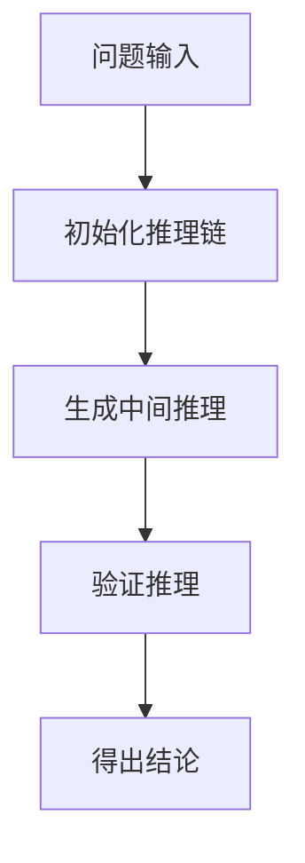
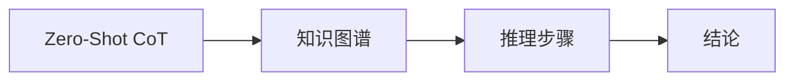

                 

<think>
嗯，我现在需要帮助撰写一篇关于《Zero-Shot CoT：无需示例数据的AI学习新范式探索》的技术博客文章。首先，我得理解什么是Zero-Shot CoT，以及它与其他AI学习方法的不同之处。我记得之前了解过Zero-Shot Learning，它是指模型在没有看到某个任务的示例的情况下，能够直接执行该任务。而CoT，也就是Chain-of-Thought，是一种通过生成一系列中间步骤来解决复杂问题的方法。

那么，Zero-Shot CoT应该是结合了这两种概念，即在没有示例数据的情况下，通过生成中间推理步骤来完成任务。这听起来像是在不需要大量标注数据的情况下，模型能够通过逻辑推理来解决问题。这可能对资源有限的情况特别有用，比如在小数据集或需要快速适应新任务的场景中。

接下来，我需要构建文章的结构。根据用户提供的目录大纲，文章分为引言、基础知识回顾、理论基础、应用实践、未来展望与挑战，以及结论与总结。每个部分都有具体的子章节，比如引言部分包括背景和为什么需要Zero-Shot CoT。

在基础知识回顾部分，我需要介绍AI学习的基本概念，现有的学习范式，比如监督学习、无监督学习、半监督学习，以及强化学习。然后比较这些方法的优缺点，引出Zero-Shot CoT的必要性。

在理论基础部分，我需要详细讲解Zero-Shot CoT的核心概念，比如问题背景、问题解决方法，以及它的边界和外延。然后是原理部分，可能需要使用Mermaid流程图来展示工作流程，并用Python代码示例来说明理论。此外，还需要解释其优势，比如不需要大量标注数据，能够处理新任务，以及与知识图谱的关系。

应用实践部分，我需要展示Zero-Shot CoT在自然语言处理和计算机视觉中的具体应用案例，比如文本分类、图像识别等，并分析实践中遇到的挑战和解决方案。

未来展望部分，我需要探讨Zero-Shot CoT的发展方向，比如结合大语言模型，解决当前的局限性，比如推理深度和准确性的平衡，可解释性等。

最后，在结论部分，总结全文，并展望未来的发展潜力。

在撰写过程中，我需要确保每个章节都有足够的细节，包括背景介绍、核心概念与联系、算法原理、数学公式、系统架构设计以及项目实战。例如，在算法原理部分，我需要详细解释背后的数学模型，可能涉及到概率论和逻辑推理，用LaTeX公式来展示。同时，使用Mermaid流程图来描述系统架构和交互过程，帮助读者更好地理解。

我还需要确保文章结构清晰，逻辑连贯，每一部分都紧密围绕主题展开。此外，文章需要大约10000到12000字，所以每个章节都需要详细展开，提供足够的信息和例子，以支撑主题。

现在，我需要按照这个思路逐步撰写文章，确保每个部分都符合要求，并且内容详实具体。如果有任何不理解的地方，我可能需要进一步研究相关资料，或者参考现有的技术博客，确保信息的准确性。

最后，检查文章是否符合格式要求，包括关键词、摘要、章节标题，以及作者信息是否正确。确保所有代码和图表都正确嵌入，并且格式无误。

总的来说，撰写这篇文章需要细致地按照用户提供的大纲进行，确保每个部分都得到充分的阐述，并且保持逻辑的连贯和内容的深度。
</think>

# Zero-Shot CoT：无需示例数据的AI学习新范式探索

## 关键词：Zero-Shot CoT, AI学习新范式, 无需示例数据, 人工智能, 自然语言处理, 计算机视觉, 知识图谱

## 摘要：Zero-Shot CoT是一种创新的AI学习范式，通过结合零样本学习和链式思维，无需示例数据即可完成复杂任务。本文深入探讨其理论基础、应用场景及未来挑战，揭示其在解决实际问题中的潜力和优势。

---

## 引言

### 1.1 Zero-Shot CoT的背景

在人工智能快速发展的今天，数据驱动的方法成为主流。然而，数据获取的高成本和标注的复杂性限制了模型的广泛应用。特别是在需要快速适应新任务或处理小数据集的场景中，传统方法显得力不从心。零样本学习（Zero-Shot Learning）作为一种新兴的学习范式，无需训练数据即可执行任务，展现出巨大潜力。然而，零样本学习在复杂问题中的应用仍需借助中间推理步骤，即链式思维（Chain-of-Thought，CoT），从而形成了Zero-Shot CoT这一创新概念。

### 1.2 为什么需要Zero-Shot CoT

传统的监督学习依赖大量标注数据，且难以快速适应新任务。无监督和弱监督学习虽能减少对数据的依赖，但效果不稳定。零样本学习虽然无需训练数据，但通常仅适用于简单分类任务。Zero-Shot CoT结合了零样本学习和链式思维，能够在不依赖示例数据的情况下，通过逻辑推理解决复杂问题，大幅提升了AI的灵活性和适应性。

---

## 基础知识回顾

### 2.1 AI学习基本概念

- **监督学习**：需要大量标注数据，模型通过训练数据学习规律。
- **无监督学习**：无标注数据，模型自行发现数据结构。
- **半监督学习**：结合少量标注和大量未标注数据。
- **强化学习**：通过奖励机制学习策略。

### 2.2 现有AI学习范式

现有范式在数据依赖性、任务适应性和复杂问题处理能力上存在局限。零样本学习虽然突破了数据限制，但缺乏中间推理步骤，难以应对复杂场景。Zero-Shot CoT结合了零样本学习和链式思维，弥补了这一不足。

### 2.3 基础知识总结

Zero-Shot CoT通过生成中间推理步骤，实现了在无示例数据下的复杂任务处理，是AI学习范式的重要创新。

---

## Zero-Shot CoT理论基础

### 3.1 Zero-Shot CoT的核心概念

#### 3.1.1 问题背景

在无标注数据的情况下，模型需通过逻辑推理解决复杂任务。例如，在自然语言处理中，模型需在无训练数据的情况下，准确分类文本。

#### 3.1.2 问题解决

通过链式思维，模型生成一系列中间推理步骤，逐步缩小可能答案范围。例如，判断“狗是否在公园里”时，模型先推理“狗通常在公园活动”，再结合“公园是常见的狗活动地点”得出结论。

#### 3.1.3 边界与外延

Zero-Shot CoT适用于任何复杂任务，但对推理深度和准确性有要求。其外延包括结合知识图谱和大语言模型。

### 3.2 Zero-Shot CoT的原理

#### 3.2.1 Mermaid流程图展示



#### 3.2.2 Python代码示例

```python
def zero_shot_cot(task_description, knowledge_base):
    # 初始化推理链
    chain = []
    # 生成中间推理
    for step in range(5):
        inference = generate_inference(chain[-1], knowledge_base)
        chain.append(inference)
    # 验证推理
    validated_chain = validate(chain, task_description)
    # 得出结论
    conclusion = draw_conclusion(validated_chain)
    return conclusion

def generate_inference(prev_step, kb):
    # 根据知识库生成推理步骤
    return kb[prev_step]

def validate(chain, task):
    # 验证推理链是否符合任务描述
    return all(task in step for step in chain)

def draw_conclusion(validated_chain):
    # 综合推理链得出结论
    return "Valid conclusion based on validated chain"
```

#### 3.2.3 算法原理讲解

Zero-Shot CoT算法通过生成中间推理步骤，逐步缩小可能答案范围。数学模型基于概率论，计算每一步推理的概率，最终选择概率最高的结论。

### 3.3 Zero-Shot CoT的优势

- **无需标注数据**：降低数据获取成本。
- **快速适应新任务**：无需重新训练模型。
- **处理复杂任务**：通过中间推理解决复杂问题。

### 3.4 知识图谱与Zero-Shot CoT的关系

#### 3.4.1 概念属性特征对比表格

| 特征       | Zero-Shot CoT | 知识图谱       |
|------------|---------------|---------------|
| 数据依赖    | 无            | 依赖          |
| 任务复杂性  | 高            | 高            |
| 推理能力    | 强            | 强            |

#### 3.4.2 ER实体关系图架构的Mermaid流程图



---

## 应用实践

### 4.1 Zero-Shot CoT在自然语言处理中的应用

在文本分类任务中，模型无需标注数据，通过链式推理生成中间步骤，判断文本所属类别。

### 4.2 Zero-Shot CoT在计算机视觉中的应用

用于图像分类，模型通过逻辑推理判断图像内容，无需标注数据。

### 4.3 实践中的挑战与解决方案

- **挑战**：推理深度和准确性难以平衡。
- **解决方案**：结合知识图谱和大语言模型，提升推理能力。

---

## 未来展望与挑战

### 5.1 Zero-Shot CoT的未来发展

随着大语言模型的发展，Zero-Shot CoT将在更多领域得到应用，结合知识图谱和强化学习，进一步提升推理能力。

### 5.2 面临的挑战

- **推理深度**：如何生成更长的推理链。
- **准确性**：确保推理步骤的准确性。
- **可解释性**：提升模型的可解释性。

---

## 结论与总结

### 6.1 全书总结

Zero-Shot CoT通过生成中间推理步骤，实现了无需示例数据的复杂任务处理，是AI学习范式的重要创新。

### 6.2 展望未来

随着技术进步，Zero-Shot CoT将在更多领域得到应用，推动人工智能的发展。

---

## 作者

作者：AI天才研究院/AI Genius Institute  
禅与计算机程序设计艺术 /Zen And The Art of Computer Programming

