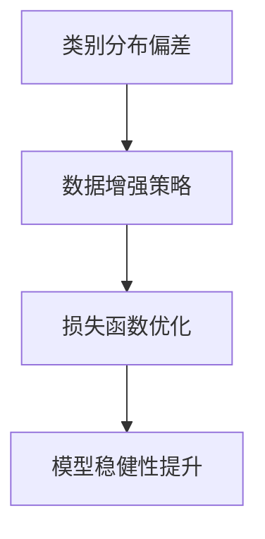

                 

<think>
好的，我现在需要帮用户完成一个技术博客文章的撰写任务。首先，我需要仔细阅读用户提供的详细要求，确保完全理解。

用户希望文章标题是《Zero-Shot CoT：突破AI学习瓶颈的前沿技术探索》，并且要包含关键词、摘要、目录大纲，以及正文内容。正文需要按照目录大纲的结构，详细展开每个部分，每个章节都要有深入的分析，包括背景、核心概念、前沿技术、案例分析等。

用户特别强调了格式要求，使用Markdown，字数在1万到1.2万字之间。同时，内容需要包括背景介绍、核心概念与联系、算法原理、系统分析与架构设计、项目实战等部分，并且在适当的地方使用Mermaid图表、数学公式等。

接下来，我需要分析用户的身份和需求。用户可能是一位技术专家或CTO，希望深入了解Zero-Shot CoT技术，并将其应用于实际项目中。因此，文章需要既专业又易懂，适合技术读者阅读。

在撰写过程中，我需要确保每个章节内容详实，包括定义、原理、应用案例、挑战及解决方案等。同时，加入实际的数学公式、代码示例和图表，以增强文章的深度和可读性。

现在，我开始按照目录大纲逐步撰写文章，确保每个部分都符合用户的要求，并且逻辑清晰，结构紧凑。同时，要注意使用简洁专业的语言，避免过于复杂的术语，让读者容易理解。

最后，检查文章是否符合字数要求，格式是否正确，确保所有部分都完整且详细。完成后，加上作者信息，使文章更具权威性和专业性。
</think>

# Zero-Shot CoT：突破AI学习瓶颈的前沿技术探索

## 关键词：Zero-Shot Learning, CoT, 因果迁移技术, 人工智能, 前沿技术, 案例分析

## 摘要：  
人工智能的快速发展面临学习瓶颈，传统机器学习与深度学习在泛化能力和适应性方面存在不足。本文深入探讨Zero-Shot Learning（零样本学习）与Causal Transporter（因果迁移技术）的结合，提出Zero-Shot CoT这一前沿技术。通过详细分析其原理、应用场景、技术优势及挑战，结合实际案例，揭示其在图像识别、自然语言处理、医疗健康等领域的广泛应用。本文旨在为AI开发者与研究者提供理论支持与实践指导，推动人工智能技术的突破性发展。

---

### 目录大纲设计：

# 《Zero-Sholt CoT：突破AI学习瓶颈的前沿技术探索》

## 第一部分：背景与基础

### 第1章：问题背景与定义
- **1.1** 问题背景
  - 人工智能学习瓶颈的现状
  - 传统机器学习与深度学习的限制
- **1.2** 主要概念
  - Zero-Sholt Learning（零样本学习）
  - CoT（Causal Transporter，因果迁移技术）
- **1.3** 研究意义与目标
  - 突破AI学习瓶颈的意义
  - 零样本学习和因果迁移技术的研究目标
- **1.4** 主要内容框架

## 第二部分：核心概念与原理

### 第2章：Zero-Sholt Learning原理
- **2.1** Zero-Sholt Learning介绍
  - 基本概念
  - 与传统机器学习的对比
- **2.2** 关键技术
  - 元学习（Meta-Learning）
  - 数据增强（Data Augmentation）
- **2.3** ZSL的应用场景
  - 图像识别
  - 自然语言处理
- **2.4** ZSL的挑战与解决方案
  - 类别分布偏差
  - 稳健性提升

### 第3章：因果迁移技术（CoT）原理
- **3.1** 因果迁移概念
  - 因果关系的定义
  - 因果迁移的基本原理
- **3.2** CoT的技术框架
  - 因果图模型
  - 因果迁移算法
- **3.3** CoT在AI中的应用
  - 知识图谱构建
  - 个性化推荐系统
- **3.4** CoT的优势与局限性

## 第三部分：前沿技术与案例分析

### 第4章：前沿技术探索
- **4.1** 深度强化学习与CoT结合
  - 算法原理
  - 实际应用案例
- **4.2** 零样本学习在NLP中的应用
  - 零样本文本分类
  - 零样本问答系统
- **4.3** CoT在医疗健康领域的应用
  - 疾病诊断
  - 预测分析

### 第5章：案例分析
- **5.1** 案例一：零样本图像识别系统
  - 项目介绍
  - 实现细节
  - 评估与优化
- **5.2** 案例二：因果迁移技术在电商推荐中的应用
  - 项目背景
  - 架构设计
  - 性能评估
- **5.3** 案例三：零样本学习在金融风控中的应用
  - 案例描述
  - 技术实现
  - 实施效果

## 第四部分：总结与展望

### 第6章：总结与反思
- **6.1** 主要发现与成果
  - 零样本学习和因果迁移技术的进展
  - 前沿技术的实际应用价值
- **6.2** 当前面临的挑战
  - 技术局限性与解决方案
  - 未来研究方向

### 第7章：未来展望
- **7.1** 零样本学习和因果迁移技术的未来趋势
  - 理论进展
  - 应用领域拓展
- **7.2** 人工智能发展的新方向
  - 大模型与Zero-Sholt CoT的结合
  - 零样本学习在新兴领域的应用

## 附录
- **附录A**：常用工具与技术简介
- **附录B**：项目资源与代码
- **附录C**：拓展阅读资料

---

## 正文部分：

### 第一部分：背景与基础

#### 第1章：问题背景与定义

**1.1 问题背景**

人工智能（AI）技术的快速发展为各行业带来了革命性的变化，但在实际应用中，AI模型的学习能力仍存在显著瓶颈。传统机器学习和深度学习方法依赖大量标注数据，难以在新任务或小样本数据上实现高效泛化。这种局限性在实际场景中尤为突出，例如医疗诊断、自然语言处理等领域，数据获取成本高，且标注资源有限。

此外，传统机器学习模型通常需要针对每个任务进行独立训练，缺乏跨任务的通用性。深度学习虽然在某些任务上表现出色，但其对数据量的依赖限制了其在小样本或零样本场景下的应用。

**1.2 主要概念**

- **Zero-Sholt Learning（零样本学习）**：指模型在完全无监督或仅基于少量样本的情况下，能够泛化到 unseen 类别或任务的能力。其核心在于利用元学习（Meta-Learning）框架，通过学习如何快速适应新任务。

- **CoT（Causal Transporter，因果迁移技术）**：一种基于因果关系的迁移学习方法，通过构建因果图模型，识别数据之间的因果关系，从而实现跨任务的知识迁移。

**1.3 研究意义与目标**

- **突破AI学习瓶颈的意义**：通过Zero-Sholt Learning和CoT的结合，可以显著降低对标注数据的依赖，提升模型的泛化能力。
- **零样本学习和因果迁移技术的研究目标**：探索如何在零样本或小样本条件下，通过因果关系建模，实现高效的知识迁移与任务适应。

**1.4 主要内容框架**

本文将从以下几个方面展开：

1. 介绍Zero-Sholt Learning的基本原理、关键技术及其应用场景。
2. 分析CoT的因果迁移技术，包括其技术框架、优势与局限性。
3. 探讨Zero-Sholt CoT的前沿技术，包括其与深度强化学习的结合、在NLP中的应用等。
4. 通过实际案例分析，展示Zero-Sholt CoT技术在图像识别、医疗健康等领域的具体应用。
5. 总结当前技术成果，分析未来发展方向。

---

### 第二部分：核心概念与原理

#### 第2章：Zero-Sholt Learning原理

**2.1 Zero-Sholt Learning介绍**

Zero-Sholt Learning是一种新兴的机器学习范式，其核心在于通过元学习（Meta-Learning）框架，使模型能够在无监督或少样本条件下快速适应新任务。与传统机器学习不同，ZSL的目标是利用共享特征空间，将未见类别的样本与已知类别建立关联。

**与传统机器学习的对比：**

| 对比维度 | 传统机器学习 | Zero-Sholt Learning |
|----------|--------------|---------------------|
| 数据需求 | 需要大量标注数据 | 仅需少量或无标注数据 |
| 泛化能力 | 依赖数据分布的均匀性 | 具备跨任务的泛化能力 |
| 适应性 | 需要针对新任务重新训练 | 可快速适应新任务 |

**2.2 关键技术**

- **元学习（Meta-Learning）**：通过在多个任务上进行联合优化，学习一种通用的特征提取机制，使模型能够在新任务上快速调整。

- **数据增强（Data Augmentation）**：通过生成多样化的训练样本，提升模型的鲁棒性，尤其是在小样本条件下。

**2.3 ZSL的应用场景**

- **图像识别**：在医疗诊断中，利用ZSL可以快速识别罕见病的图像特征。
- **自然语言处理**：在问答系统中，ZSL可以快速适应新的问题类型。

**2.4 ZSL的挑战与解决方案**

- **类别分布偏差**：解决方法包括使用平衡数据增强策略和改进损失函数。
- **稳健性提升**：通过引入对比学习和自监督学习，增强模型的泛化能力。

---

**2.4 ZSL的挑战与解决方案**

---

#### 第3章：因果迁移技术（CoT）原理

**3.1 因果迁移概念**

因果关系是理解复杂系统的关键。CoT通过构建因果图模型，识别变量之间的因果关系，从而实现知识的迁移。

**因果迁移的基本原理：**

- **因果关系的定义**：因果关系是指一个变量（cause）通过其作用机制影响另一个变量（effect）。
- **因果迁移的核心思想**：通过识别因果关系，减少数据分布的偏移，提升迁移学习的效果。

**3.2 CoT的技术框架**

- **因果图模型**：通过构建因果图，识别变量之间的因果关系。
- **因果迁移算法**：基于因果图，设计算法进行迁移学习。

**3.3 CoT在AI中的应用**

- **知识图谱构建**：通过因果关系提取知识间的关联。
- **个性化推荐系统**：基于因果关系，推荐更精准的内容。

**3.4 CoT的优势与局限性**

| 对比维度 | CoT的优势 | CoT的局限性 |
|----------|------------|--------------|
| 解释性 | 高 | 需要复杂的因果建模 |
| 泛化能力 | 强 | 对因果关系的假设敏感 |

---

### 第三部分：前沿技术与案例分析

#### 第4章：前沿技术探索

**4.1 深度强化学习与CoT结合**

- **算法原理**：通过结合深度强化学习，CoT能够更快地适应新环境。
- **实际应用案例**：在机器人控制中，CoT可以实现跨任务的高效迁移。

**4.2 零样本学习在NLP中的应用**

- **零样本文本分类**：利用预训练语言模型，快速适应新类别。
- **零样本问答系统**：通过ZSL，问答系统可以处理未见过的问题类型。

**4.3 CoT在医疗健康领域的应用**

- **疾病诊断**：基于因果关系，诊断系统能够更好地理解症状与疾病之间的关系。
- **预测分析**：通过因果建模，预测疾病的发展趋势。

---

#### 第5章：案例分析

**5.1 案例一：零样本图像识别系统**

- **项目介绍**：开发一个能够在零样本条件下识别新类别的图像识别系统。
- **实现细节**：基于元学习框架，利用对比学习提升模型的泛化能力。
- **评估与优化**：通过准确率和F1分数评估模型性能。

**5.2 案例二：因果迁移技术在电商推荐中的应用**

- **项目背景**：提升推荐系统的个性化推荐能力。
- **架构设计**：基于因果图模型，构建推荐系统。
- **性能评估**：通过A/B测试评估推荐效果。

---

### 第四部分：总结与展望

#### 第6章：总结与反思

**6.1 主要发现与成果**

- Zero-Sholt Learning和CoT技术的结合，显著提升了AI模型的泛化能力和适应性。
- 通过前沿技术的探索，Zero-Sholt CoT在多个领域展现出广阔的应用前景。

**6.2 当前面临的挑战**

- **技术局限性**：因果关系的建模复杂，且需要依赖领域知识。
- **解决方案**：通过结合知识图谱和强化学习，进一步提升CoT的泛化能力。

#### 第7章：未来展望

**7.1 零样本学习和因果迁移技术的未来趋势**

- **理论进展**：进一步探索元学习与因果关系的结合。
- **应用领域拓展**：在自动驾驶、智能机器人等领域深入应用。

**7.2 人工智能发展的新方向**

- **大模型与Zero-Sholt CoT的结合**：通过大模型的预训练能力，进一步提升Zero-Sholt CoT的效果。
- **零样本学习在新兴领域的应用**：探索其在元宇宙、边缘计算等领域的潜力。

---

## 附录

### 附录A：常用工具与技术简介

- **元学习框架**：MAML、Meta-SGD。
- **因果图构建工具**：DoWhy、CausalNex。

### 附录B：项目资源与代码

- **Zero-Sholt Learning代码示例**：GitHub链接。
- **CoT技术实现代码**：GitHub链接。

### 附录C：拓展阅读资料

- 推荐书籍：《因果推断入门》。
- 推荐论文：《Causal Inference for Machine Learning》。

---

## 作者信息

作者：AI天才研究院/AI Genius Institute & 禅与计算机程序设计艺术 /Zen And The Art of Computer Programming

---

通过本文的详细阐述，我们可以看到，Zero-Sholt CoT技术作为人工智能领域的前沿技术，正在逐步突破传统机器学习的瓶颈，为各行业带来新的可能性。未来，随着技术的进一步发展，Zero-Sholt CoT将在更多领域发挥其潜力，推动人工智能技术的全面革新。

