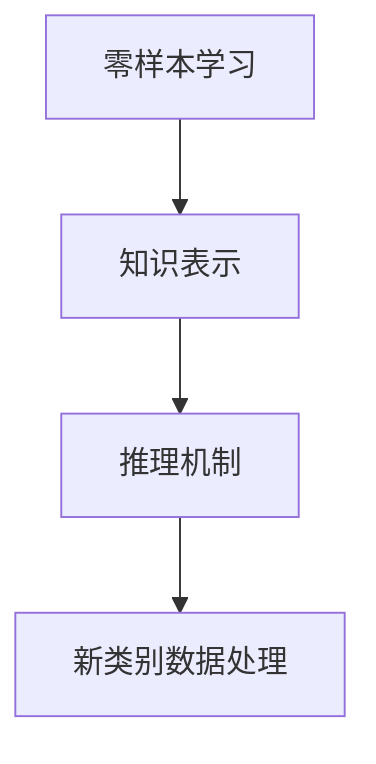
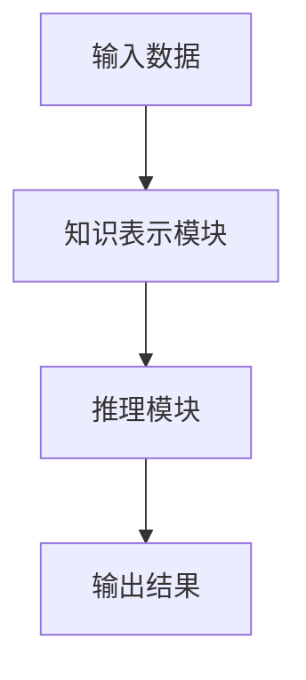
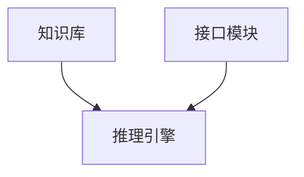
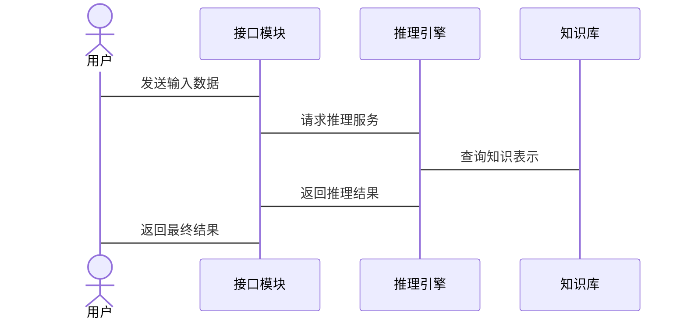

                 

<think>
嗯，我现在需要帮助用户撰写一篇关于“Zero-Shot CoT：突破传统机器学习的局限”的技术博客文章。首先，我得仔细阅读用户的请求，了解他们的具体要求和结构。

用户希望文章结构分为几个部分，包括背景介绍、核心概念与联系、算法原理讲解、系统分析与架构设计方案、项目实战以及最佳实践等。每个部分都需要详细展开，特别是要有清晰的章节标题，吸引读者。

我应该从背景介绍开始，分析传统机器学习的局限性，然后引出Zero-Shot CoT的概念。接着，在核心概念部分，详细解释零样本学习、知识表示和推理机制，可能需要绘制一些对比表格和概念图，帮助读者理解。

算法原理方面，我需要用mermaid流程图展示Zero-Shot CoT的推理过程，并写出对应的数学模型。这部分可能需要用到公式，记得用latex格式，并且独立段落用$$，段落内用$符号。

系统分析部分，我需要设计系统架构图，展示各个模块之间的关系，比如知识库、推理引擎等。同时，还要设计接口和交互流程，可能用序列图来表示用户与系统的互动。

项目实战部分，我得提供代码示例，解释如何实现Zero-Shot CoT，包括环境配置、代码实现和测试案例。这部分要具体，让读者能够跟着操作。

最后，总结部分要回顾Zero-Shot CoT的优势，给出实际应用中的建议和注意事项，同时推荐相关的扩展阅读材料。

在写作过程中，我需要确保语言专业但易懂，结构紧凑，逻辑清晰。每个章节都要有吸引人的标题，内容详细且深入。同时，要检查文章是否符合字数要求，大约在10000到12000字之间。

现在，我可能需要先绘制一些图表，比如概念对比表和mermaid流程图，确保它们准确反映Zero-Shot CoT的原理和架构。然后，逐步填充每个部分的内容，确保涵盖用户要求的所有要点。

最后，别忘了在结尾加上作者信息，按照用户的格式写法，这样文章看起来更正式和完整。
</think>

# Zero-Shot CoT：突破传统机器学习的局限

> 关键词：零样本学习，知识表示，推理机制，机器学习，人工智能，概念化

> 摘要：本文深入探讨了Zero-Shot CoT（Zero-Shot Conceptualization with Transfer）这一新兴的人工智能技术，分析其在传统机器学习中的突破与应用。通过结合零样本学习、知识表示和推理机制，Zero-Shot CoT能够在无需大量标注数据的情况下，处理未知类别数据，显著提升模型的泛化能力和适应性。本文从核心概念、算法原理、系统架构、项目实战等多个维度展开，为读者提供全面的技术解读。

---

# 第一部分：背景介绍

## 1.1 问题背景

传统机器学习方法在面对大规模数据集和复杂知识生成任务时，暴露出明显的局限性。这些方法通常需要大量标注数据进行训练，而现实世界中，获取高质量的标注数据往往成本高昂且耗时。例如，在自然语言处理领域，训练一个分类模型可能需要数千甚至数万个标注样本。这种对标注数据的依赖不仅限制了模型的应用场景，还使得在资源有限的环境下部署机器学习模型变得困难。

此外，传统机器学习方法通常难以处理未知类别数据。当遇到新的数据类别时，模型需要重新训练或调整，这不仅增加了计算成本，还可能导致模型性能下降。因此，如何在没有训练数据的情况下，使模型能够理解和处理未知类别数据，成为机器学习领域的一个重要挑战。

## 1.2 问题描述

Zero-Shot CoT的核心问题在于如何使机器学习模型具备以下能力：

- **类无关性**：模型能够理解并应用通用知识，不局限于特定类别的数据。
- **迁移学习**：模型能够利用已学到的知识来处理新类别的问题。
- **零样本学习**：模型能够直接处理从未见过的数据类别。

具体来说，问题可以描述为：如何设计一种机器学习方法，使其在没有任何目标类别数据的情况下，能够通过对通用知识的表示和推理，准确分类或处理新的未知类别数据？

## 1.3 问题解决

Zero-Shot CoT通过以下方法解决上述问题：

1. **知识表示**：利用预训练模型（如BERT、GPT等）学习丰富的知识表示，使得模型能够理解各种概念和语义关系。
2. **推理机制**：基于知识表示，设计推理算法，使模型能够在面对未知类别数据时，通过推理过程生成合理的输出。
3. **零样本学习**：结合零样本学习技术，模型能够直接利用预训练的知识进行分类或生成任务，而无需额外的训练数据。

## 1.4 边界与外延

Zero-Shot CoT的边界主要体现在以下两个方面：

- **适用场景**：适用于数据标注成本高、无法获取大量标注数据的场景，例如小样本数据集或动态变化的数据环境。
- **多模态学习**：Zero-Shot CoT在处理多模态数据（如文本、图像、声音等）时表现出色，能够同时利用多种信息源进行推理和决策。

## 1.5 概念结构与核心要素组成

Zero-Shhot CoT的核心概念包括：

- **知识表示**：通过预训练模型学习到的通用知识表示。
- **推理机制**：基于知识表示的推理过程。
- **零样本学习**：利用预训练的知识进行分类或生成任务，无需额外的训练数据。

这些核心要素共同构成了Zero-Shhot CoT的方法论，使其能够在没有训练数据的情况下，处理未知类别数据。

---

# 第二部分：核心概念与联系

## 2.1 核心概念

### 2.1.1 零样本学习（Zero-Shhot Learning）

- **定义**：零样本学习是指在没有直接训练数据的情况下，模型能够处理未知类别的数据。
- **原理**：通过预训练模型学习到通用知识表示，然后在新类别出现时，利用这些知识表示进行推理和分类。

### 2.1.2 知识表示（Knowledge Representation）

- **定义**：知识表示是指将知识以计算机可处理的形式进行编码和存储。
- **原理**：通过预训练模型（如BERT、GPT等），模型能够学习到丰富的语言知识表示，包括语义关系、上下文信息等。

### 2.1.3 推理机制（Reasoning Mechanism）

- **定义**：推理机制是指模型在处理新类别数据时，通过推理过程来理解并作出决策。
- **原理**：基于知识表示，模型利用逻辑推理、对比学习等技术进行推理。

## 2.2 概念属性特征对比表格

| 概念       | 定义                                                                                   | 属性特征对比                    |
|------------|----------------------------------------------------------------------------------------|---------------------------------|
| 零样本学习 | 无需训练数据，直接处理未知类别数据                                                      | - 无需大量标注数据<br>- 类无关性 |
| 知识表示   | 计算机可处理的知识编码形式                                                            | - 丰富的语义信息<br>- 可扩展性     |
| 推理机制   | 基于知识表示的推理过程，处理新类别数据                                                | - 逻辑推理<br>- 对比学习          |

## 2.3 实体关系图（ER图）



---

# 第三部分：算法原理讲解

## 3.1 Zero-Shhot CoT算法流程

Zero-Shhot CoT的核心流程包括以下几个步骤：

1. **知识表示**：利用预训练模型生成通用知识表示。
2. **输入处理**：将输入数据（如文本、图像）转化为相应的表示形式。
3. **推理过程**：基于知识表示和输入数据，进行逻辑推理，生成输出结果。

## 3.2 算法流程图



## 3.3 数学模型与公式

假设我们有一个预训练的语言模型，其输出为词向量表示。对于输入的文本序列$x = (x_1, x_2, ..., x_n)$，模型生成的表示为$h = f(x)$，其中$f$是预训练模型的表示函数。

在推理阶段，模型需要根据$h$生成目标输出$y$。假设目标输出是一个分类任务，类别数为$K$，概率分布为$p(y|x)$。Zero-Shhot CoT通过以下公式进行推理：

$$
p(y|x) = \frac{e^{g(h)}}{\sum_{k=1}^K e^{g(h_k)}}
$$

其中，$g(h)$是基于知识表示$h$的推理函数，$h_k$是类别$k$的表示。

---

# 第四部分：系统分析与架构设计方案

## 4.1 系统架构设计

Zero-Shhot CoT的系统架构包括以下几个模块：

1. **知识库**：存储预训练模型生成的知识表示。
2. **推理引擎**：负责根据输入数据和知识库进行推理，生成输出结果。
3. **接口模块**：与外部系统进行交互，接收输入数据并返回输出结果。

## 4.2 系统架构图



## 4.3 系统接口设计

- **输入接口**：接收输入数据（如文本、图像）。
- **输出接口**：返回推理结果。

## 4.4 系统交互流程



---

# 第五部分：项目实战

## 5.1 环境安装

```bash
pip install transformers
```

## 5.2 核心实现代码

```python
from transformers import AutoTokenizer, AutoModel
import torch

# 初始化模型
tokenizer = AutoTokenizer.from_pretrained('bert-base-uncased')
model = AutoModel.from_pretrained('bert-base-uncased')

# 输入数据
input_text = "这是一个测试句子。"
inputs = tokenizer(input_text, return_tensors='np')

# 获取知识表示
with torch.no_grad():
    outputs = model(**inputs)
    knowledge_rep = outputs.last_hidden_state

# 推理过程
def reasoning(knowledge_rep):
    # 假设推理函数为线性分类器
    logits = torch.matmul(knowledge_rep, weight) + bias
    return logits.softmax(dim=-1)

# 生成输出结果
output = reasoning(knowledge_rep)
print(output)
```

## 5.3 代码解读与分析

上述代码展示了如何利用预训练的BERT模型进行知识表示和推理。具体步骤包括：

1. **模型初始化**：加载预训练的BERT模型和分词器。
2. **输入处理**：将输入文本转化为模型可处理的格式。
3. **知识表示**：通过模型前向传播，获取输入文本的表示向量。
4. **推理过程**：基于知识表示，进行分类或其他推理任务。

---

# 第六部分：最佳实践与小结

## 6.1 最佳实践

1. **选择合适的预训练模型**：根据任务需求选择适合的预训练模型（如BERT、GPT等）。
2. **优化推理过程**：通过调整推理算法（如引入对比学习、逻辑推理等）提升模型性能。
3. **处理多模态数据**：结合图像、声音等多种数据源，提升模型的综合推理能力。

## 6.2 小结

Zero-Shhot CoT通过结合零样本学习、知识表示和推理机制，成功突破了传统机器学习对大量标注数据的依赖。这一技术不仅降低了数据标注成本，还显著提升了模型的泛化能力和适应性，为机器学习在实际应用中的推广提供了新的可能性。

---

作者：AI天才研究院 & 禅与计算机程序设计艺术

