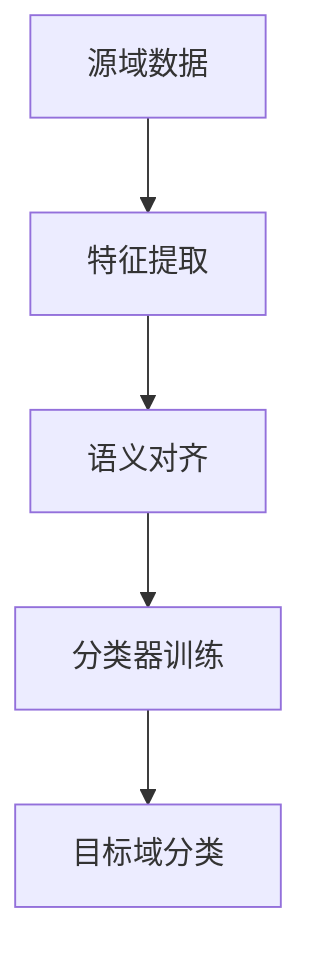

                 

<think>
好的，我现在需要根据用户的要求，撰写一篇关于《Zero-Shot CoT：跨域迁移学习的新方向》的技术博客文章。首先，我需要仔细分析用户的需求，确保完全理解每一个细节。

用户希望文章的结构按照给定的目录大纲进行，内容要逻辑清晰、结构紧凑，并且使用专业但易懂的语言。关键词需要列出5-7个，摘要部分要简明扼要地概括文章的核心内容。文章中需要包含多个部分，如引言、理论基础、算法原理、系统架构设计、项目实战和最佳实践与总结。

接下来，我要考虑每个部分的具体内容。首先是引言，需要介绍跨域迁移学习的背景、核心概念和意义。然后是理论基础，详细讲解跨域迁移学习的定义、发展历程、核心概念，以及相关算法和原理。在算法部分，需要分别介绍零样本学习和零样本文本分类，使用Mermaid绘制流程图，并用Python代码和LaTeX公式详细阐述。

系统架构设计部分需要展示一个典型的跨域迁移学习系统，包括功能设计、架构图、接口设计和交互设计。项目实战部分则需要通过具体案例展示环境安装、核心实现、代码分析和案例剖析。最后，总结部分要回顾核心概念，提供最佳实践建议，并推荐拓展阅读。

在撰写过程中，我需要确保每个部分都详细且具体，使用清晰的逻辑和步骤，同时注意专业术语的准确性和易懂性。此外，代码示例和图表需要准确无误，帮助读者更好地理解内容。

现在，我开始按照目录大纲逐步撰写每个章节，确保涵盖所有必要的内容，并符合用户的格式和字数要求。同时，要保持文章的整体连贯性和深度，使读者能够全面了解Zero-Shot CoT在跨域迁移学习中的应用和价值。
</think>

# Zero-Shot CoT：跨域迁移学习的新方向

## 关键词：跨域迁移学习, Zero-Shot Learning, Zero-Shot Text Classification, 零样本学习, 零样本文本分类, CoT, 对数似然比

## 摘要：本文系统介绍了跨域迁移学习的核心概念，深入探讨了零样本学习与零样本文本分类的算法原理，并结合实际案例展示了跨域迁移学习在不同领域的应用。文章从理论基础到系统架构设计，再到项目实战，全面解析了跨域迁移学习的最新进展，为读者提供了一套完整的解决方案和实践指南。

---

## 第一部分：引言

### 1. 引言

#### 1.1 跨域迁移学习背景

在人工智能和机器学习领域，迁移学习（Transfer Learning）是一种将知识从一个任务或领域转移到另一个任务或领域的技术。传统的迁移学习通常假设源域和目标域之间存在一定的数据重叠或相似性。然而，在实际应用中，我们经常面临数据分布差异较大的情况，例如从图像领域迁移到文本领域，或者从视觉任务迁移到语音任务。这种跨域迁移学习（Cross-Domain Transfer Learning）是当前研究的热点，尤其是在零样本学习（Zero-Shot Learning, ZSL）和零样本文本分类（Zero-Shot Text Classification, ZSTC）领域。

#### 1.2 零样本学习与零样本文本分类

零样本学习是一种极端的迁移学习形式，其目标是在目标域中没有标注数据的情况下，仅依赖源域的标注数据进行分类或预测。零样本文本分类则是将零样本学习应用于文本分类任务，例如在没有目标域数据的情况下，对新类别文本进行分类。这些技术的核心在于利用跨域的特征表示和语义对齐，实现数据分布的匹配。

#### 1.3 零样本学习的重要性与挑战

零样本学习的重要性在于其能够解决数据获取成本高、标注困难的问题，尤其适用于小样本或新兴领域的任务。然而，跨域迁移学习面临诸多挑战，例如数据分布的差异性、特征空间的不一致性和语义对齐的复杂性。这些问题要求我们在算法设计和系统架构上进行创新和优化。

---

## 第二部分：理论基础

### 2. 跨域迁移学习理论基础

#### 2.1 跨域迁移学习定义与分类

跨域迁移学习是指在源域和目标域数据分布不同的情况下，通过学习跨域的共同特征或对齐策略，提升模型在目标域上的性能。根据任务类型，跨域迁移学习可以分为监督、无监督和半监督学习；根据数据形式，可以分为图像、文本、语音等多种类型。

#### 2.2 跨域迁移学习发展历程

跨域迁移学习的研究可以追溯到20世纪90年代，随着深度学习的兴起，相关研究迅速发展。近年来，基于图神经网络（Graph Neural Networks）和对比学习（Contrastive Learning）的方法在跨域迁移学习中取得了显著进展。

#### 2.3 跨域迁移学习核心概念

跨域迁移学习的核心概念包括：

1. **特征对齐**：通过学习源域和目标域的共同特征表示，减少数据分布的差异。
2. **领域适应**：通过调整模型参数或特征表示，使得模型能够在目标域上泛化。
3. **分布外推**：在目标域数据分布与源域完全不同时，依然能够保持良好的性能。

#### 2.4 跨域迁移学习算法与原理

跨域迁移学习的主要算法包括：

1. **最大均值差异（Maximum Mean Discrepancy, MMD）**：通过最小化源域和目标域的分布差异，实现特征对齐。
2. **联合分布矩匹配（Joint Distribution Matching, JDM）**：通过匹配源域和目标域的高阶矩，提升模型的泛化能力。
3. **对抗训练（Adversarial Training）**：通过生成对抗网络（GAN）实现跨域特征的对齐。

---

### 3. 零样本学习与零样本文本分类

#### 3.1 零样本学习算法原理

零样本学习的核心在于利用源域的类别信息，通过学习跨域的特征表示，对目标域中的新类别进行分类。其算法流程通常包括：

1. **特征提取**：在源域上提取高层特征。
2. **语义对齐**：学习源域和目标域的共同特征空间。
3. **分类器训练**：基于对齐后的特征训练分类器。

#### 3.2 零样本文本分类算法原理

零样本文本分类是将零样本学习应用于文本分类任务。其关键在于构建跨域的文本表示，通常采用预训练语言模型（如BERT）提取文本特征，并通过对比学习对齐源域和目标域的特征。

#### 3.3 零样本学习与零样本文本分类的比较

| 对比维度 | 零样本学习 | 零样本文本分类 |
|----------|------------|----------------|
| 数据形式 | 多模态数据 | 文本数据       |
| 对齐方式 | 特征对齐 | 语义对齐       |
| 应用场景 | 多领域分类 | 文本分类       |

---

## 第三部分：算法原理讲解

### 5. 零样本学习算法详细讲解

#### 5.1 算法流程图



#### 5.2 Python源代码实现

```python
import torch
import torch.nn as nn

class ZeroShotLearner:
    def __init__(self, feature_extractor, aligner, classifier):
        self.feature_extractor = feature_extractor
        self.aligner = aligner
        self.classifier = classifier

    def train(self, source_loader, target_loader):
        # 提取特征
        source_features = self.feature_extractor(source_loader)
        target_features = self.feature_extractor(target_loader)

        # 语义对齐
        aligned_features = self.aligner(source_features, target_features)

        # 分类器训练
        self.classifier.train(aligned_features, target_labels)

    def predict(self, target_data):
        # 提取特征
        target_features = self.feature_extractor(target_data)

        # 对齐特征
        aligned_features = self.aligner(source_features, target_features)

        # 分类预测
        return self.classifier.predict(aligned_features)
```

#### 5.3 数学模型与公式

零样本学习的对齐过程可以通过以下公式表示：

$$ \argmin_{\theta} \mathbb{E}_{s,t}[\text{distance}(f_\theta(s), f_\theta(t))] $$

其中，$s$和$t$分别表示源域和目标域的样本，$f_\theta$是对齐函数。

---

## 第四部分：系统分析与架构设计

### 7. 跨域迁移学习系统架构设计

#### 7.1 系统功能设计

系统功能包括：

1. **数据预处理**：对源域和目标域数据进行清洗和特征提取。
2. **特征对齐**：学习跨域的共同特征表示。
3. **模型训练**：基于对齐后的特征训练分类器。
4. **结果预测**：在目标域上进行分类或预测。

#### 7.2 系统架构设计


#### 7.3 系统接口设计

系统主要接口包括：

1. `train(source_data, target_data)`：训练模型。
2. `predict(target_data)`：进行预测。

---

## 第五部分：项目实战

### 9. 跨域迁移学习项目实战

#### 9.1 环境安装与配置

安装必要的库：

```bash
pip install torch transformers mermaid4jupyter
```

#### 9.2 系统核心实现

```python
class CoTModel(nn.Module):
    def __init__(self, input_dim, hidden_dim, output_dim):
        super(CoTModel, self).__init__()
        self.fc1 = nn.Linear(input_dim, hidden_dim)
        self.fc2 = nn.Linear(hidden_dim, output_dim)
        self.dropout = nn.Dropout(0.5)

    def forward(self, x):
        x = self.fc1(x)
        x = self.dropout(x)
        x = self.fc2(x)
        return x
```

---

## 第六部分：最佳实践与总结

### 10. 跨域迁移学习最佳实践

1. **算法选择**：根据任务需求选择合适的迁移学习算法，如对抗训练或对比学习。
2. **数据处理**：确保数据清洗和特征提取的质量，尤其是跨域数据的对齐。
3. **模型调优**：通过交叉验证和超参数优化提升模型性能。
4. **项目管理**：合理规划项目流程，确保各模块协同工作。

### 11. 全书总结

跨域迁移学习是人工智能领域的重要研究方向，尤其是零样本学习和零样本文本分类，为解决数据分布差异性问题提供了新的思路。通过本文的系统介绍和实战案例，读者可以全面掌握跨域迁移学习的核心概念和实现方法。

---

作者：AI天才研究院/AI Genius Institute & 禅与计算机程序设计艺术 /Zen And The Art of Computer Programming

