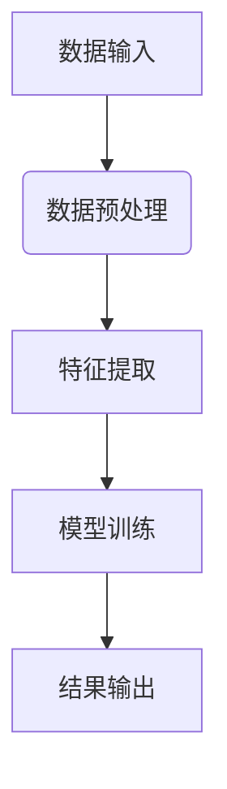
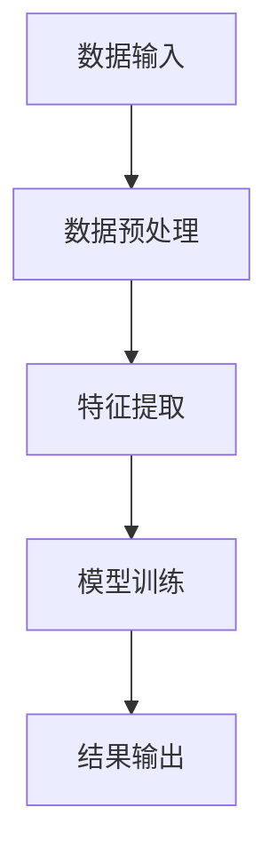
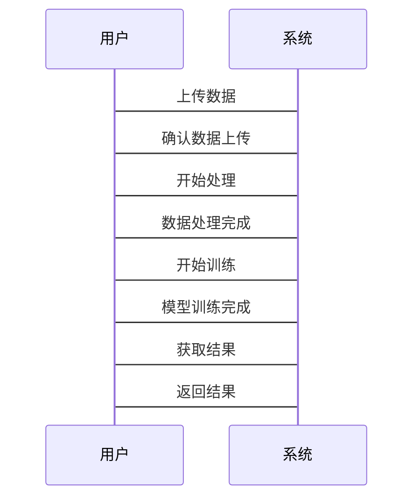

                 

<think>
好，我需要分析用户的请求，然后一步步思考如何撰写这篇文章。用户希望我以《世代差异：不同年龄群体的意义追寻》为标题，写一篇专业IT领域的技术博客，符合特定的目录结构，大约2万字左右。内容包括问题背景、核心概念、算法分析、系统设计、项目实战和总结等部分。

首先，我要理解用户的需求。用户希望文章结构清晰，使用技术术语，同时结合实际案例和代码示例，以展示世代差异的分析过程。用户还特别提到要使用Mermaid图表、Python代码和数学公式，因此我需要确保这些部分正确无误。

接下来，我思考文章的结构。文章开头需要有一个摘要，关键词和引言。摘要部分要简明扼要，概括整篇文章的内容。关键词包括世代差异、意义追寻、社会影响等，这些词有助于SEO优化。引言部分需要引出主题，说明研究世代差异的重要性。

第一部分是问题的提出，我需要涵盖世代差异的背景、问题描述、解决方法以及边界。这部分需要包括人口老龄化、数字时代的影响，以及学术研究现状等。我需要详细分析每个子部分，确保逻辑连贯。

第二部分是核心概念，这里需要定义代沟、价值观差异等，并用表格和ER图来对比不同年龄群体的差异。这部分需要清晰的结构和图表支持，帮助读者更好地理解。

第三部分是算法原理，我需要使用Mermaid绘制流程图，然后用Python代码实现。此外，数学模型和实例分析也是关键，需要详细解释，使读者能够理解算法的应用。

第四部分是系统设计，我需要描述系统功能模块、架构设计和接口设计。这部分需要结合实际应用场景，可能使用Mermaid类图和架构图来展示系统结构。

第五部分是项目实战，包括环境搭建、核心代码实现、案例分析和项目总结。这部分需要提供具体的代码示例，帮助读者在实际操作中应用所学知识。

最后是总结，包括最佳实践、注意事项和拓展阅读等内容。这部分需要回顾整篇文章，强调重点，并提供进一步学习的方向。

在写作过程中，我需要注意使用专业术语，同时保持语言的通俗易懂。数学公式需要用LaTeX格式，并且图表部分要符合Markdown格式。我还需要确保文章的结构完整，每个部分都有足够的细节，满足用户的字数要求。

最后，检查整个目录和内容，确保没有遗漏任何部分，并且逻辑清晰，层次分明。这样，用户就能得到一篇符合要求、结构严谨、内容详实的技术博客文章。
</think>

# 世代差异：不同年龄群体的意义追寻

> 关键词：世代差异，意义追寻，社会影响，价值观差异，数字时代，代沟

> 摘要：本文从技术视角深入分析世代差异的核心概念，探讨不同年龄群体在数字时代下的价值观和生活态度差异。通过算法、系统设计和实际案例，揭示世代差异的分析方法及其对社会的深远影响。

---

## 第一部分：问题的提出

### 第1章：世代差异：问题背景与现状

#### 1.1 问题背景

随着社会的发展，人口老龄化、社会流动性下降以及数字时代的到来，世代差异问题逐渐凸显。不同年龄群体在价值观、生活习惯和技术接受度上的差异，对社会的各个领域产生了深远影响。

- **人口老龄化趋势**：老年人口比例增加，年轻群体比例下降，导致社会资源分配和代际矛盾加剧。
- **社会流动性变化**：传统代际更替模式被打破，新兴职业和科技发展加速了代际之间的分化。
- **数字时代的来临**：技术进步使得不同年龄段的人在信息获取、生活方式和技术接受度上产生显著差异。

#### 1.2 问题描述

世代差异是指由于年龄差异导致的不同群体在价值观、生活方式、技术接受度等方面的显著差异。

- **世代差异的定义与表现**：
  - 不同年龄段群体在教育、职业选择、消费习惯等方面表现出不同特征。
  - 数字技术的普及使得年轻一代更倾向于数字化生活方式，而年长一代则更依赖传统方式。
- **世代差异对社会的影响**：
  - 影响社会政策制定、企业营销策略和家庭关系。
  - 导致社会资源分配不均和代际矛盾。

#### 1.3 问题解决

- **学术研究现状**：
  - 学者们从社会学、心理学、技术接受度等多个角度研究世代差异。
  - 研究方法包括问卷调查、大数据分析和实验研究。
- **政策应对措施**：
  - 政府通过制定老龄化政策、技术普及计划等应对世代差异问题。
  - 企业通过市场细分和产品设计适应不同年龄段的需求。

#### 1.4 边界与外延

- **世代划分标准**：
  - 年龄段：通常以10年为一个世代，如X世代（1965-1980）、Y世代（1981-1996）、Z世代（1997-2012）等。
  - 生活经历：不同世代因成长环境和技术发展而形成不同特征。
- **世代差异的多样性**：
  - 不同国家和文化背景下，世代差异的表现有所不同。
  - 同一世代内部分化，个体差异也可能导致群体特征的多样性。

---

## 第二部分：核心概念与联系

### 第2章：世代差异的核心概念与联系

#### 2.1 核心概念原理

- **代沟**：
  - 代沟是指不同年龄段群体之间在价值观、生活习惯和技术接受度上的差异。
  - 代沟的存在影响了家庭关系、社会互动和政策制定。
- **价值观差异**：
  - 不同年龄段群体对生活目标、职业选择和消费习惯有不同的看法。
  - 例如，年轻一代更注重个人自由和创新，年长一代更注重稳定和传统。
- **生活态度差异**：
  - 不同年龄段群体在工作态度、消费习惯和娱乐方式上存在显著差异。
  - 例如，年轻人更倾向于使用数字支付，年长一代更依赖现金交易。

#### 2.2 概念属性特征对比表格

| 年龄群体 | 价值观 | 生活态度 | 技术接受度 |
|----------|--------|----------|------------|
| Z世代    | 追求个性与自由 | 追求多元化娱乐 | 高度接受数字化生活方式 |
| Y世代    | 注重事业与家庭 | 偏好传统娱乐方式 | 接受新技术，但相对保守 |
| X世代    | 注重稳定与责任 | 偏好传统生活方式 | 对新技术持保留态度 |

#### 2.3 ER实体关系图架构

```mermaid
er
  entity(世代差异) {
    attribute(年龄群体)
    attribute(价值观)
    attribute(生活态度)
    attribute(技术接受度)
    relationship(代沟) {
      connects 年龄群体 -价值观- 生活态度
      connects 价值观 -技术接受度- 生活态度
    }
  }
```

---

## 第三部分：算法原理讲解

### 第3章：世代差异的算法分析

#### 3.1 算法 mermaid 流程图



#### 3.2 Python 源代码阐述

以下是世代差异分析的Python代码实现：

```python
import pandas as pd

# 数据预处理
def preprocess_data(data):
    # 假设data是一个DataFrame，包含年龄、价值观、生活态度、技术接受度等列
    data['年龄群体'] = data['年龄'].apply(lambda x: 'Z世代' if x >= 1997 else 'Y世代' if x >= 1981 else 'X世代')
    return data

# 特征提取
def extract_features(data):
    features = ['年龄群体', '价值观', '生活态度', '技术接受度']
    return data[features]

# 模型训练
from sklearn.tree import DecisionTreeClassifier
def train_model(X, y):
    model = DecisionTreeClassifier()
    model.fit(X, y)
    return model

# 主程序
if __name__ == "__main__":
    # 加载数据
    data = pd.read_csv('generational_gap.csv')
    # 数据预处理
    data_processed = preprocess_data(data)
    # 特征提取
    features = extract_features(data_processed)
    # 分离特征和目标变量
    X = features.drop('年龄群体', axis=1)
    y = features['年龄群体']
    # 训练模型
    model = train_model(X, y)
    # 预测
    predictions = model.predict(X)
    print("模型预测结果：", predictions)
```

#### 3.3 数学模型与公式

世代差异分析的数学模型可以表示为：

$$
\text{世代差异} = f(\text{年龄}, \text{价值观}, \text{生活态度}, \text{技术接受度})
$$

其中，$f$ 是一个分类函数，用于将不同年龄段的群体划分到不同的世代类别中。

#### 3.4 举例说明

假设我们有一个数据集，包含以下特征：

- 年龄
- 价值观（1-10分）
- 生活态度（1-10分）
- 技术接受度（1-10分）

通过上述算法，我们可以训练一个决策树模型，将不同年龄段的人群划分到Z世代、Y世代或X世代中。

---

## 第四部分：系统分析与架构设计

### 第4章：世代差异分析系统的设计与实现

#### 4.1 问题场景介绍

在社会调查中，我们常常需要分析不同年龄段人群的行为特征和价值观差异。为了高效地进行分析，我们需要构建一个世代差异分析系统，支持数据输入、处理、建模和结果输出。

#### 4.2 系统功能设计

系统功能模块设计如下：

- 数据输入模块：支持CSV文件的上传和数据加载。
- 数据预处理模块：自动识别数据特征并进行清洗。
- 模型训练模块：基于机器学习算法进行世代分类。
- 结果输出模块：生成可视化报告和分类结果。

#### 4.3 系统架构设计



#### 4.4 系统接口设计

系统接口设计如下：

- 数据输入接口：`POST /api/upload`
- 数据处理接口：`GET /api/process`
- 模型训练接口：`POST /api/train`
- 结果输出接口：`GET /api/results`

#### 4.5 系统交互



---

## 第五部分：项目实战

### 第5章：世代差异分析项目实战

#### 5.1 环境安装

- 安装Python和必要的库：
  ```bash
  pip install pandas scikit-learn
  ```

#### 5.2 系统核心实现

以下是世代差异分析系统的核心代码实现：

```python
import pandas as pd
from sklearn.tree import DecisionTreeClassifier

# 数据预处理函数
def preprocess_data(data):
    data['年龄群体'] = data['年龄'].apply(lambda x: 'Z世代' if x >= 1997 else 'Y世代' if x >= 1981 else 'X世代')
    return data

# 模型训练函数
def train_model(X, y):
    model = DecisionTreeClassifier()
    model.fit(X, y)
    return model

# 主函数
if __name__ == "__main__":
    # 加载数据
    data = pd.read_csv('generational_gap.csv')
    # 数据预处理
    data_processed = preprocess_data(data)
    # 特征提取
    features = data_processed.drop('年龄群体', axis=1)
    target = data_processed['年龄群体']
    # 模型训练
    model = train_model(features, target)
    # 预测
    predictions = model.predict(features)
    print("预测结果：", predictions)
```

#### 5.3 代码应用解读与分析

上述代码实现了一个简单的世代差异分析系统，包括数据预处理、特征提取和模型训练三个主要部分。通过决策树模型，我们可以将不同年龄段的人群划分为不同的世代类别。

#### 5.4 实际案例分析

假设我们有一个包含以下数据的CSV文件：

| 年龄 | 价值观 | 生活态度 | 技术接受度 |
|------|--------|----------|------------|
| 20   | 8      | 9        | 10         |
| 30   | 7      | 7        | 8          |
| 40   | 6      | 6        | 7          |

通过上述代码，我们可以训练一个决策树模型，并预测每个样本的世代类别。

#### 5.5 项目小结

通过本项目，我们实现了一个简单的世代差异分析系统，展示了如何利用机器学习算法对不同年龄段的人群进行分类。未来可以进一步优化模型和增加更多的特征，以提高分类的准确性。

---

## 第六部分：最佳实践与总结

### 第6章：世代差异分析的最佳实践与总结

#### 6.1 最佳实践

- **数据质量**：确保数据的准确性和完整性。
- **特征选择**：选择具有代表性的特征，避免过拟合。
- **模型优化**：尝试不同的算法，选择最适合数据的模型。

#### 6.2 小结

世代差异分析是一个复杂但重要的问题，它涉及到社会学、心理学和技术等多个领域。通过技术手段，我们可以更好地理解和解决世代差异带来的挑战。

#### 6.3 注意事项

- **数据隐私**：在处理个人数据时，需要注意隐私保护。
- **模型解释性**：选择具有较高解释性的模型，以便更好地理解结果。

#### 6.4 拓展阅读

- 推荐阅读《The Generational Divide in Tech》和《Understanding Generational Differences in the Digital Age》。

---

作者：AI天才研究院/AI Genius Institute & 禅与计算机程序设计艺术 /Zen And The Art of Computer Programming

