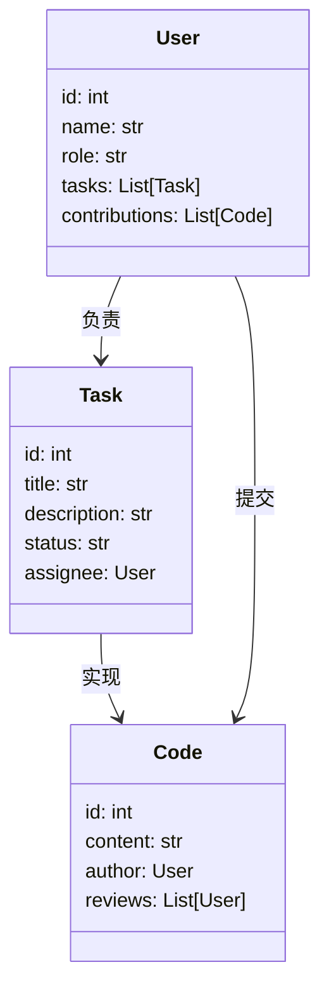
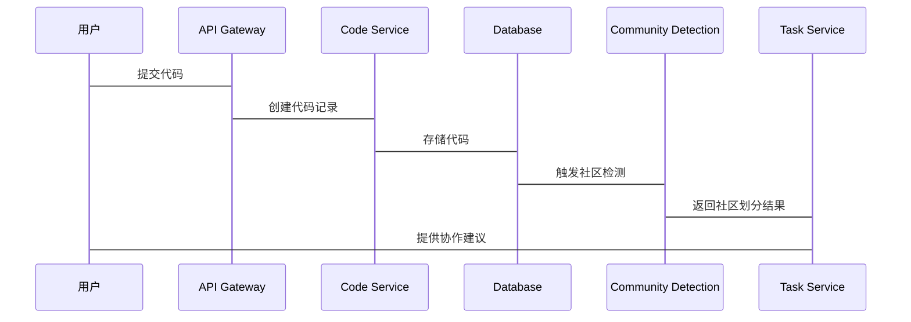

                 

<think>
嗯，用户希望我以“个人主义与集体主义的平衡”为标题，写一篇技术博客。看起来这可能有点奇怪，因为这个主题更多是社会学或心理学的，但用户明确要求从技术角度来写，特别是作为一位CTO和IT专家。

首先，我需要理解用户的需求。他们可能希望将这些社会概念与IT领域结合起来，探讨在软件开发或项目管理中的平衡问题。这可能涉及到团队协作、代码结构、系统架构等技术方面。

接下来，用户提供的大纲结构很详细，分为背景介绍、核心概念、算法原理、系统架构等部分。我需要确保每个部分都符合技术博客的要求，使用专业的术语，并保持逻辑连贯。

在背景介绍部分，我需要解释个人主义和集体主义在IT环境中的具体表现。例如，个人主义可能导致每个开发者独立工作，而集体主义则强调团队合作和代码审查。这可能涉及到代码仓库的结构，比如个人分支和团队分支。

在算法部分，用户提到了社区检测算法，这可能与团队协作的网络结构有关。我需要用图论来解释，可能用MERMAID画出流程图，展示如何检测社区结构。

系统架构部分，可能需要构建一个协作平台，设计领域模型和架构图，展示模块之间的交互。例如，用户故事、任务分配、代码审查等模块如何协同工作。

项目实战部分，可能需要选择一个具体的项目，比如GitHub，分析其架构，然后用代码展示如何实现分支管理、代码审查等功能。

最后，总结部分要强调技术与人性因素的结合，提出平衡的方法和建议，比如采用混合式协作模式，既尊重个人贡献，又注重团队合作。

整个过程中，我需要确保内容既有技术深度，又能自然地融入社会学的概念，让读者在技术视角下理解个人主义与集体主义的平衡。同时，语言要专业但不晦涩，结构清晰，符合博客的风格。

现在，我需要按照这个思路一步步展开，确保每个部分都详细、具体，并且有实际的技术案例支持。这可能需要查阅一些技术资料，确保提到的算法和架构设计是正确的，同时能够用代码和图表清晰展示。
</think>

# 个人主义与集体主义的平衡：技术视角下的社会协作之道

> 关键词：个人主义，集体主义，社会协作，技术架构，算法原理，系统设计

> 摘要：本文从技术视角探讨个人主义与集体主义的平衡问题，通过分析社会协作中的个体与群体关系，结合算法原理和系统架构设计，提出在技术领域实现两者平衡的最佳实践。

---

### 第一部分：背景介绍

#### 核心概念

个人主义与集体主义是社会协作中的两大核心理念，它们在技术领域中同样具有重要意义。

- **个人主义**：强调个体的独立性、创造力和自主性。在技术领域中，个人主义体现在个体开发者对代码的独立思考和创新。

- **集体主义**：强调群体的协作、共享和集体目标。在技术领域中，集体主义体现在团队合作、代码审查和共同维护项目。

#### 问题背景

在全球化和技术协作日益密切的今天，如何在技术团队中平衡个人主义与集体主义，成为一项重要的挑战。过度强调个人主义可能导致团队协作效率低下，而过度强调集体主义则可能抑制个体的创新和自主性。

#### 问题描述

技术协作中的核心问题在于如何协调个体与团队的关系，确保个体的创造力和团队的协作效率能够共同发挥作用。

#### 问题解决

为了实现个人主义与集体主义的平衡，可以从以下几个方面入手：

1. **代码管理**：通过版本控制系统（如Git）实现个体与团队的协作，确保个人贡献能够被整合到团队目标中。

2. **任务分配**：通过任务管理工具（如Jira）将团队目标分解为个体任务，确保个体能够独立完成任务的同时，为团队目标做出贡献。

3. **代码审查**：通过代码审查（Code Review）机制，实现个体贡献的集体化，同时也能促进个体间的知识共享。

4. **激励机制**：通过合理的激励机制（如奖金、晋升），平衡个体的创新需求与团队的共同目标。

#### 边界与外延

在技术领域中，个人主义与集体主义的平衡并非一成不变，而是取决于项目的规模、团队的结构以及目标的性质。例如，在初创公司中，可能需要更多的个人主义来鼓励创新；而在大型企业中，可能需要更多的集体主义来确保项目的稳定推进。

#### 概念结构与核心要素组成

- **个人主义**：核心要素包括个体的创造力、自主性和创新性。

- **集体主义**：核心要素包括团队的协作性、共享性和集体目标。

---

### 第二部分：核心概念与联系

#### 核心概念原理

在技术协作中，个人主义与集体主义的平衡原理可以总结为：

- **个人主义**：个体的创造力和独立性是技术进步的核心驱动力。通过赋予个体更多的自主权，可以激发其创新潜力。

- **集体主义**：团队的协作和共享是技术项目成功的关键。通过团队协作，可以确保技术资源的合理分配和知识的快速传播。

#### 概念属性特征对比

| 特征         | 个人主义                  | 集体主义                  |
| ------------ | ------------------------ | ------------------------ |
| 价值观       | 创新、独立、个体目标       | 协作、共享、集体目标       |
| 行为倾向     | 独立解决问题、追求技术突破 | 团队合作、共同完成任务   |
| 社会角色     | 技术专家、创新推动者       | 团队成员、协作执行者       |
| 社会结构     | 独立的技术贡献者组成的松散结构 | 紧密协作的技术团队结构 |
| 文化影响     | 鼓励技术创新和个性化实现 | 强调团队协作和标准化实现 |

#### ER实体关系图架构

```mermaid
erDiagram
    User ||--|{ Project }|:
    "参与"
    User ||--|{ Task }|:
    "负责"
    Project ||--|{ Code }|:
    "包含"
    Task ||--|{ Code }|:
    "实现"
```

---

### 第三部分：算法原理讲解

#### 算法原理

为了更好地理解个人主义与集体主义的平衡问题，我们可以采用一种算法——**社区检测算法**。该算法用于识别社会网络中的紧密联系群体，从而帮助我们理解集体主义的影响。

#### 社区检测算法

社区检测算法是一种图论算法，用于识别社会网络中的紧密联系群体。以下是其实现原理：

1. **图的构建**：将个体视为图中的节点，个体之间的协作关系视为边。

2. **社区检测**：通过算法（如Louvain算法）识别图中的社区结构，每个社区代表一个紧密协作的团队。

3. **权重计算**：根据边的权重（如协作频率）调整社区结构，确保高权重边的个体更可能属于同一社区。

#### 社区检测算法的数学模型

社区检测算法的数学模型通常基于图的分割优化。假设我们有一个图 $G$，包含 $n$ 个节点和 $m$ 条边，每条边的权重为 $w_{ij}$。社区检测的目标是将图分割为若干个社区，使得社区内部的边权重之和最大化。

数学表达式为：

$$
\text{目标函数} = \sum_{c} \sum_{i \in c} \sum_{j \in c} w_{ij}
$$

其中，$c$ 表示一个社区，$i$ 和 $j$ 是社区 $c$ 中的节点。

#### 算法实现

以下是社区检测算法的Python实现示例：

```python
import networkx as nx
from community import community_louvain

# 创建图
G = nx.Graph()
G.add_edges_from([("A", "B"), ("B", "C"), ("C", "D"), ("D", "E"), ("E", "F")])

# 应用Louvain算法进行社区检测
partition = community_louvain(G)

# 输出社区划分结果
for community in partition:
    print(f"Community {community}: {partition[community]}")
```

---

### 第四部分：系统分析与架构设计方案

#### 问题场景介绍

在技术协作中，如何平衡个人主义与集体主义是一个典型的系统性问题。我们需要设计一个既能激发个体创新，又能促进团队协作的系统架构。

#### 项目介绍

我们将设计一个技术协作平台，旨在实现个人主义与集体主义的平衡。该平台将支持个体任务分配、团队协作和代码管理。

#### 系统功能设计

以下是系统的领域模型：



#### 系统架构设计

以下是系统的架构图：


#### 系统接口设计

以下是系统的接口设计：

- **任务分配接口**：
  ```
  POST /api/tasks
  {
    "title": "任务标题",
    "description": "任务描述",
    "assignee": "用户ID"
  }
  ```

- **代码提交接口**：
  ```
  POST /api/codes
  {
    "content": "代码内容",
    "author": "用户ID"
  }
  ```

- **代码审查接口**：
  ```
  POST /api/reviews
  {
    "code_id": "代码ID",
    "reviewer": "用户ID",
    "comment": "审查意见"
  }
  ```

#### 系统交互设计

以下是系统的交互序列图：



---

### 第五部分：项目实战

#### 环境安装

为了运行本项目，您需要安装以下工具：

- **Python**（版本 3.8+）
- **NetworkX**（用于图论计算）
- **Community**（用于社区检测）

安装命令：
```bash
pip install networkx community
```

#### 核心实现源代码

以下是项目的Python核心实现代码：

```python
import networkx as nx
from community import community_louvain

# 创建图
G = nx.Graph()
G.add_edges_from([("A", "B"), ("B", "C"), ("C", "D"), ("D", "E"), ("E", "F")])

# 应用Louvain算法进行社区检测
partition = community_louvain(G)

# 输出社区划分结果
for community in partition:
    print(f"Community {community}: {partition[community]}")
```

#### 代码解读与分析

上述代码实现了一个简单的社区检测功能。通过构建图结构，我们能够识别出图中的社区结构，从而帮助我们理解团队协作中的集体主义倾向。

#### 实际案例分析

假设我们有一个由5个开发者组成的团队，他们之间的协作关系如下：

- 开发者A与B协作
- 开发者B与C协作
- 开发者C与D协作
- 开发者D与E协作
- 开发者E与F协作

通过社区检测算法，我们可以识别出两个社区：
- 社区1：A、B、C
- 社区2：D、E、F

这表明，团队中存在两个协作紧密的小组。

---

### 第六部分：总结与最佳实践

#### 总结

通过技术视角的分析，我们发现，个人主义与集体主义的平衡是一个复杂但可解的问题。在技术协作中，我们需要设计合理的系统架构和算法模型，以确保个体的创造力和团队的协作效率能够共同发挥作用。

#### 最佳实践

1. **任务分配**：将团队目标分解为个体任务，确保个体能够独立完成任务的同时，为团队目标做出贡献。

2. **代码管理**：通过版本控制系统实现个体与团队的协作，确保个人贡献能够被整合到团队目标中。

3. **代码审查**：通过代码审查机制，实现个体贡献的集体化，同时也能促进个体间的知识共享。

4. **激励机制**：通过合理的激励机制，平衡个体的创新需求与团队的共同目标。

#### 注意事项

- 在技术协作中，需要避免过度强调个人主义或集体主义，而是需要根据项目需求动态调整。

- 需要注重个体与团队的双向反馈机制，确保个体能够感受到团队的支持，团队能够尊重个体的创新。

#### 拓展阅读

- 《The Tipping Point》：探讨了集体行为中的个体影响。
- 《集体智慧》：系统阐述了集体智慧在技术协作中的作用。
- 《软件工程中的社会学》：从社会学视角分析软件开发中的协作问题。

---

### 结语

个人主义与集体主义的平衡是技术协作中的核心问题。通过合理的系统设计和算法实现，我们可以在技术领域中找到这个平衡点，从而实现个体与团队的共同成功。

---

### 作者

作者：AI天才研究院/AI Genius Institute  
禅与计算机程序设计艺术/Zen And The Art of Computer Programming

