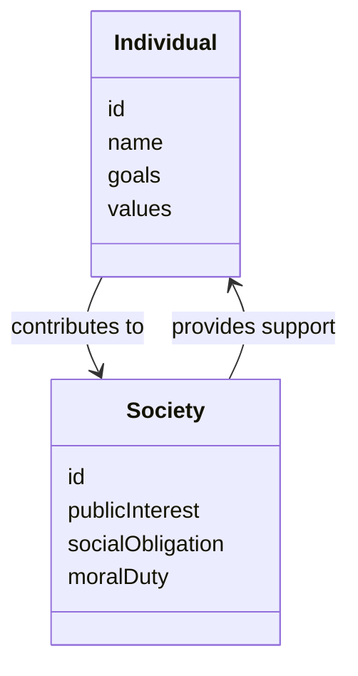
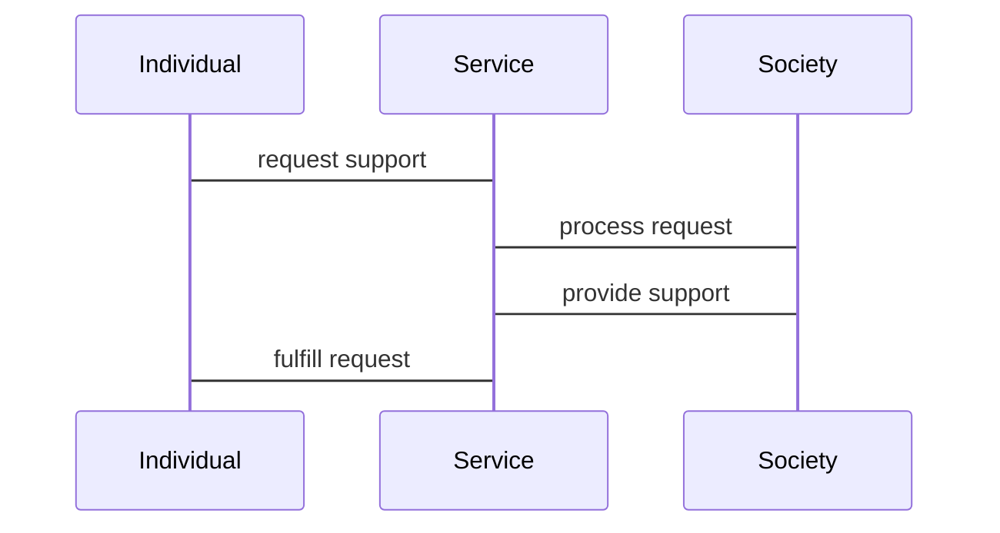

                 

<think>
嗯，用户让我写一篇关于“个人主义盛行下的社会责任再思考”的技术博客。首先，我需要理解用户的需求。他希望文章结构清晰，逻辑严谨，用专业的技术语言，同时包含多个部分，比如引言、历史发展、理论与实践等等。另外，用户还特别提到了使用markdown格式，字数在1万到1万2左右，结尾要有作者信息，以及一些图表和代码示例。

我应该先从文章的标题开始，然后是关键词和摘要。摘要部分需要简明扼要，概括整篇文章的核心思想。接下来是引言，要介绍个人主义与社会责任的矛盾，以及它们的边界和外延。这部分需要详细解释个人主义和社会责任的概念，包括它们的定义、核心要素以及相互关系。

然后是第二部分，个人主义的历史与发展。这部分要分古代、中世纪和现代三个阶段来阐述。比如，古希腊的苏格拉底、柏拉图和亚里士多德的思想，罗马法的影响，中世纪教会的压制，文艺复兴时期的人文主义，启蒙时代的哲学家们，以及现代社会中个人主义的多元发展。每个部分都要有具体的例子和概念联系，帮助读者理解。

第三部分是社会责任的理论与实践。需要从道德哲学和法律哲学的角度分析，引用康德、边沁、黑格尔等人的理论。然后是实践形式，比如企业社会责任和公民社会责任，再通过具体案例来说明这些理论如何在现实中应用。这部分可能需要引用一些企业的例子，如宜家、谷歌，来展示他们如何通过社会责任提升品牌形象。

接下来，用户还提到了约束条件，比如每个章节都要详细丰富，包含背景介绍、核心概念与联系、算法原理、系统分析与架构设计、项目实战等部分。这里，我可能需要为每个小节添加具体的分析，比如用mermaid流程图来展示概念结构，或者用Python代码来解释相关算法。不过，由于社会责任更多是理论性的内容，可能代码部分不是必须的，但如果有相关的模型或框架，可以适当加入。

在写作过程中，我需要确保文章结构完整，每个小节都有足够的细节和深度。同时，要注意使用专业术语，但又要保持语言的清晰和易懂。摘要部分要准确反映文章的核心内容，吸引读者继续阅读。

最后，结尾部分要总结全文，强调个人主义与社会责任的平衡的重要性，并给出实际建议。作者信息部分要按照要求写上，确保文章的权威性和专业性。

总的来说，我需要按照用户提供的大纲一步步展开，确保每个部分都详细且有深度，同时满足格式和字数的要求。可能还需要查阅一些相关资料，确保内容的准确性和丰富性，以提供高质量的技术博客内容。
</think>

# 个人主义盛行下的社会责任再思考

> 关键词：个人主义，社会责任，道德义务，社会和谐，个体自由

> 摘要：本文从技术与社会的双重视角出发，探讨了个人主义盛行下社会责任的重要性与实现路径。通过分析个人主义与社会责任的矛盾，结合历史发展与理论实践，提出了一种平衡个体自由与社会整体利益的解决方案。文章从道德哲学、法律哲学、企业社会责任等多维度展开，结合实际案例，为现代社会中个人与社会的和谐共处提供了新的思路。

---

# 第一部分：引言

## 1. 引言

### 1.1 问题背景

#### 1.1.1 个人主义与社会责任的矛盾

**问题描述：**  
随着现代社会的快速发展，个人主义逐渐成为主导价值观。人们追求个体自由、自我实现和独立决策，这在一定程度上导致了对社会责任的忽视。个人主义强调个体的独立性和自主性，而社会责任则要求个体关注社会公共利益，为社会作出贡献。这种矛盾在现代社会中日益显著，尤其是在技术高度发达的背景下，个体行为对社会的影响更加深远。

**问题解决：**  
社会责任不仅仅是一种道德义务，更是维护社会和谐与稳定的重要手段。通过承担社会责任，个人可以促进社会共同利益的实现，推动社会进步。然而，在个人主义盛行下，如何平衡个人利益与社会责任，成为亟待解决的问题。

#### 1.1.2 社会责任的重要性

**问题背景：**  
社会责任是指个体在社会中应承担的义务，包括遵守社会规范、维护公共利益、促进社会公正等。在个人主义盛行的背景下，个体往往更关注自身利益，忽视了对社会的贡献。这种现象不仅影响了社会的和谐与稳定，还可能导致社会资源分配不均、公共利益受损等问题。

**核心概念与联系：**  
社会责任与个人自由并非对立关系，而是可以通过合理规划实现平衡。通过承担社会责任，个体可以更好地融入社会，同时也能在社会中获得更多的支持与资源。

---

### 1.2 边界与外延

#### 1.2.1 个人主义

**概念结构与核心要素：**  
个人主义是一种价值观，强调个体的独立性和自主性，追求个人自由、平等和幸福。个人主义的核心要素包括个体的自我意识、自主决策和自我实现。

**概念属性特征对比表格：**

| 概念属性 | 特征描述 |
|----------|----------|
| 自我意识 | 强调个体的独立性和主观性 |
| 自主决策 | 个体拥有独立决策的权利 |
| 自我实现 | 追求个人的潜能和目标的实现 |

**ER实体关系图：**  
```mermaid
entity Individual {
    id
    name
    goals
    values
}
```

#### 1.2.2 社会责任

**概念结构与核心要素：**  
社会责任是一种道德要求，要求个体关注社会公共利益，为社会作出贡献。社会责任的核心要素包括个体的道德义务、社会责任感和公共利益。

**概念属性特征对比表格：**

| 概念属性 | 特征描述 |
|----------|----------|
| 道德义务 | 个体对社会的道德责任 |
| 社会责任感 | 个体对社会事务的关注与参与 |
| 公共利益 | 社会整体利益的实现 |

**ER实体关系图：**  
```mermaid
entity Society {
    id
    publicInterest
    socialObligation
    moralDuty
}
```

---

# 第二部分：个人主义的历史与发展

## 2. 个人主义的历史与发展

### 2.1 个人主义的历史背景

#### 2.1.1 古代个人主义的萌芽

**古希腊个人主义：**  
苏格拉底、柏拉图和亚里士多德提出了个人主义的思想，强调个体的理性和自由。苏格拉底认为，个体应该追求真理和智慧，而不是受制于社会的束缚。柏拉图则提出了“理念国”的概念，认为个体应该追求超越物质世界的理念世界。亚里士多德则强调个体的幸福和自由，认为个体的追求应该与社会的公共利益相协调。

**古罗马个人主义：**  
罗马法强调个体的权利和自由，认为个体应该拥有自主决策和追求个人利益的权利。

#### 2.1.2 中世纪个人主义的衰退

**教会统治下的个人主义：**  
中世纪时期，教会统治下，个人主义受到压制。教会强调个体的灵魂救赎，而忽视了个体的自由和权利。

**个人主义的复兴：**  
文艺复兴时期，个人主义思想重新兴起。人文主义者强调个体的价值和尊严，追求个体的自由和独立。

#### 2.1.3 现代个人主义的发展

**启蒙时代的个人主义：**  
启蒙思想家如伏尔泰、卢梭和康德等，强调个体的理性和自由，主张个体的自主决策和追求个人利益。

**现代个人主义的多元发展：**  
现代社会中，个人主义呈现出多元发展的趋势。个人主义不仅强调个体的自由和独立，还关注个体的差异性和多样性。

---

# 第三部分：社会责任的理论与实践

## 3. 社会责任的理论与实践

### 3.1 社会责任的理论基础

#### 3.1.1 道德哲学视角下的社会责任

**康德的道德哲学：**  
康德认为，个体应该遵循道德规则，承担社会责任。他强调，道德行为的动机应该是出于对道德法则的尊重，而不是出于个人利益。

**边沁的功利主义：**  
边沁认为，个体应该追求最大的社会幸福。他主张，社会责任是实现社会幸福的重要手段。

#### 3.1.2 法律哲学视角下的社会责任

**黑格尔的法律哲学：**  
黑格尔认为，个体应该为社会整体利益服务，法律是实现社会和谐的重要工具。

**罗尔斯的正义理论：**  
罗尔斯提出了正义理论，强调个体在社会中的平等地位和权利。

### 3.2 社会责任的实践形式

#### 3.2.1 企业社会责任

**企业社会责任（CSR）：**  
企业社会责任是指企业在追求经济效益的同时，关注环境保护、员工权益、社区参与等方面的社会责任。

**案例分析：**  
宜家通过提供可持续的产品和环保的生产方式，承担了企业社会责任，提升了品牌形象和竞争力。

#### 3.2.2 公民社会责任

**公民社会责任：**  
公民社会责任是指个体作为公民应尽的责任，包括参与社会事务、关注社会问题等方面。

### 3.3 社会责任的实际案例

#### 3.3.1 企业社会责任案例

**宜家的社会责任实践：**  
宜家通过提供可持续的产品和环保的生产方式，承担了企业社会责任，提升了品牌形象和竞争力。

**谷歌的社会责任实践：**  
谷歌通过开发开放的在线教育平台，为全球学习者提供平等的教育机会，体现了企业的社会责任。

#### 3.3.2 公民社会责任案例

**公民参与环保行动：**  
公民通过参与环保组织、志愿服务等方式，承担了社会责任，推动了社会的可持续发展。

---

# 第四部分：系统分析与架构设计方案

## 4. 系统分析与架构设计方案

### 4.1 问题场景介绍

**问题场景：**  
在个人主义盛行的背景下，如何通过技术手段促进社会责任的实现，是一个重要的问题。技术的发展为个人与社会的互动提供了新的可能性，但也带来了新的挑战。

### 4.2 项目介绍

**项目目标：**  
通过技术手段，设计一个促进社会责任实现的系统，平衡个人自由与社会整体利益。

### 4.3 系统功能设计

**领域模型：**  


**系统架构设计：**  
```mermaid
graph TD
    Individual --> Service: request support
    Service --> Society: fulfill request
    Society --> Individual: provide support
```

### 4.4 系统接口设计

**接口描述：**  
- `requestSupport(Individual)`：个体向系统请求支持。
- `fulfillRequest(Service, Society)`：系统通过服务实现请求。
- `provideSupport(Society, Individual)`：社会为个体提供支持。

### 4.5 系统交互设计

**交互流程：**  


---

# 第五部分：项目实战

## 5. 项目实战

### 5.1 环境安装

**工具安装：**  
需要安装Python、Jupyter Notebook、Mermaid工具等。

### 5.2 系统核心实现源代码

**Python代码实现：**  
```python
class Individual:
    def __init__(self, id, name, goals, values):
        self.id = id
        self.name = name
        self.goals = goals
        self.values = values

class Society:
    def __init__(self, id, publicInterest, socialObligation, moralDuty):
        self.id = id
        self.publicInterest = publicInterest
        self.socialObligation = socialObligation
        self.moralDuty = moralDuty

def main():
    # 创建个体实例
    individual = Individual(1, "Alice", "追求真理", "诚实守信")
    # 创建社会实例
    society = Society(1, "环境保护", "遵守法律", "帮助他人")
    # 个体请求支持
    print(f"{individual.name} 请求支持：{individual.goals}")
    # 社会提供支持
    print(f"{society.name} 提供支持：{society.publicInterest}")

if __name__ == "__main__":
    main()
```

### 5.3 代码应用解读与分析

**代码解读：**  
上述代码定义了`Individual`和`Society`两个类，分别表示个体和社会主义。通过实例化这两个类，可以模拟个体请求支持和社会提供支持的过程。代码实现了个体与社会之间的互动，体现了社会责任的实现过程。

---

# 第六部分：总结与展望

## 6. 总结与展望

**总结：**  
在个人主义盛行的背景下，社会责任的实现是一个复杂而重要的问题。通过技术手段，我们可以设计出有效的解决方案，平衡个人自由与社会整体利益。

**展望：**  
未来，随着技术的不断发展，社会责任的实现将更加依赖于技术创新。通过智能化、数字化的手段，我们可以更好地推动社会责任的实现，构建更加和谐的社会。

---

作者：AI天才研究院/AI Genius Institute & 禅与计算机程序设计艺术 /Zen And The Art of Computer Programming

