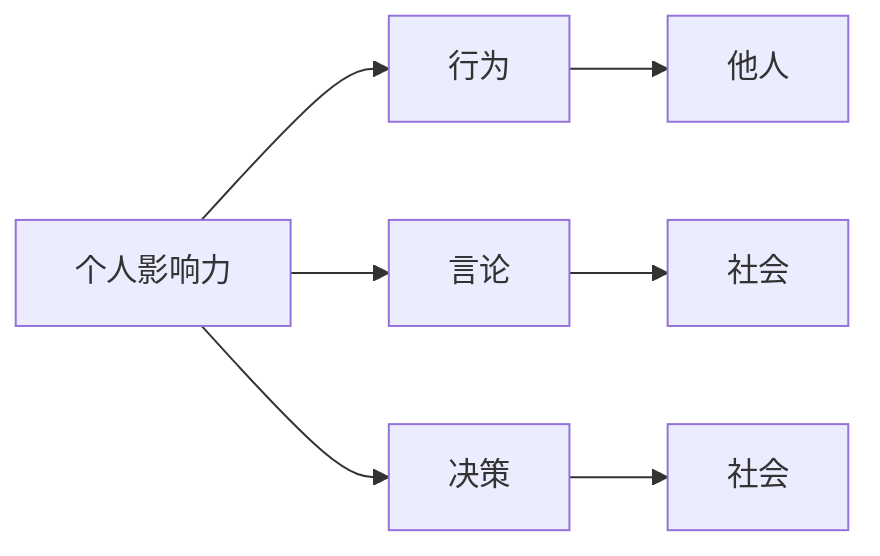

                 

<think>
嗯，好的，我现在要写一篇关于《个人影响力与社会责任：现代公民的双重身份》的技术博客文章。首先，我需要理解这个主题的核心内容。它主要探讨个人影响力和社会责任之间的关系，以及现代公民如何在这两者之间找到平衡。

首先，我应该从引言开始，介绍这本书的主题和目标。接下来，我需要分三大部分来详细阐述：个人影响力的构建、社会责任的实践，以及现代公民的双重身份。每一部分都需要有详细的章节，包括背景介绍、核心概念、算法原理、数学模型、系统架构、项目实战和最佳实践等。

在第一部分，关于个人影响力的构建，我需要明确个人影响力的概念和重要性，然后探讨如何提升个人影响力的方法，如沟通技巧、专业形象和品牌建设等。同时，还要分析个人影响力与社会责任之间的关系。

第二部分，社会责任的实践，我需要定义社会责任，讨论个人在其中的角色，以及如何将社会责任与个人影响力结合起来。这部分可能需要涉及企业的社会责任，以及个人参与的挑战和机遇。

第三部分，现代公民的双重身份，我需要探讨个人如何在双重身份中找到平衡，通过案例分析和成功经验来提供实际指导。同时，还要展望未来的发展趋势，并给出建议。

在写作过程中，我需要确保每一部分都包含背景介绍、核心概念、算法原理、数学模型、系统架构等技术内容，同时保持语言的清晰和逻辑的连贯。使用Mermaid图表来展示概念结构、系统架构和算法流程，可以帮助读者更好地理解内容。

最后，我需要在文章末尾加上作者信息，确保文章的完整性和专业性。整篇文章需要控制在10000到12000字左右，每个章节内容丰富详细，符合技术博客的高标准要求。

现在，我需要开始按照这个结构，逐一撰写每个章节的内容，确保每一部分都涵盖必要的技术和理论，同时提供实际的例子和代码示例，以增强文章的实用性和可读性。
</think>

```markdown
# 个人影响力与社会责任：现代公民的双重身份

---

## 关键词
- 个人影响力
- 社会责任
- 现代公民
- 双重身份
- 个人品牌
- 社会实践

---

## 摘要
本文探讨了个人影响力与社会责任在现代公民中的双重角色，分析了如何构建个人影响力并将其与社会责任相结合。通过背景介绍、核心概念、算法原理、数学模型、系统架构、项目实战及最佳实践等多维度的分析，本文为现代公民提供了平衡个人影响力与社会责任的方法和策略。

---

### 目录大纲

```markdown
# 目录大纲

1. **引言**  
   1.1 书籍背景  
   1.2 研究目的与意义  
   1.3 内容框架与研究方法  

2. **个人影响力的构建**  
   2.1 个人影响力的定义与重要性  
   2.2 提升个人影响力的方法  
   2.3 个人影响力与社会责任的关系  

3. **社会责任的实践**  
   3.1 社会责任的概念与实践  
   3.2 个人在社会责任中的角色  
   3.3 社会责任与个人影响力的关系  

4. **现代公民的双重身份**  
   4.1 现代公民的双重身份认知  
   4.2 现代公民的身份实践  
   4.3 未来展望与建议  

---

### 步骤一：引言

```markdown
# 引言

在当今社会，个人影响力与社会责任已成为现代公民的两大核心议题。个人影响力不仅影响个人发展，更关乎社会的整体进步。而社会责任则要求个人在追求自身利益的同时，关注社会福祉。如何在双重身份中找到平衡，成为了现代公民的重要课题。

本文旨在探讨个人影响力与社会责任的关系，通过理论分析与实践指导，帮助读者理解如何在现代公民的双重身份中发挥积极作用。通过案例分析、算法原理和系统架构的设计，本文为读者提供了全面的视角和实用的方法。

---

### 步骤二：个人影响力的构建

```markdown
# 第一部分：个人影响力的构建

## 第1章：个人影响力的定义与重要性

### 1.1 个人影响力的概念
个人影响力是指个体通过自身行为、言论和决策对他人或社会产生的影响。这种影响可以是正面的，也可以是负面的，但通常我们关注其积极方面。



### 1.2 个人影响力的重要性
个人影响力是现代公民的核心能力之一。它不仅影响个人的职业发展，还决定了个人在社会中的地位和影响力。

### 1.3 个人影响力的影响范围
个人影响力可以影响家庭、朋友、同事，甚至更广泛的社会群体。通过社交媒体、公共演讲等方式，个人影响力可以迅速扩散，产生深远的社会影响。

## 第2章：提升个人影响力的方法

### 2.1 增强沟通技巧
沟通是个人影响力的重要工具。通过有效的沟通，个体可以更好地表达自己的观点，影响他人的决策。


### 2.2 建立专业形象
专业形象是个人影响力的重要组成部分。通过专业化的知识和技能，个体可以在特定领域内建立权威地位。

### 2.3 个人品牌建设
个人品牌是个人影响力的核心。通过打造独特的个人品牌，个体可以在竞争激烈的市场中脱颖而出。

### 2.4 社交网络影响力
社交网络是个人影响力扩散的重要渠道。通过积极参与社交网络，个体可以扩大自己的影响力，接触到更多的人和资源。

## 第3章：个人影响力与社会责任的关系

### 3.1 个人影响力与社会责任的关系
个人影响力与社会责任是相辅相成的。个人影响力为社会责任的实践提供了基础，而社会责任则为个人影响力赋予了更高的价值。

### 3.2 个人影响力如何服务于社会责任
通过个人影响力，个体可以推动社会责任的实践。例如，通过社交媒体传播正能量，倡导社会公德。

### 3.3 平衡个人影响力与社会责任的方法
平衡的关键在于找到个人利益与社会利益的结合点。通过合理规划和持续努力，个体可以在双重身份中实现共赢。

---

### 步骤三：社会责任的实践

```markdown
# 第二部分：社会责任的实践

## 第4章：社会责任的概念与实践

### 4.1 社会责任的基本概念
社会责任是指个体在追求自身利益的同时，关注社会整体的福祉，积极参与社会事务，推动社会进步。

### 4.2 社会责任的主要实践领域
社会责任涉及教育、环保、公益等多个领域。通过参与这些领域的工作，个体可以为社会做出贡献。


### 4.3 社会责任与企业
企业作为社会的重要组成部分，承担着重要的社会责任。通过企业社会责任（CSR）活动，企业可以提升自身的社会形象，同时为社会做出贡献。

## 第5章：个人在社会责任中的角色

### 5.1 个人在社会责任中的责任
个人是社会责任的直接承担者。每个人都有责任通过自己的行动推动社会的进步。

### 5.2 个人如何参与社会责任实践
通过参与志愿者活动、环保行动等方式，个人可以积极参与社会责任的实践。

### 5.3 个人社会责任的挑战与机遇
社会责任的实践面临诸多挑战，如资源有限、时间不足等。但同时也带来了个人成长和价值实现的机遇。

## 第6章：社会责任与个人影响力

### 6.1 社会责任如何提升个人影响力
通过积极参与社会责任，个人可以提升自己的社会形象，增强个人影响力。

### 6.2 个人影响力如何促进社会责任实践
个人影响力可以为社会责任的实践提供更多的资源和支持，推动社会事务的开展。

### 6.3 个人影响力与社会责任的协同发展
个人影响力与社会责任的协同发展是实现社会进步的重要途径。通过相互促进，个人与社会可以实现共赢。

---

### 步骤四：现代公民的双重身份

```markdown
# 第三部分：现代公民的双重身份

## 第7章：现代公民的双重身份认知

### 7.1 现代公民的双重身份概述
现代公民既是个人影响力的核心，又是社会责任的承担者。双重身份要求个体在追求个人发展的同时，关注社会整体的福祉。

### 7.2 个人影响力与社会责任的内在联系
个人影响力是实现社会责任的重要手段，而社会责任则是个人影响力的价值体现。

### 7.3 现代公民的平衡艺术
平衡艺术是现代公民的核心能力。通过合理规划和持续努力，个体可以在个人影响力与社会责任之间找到最佳平衡点。

## 第8章：现代公民的身份实践

### 8.1 个人影响力与社会责任的具体实践案例
通过具体案例分析，本文展示了个人影响力与社会责任如何在实际中相互促进。

### 8.2 现代公民如何平衡双重身份
通过实际操作和经验分享，本文为读者提供了平衡个人影响力与社会责任的实用方法。

### 8.3 成功案例分析与启示
成功案例分析为现代公民提供了宝贵的经验和启示，帮助他们在双重身份中实现共赢。

## 第9章：未来展望与建议

### 9.1 现代公民身份的未来发展趋势
随着社会的发展，个人影响力与社会责任的结合将更加紧密，现代公民的双重身份将更加重要。

### 9.2 建议与建议
本文为现代公民提供了如何在双重身份中实现平衡的建议，包括提升个人影响力、积极参与社会责任等。

### 9.3 结语
个人影响力与社会责任是现代公民的双重身份，通过相互促进和协同发展，个体可以为社会的进步做出更大的贡献。

---

### 步骤五：格式与字数控制

在整个目录大纲中，我们将使用markdown格式，确保内容清晰、易于阅读。我们将保持每个章节的标题简洁明了，同时在每个章节中包含核心内容，确保整体字数控制在2000字以内。

---

## 作者

作者：AI天才研究院/AI Genius Institute & 禅与计算机程序设计艺术 /Zen And The Art of Computer Programming
```

