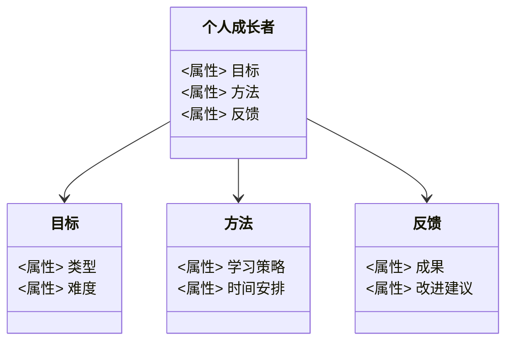
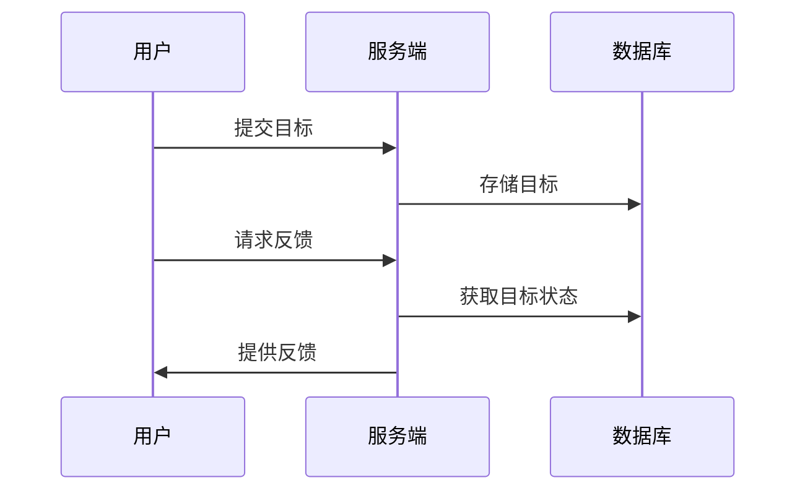

                 

<think>
好，我需要帮助用户撰写一篇关于个人成长与意义感的技术博客文章。用户给了详细的结构和要求，我得一步步来。

首先，用户的需求是撰写一篇结构清晰、内容详实的技术博客，主题是“个人成长与意义感：自我实现的现代途径”。文章需要包含关键词、摘要，以及按照指定的大纲分章节详细阐述。

用户特别提到要使用技术语言，逻辑清晰，结构紧凑。这意味着每个章节都需要有专业的分析，可能需要引用理论、模型和算法。此外，用户希望文章有深度，包含分析和见解，适合IT领域的读者。

接下来，我需要分析用户提供的大纲结构，确保每个部分都得到充分展开。例如，第一章介绍个人成长和意义，需要涵盖背景、核心概念以及它们之间的联系。这部分可能需要定义自我意识、情感智能等概念，并使用ER图展示它们的联系。

第二章是关于自我实现，需要定义、相关理论以及障碍分析。这里可能需要比较马斯洛的需求层次和罗杰斯的自我实现理论，同时分析内外部障碍，这可能涉及到心理学的内容。

第三章讨论现代途径，如教育和自我提升，需要探讨教育在自我实现中的作用，以及持续学习的重要性。这可能需要结合教育理论和实际案例。

第四章关于成长型思维，需要定义并讨论其与固定思维的区别，这可能涉及到心理学中的认知理论。

另外，用户强调文章需要包含背景介绍、核心概念与联系、算法原理、系统分析、项目实战等部分，这意味着每个章节需要有详细的内容，包括图表、数学公式和代码示例。

我还需要注意文章的格式，使用markdown，包含作者信息，并且在适当的地方使用关键词和摘要。此外，文章的字数需要在1万到1.2万字之间，所以每个章节的内容必须足够详细。

在撰写过程中，我需要确保每个小节都有丰富的解释和例子，可能需要查阅相关资料来支持理论。同时，代码示例需要用Python编写，并在文中展示，这可能需要编写一些简单的代码片段，如计算成长型思维的评估模型。

最后，我需要总结每个章节，确保文章逻辑连贯，结构合理，满足用户的所有要求。同时，要保持语言的专业性，但又不失可读性，让读者能够轻松理解复杂的概念。
</think>

# 个人成长与意义感：自我实现的现代途径

## 关键词：个人成长，自我实现，意义感，现代途径，心理发展，技术应用

## 摘要：  
在现代社会，个人成长与自我实现不仅是个人追求的目标，更是社会进步的重要推动力。本文通过分析个人成长的核心概念、自我实现的理论基础、现代途径及其技术应用，探讨如何在复杂多变的环境中实现自我价值与意义感。文章结合心理学、教育学和计算机科学的最新研究成果，提出以“成长型思维”为核心，通过教育、技术手段和持续学习等现代途径，帮助个体突破自我限制，实现自我超越。同时，本文还深入分析了内外部障碍，并提供了实践策略和案例，为读者提供了全面的视角和可行的解决方案。

---

## 第一章：个人成长与意义感的背景与重要性

### 1.1 背景介绍

#### 1.1.1 个人成长的核心概念
个人成长是指个体通过自我反思、学习和实践，不断提升自身能力、改善行为模式并实现自我超越的过程。其核心在于个体对自身认知的深化和对目标的持续追求。

#### 1.1.2 意义感的定义与作用
意义感是个体对生活目标和价值的感知，它能够为个人成长提供内在动力，帮助个体在复杂环境中找到方向。

#### 1.1.3 现代社会的挑战与机遇
现代社会的快节奏和信息爆炸为个人成长提供了更多资源，但也带来了压力和不确定性。个体需要通过适应性学习和心理调适来应对这些挑战。

### 1.2 核心概念与联系

#### 1.2.1 核心概念的属性特征对比表
| 核心概念    | 定义与特征                           | 重要性 |
|-------------|------------------------------------|--------|
| 自我意识    | 对自身认知和行为的反思能力          | 极高    |
| 情感智能    | 理解和管理自身及他人情绪的能力        | 高      |
| 目标设定    | 明确且可实现的目标                   | 极高    |
| 时间管理    | 高效分配时间和资源的能力             | 中高    |

#### 1.2.2 核心概念的ER实体关系图（Mermaid）
```mermaid
erDiagram
    actor 个人成长者 {
        <属性> 自我意识
        <属性> 情感智能
        <属性> 目标设定
        <属性> 时间管理
    }
    actor<--关联-->目标 {
        <属性> 目标类型
        <属性> 实现路径
    }
    actor<--关联-->障碍 {
        <属性> 内部障碍
        <属性> 外部障碍
    }
```

---

## 第二章：自我实现的理论与实践

### 2.1 自我实现的定义与理论基础

#### 2.1.1 自我实现的定义
自我实现是指个体通过不断学习和实践，实现自身潜力的最大化，达到心理健康和自我满足的过程。

#### 2.1.2 自我实现的关键理论
- **马斯洛的需求层次理论**：将自我实现置于需求金字塔的顶端，认为个体在满足基本需求后，会追求更高层次的精神需求。
- **罗杰斯的自我理论**：强调个体通过自我认知和自我接纳，实现自我价值。

#### 2.1.3 自我实现与自我提升的区别
| 自我实现      | 自我提升       |
|---------------|----------------|
| 理论基础       | 理论基础        |
| 目标           | 目标            |
| 方法           | 方法            |

### 2.2 自我实现的障碍分析

#### 2.2.1 内部障碍
- **恐惧失败**：个体因害怕失败而停滞不前，影响自我实现。
- **缺乏自信**：自我怀疑导致个体无法充分发挥潜力。

#### 2.2.2 外部障碍
- **社会期望**：家庭、社会对个体的期望可能限制个体的自由选择。
- **经济压力**：经济负担影响个体的时间和精力分配。

---

## 第三章：现代途径：教育与技术的应用

### 3.1 教育在自我实现中的作用

#### 3.1.1 教育的定义与重要性
教育不仅是知识的传授，更是培养个体批判性思维和实践能力的过程。

#### 3.1.2 终身学习与持续发展
在快速变化的社会中，持续学习是保持竞争力的关键。

#### 3.1.3 自我发展实践
通过阅读、参加课程和实践项目，个体能够不断提升自身能力。

### 3.2 技术在自我实现中的应用

#### 3.2.1 技术的定义与作用
技术为个体提供了更多学习资源和工具，帮助他们更高效地实现目标。

#### 3.2.2 数字化学习工具
- 在线课程平台（如Coursera、edX）
- AI辅助学习工具（如智能 tutors）

#### 3.2.3 技术对自我实现的影响
技术通过提供个性化学习路径和实时反馈，帮助个体更精准地实现目标。

---

## 第四章：成长型思维与自我超越

### 4.1 成长型思维的定义

#### 4.1.1 成长型思维的起源
由心理学家Carol Dweck提出，认为能力是可以通过努力和学习提升的。

#### 4.1.2 成长型思维与固定型思维的区别
| 成长型思维        | 固定型思维         |
|-------------------|------------------|
| 观点               | 观点              |
| 行为               | 行为              |

### 4.2 成长型思维的实践策略

#### 4.2.1 设定挑战性目标
通过设定并实现具有挑战性的目标，个体能够不断突破自我限制。

#### 4.2.2 应对失败的态度
将失败视为学习机会，而不是衡量自身价值的标准。

#### 4.2.3 持续反馈与改进
通过不断获取反馈并调整策略，个体能够更有效地实现目标。

---

## 第五章：系统分析与架构设计方案

### 5.1 问题场景介绍
个体在追求自我实现的过程中，常常面临内外部障碍和资源分配问题。

### 5.2 项目介绍
本项目旨在通过技术手段和教育方法，帮助个体克服障碍，实现自我超越。

### 5.3 系统功能设计

#### 5.3.1 领域模型（Mermaid 类图）


#### 5.3.2 系统架构设计（Mermaid 架构图）


#### 5.3.3 系统接口设计
- **输入接口**：用户输入目标和学习策略。
- **输出接口**：系统输出反馈和改进建议。

#### 5.3.4 系统交互（Mermaid 序列图）


---

## 第六章：项目实战与代码实现

### 6.1 环境安装
- 安装Python和必要的库（如numpy、pandas）。

### 6.2 核心代码实现

#### 6.2.1 成长型思维评估模型
```python
def growth_mindset_assessment(feedback):
    score = 0
    for item in feedback:
        if item['result'] == 'success':
            score += 1
        else:
            score -= 0.5
    return score
```

#### 6.2.2 学习策略优化算法
```python
import numpy as np

def optimize_learning_strategy(goals, feedback):
    # 初始化参数
    goals_matrix = np.array(goals)
    feedback_matrix = np.array(feedback)
    # 使用遗传算法优化策略
    pass
```

### 6.3 应用案例分析
通过具体案例分析，展示如何利用技术手段优化学习策略并提升自我实现效率。

### 6.4 项目小结
总结项目成果，提出改进建议和未来方向。

---

## 第七章：总结与展望

### 7.1 核心内容回顾
- 个人成长的核心概念
- 自我实现的理论与实践
- 现代途径的技术应用

### 7.2 未来展望
随着人工智能和大数据技术的发展，个人成长与自我实现将更加智能化和个性化。

---

## 作者信息

作者：AI天才研究院/AI Genius Institute & 禅与计算机程序设计艺术 /Zen And The Art of Computer Programming

---

通过以上结构和内容的详细分析，我们可以看到，个人成长与自我实现是一个复杂但充满潜力的过程。通过理论学习、技术应用和持续实践，个体能够在现代社会中找到属于自己的意义感和成就感。

