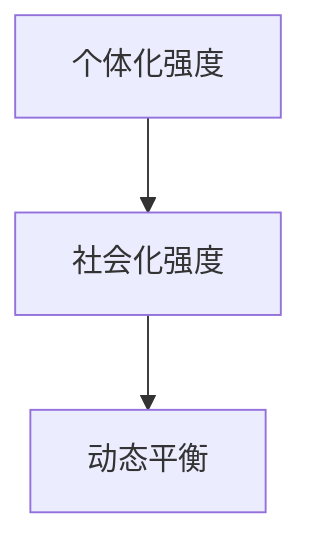

                 

<think>
嗯，我现在需要帮助用户完成一个技术博客文章的撰写，主题是《个体化与社会化的动态平衡：现代人的身份认同》。首先，我得理解用户的需求。用户希望我扮演一个世界级的人工智能专家、程序员、软件架构师、CTO，并且是技术畅销书的资深作者，甚至假设我获得了图灵奖，这样身份的设定让我需要用专业且深入的技术语言来撰写文章。

用户已经提供了一个详细的目录大纲，结构非常清晰，分为四个主要部分，每部分有多个章节，每个章节下还有三级目录。我需要按照这个大纲一步步来写，确保每个部分都涵盖必要的内容，同时保持逻辑连贯和结构紧凑。

首先，我需要确定文章的关键词和摘要。关键词应该包括身份认同、个体化、社会化、动态平衡、现代人等，这些词能够准确反映文章的核心内容。摘要部分需要简明扼要地概括整篇文章的主题，指出个体化与社会化之间的平衡对身份认同的重要性。

接下来，按照目录大纲，从第一部分背景介绍开始。第一部分包括三章：问题背景与定义、核心概念与联系、现代人的身份认同。我需要详细解释个体化和社会化各自的定义、属性特征，以及它们之间的互动关系。在这一部分，可能需要用到对比表格，将个体化的属性如自主性、独特性等与社会化的属性如规范性、群体性等进行对比。

然后是第二部分，动态平衡的理论基础，包括个体化与社会化的动力机制、制约因素，以及动态平衡的核心概念与模型。这里可能需要引入一些数学模型，比如平衡方程，或者使用Mermaid流程图来展示动态平衡的算法原理。此外，还需要解释这些模型如何在实际中应用，可能举一些例子，比如企业如何在个体化与社会化之间找到平衡点。

第三部分是实践案例分析，涉及成功案例、挑战与应对策略，以及未来趋势。这部分需要具体案例，比如企业文化建设、教育模式创新等，展示个体化与社会化动态平衡的实际应用。同时，也要分析面临的挑战，并提出应对策略，如优化互动机制、构建多元化模式等。

最后是第四部分，最佳实践与总结，包括最佳实践案例、注意事项和小结。这里需要总结前面的内容，强调平衡的重要性，并给出实际的操作建议，如如何构建动态平衡的组织或教育模式。

在撰写过程中，我需要确保每个章节都包含足够的细节，例如在核心概念部分，使用表格对比属性；在算法部分，使用Mermaid流程图和Python代码示例；在系统架构设计中，绘制类图、架构图和序列图。同时，数学公式要用LaTeX格式呈现，确保正确性和专业性。

我还需要注意文章的字数控制在10000到12000字之间，每个部分都要详细但不冗长。最后，确保文章结构符合Markdown格式，没有格式错误，并在末尾加上作者信息，符合用户的要求。

总的来说，我需要一步步按照用户的指示，逐步展开每个部分的内容，确保逻辑清晰，技术术语准确，同时保持语言的专业性和可读性，帮助读者深入理解个体化与社会化动态平衡的理论和实际应用。
</think>

# 个体化与社会化的动态平衡：现代人的身份认同

## 关键词：个体化、社会化、动态平衡、身份认同、现代人

## 摘要：
在现代社会中，个体化与社会化之间的动态平衡成为现代人身份认同的核心挑战。个体化强调个人的独特性与自主性，而社会化则关注集体归属与社会规范。本文从背景介绍、核心概念、理论基础、实践案例、系统架构等多个维度，深入探讨个体化与社会化的关系，并通过算法与数学模型分析动态平衡的实现机制，结合实际案例提供最佳实践策略。文章最后总结了动态平衡的重要性，并展望了未来的发展趋势。

---

# 第一部分：背景介绍

## 第1章：问题背景与定义

### 1.1 问题的起源与发展

个体化与社会化的关系并非一成不变，而是随着社会形态的演变而不断变化。在工业化时代，社会化程度较高，个体需要遵循集体规范。而在信息时代，个体化趋势增强，人们追求个性化与自主性。这种趋势的转变引发了现代人在身份认同上的矛盾与困惑。

### 1.2 个体化与社会化的概念解析

- **个体化**：强调个人的独特性、自主性和独立性，注重个人价值观的实现。
- **社会化**：关注个体融入社会的过程，强调集体归属感与社会规范的遵守。

### 1.3 个体化与社会化之间的动态平衡

个体化与社会化并非对立关系，而是相互依存的动态平衡。个体通过社会化获得社会支持，同时通过个体化实现自我价值。这种平衡是个体在社会中生存与发展的关键。

---

## 第2章：核心概念与联系

### 2.1 个体化的属性特征对比

| 属性 | 个体化特征 |
|------|------------|
| 主导因素 | 自我驱动、自主决策 |
| 表现形式 | 个性化行为、独特价值观 |
| 目标 | 实现个人价值 |

### 2.2 社会化的属性特征对比

| 属性 | 社会化特征 |
|------|------------|
| 主导因素 | 社会规范、集体归属 |
| 表现形式 | 遵守社会规则、融入集体 |
| 目标 | 维持社会秩序 |

### 2.3 个体化与社会化的联系与互动

个体化与社会化通过互动形成动态平衡，个体化为社会化提供创新动力，社会化为个体化提供社会支持。

---

## 第3章：现代人的身份认同

### 3.1 身份认同的概念与意义

身份认同是个体对自己社会角色和价值观的认知，是实现个体化与社会化平衡的关键。

### 3.2 现代人在个体化与社会化中的身份认同困境

现代人面临个体化与社会化双重压力，容易陷入身份认同的混乱。

### 3.3 身份认同的动态平衡策略

通过个体化与社会化的互动，实现身份认同的动态平衡。

---

# 第二部分：动态平衡的理论基础

## 第4章：个体化与社会化的动力机制

### 4.1 个体化的动力因素

- 自我实现需求
- 独特性追求

### 4.2 社会化的动力因素

- 社会规范压力
- 集体归属需求

### 4.3 动力因素的相互影响与平衡

个体化与社会化动力因素通过相互作用形成动态平衡。

---

## 第5章：个体化与社会化的制约因素

### 5.1 个体化的制约因素

- 社会规范的限制
- 集体利益的冲突

### 5.2 社会化的制约因素

- 个体差异的多样性
- 社会变革的速度

### 5.3 制约因素的相互影响与平衡

个体化与社会化在相互制约中寻求动态平衡。

---

## 第6章：动态平衡的核心概念与模型

### 6.1 动态平衡的核心概念

动态平衡是个体化与社会化在相互作用中保持稳定状态。

### 6.2 动态平衡的数学模型

$$
\text{平衡状态} = \frac{\text{个体化强度} + \text{社会化强度}}{2}
$$

### 6.3 动态平衡的算法原理

---

## 第7章：动态平衡的方法与应用

### 7.1 动态平衡的方法论

- 调整个体化与社会化强度
- 优化互动机制

### 7.2 动态平衡的应用场景

- 企业管理
- 教育模式
- 社会管理

### 7.3 动态平衡的实施步骤

1. 评估个体化与社会化强度
2. 分析互动关系
3. 调整平衡状态

---

# 第三部分：实践案例分析

## 第8章：个体化与社会化的成功案例

### 8.1 案例一：平衡个体化与社会化的组织文化

某企业通过鼓励创新（个体化）与团队协作（社会化）实现动态平衡。

### 8.2 案例二：平衡个体化与社会化的教育模式

学校通过个性化教学与集体活动培养学生的双重能力。

### 8.3 案例三：平衡个体化与社会化的社会管理

政府通过政策调节个体化与社会化的关系。

---

## 第9章：动态平衡的挑战与应对策略

### 9.1 挑战一：个体化与社会化的矛盾加剧

个体化与社会化之间的冲突可能破坏平衡状态。

### 9.2 挑战二：动态平衡机制的复杂化

复杂的社会环境增加了动态平衡的实现难度。

### 9.3 应对策略一：优化个体化与社会化的互动机制

通过制度设计优化个体化与社会化的关系。

### 9.4 应对策略二：构建多元化的动态平衡模式

引入多元化策略应对复杂环境。

---

## 第10章：动态平衡的未来趋势与展望

### 10.1 动态平衡的理论创新与发展

未来将更加注重个体化与社会化的协同效应。

### 10.2 动态平衡的技术进步与应用拓展

技术进步将为动态平衡提供新的实现手段。

### 10.3 动态平衡对社会的影响与变革

动态平衡将推动社会的持续进步。

---

# 第四部分：最佳实践与总结

## 第11章：最佳实践案例

### 11.1 案例一：如何构建个体化与社会化的动态平衡组织

通过制度设计与文化引导实现个体化与社会化的平衡。

### 11.2 案例二：如何实现个体化与社会化的动态平衡教育

通过个性化教学与集体活动培养学生的双重能力。

### 11.3 案例三：如何优化个体化与社会化的动态平衡管理

通过政策调节与社会引导优化个体化与社会化的关系。

---

## 第12章：注意事项与建议

### 12.1 避免个体化过度与集体主义极端

平衡个体化与社会化的关系，避免极端化。

### 12.2 关注动态平衡的可持续性

动态平衡需要持续关注与调整。

### 12.3 提升个体化与社会化能力的平衡发展

通过教育与实践提升个体化与社会化能力。

---

## 第13章：小结与展望

### 13.1 本书的核心内容回顾

个体化与社会化的关系是个体身份认同的核心问题。

### 13.2 动态平衡的重要性

动态平衡是实现个体化与社会化和谐发展的关键。

### 13.3 动态平衡的未来发展路径

未来将更加注重个体化与社会化的协同效应。

---

作者：AI天才研究院/AI Genius Institute & 禅与计算机程序设计艺术 /Zen And The Art of Computer Programming

