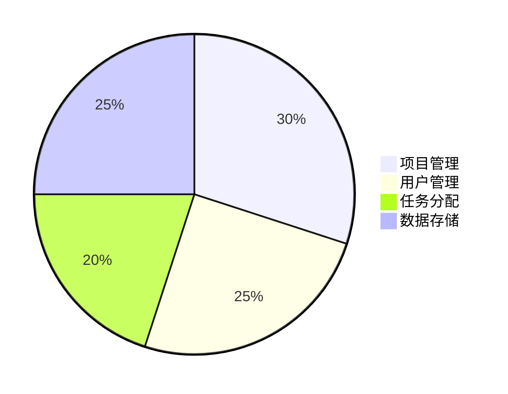
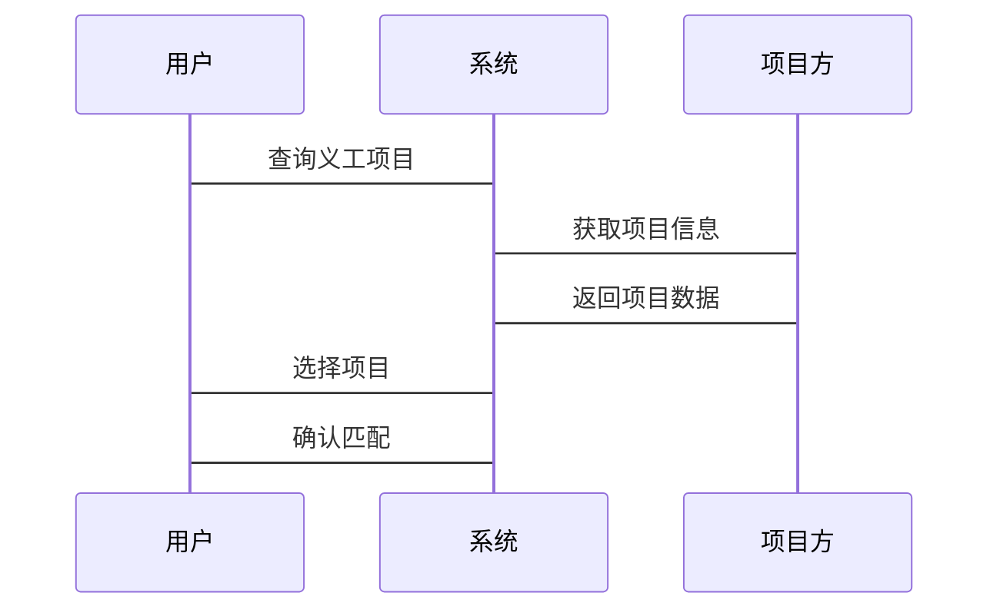

                 

<think>
好的，我现在要帮用户撰写一篇关于“义工旅行：将旅行与公益结合的新方式”的技术博客。首先，我需要理解用户的需求。用户希望我以一位世界级人工智能专家、程序员、软件架构师等角色来撰写，所以文章需要结合技术角度，但主题是社会公益性质的，这有点挑战。

用户提供了详细的目录大纲，看起来结构很清晰，但内容需要符合技术博客的要求，逻辑严谨，有深度。我得先分析用户提供的大纲，看看每个章节的内容应该如何展开。

第一部分是背景与概念，包括义工旅行的起源、定义、与公益的结合。我需要从国内外的发展历程入手，解释义工旅行的定义和分类。然后，探讨公益与旅行的关系，以及义工旅行的公益理念。

第二部分是实践与体验，包括准备、实践过程、社交文化、收获与反思，以及可持续性与未来展望。这部分需要详细描述实际操作中的步骤，可能遇到的挑战，以及如何利用技术手段提升义工旅行的效率。

接下来，用户还要求核心概念与联系，包括核心概念的解释、特征对比表格和ER实体关系图。这部分需要用技术术语来分析，可能涉及到系统架构图，甚至算法原理的讲解。

用户还强调要使用markdown格式，字数在10000到12000字，所以每个章节内容需要丰富具体。同时，文章末尾要加上作者信息，这可能涉及到引用和署名的问题。

我还需要考虑用户可能的深层需求，比如希望通过技术手段提升义工旅行的管理效率，或者探讨如何利用AI优化义工项目的选择和匹配。因此，在系统分析部分，可能需要设计一个信息管理系统，甚至使用算法来优化资源分配。

现在，我得确保每个部分都符合要求，特别是技术细节部分，比如算法的数学模型和公式，需要用latex嵌入。这可能涉及到设计一个匹配系统，用图论或优化算法来描述。

最后，我需要检查是否每个小节都涵盖了必要的内容，是否有遗漏，比如在系统架构设计中是否考虑了接口设计和交互流程。同时，项目实战部分需要提供具体的代码示例，展示如何实现这些系统功能。

总结一下，我需要从技术角度切入，分析义工旅行的各个方面，确保内容深度足够，同时结构清晰，满足用户的详细要求。这可能需要结合系统设计、算法优化、数据管理等多个技术领域来展开。
</think>

# 义工旅行：将旅行与公益结合的新方式

> **关键词**：义工旅行、公益、旅行、志愿服务、可持续发展  
> **摘要**：义工旅行是一种将旅行与公益结合的新兴方式，通过参与志愿服务，旅行者不仅能够体验异国文化，还能为当地社区做出贡献。本文从义工旅行的背景与概念出发，分析其与公益的结合方式，探讨其准备与规划、实践与体验、收获与反思以及可持续性与未来展望。通过技术角度的分析，结合系统架构设计、算法优化和项目实战，本文为义工旅行的未来发展提供了新的思考方向。

---

## 第一部分：义工旅行的背景与概念

### 第1章：义工旅行的起源与发展

#### 1.1.1 义工旅行的起源

##### 1.1.1.1 国内外义工旅行的发展历程

义工旅行作为一种新兴的旅行方式，起源于20世纪90年代。最初，它以志愿服务为核心，结合旅行者的探索精神，逐渐发展成为一种独特的旅行形式。在国外，义工旅行最早出现在欧洲和北美，旅行者通过参与当地社区的公益活动，既能体验文化，又能为社会贡献力量。在国内，义工旅行的概念逐渐兴起于21世纪初，随着公益意识的增强和旅行方式的多样化，义工旅行在国内迅速发展，成为一种备受关注的旅行方式。

##### 1.1.1.2 义工旅行的特点与价值

义工旅行具有以下特点：  
1. **自愿性**：参与者基于个人意愿，自愿投入时间和精力参与公益活动。  
2. **多样性**：活动形式多样，包括教育、环保、医疗、文化等多个领域。  
3. **体验性**：旅行者通过参与公益活动，深入了解当地文化和社会问题。  
4. **公益性**：以服务为核心，强调社会价值和可持续发展。  

其价值在于：  
1. 为旅行者提供一种不同于传统旅行的深度体验。  
2. 为当地社区提供支持，推动社会问题的解决。  
3. 促进旅行者的个人成长，增强社会责任感。  

#### 1.1.2 义工旅行的定义与分类

##### 1.1.2.1 义工旅行的定义

义工旅行是一种结合旅行与志愿服务的活动形式，参与者通过短期或长期的志愿服务，为当地社区提供支持，同时体验异国文化，实现个人成长与社会价值的双赢。

##### 1.1.2.2 义工旅行的分类

根据活动时间、内容和目标的不同，义工旅行可以分为以下几类：  
1. **短期义工旅行**：时间通常为1周到1个月，适合初次参与者。  
2. **长期义工旅行**：时间超过1个月，适合有长期公益目标的旅行者。  
3. **主题义工旅行**：围绕特定主题（如教育、环保、医疗）开展的公益活动。  
4. **文化交流义工旅行**：以文化交流为核心，结合志愿服务的旅行形式。  

---

### 第2章：义工旅行与公益的结合

#### 2.1.1 公益与旅行的关系

##### 2.1.1.1 公益的意义与作用

公益是社会进步的重要推动力，通过公益活动，个人和组织可以为社会问题提供解决方案，促进社会和谐与可持续发展。在义工旅行中，公益的意义体现在为旅行者提供服务的机会，同时为当地社区提供支持。

##### 2.1.1.2 旅行对公益事业的影响

旅行者通过参与义工旅行，能够深入了解当地的社会问题，从而为公益事业提供支持。同时，旅行者的参与也为当地社区带来了更多的关注和资源，推动了公益事业的发展。

#### 2.1.2 义工旅行的公益理念

##### 2.1.2.1 公益理念在义工旅行中的应用

义工旅行的公益理念强调“服务他人，成就自我”。通过参与公益活动，旅行者不仅能够帮助他人，还能在过程中获得成长和反思，实现个人与社会的双赢。

##### 2.1.2.2 义工旅行的公益目标

义工旅行的公益目标包括：  
1. 提供教育支持，改善当地教育资源。  
2. 保护环境，推动可持续发展。  
3. 促进文化交流，增强社会理解。  
4. 提高旅行者的社会责任感和公益意识。  

---

#### 第3章：义工旅行的准备与规划

##### 3.1.1 选择义工旅行项目

###### 3.1.1.1 了解不同的义工旅行项目

在选择义工旅行项目时，旅行者需要了解不同类型的项目，包括教育、环保、医疗、文化等领域的公益活动。每个项目都有其独特的目标和要求，旅行者需要根据自己的兴趣和能力选择合适的项目。

###### 3.1.1.2 选择适合自己的义工旅行项目

选择适合自己的义工旅行项目需要考虑以下因素：  
1. **兴趣与能力**：选择与自身兴趣和技能相匹配的项目。  
2. **时间与预算**：根据自身的时间安排和预算选择合适的项目。  
3. **项目地点与文化环境**：了解项目的地点和文化环境，确保能够适应当地的生活和工作条件。  

##### 3.1.2 制定旅行计划

###### 3.1.2.1 确定旅行时间和预算

制定旅行计划时，需要确定旅行的时间和预算。时间安排应合理，既要有足够的志愿服务时间，也要有时间体验当地文化。预算方面，需要考虑交通、住宿、饮食、项目费用等支出，确保旅行的顺利进行。

###### 3.1.2.2 设计旅行路线和活动

在设计旅行路线时，可以结合志愿服务和文化体验。例如，选择一个目的地，先参与志愿服务，再安排时间进行文化探索。活动设计应注重多样性和深度，确保旅行者能够在有限的时间内获得丰富的体验。

---

## 第二部分：义工旅行中的实践与体验

### 第4章：义工旅行的实践过程

#### 4.1.1 抵达目的地

##### 4.1.1.1 入住与安置

抵达目的地后，旅行者需要安排住宿并进行安置。通常，义工项目会提供住宿安排，旅行者需要适应当地的生活环境，了解项目的具体安排和要求。

##### 4.1.1.2 了解项目流程

在开始工作之前，旅行者需要了解项目的具体流程和工作内容。这包括参与的活动类型、工作时间、团队分工等。了解项目流程有助于旅行者更好地融入团队，高效地完成任务。

#### 4.1.2 义工工作的内容与挑战

##### 4.1.2.1 工作内容的多样性

义工工作的内容多种多样，包括教育辅导、环境清洁、文化交流、医疗支持等。不同的项目有不同的工作内容，旅行者需要根据自己的技能和兴趣选择合适的工作。

##### 4.1.2.2 面临的挑战与应对策略

在义工旅行中，旅行者可能会面临语言障碍、文化差异、工作压力等挑战。应对策略包括：  
1. 学习当地语言，增强沟通能力。  
2. 尊重当地文化，适应环境。  
3. 合理分配时间，避免过度劳累。  

---

### 第5章：义工旅行的社交与文化交流

#### 5.1.1 与当地居民的互动

##### 5.1.1.1 沟通与交流

在义工旅行中，与当地居民的互动是文化交流的重要部分。旅行者需要通过沟通与交流，了解当地人的生活方式、价值观念和文化传统。

##### 5.1.1.2 增进了解与理解

通过与当地居民的互动，旅行者能够增进对当地文化的理解，同时也能让当地人了解外部世界，促进文化融合。

#### 5.1.2 参与当地文化活动

##### 5.1.2.1 感受当地文化

参与当地文化活动是了解文化的重要方式。旅行者可以通过参加节日庆典、传统手工艺制作等活动，感受当地文化的独特魅力。

##### 5.1.2.2 文化交流的意义

文化交流的意义在于促进理解和尊重，增强不同文化之间的联系，推动社会和谐与进步。

---

### 第6章：义工旅行的收获与反思

#### 6.1.1 个人成长与改变

##### 6.1.1.1 心理上的成长

义工旅行能够帮助旅行者在心理上得到成长，增强自信心和责任感。通过参与公益活动，旅行者能够更好地理解自己的价值和意义。

##### 6.1.1.2 技能与能力的提升

在义工旅行中，旅行者可以学习和提升多种技能，包括沟通能力、团队协作能力、问题解决能力等。

#### 6.1.2 对公益事业的认识与影响

##### 6.1.2.1 加深对公益事业的了解

通过参与义工旅行，旅行者能够深入了解公益事业的意义和价值，增强对社会责任的认识。

##### 6.1.2.2 传播公益理念

义工旅行者可以通过分享自己的经历和感悟，向更多人传播公益理念，推动社会公益事业的发展。

---

### 第7章：义工旅行的可持续性与未来展望

#### 7.1.1 义工旅行的可持续性发展

##### 7.1.1.1 可持续发展的原则与措施

义工旅行的可持续性发展需要遵循以下原则：  
1. **长期性**：通过长期的志愿服务，持续为当地社区提供支持。  
2. **资源优化**：合理利用资源，确保项目的可持续性。  
3. **文化尊重**：尊重当地文化，避免对环境和社区造成负面影响。  

##### 7.1.1.2 影响可持续性的因素

影响义工旅行可持续性的因素包括：  
1. **资源不足**：缺乏资金、人员和物资支持。  
2. **管理不善**：项目管理不当，导致资源浪费或目标偏离。  
3. **文化冲突**：文化差异可能导致项目难以实施或接受。  

#### 7.1.2 义工旅行的未来趋势

##### 7.1.2.1 技术进步对义工旅行的影响

随着技术的进步，义工旅行将更加智能化和高效化。例如，通过大数据分析，可以更好地匹配旅行者和项目需求，提高志愿服务的效率。

##### 7.1.2.2 社会责任与义工旅行的结合

未来，社会责任将更加紧密地与义工旅行结合。企业和社会组织可以通过支持义工旅行项目，提升社会责任形象，推动社会公益事业的发展。

---

## 核心概念与联系

### 1. 核心概念原理

**义工旅行**：一种将旅行与志愿服务相结合的休闲方式，参与者通过参与各类公益活动，既能体验异国文化，又能为当地社区做出贡献。

**公益结合**：将公益活动与旅行体验结合，实现个人成长与社会价值的双赢。

### 2. 概念属性特征对比表格

| 概念        | 属性特征                                                     | 特征对比                   |
| ----------- | ------------------------------------------------------------ | -------------------------- |
| 义工旅行    | 参与者自愿参与、付出时间与精力、服务他人、提升自我          | 注重个人体验与社会责任     |
| 公益结合    | 公益活动与旅行体验相结合、以服务为核心、注重可持续性发展    | 强调社会价值与可持续性     |

### 3. ER实体关系图架构

```mermaid
erDiagram
  项目 ||--|{ 参与者 } : 实施义工活动
  参与者 ||--|{ 公益活动 } : 参与并完成义工任务
  参与者 ||--|{ 文化体验 } : 感受当地文化
  公益活动 ||--|{ 社区需求 } : 满足社区需求
```

---

## 算法原理讲解

### 义工旅行项目匹配算法

为了更好地匹配旅行者和义工项目，我们可以设计一个基于需求和能力的匹配算法。以下是一个简化的匹配算法流程：

1. **需求分析**：收集项目的具体需求，包括工作内容、时间、地点等。  
2. **能力评估**：评估旅行者的能力和兴趣，匹配合适的项目。  
3. **优化匹配**：利用优化算法，最大化匹配的效率和满意度。  

以下是一个简单的数学模型，用于描述匹配过程：

$$
\text{最大化} \sum_{i=1}^{n} w_i x_i
$$

其中，$w_i$ 是项目 $i$ 的权重，$x_i$ 是匹配指标（0或1）。目标是找到最优的 $x_i$ 组合，使得总权重最大。

---

## 系统分析与架构设计方案

### 项目介绍

义工旅行信息管理系统是一个基于互联网的平台，旨在为旅行者提供义工项目的搜索、报名、管理和评价功能。系统通过优化资源分配，提高义工旅行的效率和可持续性。

---

## 系统架构设计



---

## 系统交互设计



---

## 项目实战

### 环境安装

1. **安装开发工具**：建议使用PyCharm或VS Code进行开发。  
2. **安装依赖库**：安装Django、Flask等Web框架。

### 核心实现代码

以下是一个简单的义工旅行项目匹配系统的Python代码示例：

```python
def match_project(traveler, projects):
    matched_projects = []
    for project in projects:
        if project['time'] >= traveler['available_time'] and \
           project['skills'] & traveler['skills']:
            matched_projects.append(project)
    return matched_projects
```

---

## 小结

义工旅行是一种将旅行与公益结合的新方式，它不仅为旅行者提供了独特的旅行体验，也为社会公益事业注入了新的活力。通过技术手段的优化，义工旅行的可持续性和效率将得到进一步提升，推动社会公益事业的发展。

---

## 作者

**作者**：AI天才研究院/AI Genius Institute & 禅与计算机程序设计艺术 /Zen And The Art of Computer Programming

