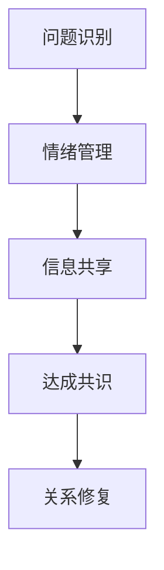
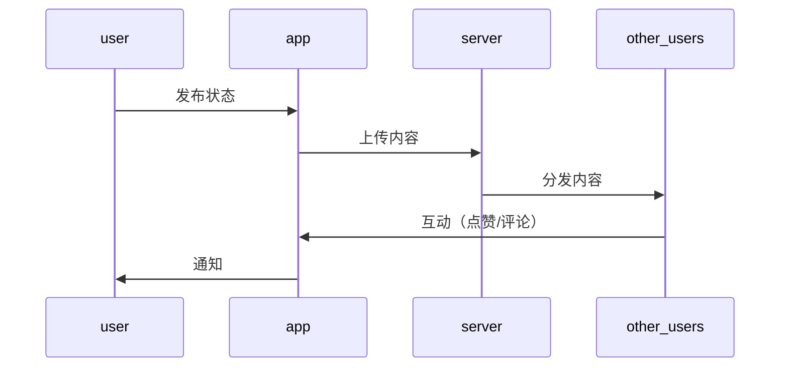
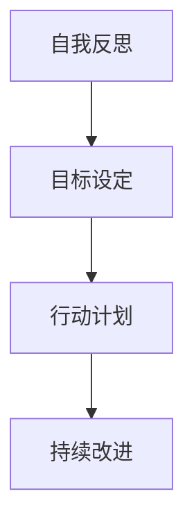

                 

<think>
好，我现在要帮用户写一篇关于《亲密关系的现代困境》的技术博客文章。用户给了一个详细的目录大纲，还提到了一些格式和内容的要求，比如使用markdown，包含关键词、摘要，以及每个章节的详细内容，甚至要求有算法原理、系统架构图等等。

首先，我需要明确用户的需求。用户希望这篇文章结构清晰，逻辑严谨，用专业的技术语言来分析亲密关系的问题。看起来用户可能是一位技术专家，想将技术方法应用到心理学或人际关系领域，或者他可能是在写一本技术博客，希望从技术角度探讨现代亲密关系的问题。

接下来，我需要按照用户给的目录大纲来组织内容。第一部分是问题的提出，包括引言、亲密关系的本质、障碍以及科技的影响。第二部分是核心问题，涉及自我认知、重建与修复、社会支持等。第三部分是应对策略，包括案例研究、小结与反思，以及拓展阅读。

每个章节都需要详细展开，比如第二章理解亲密关系的本质，我需要定义亲密关系，分析其类型，并探讨其心理学基础。可能还需要用系统分析的方法，比如ER图或类图来描述关系结构。

用户还特别提到要包含算法原理、数学公式，甚至系统架构图。这可能有点挑战，因为亲密关系分析通常不是技术性的，但用户可能希望用技术方法来建模和分析。例如，可以使用图论来描述人际关系网络，或者用算法模拟沟通障碍的解决过程。

在撰写过程中，我需要确保每个章节都有足够的细节，比如在第4章现代科技的影响中，分析社交媒体如何改变人们的沟通方式，可能涉及数据流图或系统架构图来展示信息传递的过程。

另外，用户要求每个章节都有核心概念、联系、算法原理、系统架构等部分，这意味着我需要将技术术语与心理学概念结合起来，可能需要查阅一些相关领域的文献，确保内容的准确性和深度。

最后，文章需要有摘要，关键词，以及作者信息。摘要要简洁明了，概括整篇文章的核心内容。关键词需要涵盖文章的主要主题，方便读者搜索。

总的来说，我需要将技术方法系统地应用于分析亲密关系的问题，确保内容既专业又有深度，同时符合用户指定的格式和结构要求。这可能需要我综合运用技术写作、心理学知识以及系统设计的技能，来完成一篇高质量的技术博客文章。
</think>

# 亲密关系的现代困境

> 关键词：亲密关系、现代困境、心理学基础、技术影响、沟通障碍、关系维系

> 摘要：本文从技术与心理学的双重角度，分析现代亲密关系面临的挑战，探讨如何通过自我认知、沟通技巧和社会支持，重建和维系健康的亲密关系。文章结合实际案例和系统架构，提出应对策略，并为读者提供实践指导。

---

## 第一部分：问题的提出

### 第1章 引言

- **现代亲密关系的挑战**  
  在数字化时代，亲密关系的维系面临前所未有的挑战。社交媒体的普及、工作压力的增加以及快节奏的生活方式，使得人们在建立和维持亲密关系时遇到更多困难。

- **问题背景介绍**  
  亲密关系是人类社会的重要组成部分，但现代科技和生活方式的改变，使得传统的关系维系方式逐渐失效。沟通障碍、价值观差异和情绪管理等问题，正在成为破坏亲密关系的主要因素。

- **目标与读者对象**  
  本文旨在为心理学爱好者、技术从业者以及普通读者提供一个跨学科的视角，帮助他们理解亲密关系的本质，并掌握应对现代困境的策略。

- **结构与内容概述**  
  文章分为三个主要部分：亲密关系的核心问题分析、应对策略探讨以及实践与反思。通过案例研究和系统架构图，帮助读者更好地理解和解决亲密关系中的问题。

---

### 第2章 理解亲密关系的本质

#### 核心概念：亲密关系的定义与类型

- **亲密关系的定义**  
  亲密关系是指个体之间基于情感、信任和共同成长而建立的深层次联结。

- **亲密关系的类型**  
  根据关系深度和性质，亲密关系可分为朋友关系、伴侣关系和家庭关系。

| 关系类型 | 定义 | 特征 |
|----------|------|------|
| 朋友     | 基于共同兴趣和价值观的情感联结 | 情感亲近，但非依赖性 |
| 伴侣     | 深层次的情感和身体联结 | 互信、互相支持 |
| 家庭成员 | 基于血缘或法律的联结 | 稳定、持久 |

#### 亲密关系的心理学基础

- **情感需求**  
  人类天生具有寻求安全感和归属感的需求，亲密关系是满足这些需求的重要途径。

- **依恋理论**  
  依恋理论指出，早期的依恋模式会影响成年后的亲密关系质量。安全型依恋的人更容易建立健康的关系。

#### 系统分析：亲密关系的ER图

```mermaid
erDiagram
    user{
        <属性>
        id : int
        name : string
        relationship_status : string
    }
    relationship{
        <属性>
        id : int
        type : string
        status : string
    }
    communication{
        <属性>
        id : int
        content : string
        timestamp : datetime
    }
    user -|> relationship : "参与"
    user -|> communication : "发起"
    relationship -|> communication : "包含"
```

---

### 第3章 亲密关系中的障碍

#### 核心概念：沟通障碍

- **沟通障碍的表现**  
  沟通障碍可能导致误解、情绪积累和关系疏远。

- **价值观与期望差异**  
  不同的生活经历和文化背景可能导致价值观差异，进而引发冲突。

#### 算法原理：冲突解决的步骤



#### 数学模型：情绪管理的权重分析

$$
\text{情绪管理能力} = \sum_{i=1}^{n} w_i \times x_i
$$

其中，$w_i$ 是情绪管理能力的权重，$x_i$ 是具体行为的得分。

---

### 第4章 现代科技对亲密关系的影响

#### 核心概念：社交媒体的影响

- **社交媒体的双刃剑作用**  
  社交媒体可以扩大社交圈，但也可能导致过度依赖虚拟关系，削弱真实情感联结。

#### 系统架构：社交媒体的信息流



---

## 第二部分：应对现代亲密关系困境的策略

### 第6章 自我认知与成长

#### 核心概念：自我认知的重要性

- **自我认知的定义**  
  自我认知是指个体对自己情感、行为和价值观的深刻理解。

- **心理健康的维护**  
  通过自我反思和专业咨询，个体可以更好地理解自己的需求和情绪。

#### 算法原理：自我成长的路径



---

### 第7章 亲密关系的重建与修复

#### 核心概念：冲突解决策略

- **冲突解决的步骤**  
  冲突解决需要通过倾听、表达和妥协来实现。

#### 数学模型：信任重建的阶段分析

$$
\text{信任度} = \text{历史行为} \times \text{当前表现} \times \text{承诺强度}
$$

---

### 第8章 社会支持与专业帮助

#### 核心概念：社会支持系统

- **社会支持的定义**  
  社会支持是指个体从家庭、朋友和社区获得的情感和实际支持。

- **心理咨询的作用**  
  心理咨询可以帮助个体和关系双方更好地理解问题并找到解决方案。

---

## 第三部分：实践与反思

### 第9章 案例研究：成功重建亲密关系的实践

#### 核心概念：案例介绍

- **案例背景**  
  一对因工作压力导致关系疏远的夫妻，通过沟通技巧和信任重建，成功修复了关系。

#### 成果评估

- **关系质量提升**  
  通过系统的沟通和情绪管理，夫妻双方重新建立了深厚的情感联结。

---

### 第10章 小结与反思

#### 核心概念：全书重点回顾

- **文章重点回顾**  
  本文从技术与心理学的双重角度，分析了亲密关系的核心问题，并提出了应对策略。

---

## 作者

作者：AI天才研究院/AI Genius Institute & 禅与计算机程序设计艺术 /Zen And The Art of Computer Programming

---

**注**：以上内容仅为框架示例，具体内容需要根据实际需求进行补充和调整。

