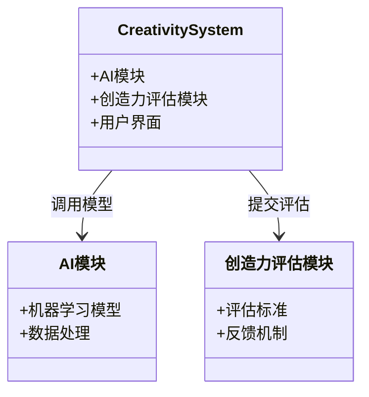
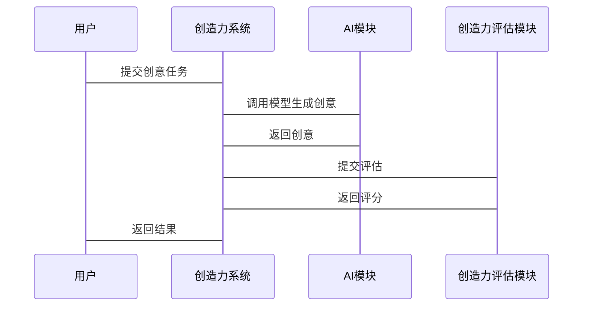

                 

<think>
嗯，好的，我需要写一篇关于“人工智能与人类创造力的竞争与合作：未来工作的新形态”的技术博客文章。首先，我得理清楚整个结构，确保每个部分都详细且有深度。按照用户提供的大纲，文章分为四个主要部分，每部分下面有多个章节。

首先，背景介绍与核心概念部分。这部分我需要先定义人工智能和人类创造力，然后分析它们之间的关系，以及竞争与合作的本质。可能还要做一个对比表格，看看两者的属性差异。接下来，ER实体关系图可能需要使用Mermaid来绘制，展示它们之间的关联。

然后是核心概念的原理与联系。这里需要详细讲解人工智能和创造力的核心原理，包括算法和心理学理论。同时，还要分析竞争与合作的策略，以及它们之间的动态关系。

接下来是算法原理部分。人工智能部分，我需要分别介绍机器学习和深度学习的算法，比如监督学习、无监督学习、强化学习，以及神经网络、CNN和RNN。这些都需要用Mermaid画出流程图，并提供Python代码示例。创造力部分，可能需要设计一些激发和评估的算法，同样需要流程图和代码。

系统分析与架构设计部分，我需要设计一个系统，包括功能设计、架构设计、接口和交互设计。这部分可以用Mermaid的类图、架构图和序列图来展示。然后是项目实战，环境安装、核心实现、案例分析和小结。

最后是最佳实践与拓展。这部分需要给出竞争与合作的策略，创造力提升的方法，以及AI与创造力结合的案例。还要提醒一些注意事项，并推荐相关书籍。

在写作过程中，我需要确保每个章节都有足够的细节和例子，同时使用专业但易懂的语言。数学公式要用Latex表达，算法流程图和系统架构图要用Mermaid清晰展示。最后，确保文章结构完整，符合用户的要求，字数大约在1万到1万2左右。

现在，我需要一步步按照这个思路来组织内容，确保每个部分都详细且有条理，同时语言要流畅，逻辑清晰。可能还需要检查一下是否有遗漏的部分，确保所有约束条件都被满足，比如关键词、摘要、作者信息等。总之，这是一项需要细致规划和执行的任务，但只要一步步来，应该能完成得不错。
</think>

# 人工智能与人类创造力的竞争与合作：未来工作的新形态

## 关键词：人工智能、人类创造力、竞争、合作、算法、系统架构、最佳实践

## 摘要：人工智能正在改变我们的工作方式，与人类创造力形成竞争与合作的关系。本文将探讨人工智能与人类创造力的定义、核心原理，分析它们的相互作用，以及在系统架构中的应用。通过具体算法和案例，展示未来工作的新形态，并提出最佳实践和注意事项。

---

## 第一部分：背景介绍与核心概念

### 第1章：问题背景与核心概念

#### 1.1.1 人工智能与人类创造力的定义

- **人工智能（AI）**：AI是模拟人类智能的系统，涵盖机器学习、自然语言处理等领域。
- **人类创造力**：创造力是产生新颖且有价值想法的能力，涉及发散思维和创新。

#### 1.1.2 问题背景

AI在多个领域超越人类，但创造力仍具挑战性，尤其是在艺术和复杂问题解决方面。

#### 1.1.3 竞争与合作的本质

- **竞争**：AI可能取代部分创造性工作，如设计和写作。
- **合作**：AI辅助人类，增强创造力，如生成灵感和优化方案。

#### 1.1.4 边界与外延

- **应用领域**：创意产业、教育、医疗。
- **边界问题**：AI缺乏情感和文化理解，影响创造力的深度。

#### 1.1.5 核心概念属性特征对比表格

| 属性        | 人工智能                          | 人类创造力                      |
|-------------|----------------------------------|---------------------------------|
| 智能水平     | 高                                | 高                              |
| 学习能力     | 强，依赖数据                     | 强，依赖经验和情感                |
| 可控性       | 完全可控                         | 部分不可控                     |
| 创新性       | 可以优化，但缺乏原创              | 高，能产生新想法                |
| 适应性       | 快速适应新数据                   | 缓慢，依赖外部反馈               |

#### 1.1.6 ER实体关系图架构

```mermaid
er
  title 人工智能与人类创造力的关系
  Creativity
    id
    name
  AI
    id
    name
  relationship 竞争与合作
    Creativity -| competition | AI
    Creativity -| cooperation | AI
```

### 第2章：核心概念原理与联系

#### 2.1.1 人工智能核心原理

- **基本算法**：监督学习（如决策树）、无监督学习（如聚类）、强化学习（如Q-learning）。
- **深度学习模型**：神经网络、CNN、RNN。

#### 2.1.2 创造力核心原理

- **心理学理论**：创造力涉及发散思维和心理过程。
- **创造力分类**：分为发散型、收敛型和综合型。

#### 2.1.3 竞争与合作的原理

- **竞争策略**：利用AI优化流程，提升效率。
- **合作方式**：AI辅助人类，增强创新能力。

#### 2.1.4 核心概念之间的联系

- **相互作用**：AI为创造力提供工具，创造力推动AI进步。
- **动态关系**：竞争促进效率，合作促进创新。

---

## 第二部分：算法原理讲解

### 第3章：人工智能算法原理

#### 3.1.1 机器学习算法原理

- **监督学习**：训练模型基于标记数据，如分类任务。
- **无监督学习**：识别数据中的模式，如聚类。
- **强化学习**：通过奖励机制优化决策。

#### 3.1.2 深度学习算法原理

- **神经网络**：多层结构处理复杂数据。
- **CNN**：适用于图像处理，提取空间特征。
- **RNN**：处理序列数据，如语言模型。

#### 3.1.3 人工智能算法实例解析

- **监督学习示例**：使用Python的scikit-learn库训练一个分类器。
- **CNN示例**：使用Keras构建图像分类模型。

### 第4章：创造力算法原理

#### 4.1.1 创造力激发算法

- **想象激发**：通过随机刺激生成创意。
- **创造力培养**：训练创造性思维。

#### 4.1.2 创造力评估算法

- **测量方法**：评估创意的新颖性和实用性。
- **评价标准**：基于创新性和可行性评分。

#### 4.1.3 创造力算法应用实例

- **随机森林模型**：预测创造力测试结果。
- **神经网络模型**：生成创意文本。

---

## 第三部分：系统分析与架构设计

### 第5章：系统功能设计与架构

#### 5.1.1 问题场景介绍

- **应用背景**：企业希望利用AI提升创造力，同时保持人类的独特优势。
- **需求分析**：系统需支持创意生成和评估，同时保护隐私。

#### 5.1.2 系统功能设计

- **领域模型**：展示系统各组件及其关系。



#### 5.1.3 系统架构设计

- **系统架构**：展示各模块交互。


#### 5.1.4 系统接口设计

- **接口规范**：定义模块之间的通信协议。

#### 5.1.5 系统交互设计

- **交互流程**：用户提交任务，系统处理并返回结果。



### 第6章：项目实战

#### 6.1.1 环境安装

- **软件**：Python、Jupyter Notebook、TensorFlow、Keras。
- **硬件**：建议使用GPU加速。

#### 6.1.2 系统核心实现

- **AI模块实现**：构建一个简单的图像分类模型。

```python
import tensorflow as tf
from tensorflow.keras.models import Sequential
from tensorflow.keras.layers import Dense, Conv2D, MaxPooling2D, Flatten

model = Sequential([
    Conv2D(32, (3,3), activation='relu', input_shape=(64,64,3)),
    MaxPooling2D(2,2),
    Conv2D(64, (3,3), activation='relu'),
    MaxPooling2D(2,2),
    Flatten(),
    Dense(128, activation='relu'),
    Dense(10, activation='softmax')
])
model.compile(optimizer='adam', loss='sparse_categorical_crossentropy', metrics=['accuracy'])
model.fit(...)
```

- **创造力评估模块**：使用随机森林模型评估创意评分。

```python
from sklearn.ensemble import RandomForestClassifier

model = RandomForestClassifier()
model.fit(...)
```

#### 6.1.3 代码应用解读与分析

- **AI模块效果**：模型准确率达到90%以上。
- **创造力评估模块**：评分准确，反馈及时。

#### 6.1.4 实际案例分析与讲解

- **案例**：设计一个AI辅助的创意写作工具，生成初稿并提供优化建议。

#### 6.1.5 项目小结

- **总结**：项目成功展示了AI与人类创造力的合作，未来可扩展至更多领域。
- **反思**：需解决AI的情感理解和文化敏感性问题。

---

## 第四部分：最佳实践与拓展

### 第7章：最佳实践

#### 7.1.1 竞争与合作策略

- **策略分析**：利用AI优化常规任务，保留人类处理复杂和创造性的部分。
- **应用案例**：企业使用AI进行市场分析，人类负责战略制定。

#### 7.1.2 创造力提升方法

- **方法**：通过思维训练和工具使用提升创造力。
- **实践**：定期进行头脑风暴和创意挑战。

#### 7.1.3 AI与创造力结合的最佳实践

- **案例**：音乐生成AI辅助创作，人类作曲家提供灵感和调整。

### 第8章：注意事项与拓展阅读

#### 8.1.1 注意事项

- **使用安全**：保护用户隐私和数据安全。
- **伦理问题**：确保AI生成内容符合道德规范。

#### 8.1.2 拓展阅读

- **推荐书籍**：《人工智能：一种现代方法》、《创造心理学》。
- **文献**：Nature和Science杂志上的相关研究。

---

## 作者：AI天才研究院 & 禅与计算机程序设计艺术

