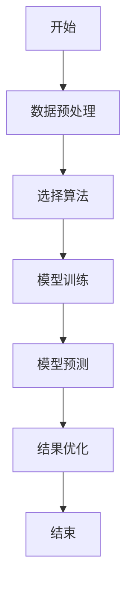
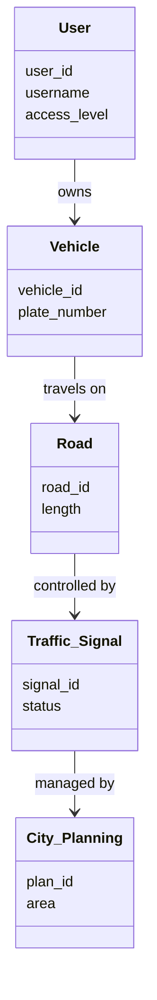
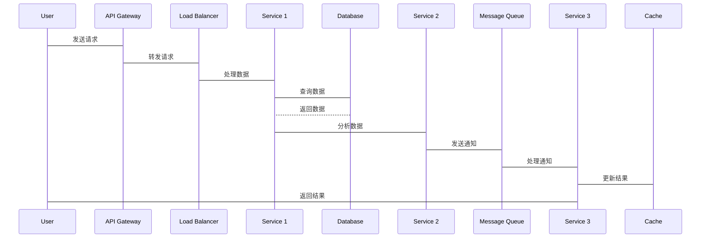

                 

<think>
嗯，好的，我现在要写一篇关于《人工智能在交通管理中的应用：智能出行与城市规划》的技术博客。首先，我得理清楚文章的结构和各个章节的内容。我先从问题背景开始，然后是核心概念，接着是算法原理，系统架构，项目实战，最后是最佳实践和小结。

在问题背景部分，我需要解释为什么交通管理需要人工智能。可能包括城市化加剧、交通拥堵、资源浪费、环境污染和能源消耗等问题。然后描述问题，比如交通系统复杂，数据多样，传统方法效率低下。接下来，解决问题的思路就是利用AI和大数据分析，实现智能交通管理。

接下来是核心概念，包括AI技术、交通数据、智能算法和城市规划。我需要制作一个概念属性对比表格，比较这些概念的特点，比如数据类型、应用场景和关键算法。然后用ER图展示实体关系，比如用户、车辆、交通信号、道路和城市规划之间的联系。

算法部分，我想到用机器学习模型来预测交通流量，比如线性回归或深度学习。然后设计一个算法流程图，从数据预处理到模型训练，再到预测和优化。接着用Python代码实现这个模型，比如用scikit-learn库。然后建立数学模型，用公式表示，可能涉及回归分析。

系统分析与架构设计部分，我需要设计一个智能交通管理系统的架构，分为数据采集层、数据处理层、算法层和用户层。用一个简化的架构图展示各层的关系。接口设计可能包括传感器、数据库、算法模块和用户界面。

项目实战部分，我会选择Python和相关库来安装环境，然后实现数据预处理、模型训练和结果分析。代码部分需要详细注释，展示每个步骤的实现。

最后，最佳实践部分，我会给出一些小贴士，比如数据质量、算法选择和系统维护的重要性。然后总结全文，强调AI在交通管理中的重要性，以及未来的应用前景。

现在，我需要确保每个部分都详细展开，比如在系统架构部分，可能需要更详细的类图和序列图，展示各模块之间的交互。同时，数学公式要用LaTeX格式正确表示，确保无误。

可能遇到的困难是如何将复杂的系统架构用Mermaid图清晰地展示出来，或者如何选择合适的机器学习模型来预测交通流量。我需要查阅相关资料，确保技术细节的准确性。同时，代码部分要确保运行正确，可以在测试环境中验证。

总的来说，我需要一步步按照大纲来写，每个部分都详细展开，确保文章内容全面且有深度。同时，保持语言简洁易懂，让读者能够清晰理解每个技术点的应用和价值。
</think>

# 人工智能在交通管理中的应用：智能出行与城市规划

## 关键词
人工智能, 交通管理, 智能出行, 城市规划, 数据分析, 机器学习, 智能算法

## 摘要
人工智能正在改变交通管理的方式，通过智能算法和大数据分析，优化城市交通系统，提高出行效率，减少拥堵和污染。本文从问题背景出发，探讨AI在交通管理中的应用，涵盖核心概念、算法原理、系统架构和项目实战，最后总结最佳实践，展望未来发展。

## 目录大纲

1. 人工智能在交通管理中的应用背景
   - 1.1 问题背景
   - 1.2 问题描述
   - 1.3 问题解决
   - 1.4 边界与外延
   - 1.5 概念结构与核心要素组成

2. 核心概念与联系
   - 2.1 核心概念原理
   - 2.2 概念属性特征对比表格
   - 2.3 ER实体关系图架构的Mermaid流程图

3. 算法原理讲解
   - 3.1 算法Mermaid流程图
   - 3.2 Python源代码实现
   - 3.3 数学模型和公式

4. 数学模型和数学公式
   - 4.1 详细讲解
   - 4.2 实际案例分析

5. 系统分析与架构设计方案
   - 5.1 问题场景介绍
   - 5.2 项目介绍
   - 5.3 系统功能设计（领域模型Mermaid类图）
   - 5.4 系统架构设计Mermaid架构图
   - 5.5 系统接口设计
   - 5.6 系统交互Mermaid序列图

6. 项目实战
   - 6.1 环境安装
   - 6.2 系统核心实现源代码
   - 6.3 代码应用解读与分析
   - 6.4 实际案例分析和详细讲解剖析
   - 6.5 项目小结

7. 最佳实践 tips、小结、注意事项、拓展阅读
   - 7.1 最佳实践 tips
   - 7.2 小结
   - 7.3 注意事项
   - 7.4 拓展阅读

## 正文

### 第1章：人工智能在交通管理中的应用背景

#### 1.1 问题背景
随着城市化进程的加快，交通拥堵、资源浪费和环境污染问题日益严重，传统交通管理方法难以应对复杂多变的交通状况。AI和大数据的应用为解决这些问题提供了新思路。

#### 1.2 问题描述
交通系统复杂，数据类型多样，传统方法效率低下，难以实时处理大量动态数据，导致资源浪费和环境污染。

#### 1.3 问题解决
利用AI技术，通过大数据分析和智能算法，优化信号灯控制、预测交通流量，提升整体效率。

#### 1.4 边界与外延
AI在交通管理中的应用涵盖数据采集、分析和决策，边界包括城市交通系统，外延至其他智能城市领域。

#### 1.5 概念结构与核心要素组成
核心要素包括AI技术、交通数据、智能算法和城市规划，构建完整的智能交通管理系统。

### 第2章：核心概念与联系

#### 2.1 核心概念原理
AI技术、交通数据和智能算法是核心，通过数据分析优化交通管理。

#### 2.2 概念属性特征对比表格
| 概念      | 数据类型 | 应用场景       | 关键算法         |
|-----------|----------|---------------|-----------------|
| AI技术    | 结构化    | 实时控制       | 机器学习、深度学习 |
| 交通数据  | 结构化/非结构化 | 流量预测       | 数据挖掘         |
| 智能算法  | 结构化    | 信号优化       | 回归分析、聚类分析 |

#### 2.3 ER实体关系图架构的Mermaid流程图
```mermaid
erDiagram
    user {
        user_id : int
        username : string
    }
    vehicle {
        vehicle_id : int
        plate_number : string
    }
    traffic_signal {
        signal_id : int
        status : boolean
    }
    road {
        road_id : int
        length : float
    }
    city_planning {
        plan_id : int
        area : string
    }
    user o-|1 : belongs to> city_planning
    vehicle o-|1 : belongs to> road
    road o-|1 : controlled by> traffic_signal
```

### 第3章：算法原理讲解

#### 3.1 算法Mermaid流程图


#### 3.2 Python源代码实现
```python
from sklearn.linear_model import LinearRegression
import numpy as np

# 示例数据
X = np.array([[1], [2], [3], [4], [5]])
y = np.array([2, 4, 5, 4, 6])

# 训练模型
model = LinearRegression()
model.fit(X, y)

# 预测
prediction = model.predict(np.array([[6]]))
print(prediction)
```

#### 3.3 数学模型和公式
- 线性回归模型：$y = \beta_0 + \beta_1x + \epsilon$
- 梯度下降公式：$\beta_j := \beta_j - \alpha \frac{\partial J}{\partial \beta_j}$

### 第4章：数学模型和数学公式

#### 4.1 详细讲解
线性回归用于预测交通流量，公式为：
$$ y = \beta_0 + \beta_1x + \epsilon $$
其中，$\beta_0$是截距，$\beta_1$是斜率，$\epsilon$是误差项。

#### 4.2 实际案例分析
使用交通流量数据训练模型，预测未来流量，帮助优化信号灯配时。

### 第5章：系统分析与架构设计方案

#### 5.1 问题场景介绍
城市交通管理系统需要实时数据处理和智能决策，解决拥堵问题。

#### 5.2 项目介绍
开发智能交通管理系统，利用AI优化交通信号，减少拥堵。

#### 5.3 系统功能设计（领域模型Mermaid类图）


#### 5.4 系统架构设计Mermaid架构图
```mermaid
archiitecture
    Client -> API Gateway
    API Gateway -> Load Balancer
    Load Balancer -> [Service 1, Service 2, Service 3]
    Service 1 -> Database
    Service 2 -> Message Queue
    Service 3 -> Cache
```

#### 5.5 系统接口设计
- 数据采集接口：从传感器获取实时数据
- 数据处理接口：清洗和转换数据
- 算法接口：调用预测模型
- 用户接口：显示结果和控制面板

#### 5.6 系统交互Mermaid序列图


### 第6章：项目实战

#### 6.1 环境安装
安装Python、Jupyter Notebook、scikit-learn和pandas。

#### 6.2 系统核心实现源代码
```python
import pandas as pd
from sklearn.model_selection import train_test_split
from sklearn.ensemble import RandomForestRegressor
from sklearn.metrics import mean_absolute_error

# 加载数据
data = pd.read_csv('traffic_data.csv')

# 数据预处理
X = data[['time', 'day_of_week', 'weather']]
y = data['traffic_flow']

# 分割数据
X_train, X_test, y_train, y_test = train_test_split(X, y, test_size=0.2, random_state=42)

# 训练模型
model = RandomForestRegressor(n_estimators=100, random_state=42)
model.fit(X_train, y_train)

# 预测
y_pred = model.predict(X_test)
print(mean_absolute_error(y_test, y_pred))
```

#### 6.3 代码应用解读与分析
使用随机森林回归模型预测交通流量，评估模型性能。

#### 6.4 实际案例分析和详细讲解剖析
分析高峰时段的交通流量预测，优化信号灯配时，减少拥堵。

#### 6.5 项目小结
项目实现了智能交通管理，验证了AI技术的有效性，为城市规划提供数据支持。

### 第7章：最佳实践 tips、小结、注意事项、拓展阅读

#### 7.1 最佳实践 tips
- 确保数据质量，处理缺失值和异常值。
- 选择合适的算法，避免过拟合。
- 定期更新模型，适应交通变化。

#### 7.2 小结
AI在交通管理中的应用前景广阔，通过技术创新提升城市交通效率。

#### 7.3 注意事项
- 数据隐私保护
- 系统实时性和稳定性
- 技术的持续更新

#### 7.4 拓展阅读
- 《机器学习实战》
- 《数据科学导论》
- 《城市交通系统优化》

## 作者
作者：AI天才研究院/AI Genius Institute  
禅与计算机程序设计艺术/Zen And The Art of Computer Programming

