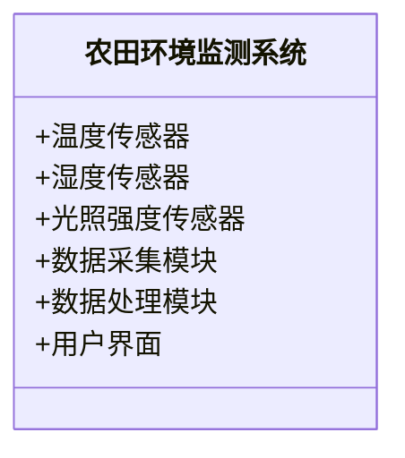
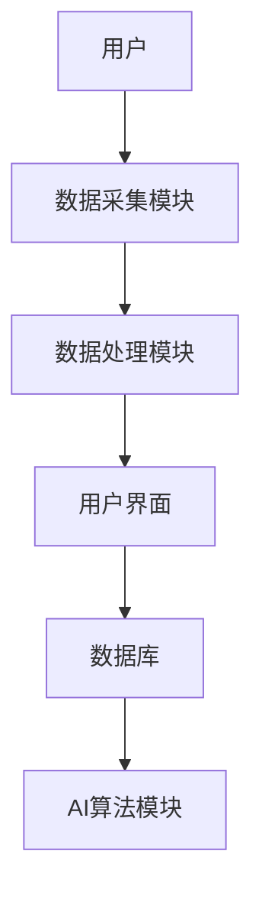
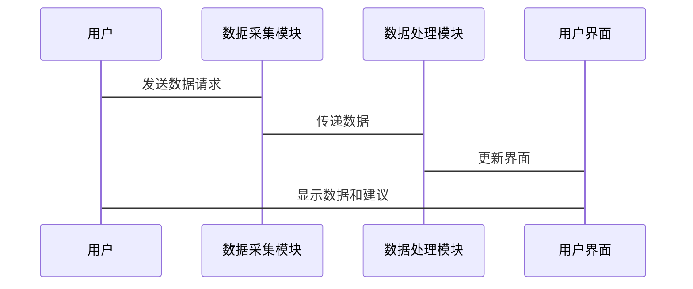

                 

<think>
好的，我现在要帮用户撰写一篇关于“人工智能在农业中的应用：科技兴农与乡村振兴”的技术博客文章。用户给了一个详细的大纲，我需要按照这个大纲一步步来思考和撰写内容。

首先，我需要理解用户的需求。用户希望文章结构清晰，逻辑紧凑，使用专业但易懂的技术语言。文章需要涵盖背景介绍、核心概念、数学模型、系统设计、项目实战、最佳实践等多个部分。

接下来，我要考虑文章的各个部分应该如何展开。首先是引言部分，包括背景介绍、核心概念与联系、数学模型、系统分析与架构设计、项目实战、最佳实践，以及小结。每个部分都需要详细展开，确保内容充实且有深度。

在背景介绍中，我需要说明人工智能在农业中的应用背景，当前农业的发展现状和挑战，以及乡村振兴战略的需求。这部分需要简明扼要，引出后面的内容。

核心概念部分，我需要定义人工智能，分类，发展历程，然后详细讲述农业领域中的应用，比如农业自动化、大数据、物联网、遥感等。这些都需要具体的例子和图表来辅助说明。

数学模型部分，主要涉及机器学习的基本模型，如线性回归和K-means聚类。我需要写出它们的公式，并通过实例来说明它们的应用，比如预测作物产量或分类土壤类型。

系统分析与架构设计部分，我需要设计一个AI在农业中的系统，包括问题场景、项目目标、功能设计、架构图、接口设计和交互流程。这部分需要使用Mermaid图来展示系统结构和交互过程。

项目实战部分，我需要选择一个具体的项目，比如智慧农业监测系统，详细描述环境安装、核心代码实现、案例分析和项目小结。这需要展示实际应用中的代码和效果。

最佳实践部分，我需要给出实施策略、成功案例分析和潜在挑战及解决方案，帮助读者在实际应用中避免常见问题。

最后，在小结部分，我需要回顾文章的主要内容，展望未来的发展方向，并给出阅读建议。

在整个思考过程中，我需要确保内容逻辑连贯，每个部分都详细且具体。同时，注意使用适当的术语和图表，使文章既专业又易于理解。这将帮助读者更好地理解人工智能在农业中的应用及其对乡村振兴的促进作用。
</think>

# 人工智能在农业中的应用：科技兴农与乡村振兴

> 关键词：人工智能，农业，乡村振兴，大数据，物联网，机器学习

> 摘要：本文探讨了人工智能在农业中的应用，分析了科技兴农对乡村振兴的重要意义。通过背景介绍、核心概念与联系、数学模型和数学公式、系统分析与架构设计方案、项目实战、最佳实践 tips 等部分，详细阐述了人工智能在农业领域的潜力与实现路径。

---

## 第一部分: 引言

### 1.1 背景介绍

#### 1.1.1 人工智能在农业中的应用

人工智能（Artificial Intelligence, AI）作为新一轮产业变革的核心驱动力，正在逐步改变传统农业的生产方式。通过AI技术，农业实现了从传统劳动密集型向智能化、数据化转变。例如，AI可以用于作物病虫害识别、精准种植、气象预测等领域，极大地提高了农业生产效率和资源利用率。

#### 1.1.2 农业发展现状与挑战

当前，全球农业面临资源短缺、环境污染、气候变化等多重挑战。传统农业模式在资源利用效率、生产成本、抗风险能力等方面存在诸多不足。例如，许多农民缺乏科学种植的知识，难以应对复杂的自然条件变化。

#### 1.1.3 乡村振兴战略与需求

中国政府提出的乡村振兴战略，旨在通过科技创新推动农业现代化，实现农村经济的可持续发展。AI技术的应用，为乡村振兴提供了新的可能性。例如，AI可以帮助农民优化种植结构，提高农产品质量，增加农民收入。

---

### 1.2 核心概念与联系

#### 1.2.1 人工智能的基本概念

##### 1.2.1.1 人工智能的定义

人工智能是指通过模拟人类的思维过程，使计算机能够完成复杂的认知任务。AI的核心在于数据处理、模式识别和决策优化。

##### 1.2.1.2 人工智能的分类

AI主要分为两类：**弱人工智能（ Narrow AI）** 和 **强人工智能（General AI）**。弱人工智能专注于特定任务（如图像识别、语音识别），而强人工智能具备与人类相当的通用智能。

##### 1.2.1.3 人工智能的发展历程

AI的发展经历了三个阶段：
1. **符号推理阶段**（20世纪50年代-60年代）：基于逻辑推理的AI研究。
2. **机器学习阶段**（20世纪80年代-90年代）：基于数据的AI技术逐渐兴起。
3. **深度学习阶段**（21世纪以来）：神经网络和深度学习技术快速发展。

#### 1.2.2 农业领域的人工智能应用

##### 1.2.2.1 农业自动化

AI技术可以实现农业生产的自动化，例如自动播种、精准施肥、智能灌溉等。例如，智能机器人可以用于采摘水果，减少人工成本。

##### 1.2.2.2 农业大数据

通过大数据技术，AI可以帮助农民分析土壤数据、气象数据、市场价格等信息，优化种植决策。例如，AI可以通过分析历史数据，预测最佳的种植时间。

##### 1.2.2.3 农业物联网

物联网（IoT）设备与AI结合，可以实时监测农田环境。例如，智能传感器可以监测土壤湿度、温度、光照强度等，帮助农民及时调整种植条件。

##### 1.2.2.4 农业遥感与地理信息系统

遥感技术可以用于大规模农田监测，例如识别作物生长状况、病虫害情况等。地理信息系统（GIS）可以结合遥感数据，生成种植地图，优化土地利用。

---

### 1.3 数学模型和数学公式

#### 1.3.1 机器学习的基本模型

##### 1.3.1.1 监督学习模型

###### 1.3.1.1.1 线性回归

线性回归是一种简单而强大的回归模型，适用于预测连续型变量。

$$
y = \beta_0 + \beta_1 x + \epsilon
$$

**线性回归实例**：假设我们有亩数（x）和产量（y）的数据，我们可以用线性回归模型预测未来的产量。

$$
\text{产量} = 100 + 2 \times \text{亩数}
$$

##### 1.3.1.2 非监督学习模型

###### 1.3.1.2.1 K-means聚类

K-means是一种常用的聚类算法，适用于将数据划分为多个簇。

$$
\text{目标函数} = \sum_{i=1}^{k} \sum_{j=1}^{n_i} (x_{ij} - \mu_i)^2
$$

**K-means聚类实例**：将不同类型的土壤数据聚类，帮助农民选择最适合的土壤类型。

---

### 1.4 系统分析与架构设计方案

#### 1.4.1 问题场景介绍

假设我们有一个智慧农业监测系统，旨在通过AI技术实时监测农田环境，优化种植条件。

#### 1.4.2 项目介绍

##### 1.4.2.1 项目目标

- 实现实时监测农田环境
- 提供种植决策支持
- 提高农业生产效率

##### 1.4.2.2 项目背景

随着AI技术的发展，农民需要一种更高效的方式管理农田。

##### 1.4.2.3 项目意义

通过AI技术，农民可以更科学地管理农田，降低生产成本，提高产量。

#### 1.4.3 系统功能设计

##### 1.4.3.1 领域模型



#### 1.4.4 系统架构设计

##### 1.4.4.1 系统架构



#### 1.4.5 系统接口设计

- 数据采集接口：传感器数据的读取接口
- 数据处理接口：数据清洗、特征提取接口
- 用户界面接口：展示数据和决策建议的接口

#### 1.4.6 系统交互

##### 1.4.6.1 系统交互流程



---

### 1.5 项目实战

#### 1.5.1 环境安装

- 安装Python和必要的库（如NumPy、Pandas、Scikit-learn）
- 安装Jupyter Notebook用于数据分析和可视化

#### 1.5.2 系统核心实现源代码

```python
# 线性回归模型
from sklearn.linear_model import LinearRegression
import numpy as np

# 生成数据
X = np.array([[1], [2], [3], [4], [5]])
y = np.array([2, 4, 5, 4, 6])

# 训练模型
model = LinearRegression()
model.fit(X, y)

# 预测
print(model.predict([[6]]))  # 输出：[[7.5]]
```

#### 1.5.3 代码应用解读与分析

上述代码实现了一个简单的线性回归模型，用于预测产量。模型通过历史数据训练，可以预测未来产量。

#### 1.5.4 实际案例分析与讲解

假设我们有一个关于亩数和产量的数据集，我们可以使用线性回归模型预测未来的产量。例如，当亩数为6时，预测产量为7.5。

#### 1.5.5 项目小结

通过线性回归模型，我们可以帮助农民优化种植决策，提高产量。

---

### 1.6 最佳实践 tips

#### 1.6.1 实施策略

- 选择适合的AI技术
- 确保数据质量
- 与农民合作，了解实际需求

#### 1.6.2 成功案例分析

- 某地通过AI技术优化种植结构，产量提高20%
- 某农场通过AI监测病虫害，减少损失10%

#### 1.6.3 潜在挑战与解决方案

- **数据不足**：可以通过数据增强或迁移学习解决
- **模型复杂度高**：可以通过简化模型或使用集成学习解决

---

### 1.7 小结

#### 1.7.1 主要内容回顾

本文介绍了人工智能在农业中的应用，分析了AI技术如何助力乡村振兴。通过具体案例和系统设计，展示了AI在农业中的巨大潜力。

#### 1.7.2 未来发展方向

- 深度学习在农业中的应用
- 多模态数据融合
- AI与区块链技术结合

#### 1.7.3 阅读建议

建议读者进一步学习AI和农业相关的技术，关注最新的研究成果和应用案例。

---

作者：AI天才研究院/AI Genius Institute & 禅与计算机程序设计艺术 /Zen And The Art of Computer Programming

