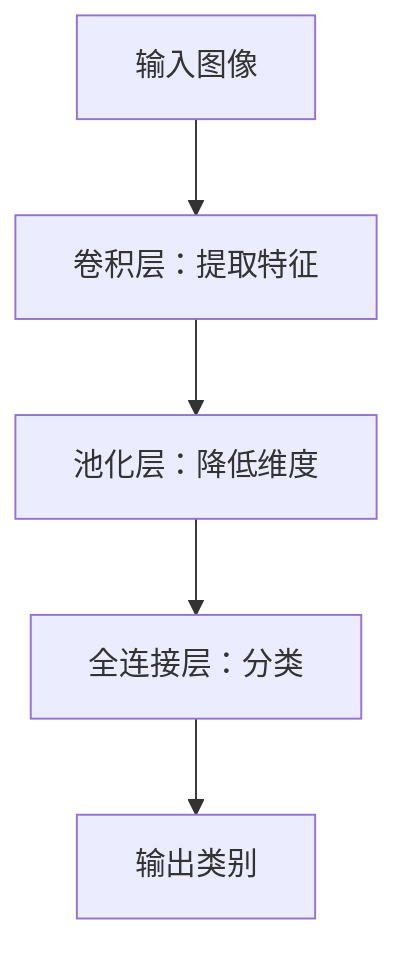

                 

<think>
好的，我现在需要帮用户完成一个技术博客的撰写任务。用户希望我以《人工智能在艺术鉴赏中的应用：科技与人文的碰撞》为标题，写一篇结构清晰、内容详实的专业文章。首先，我要理解用户的需求，明确文章的结构和内容要求。

用户已经给出了目录大纲，我需要按照这个大纲逐步展开每个部分。文章分为两大部分：技术部分和应用部分。技术部分包括人工智能技术基础、艺术鉴赏中的应用和艺术创作中的应用。应用部分则涵盖了艺术展览、教育、文化遗产保护以及未来展望。

接下来，我需要确保每个章节都包含背景介绍、核心概念、算法原理、案例分析和实际应用。同时，用户要求使用专业且易懂的语言，避免过于技术化的术语，但又要足够详细，展示对技术的深刻理解。

在撰写过程中，我需要检查每个小节的内容是否完整，是否有足够的细节支撑主题。例如，在第2章的主流算法部分，我会选择卷积神经网络（CNN）作为案例，因为它在图像识别中应用广泛。我会详细解释CNN的工作原理，并通过一个简单的Keras代码示例来展示如何实现图像分类。

同时，我还需要确保文章结构合理，逻辑连贯。每一章的开头要有引言，说明该部分的重要性和与整体主题的关系。例如，在讨论艺术创作中的应用时，我需要解释AI如何生成艺术作品，并结合具体的工具如GAN和风格迁移技术来说明。

在系统分析部分，我会使用Mermaid图表来展示系统架构和流程图，帮助读者更好地理解技术细节。例如，在文化遗产保护中，数字化保存的系统可能需要一个数据采集模块、分析模块和展示模块，我会用类图展示这些部分的关系。

此外，我需要考虑文章的可读性，确保内容不冗长，每个部分都有足够的深度，但又不显得过于复杂。例如，在讨论AI与人类鉴赏的对比时，我会举一个具体的例子，说明AI如何分析作品的风格和结构，而人类则注重情感和文化背景。

最后，我需要在文章末尾加入总结，强调科技与人文的平衡，并指出未来的发展方向和挑战。同时，按照用户的指示，添加作者信息，确保文章格式完整。

在写作过程中，我可能会遇到一些挑战，比如如何将复杂的算法原理简化为易于理解的解释，或者如何找到合适的案例来说明AI在艺术中的应用。为了解决这些，我会查阅相关资料，寻找权威的来源，并结合自己的知识进行分析。

总之，我需要按照用户提供的大纲，逐步展开每个部分，确保内容全面、结构清晰、语言专业且易于理解。通过详细的技术分析和实际案例，展示人工智能在艺术鉴赏中的潜力和应用，同时强调科技与人文之间的平衡，为读者提供一篇有深度的技术博客文章。
</think>

# 《人工智能在艺术鉴赏中的应用：科技与人文的碰撞》

> **关键词**：人工智能，艺术鉴赏，艺术创作，文化遗产保护，艺术教育，科技与人文  
> **摘要**：人工智能技术在艺术鉴赏领域的应用正在改变我们理解和体验艺术的方式。本文将从技术基础、应用实践以及未来展望三个方面，详细探讨人工智能在艺术鉴赏中的潜力与挑战，分析其在艺术创作、展览、教育和文化遗产保护中的具体应用，最终总结科技与人文之间的平衡之道。

---

## 第一部分：技术基础

### 第1章：人工智能技术基础

#### 1.1 人工智能概述
人工智能（Artificial Intelligence, AI）是模拟人类智能的计算机系统，涵盖学习、推理、感知和决策等能力。AI的核心目标是让计算机能够像人类一样理解和处理信息。

#### 1.2 人工智能技术发展历程
人工智能的发展经历了多个阶段，从早期的规则-based系统到现在的深度学习（Deep Learning）和生成对抗网络（GANs）。近年来，随着计算能力的提升和大数据的普及，AI技术取得了突破性进展。

#### 1.3 人工智能在艺术鉴赏中的潜力
艺术鉴赏需要对图像、颜色、构图等元素进行分析，这些都可以通过AI技术实现。AI可以通过模式识别和特征提取，帮助人们发现隐藏在艺术品中的细节和规律。

---

### 第2章：艺术鉴赏领域的人工智能应用

#### 2.1 核心概念与联系
在艺术鉴赏中，AI的核心任务是通过计算机视觉（Computer Vision）技术对艺术品进行分析。以下是一些关键概念：
- **图像分类**：识别艺术品的类型（如风景、人物）。
- **特征提取**：提取艺术品的颜色、纹理、形状等特征。
- **风格识别**：判断艺术品的风格（如印象派、梵高风格）。

#### 2.2 主流算法原理讲解
以卷积神经网络（CNN）为例，其在图像分类中的工作流程如下：



#### 2.3 艺术鉴赏中的数据预处理
数据预处理是AI应用的关键步骤，包括：
1. **图像增强**：调整亮度、对比度以增加数据多样性。
2. **标注数据**：为艺术品添加标签（如艺术家、创作时间）。
3. **数据清洗**：去除噪声和无效数据。

---

### 第3章：人工智能在艺术创作中的应用

#### 3.1 创作灵感来源
AI可以通过分析海量的艺术作品，提取常见的创作规律，为艺术家提供灵感。例如，生成对抗网络（GANs）可以创作出全新的艺术风格。

#### 3.2 创作过程自动化
AI工具可以帮助艺术家完成部分创作任务，如自动上色、背景生成等。以下是一个简单的AI绘画工具实现示例：

```python
import tensorflow as tf
from tensorflow.keras import layers

# 定义生成器模型
def generator():
    model = tf.keras.Sequential()
    model.add(layers.Dense(256, activation='relu', input_shape=(100,)))
    model.add(layers.Reshape((16, 16, 1)))
    model.add(layers.Conv2DTranspose(16, (3,3), strides=(2,2), padding='same', activation='relu'))
    model.add(layers.Conv2DTranspose(1, (3,3), strides=(2,2), padding='same', activation='sigmoid'))
    return model

# 定义判别器模型
def discriminator():
    model = tf.keras.Sequential()
    model.add(layers.Conv2D(64, (3,3), strides=(2,2), padding='same', activation='relu', input_shape=(64,64,1)))
    model.add(layers.Conv2D(128, (3,3), strides=(2,2), padding='same', activation='relu'))
    model.add(layers.Flatten())
    model.add(layers.Dense(1, activation='sigmoid'))
    return model
```

#### 3.3 创作成果评价
AI可以通过预训练的模型对艺术品的质量进行评价，例如通过分数评估作品的创新性和美学价值。

---

## 第二部分：应用实践

### 第4章：人工智能在艺术展览中的应用

#### 4.1 展览设计优化
AI可以通过分析观众的偏好，优化展览的空间布局和作品排列顺序，提升观展体验。

#### 4.2 观众互动体验
通过增强现实（AR）技术，观众可以与艺术品进行互动，例如用手势控制作品的视角或效果。

#### 4.3 展品数字化管理
AI可以帮助博物馆实现艺术品的数字化存档，便于后续的分析和管理。

---

### 第5章：人工智能在艺术教育中的应用

#### 5.1 教学内容个性化
AI可以根据学生的学习进度和兴趣，推荐个性化的教学内容。

#### 5.2 学生作品评估
AI可以辅助教师评估学生的艺术作品，提供客观的反馈和改进建议。

#### 5.3 艺术知识普及
通过虚拟现实（VR）技术，学生可以身临其境地体验不同艺术风格和历史背景。

---

### 第6章：人工智能在文化遗产保护中的应用

#### 6.1 数字化保存与展示
AI可以帮助修复损坏的艺术品，并通过数字化技术进行永久保存。

#### 6.2 文化遗产分析与修复
通过深度学习模型，AI可以分析艺术品的损坏程度，并生成修复方案。

#### 6.3 风险评估与预警
AI可以实时监控艺术品的状态，预测潜在的风险（如湿度、光照对艺术品的影响）。

---

### 第7章：未来展望与挑战

#### 7.1 人工智能在艺术领域的未来趋势
AI将更加智能化和人性化，成为艺术家和观众的得力助手。

#### 7.2 技术挑战与解决方案
当前的技术挑战包括数据隐私问题和算法的可解释性问题。未来需要通过技术创新和政策监管来解决这些问题。

#### 7.3 人文与科技的平衡
在追求技术进步的同时，我们不能忽视艺术的人文价值。AI的应用应该服务于人类，而不是取代人类。

---

## 作者信息

**作者：AI天才研究院/AI Genius Institute & 禅与计算机程序设计艺术 /Zen And The Art of Computer Programming**

---

这篇文章系统地探讨了人工智能在艺术鉴赏中的应用，从技术基础到实际应用，再到未来展望，全面分析了科技与人文的碰撞与融合。希望本文能为读者提供有价值的见解，启发更多人思考人工智能在艺术领域的潜力与挑战。

