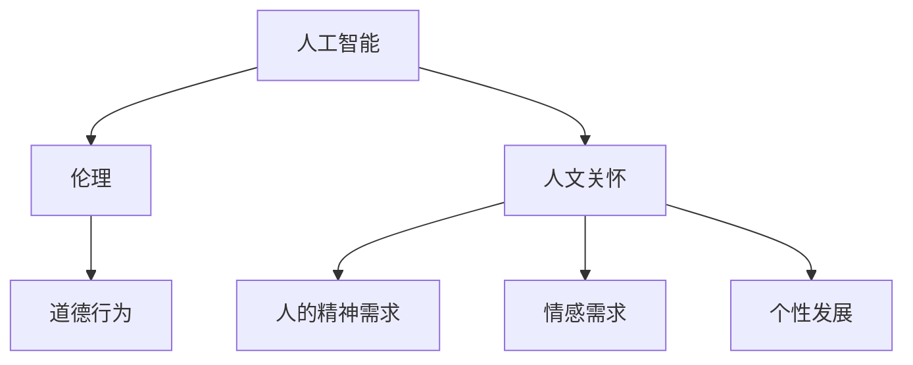
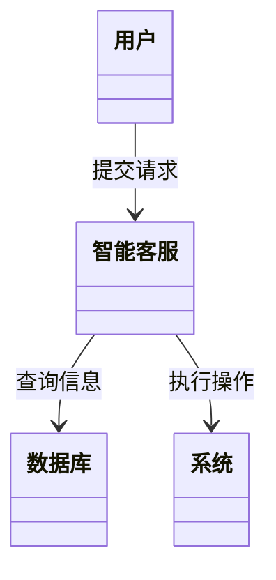
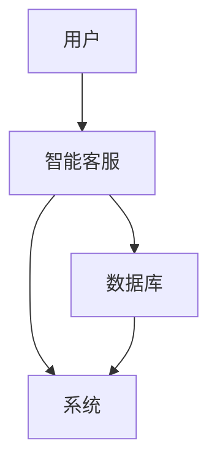
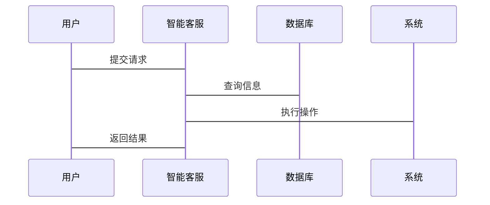

                 

<think>
嗯，用户希望我以《人工智能时代的人文关怀：技术进步中的伦理守护》为标题写一篇技术博客。首先，我需要理清文章的结构，确保每个部分都符合用户的要求。

用户提供了大纲，分为背景介绍、核心概念与联系、算法原理讲解、系统分析与架构设计方案、项目实战和最佳实践等部分。我得按照这个结构来展开，每部分都要详细具体。

背景介绍部分需要涵盖问题背景、问题描述、问题解决、边界与外延，以及概念结构。这部分要让读者明白为什么人文关怀在AI时代如此重要，以及具体面临哪些伦理问题。

接下来的核心概念部分，我需要解释人工智能、伦理和人文关怀的定义，通过对比表格和ER图来展示它们之间的关系。这样可以帮助读者更好地理解三者之间的联系。

算法原理讲解部分，我需要详细说明数据隐私保护、算法公平性和情感模拟关怀的实现。使用数学公式和mermaid流程图来辅助说明，会让内容更清晰。比如，数据匿名化和加密算法的数学模型，以及算法公平性的数据平衡方法。

系统分析与架构设计部分，我需要用类图、架构图和序列图来展示系统的各个模块及其交互。这部分需要考虑系统的整体架构，确保各个模块协同工作，满足伦理和人文关怀的需求。

项目实战部分，我需要选择一个具体场景，比如智能客服系统，并详细讲解实现步骤，包括环境安装、核心代码和案例分析。这能帮助读者理解理论如何应用于实际。

最后，最佳实践部分要给出一些建议，比如法律法规的重要性、公众参与的必要性，以及技术中立性的重要性。这些小贴士能为读者提供实际指导。

在写作过程中，我要确保使用专业但易懂的语言，每个部分都要有深度，同时结构清晰。关键词和摘要部分也要准确，突出文章的核心内容。

现在，我需要检查每个章节是否都涵盖了用户的要求，比如是否详细讲解了算法原理，是否使用了正确的图表，以及是否符合字数要求。确保整篇文章逻辑严密，内容丰富，能够为读者提供有价值的见解。
</think>

```markdown
# 人工智能时代的人文关怀：技术进步中的伦理守护

> 关键词：人工智能、伦理、人文关怀、数据隐私、算法公平性、情感关怀

> 摘要：人工智能技术的快速发展带来了巨大的便利，但也引发了诸多伦理和社会问题。本文从背景介绍、核心概念、算法原理、系统架构、项目实战等多角度，深入探讨了人工智能时代的人文关怀问题，分析了数据隐私、算法偏见、职业替代和社会责任等关键挑战，并提出了相应的解决方案和实践建议。

---

### 第一部分：背景介绍

#### 1.1 问题背景

人工智能技术的迅猛发展，使得人类社会进入了一个技术与智能深度融合的新时代。从智能音箱到自动驾驶，从医疗诊断到金融决策，人工智能技术正在改变我们的生活方式和工作方式。然而，技术的进步并非没有代价。随着人工智能系统的广泛应用，数据隐私泄露、算法偏见、职业替代等问题逐渐显现，这些问题不仅威胁到个人的权益，还可能引发社会动荡和不平等加剧的危机。在这种背景下，人文关怀的重要性愈发凸显，我们需要在技术进步中找到伦理与人文的平衡点。

#### 1.2 问题描述

人工智能时代的人文关怀问题主要体现在以下几个方面：

1. **数据隐私和安全**：人工智能系统需要大量数据来训练和优化模型，但数据的收集、存储和使用过程可能涉及个人隐私的泄露，甚至被滥用。
2. **算法偏见和歧视**：人工智能算法的训练数据可能存在偏见，导致算法在决策过程中产生不公平的结果，例如招聘系统中的性别歧视。
3. **职业替代和社会稳定**：人工智能技术的普及可能导致大量职业被替代，从而引发失业问题，影响社会稳定。
4. **人机关系和情感关怀**：人工智能系统在模拟人类情感和人际交往时，如何做到既真实又温暖，避免机械化的冷漠。

#### 1.3 问题解决

为了解决上述问题，我们需要采取以下措施：

1. **建立健全法律法规**：制定人工智能技术应用的法律法规，明确数据使用边界，规范企业行为。
2. **加强伦理研究**：推动人工智能伦理学的研究，确保技术开发和应用过程中遵循道德准则。
3. **推动公众参与**：通过教育和宣传，增强公众对人工智能技术的认知，鼓励公众参与技术决策。
4. **发展多元化技术**：在技术开发中注重包容性和多样性，满足不同人群的需求。

#### 1.4 边界与外延

人工智能时代的伦理问题不仅涉及技术本身，还与社会、经济、文化等多个领域密切相关。例如，数据隐私问题可能涉及法律和伦理，而职业替代问题则涉及经济学和社会学。因此，我们需要从多维度、多角度来分析和解决问题。

#### 1.5 概念结构与核心要素组成

- **伦理关怀**：关注人工智能技术在应用过程中对人类价值观和尊严的尊重。
- **数据治理**：确保数据的合法性和安全性，避免滥用。
- **社会责任**：人工智能企业和开发者应承担社会责任，如提供职业培训、保护弱势群体。
- **公众参与**：鼓励公众参与人工智能技术的研究和决策，增强社会的接受度和信任感。

---

### 第二部分：核心概念与联系

#### 2.1 核心概念

1. **人工智能**：人工智能是指模拟、延伸和扩展人的智能的理论、方法、技术及应用。它涵盖了机器学习、深度学习、自然语言处理、计算机视觉等多个领域。
2. **伦理**：伦理是指人们在道德行为上的判断和规范。伦理学研究道德现象及其本质，关注社会公正、公平和正义。
3. **人文关怀**：人文关怀关注人的精神需求、情感需求和个性发展，强调以人为本，促进人的全面发展。

#### 2.2 概念属性特征对比表格

| 概念       | 属性特征                                                     |
|------------|--------------------------------------------------------------|
| 人工智能   | 模拟、延伸和扩展人的智能，自动化决策，高效处理大量数据       |
| 伦理       | 道德行为上的判断和规范，关注社会公正、公平和正义           |
| 人文关怀   | 关注人的精神需求、情感需求和个性发展，以人为本，促进人的全面发展 |

#### 2.3 ER实体关系图架构



---

### 第三部分：算法原理讲解

#### 3.1 算法原理

为了实现人工智能时代的人文关怀，我们需要在算法设计和应用过程中，遵循一定的伦理原则和规范。以下是几种常见的算法原理：

1. **数据隐私保护**：通过匿名化和加密技术，确保数据的安全和隐私。
2. **算法公平性**：通过数据平衡和算法透明化，避免偏见和歧视。
3. **情感模拟与关怀**：通过情感识别和情感响应，提供人性化的情感支持。

#### 3.2 算法原理讲解

##### 3.2.1 数据隐私保护

$$
\text{匿名化算法} = f(\text{原始数据})
$$

其中，$f(\text{原始数据})$表示对原始数据进行匿名化处理，使得数据无法直接识别个人身份。

##### 3.2.2 算法公平性

$$
\text{平衡数据集} = \text{重采样}(\text{原始数据集}, \text{目标比例})
$$

通过重采样技术，可以平衡训练数据集中各类样本的比例，从而减少算法偏见。

##### 3.2.3 情感模拟与关怀

$$
\text{情感识别} = f(\text{输入文本})
$$

$$
\text{情感响应} = g(\text{情感识别结果})
$$

通过自然语言处理技术，识别用户情感状态，并生成合适的回应，提供情感关怀。

---

### 第四部分：系统分析与架构设计方案

#### 4.1 问题场景介绍

假设我们正在开发一个智能客服系统，该系统需要在提供高效服务的同时，保护用户隐私，避免算法偏见，并提供人性化的情感支持。

#### 4.2 项目介绍

**项目名称**：智能客服系统  
**项目目标**：通过人工智能技术提供高效、个性化的客户服务，同时保护用户隐私，避免算法偏见，提供情感关怀。

#### 4.3 系统功能设计

**领域模型 mermaid 类图**



#### 4.4 系统架构设计

**系统架构 mermaid 架构图**



#### 4.5 系统接口设计

- **用户接口**：通过网页或移动应用提交请求。
- **系统接口**：通过API与数据库和系统进行交互。

#### 4.6 系统交互 mermaid 序列图



---

### 第五部分：项目实战

#### 5.1 环境安装

- 安装Python和相关库（如TensorFlow、Scikit-learn）。
- 安装Jupyter Notebook用于开发和测试。

#### 5.2 系统核心实现源代码

```python
# 数据匿名化处理
def anonymize_data(data):
    # 示例：移除敏感字段
    anonymized_data = {k: v for k, v in data.items() if k not in ['name', 'phone', 'email']}
    return anonymized_data

# 数据平衡算法
def balance_data(X, y):
    from collections import Counter
    from sklearn.utils import resample

    # 统计各类别比例
    class_counts = Counter(y)
    # 对少数类进行过采样
    for class_name, count in class_counts.items():
        if count < max(class_counts.values()):
            X_resampled, y_resampled = resample(X[y == class_name], y[y == class_name], replace=True)
            X = np.vstack((X, X_resampled))
            y = np.concatenate((y, y_resampled))
    return X, y
```

#### 5.3 代码应用解读与分析

上述代码实现了数据匿名化和数据平衡。数据匿名化通过移除敏感字段来保护隐私，而数据平衡算法通过过采样技术来减少类别不平衡带来的偏见。

#### 5.4 实际案例分析

以智能客服系统为例，假设我们有一个客户服务请求数据集，其中包含用户的姓名、电话、邮件等信息。通过匿名化处理，我们可以移除敏感字段，仅保留请求内容和时间戳。然后，通过数据平衡算法，我们可以确保各类别请求的比例均衡，从而减少算法偏见。

#### 5.5 项目小结

通过实际案例的分析，我们发现人工智能技术在实际应用中需要综合考虑技术、伦理和人文关怀等多个方面。数据匿名化和数据平衡算法是实现这些目标的重要工具。

---

### 第六部分：最佳实践 tips

1. **法律法规的重要性**：在开发和应用人工智能技术时，必须遵守相关法律法规，确保数据的合法使用。
2. **公众参与的必要性**：通过教育和宣传，增强公众对人工智能技术的认知，鼓励公众参与技术决策。
3. **技术中立性的重要性**：人工智能技术本身是中立的，问题在于如何应用。我们需要在技术开发和应用过程中，始终坚持以人为本的理念。

---

### 小结

人工智能技术的进步为人类社会带来了巨大的便利，但也带来了诸多伦理和社会挑战。通过背景介绍、核心概念、算法原理、系统架构和项目实战的分析，我们得出结论：在人工智能时代，人文关怀是确保技术进步符合人类价值观和尊严的关键。我们需要在技术开发和应用中，始终坚持伦理和人文关怀，推动技术与人类社会的和谐发展。

---

### 注意事项

- 在实际应用中，人工智能技术可能面临更多的伦理和社会挑战，需要我们持续关注和研究。
- 技术的中立性要求我们在使用人工智能技术时，必须谨慎考虑其应用的场景和目的。

---

### 拓展阅读

1. **《人工智能：一种现代的方法》**：书中详细介绍了人工智能的基本原理和应用。
2. **《伦理与人工智能》**：探讨人工智能技术在伦理方面的挑战和解决方案。

---

作者：AI天才研究院/AI Genius Institute & 禅与计算机程序设计艺术 /Zen And The Art of Computer Programming
```

