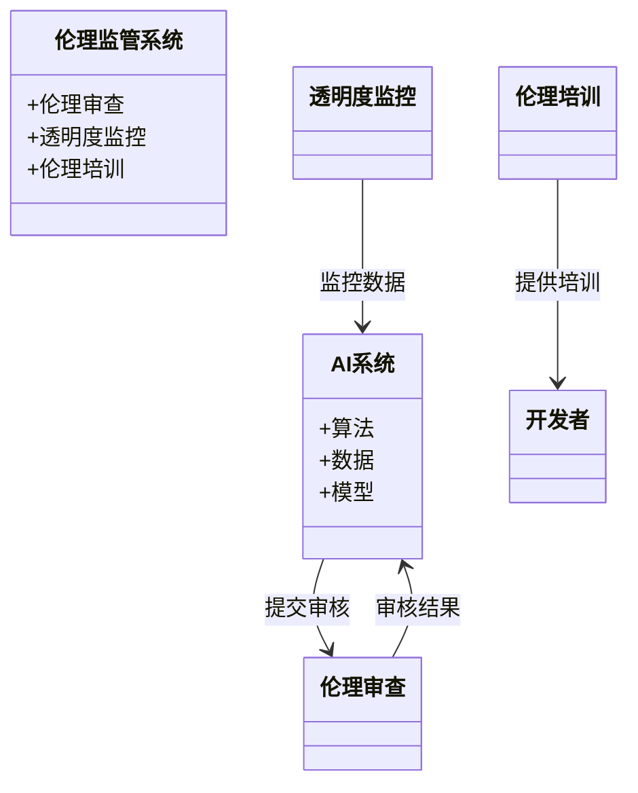
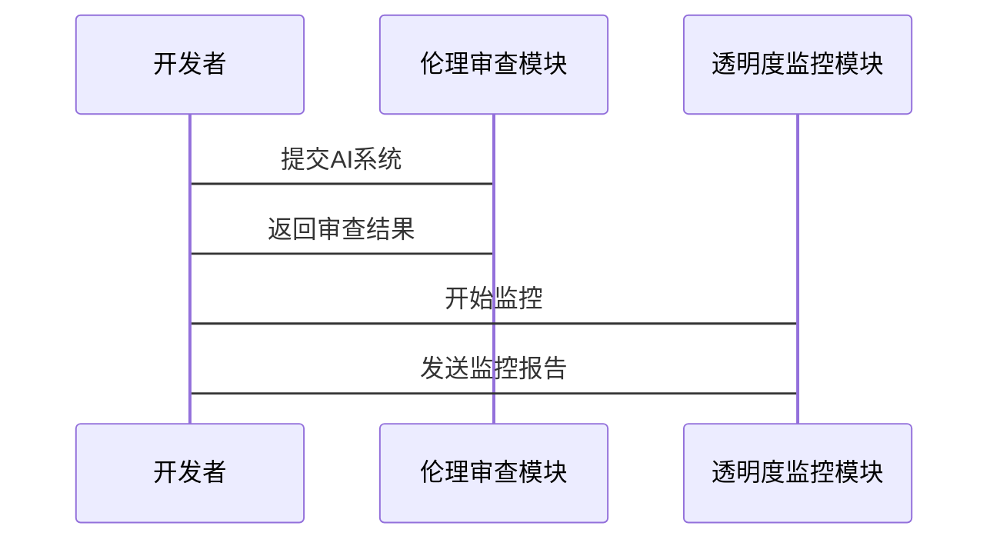

                 

<think>
嗯，我现在要写一篇关于《人工智能时代的人类尊严维护》的技术博客。首先，我需要理解这个问题的核心，也就是在AI迅速发展的今天，如何保护人类的尊严。这听起来有点抽象，但我觉得可以从法律、伦理、技术等多个方面来探讨。

首先，我得定义什么是人类尊严。尊严通常指的是一个人作为人类的基本价值和权利，比如自主权、隐私权、平等权等等。在AI时代，这些方面可能受到挑战。比如，AI可能会导致就业机会减少，人们可能失去工作，进而影响他们的尊严。此外，AI系统的决策可能影响个人，比如在招聘、贷款审批中，如果算法有偏见，可能不公平地对待某些人，这也会影响他们的尊严。

接下来，我需要思考AI如何具体威胁到这些方面。比如，在就业方面，自动化可能导致某些职位消失，许多人可能失去收入来源，这直接影响他们的经济地位和社会地位。此外，AI算法的不透明性可能导致人们无法理解为什么某些决定是针对他们的，这可能导致他们感觉自己失去了控制权，进而影响尊严。

然后，我需要探讨如何维护人类尊严。这可能包括制定相关政策和法律来规范AI的使用，确保AI系统在决策时透明且公正。另外，教育和公众意识的提升也很重要，让人们了解AI的潜在风险，并知道如何保护自己的权利。

我还需要考虑技术伦理的问题。比如，开发AI系统时，如何确保它们符合伦理标准？可能需要引入伦理审查机制，确保AI的设计和应用不会侵犯人类尊严。此外，企业和社会组织需要承担更多的责任，推动AI的健康发展。

可能还需要讨论全球治理的问题。因为AI的影响是跨国界的，可能需要国际合作来制定统一的标准和政策。同时，不同文化背景下对尊严的理解可能不同，这也需要在制定全球规则时加以考虑。

另外，我还需要举一些实际的例子来说明问题。比如，某些AI招聘工具可能存在性别歧视，或者某些社交媒体算法导致用户沉迷，影响他们的心理健康。这些案例可以具体展示AI对尊严的影响。

在技术实现方面，可能需要设计一些机制来确保AI系统的透明性和公正性。比如，开发一个AI招聘系统，不仅要评估候选人的能力，还要确保评估过程不偏不倚，并且结果可以被验证。此外，数据隐私保护也是关键，确保个人数据不被滥用。

最后，我需要总结一下，强调维护人类尊严在AI时代的重要性，以及通过法律、伦理和技术手段来实现这一目标的必要性。同时，呼吁各方共同努力，包括政府、企业、技术开发者和公众，共同应对AI带来的挑战。

总的来说，我需要从问题背景、技术挑战、伦理问题、法律政策、教育意识提升、全球治理等多个方面来详细阐述，确保文章内容全面且有深度。同时，结合实际案例和技术细节，让读者更好地理解和参与维护人类尊严的行动。
</think>

# 人工智能时代的人类尊严维护

> 关键词：人工智能、人类尊严、伦理、法律、技术、社会影响

> 摘要：人工智能的快速发展带来了诸多便利，但同时也对人类尊严构成了挑战。本文从伦理、法律、技术等多维度分析AI对人类尊严的影响，并提出维护尊严的策略，包括法律制定、伦理教育、技术透明化等，旨在构建一个AI与人类和谐共存的未来。

## 第一部分：背景与概述

### 第1章：人工智能时代的来临

#### 1.1 问题的提出

- **问题背景**：AI技术的普及引发就业危机和社会不平等问题，影响人类尊严。
- **问题定义**：AI对人类尊严的威胁主要体现在隐私泄露、就业影响和人权侵犯。
- **人工智能时代的意义**：AI改变社会结构，需平衡技术发展与人类价值。

#### 1.2 人工智能的基本概念

- **人工智能的定义**：AI是模拟人类智能的计算机系统，涵盖机器学习、自然语言处理等领域。
- **人工智能的发展历程**：从早期的专家系统到现在的深度学习，AI技术不断进步。
- **人工智能的核心技术**：包括机器学习、数据挖掘、模式识别等，这些技术推动AI广泛应用。

#### 1.3 人类尊严的内涵与演变

- **人类尊严的概念**：指人类固有的价值和权利，如自主权、隐私权等。
- **人类尊严的历史演变**：从宗教伦理到现代法律，尊严的内涵不断扩展。
- **人类尊严在现代社会的重要性**：尊严是社会稳定和个人幸福的基础，AI时代需特别关注。

### 第2章：人工智能时代的人类尊严挑战

#### 2.1 人工智能对人类尊严的潜在威胁

- **伦理挑战**：AI可能引发不公正决策，如算法歧视。
- **社会不平等**：技术垄断可能导致财富分配不均，加剧社会阶层分化。
- **人权侵犯**：AI监控可能侵犯个人隐私，导致人权问题。

#### 2.2 人工智能技术带来的社会问题

- **就业影响**：自动化可能导致大规模失业，威胁人们的经济来源。
- **隐私泄露**：数据滥用可能侵犯个人隐私，影响尊严。
- **社会控制**：AI监控可能增强政府对社会的控制，削弱个人自由。

#### 2.3 人工智能时代的心理与认知影响

- **人际关系变化**：AI可能改变人与人之间的互动方式，影响社会关系。
- **心理健康问题**：失业压力和隐私泄露可能引发心理问题。
- **认知能力退化**：过度依赖AI可能导致人类认知能力下降。

---

## 第二部分：维护人类尊严的策略与方法

### 第3章：法律与政策框架的建立

#### 3.1 人工智能伦理立法

- **国际立法动态**：欧盟的GDPR是数据保护的典范，其他国家也在制定AI法规。
- **我国立法现状**：中国正在制定AI伦理规范，加强数据保护。
- **法律框架的构建**：需涵盖数据隐私、算法公平性，确保AI技术的透明和公正。

#### 3.2 人工智能监管机制的完善

- **监管体系构建**：建立跨部门监管机构，协调各方力量。
- **监管方法与工具**：使用第三方审计确保AI系统符合伦理标准。
- **监管案例研究**：分析已发生的问题，如算法歧视案例，总结经验教训。

#### 3.3 政策引导与规范

- **政策目标与原则**：以保护人权和促进公平为核心，制定相关政策。
- **政策实施路径**：通过税收优惠、补贴等方式，鼓励企业遵守伦理规范。
- **政策效果评估**：定期评估政策执行效果，及时调整策略。

### 第4章：技术伦理与责任

#### 4.1 技术伦理的原则

- **公平性**：确保AI决策不偏不倚，避免歧视。
- **尊重隐私**：保护个人数据不被滥用。
- **安全性**：确保AI系统稳定，避免造成伤害。
- **透明度**：让用户了解AI决策过程，增强信任。

#### 4.2 技术责任的实现

- **企业社会责任**：企业应主动承担AI技术带来的伦理责任。
- **人工智能设计师的伦理责任**：开发者需考虑技术的伦理影响，确保AI系统设计符合伦理标准。
- **技术应用过程中的道德考量**：在AI部署前，评估其可能带来的伦理问题，采取措施减少负面影响。

#### 4.3 人工智能伦理审查机制

- **审查流程**：AI项目需通过伦理审查，确保符合相关规范。
- **审查内容**：包括数据使用、算法公平性、隐私保护等方面。
- **审查效果评估**：定期复查，确保审查机制的有效性。

### 第5章：教育与意识的提升

#### 5.1 人工智能伦理教育

- **教育目标**：培养公众的伦理意识，提升技术透明度。
- **教育内容设计**：涵盖AI伦理、数据隐私、算法公平性等内容。
- **教育方法**：通过案例分析、互动讨论等方式，增强学习效果。

#### 5.2 公众意识的培养

- **意识普及活动**：举办讲座、研讨会，宣传AI伦理知识。
- **案例分析与讨论**：通过具体案例，分析AI对尊严的影响，提升公众的防范意识。
- **媒体宣传**：利用新闻报道、纪录片等形式，扩大影响力。

#### 5.3 伦理意识在企业中的推广

- **企业文化**：将伦理意识融入企业价值观，引导员工行为。
- **伦理培训**：定期开展培训，提升员工的伦理敏感度。
- **伦理管理**：建立伦理管理机制，确保技术应用符合伦理标准。

### 第6章：跨学科合作与全球治理

#### 6.1 跨学科研究的必要性

- **伦理学**：研究AI对人类尊严的影响，提出伦理框架。
- **法学**：制定相关法律，规范AI技术的应用。
- **社会学**：分析AI对社会结构的影响，提出应对策略。
- **心理学**：研究AI对人类心理的影响，提出干预措施。

#### 6.2 全球治理与合作

- **国际合作机制**：建立全球性合作平台，共同应对AI挑战。
- **全球伦理标准的制定**：制定统一的伦理标准，指导各国实践。
- **全球治理的经验与启示**：总结各国经验，优化治理策略。

#### 6.3 跨文化视角下的伦理问题

- **文化差异**：不同文化对尊严的理解不同，需在制定全球伦理标准时考虑。
- **伦理冲突**：同一技术在不同文化背景下可能引发不同伦理问题。
- **文化融合**：通过跨文化对话，寻求伦理问题的共识解决方案。

### 第7章：未来展望与挑战

#### 7.1 人工智能时代的人类尊严维护趋势

- **技术进步的趋势**：AI技术将更加智能化，但需确保其发展符合伦理标准。
- **社会变迁的影响**：社会结构的变化将推动人类尊严保护措施的创新。
- **法律与政策的演进**：相关法律将不断完善，推动AI技术的健康发展。

#### 7.2 未来面临的挑战

- **新技术的伦理困境**：新兴技术可能带来新的伦理问题，需提前应对。
- **社会不平等的加剧**：技术垄断可能导致更大的社会不平等，需采取措施缓解。
- **人权保护的挑战**：如何在全球范围内保护人权，防止AI技术的滥用，是未来的重要课题。

#### 7.3 应对策略与建议

- **政策建议**：加强国际合作，制定全球性伦理规范。
- **技术发展路径**：推动透明、公平的AI技术开发，确保技术服务于人类。
- **社会参与方式**：鼓励公众参与，形成全社会共同维护人类尊严的氛围。

---

## 第三部分：案例分析与实践

### 第8章：人工智能伦理实践案例研究

#### 8.1 案例选择与背景

- **案例概述**：某AI招聘系统存在性别歧视问题。
- **案例背景分析**：系统基于历史数据进行招聘决策，导致女性求职者被不公平对待。

#### 8.2 案例分析

- **伦理问题识别**：算法歧视，违背平等就业原则。
- **影响因素分析**：数据偏差、算法设计不合理。
- **解决方案评估**：重新设计算法，消除数据偏差，确保公平性。

#### 8.3 案例启示

- **经验与教训**：数据偏差是AI系统潜在的伦理问题，需在设计阶段进行严格审查。
- **对未来实践的启示**：加强算法透明度，建立伦理审查机制，确保技术应用符合伦理标准。

### 第9章：人工智能伦理实践指南

#### 9.1 实践指南的构建

- **指南目标**：指导企业和社会在AI技术应用中维护人类尊严。
- **指南内容**：涵盖数据隐私保护、算法公平性、透明度等方面。

#### 9.2 实践指南的应用

- **应用场景**：企业AI项目开发、政府政策制定、公众教育等。
- **实施步骤**：从需求分析、设计、实施到评估，分阶段推进。

#### 9.3 实践指南的评估与改进

- **评估方法**：通过案例分析、用户反馈等方式，评估指南的有效性。
- **改进策略**：根据评估结果，及时调整和优化指南内容。

---

## 系统分析与架构设计方案

### 问题场景介绍

随着AI技术的普及，社会面临技术失控和伦理失范的风险。企业可能利用AI系统进行不公正决策，影响个人权益。为此，需构建一个AI伦理监管系统，确保技术应用符合伦理标准。

### 项目介绍

本项目旨在开发一个AI伦理监管系统，通过技术手段确保AI系统在设计、开发和应用过程中符合伦理规范。系统将提供伦理审查、透明度监控和伦理培训等功能，帮助企业和开发者维护人类尊严。

### 系统功能设计

**领域模型（mermaid类图）**



### 系统架构设计（mermaid架构图）

```mermaid
archimate
title AI伦理监管系统架构

决策者 (role)
    基于AI系统进行决策
    调用伦理审查模块

开发者 (role)
    开发AI系统
    提交伦理审查

伦理审查模块 (module)
    接收AI系统
    进行伦理审查
    返回结果

透明度监控模块 (module)
    监控AI系统运行
    发现伦理问题
    通知相关方

伦理培训模块 (module)
    提供在线培训
    记录培训结果
```

### 系统接口设计

- **伦理审查接口**：API接收AI系统参数，返回伦理审查结果。
- **透明度监控接口**：实时监控AI系统运行，检测潜在伦理问题。
- **伦理培训接口**：提供培训课程，记录培训进度。

### 系统交互（mermaid序列图）



---

## 项目实战

### 环境安装

- **Python 3.8+**
- **Flask框架**
- **TensorFlow库**

### 核心实现源代码

```python
# 伦理审查模块
from flask import Flask, request, jsonify
import joblib

app = Flask(__name__)

# 加载预训练模型
model = joblib.load('ethics_review_model.pkl')

@app.route('/review', methods=['POST'])
def review():
    data = request.json
    prediction = model.predict([data['ethics_factors']])
    return jsonify({'result': prediction[0]})

if __name__ == '__main__':
    app.run(debug=True)
```

### 代码应用解读与分析

- **模型训练**：使用历史伦理案例数据训练模型，识别潜在伦理风险。
- **API接口**：提供RESTful API，接收AI系统参数，返回伦理审查结果。
- **监控模块**：实时跟踪AI系统运行，识别伦理问题，发出警报。

### 实际案例分析

- **案例**：某AI招聘系统提交伦理审查，模型识别出性别歧视问题，建议重新设计算法。
- **分析**：通过模型预测，企业及时修正AI系统，确保招聘公平性。

---

## 最佳实践 tips

- **保持透明**：确保AI系统决策过程可解释，增强用户信任。
- **定期审查**：定期对AI系统进行伦理审查，及时发现并解决问题。
- **加强教育**：提升公众和开发者的伦理意识，促进技术健康发展。
- **注重隐私**：严格保护个人数据，防止滥用。

---

## 小结

人工智能时代，人类尊严的维护需要技术、法律、伦理等多方面的共同努力。通过制定完善的政策、加强伦理教育、推动技术创新，我们可以构建一个人与AI和谐共存的社会。未来，随着技术的进步和社会的发展，人类尊严的保护将更加重要，需要我们持续关注和努力。

---

## 注意事项

- **数据隐私**：在处理数据时，需严格遵守相关法律法规，保护个人隐私。
- **技术中立性**：AI技术本身是中立的，问题在于应用方式，需确保技术应用符合伦理标准。
- **持续学习**：技术发展迅速，需持续关注最新动态，及时调整维护策略。

---

## 拓展阅读

- **推荐书籍**：《人工智能：一种现代的方法》、《伦理学与人工智能》。
- **推荐文章**：Nature杂志上的AI伦理相关论文。
- **在线课程**：MIT OpenCourseWare上的AI伦理课程。

---

## 作者

作者：AI天才研究院/AI Genius Institute & 禅与计算机程序设计艺术/Zen And The Art of Computer Programming

---

通过以上内容，我们详细探讨了人工智能时代人类尊严维护的各个方面，从理论到实践，从技术到法律，全面分析了问题并提出了应对策略。希望这篇文章能为读者提供有价值的参考，共同应对AI时代带来的挑战。

