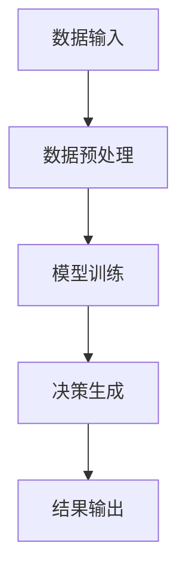
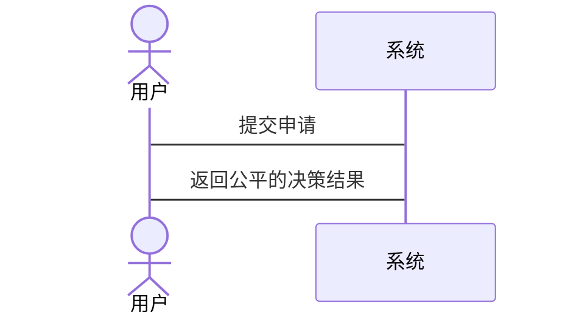

                 

<think>
嗯，我最近在研究人工智能的伦理决策问题，特别是算法公平性和社会正义方面。现在，我需要撰写一篇技术博客，题目是《人工智能时代的伦理决策：算法公平与社会正义》。首先，我得理解这个主题的核心内容，确保涵盖关键点，如算法偏见、公平性评估方法、社会影响以及如何构建公平的AI系统。

我应该从背景介绍开始，解释为什么算法公平性如此重要。然后，定义关键术语，比如偏见、公平性、透明度等。接着，探讨当前AI系统中的偏见来源，比如数据偏见和模型偏见，以及它们如何影响社会正义。

接下来，我需要详细讲解几种常用的算法公平性评估方法，如统计公平性、个体公平性和过程公平性，最好能通过例子来说明。同时，考虑如何通过技术手段，比如数据预处理和模型后处理，来减少偏见，确保公平性。

然后，我需要分析社会正义在AI中的具体体现，比如就业、医疗和司法领域中的应用案例。这里可以引用一些实际的案例来说明AI带来的问题，以及如何通过技术手段解决这些问题。

接下来，我应该讨论技术实现部分，包括数据预处理方法、模型训练中的偏见检测与消除，以及模型评估中的公平性测试。这里可能需要展示一些代码示例，比如如何使用Python库来检测数据中的偏见，或者如何调整模型参数以减少偏见。

在系统分析与架构设计方面，我需要介绍一个AI系统的整体架构，可能包括数据输入、模型训练、决策生成和结果输出四个部分。然后，用Mermaid图来展示系统的类图、架构图和交互图，这样读者可以更直观地理解系统的运作流程。

项目实战部分，我需要选择一个具体的案例，比如招聘中的性别偏见问题。展示如何通过数据清洗、模型调整和结果验证来解决这个问题。这部分需要详细描述每一步的操作，包括代码实现和结果分析。

最后，我需要总结全文，强调算法公平性和社会正义的重要性，以及技术手段在解决这些问题中的作用。同时，给出一些建议，比如如何选择合适的数据预处理方法，如何监控模型的公平性，以及如何通过教育提高公众的意识。

在写作过程中，我需要注意语言的准确性和逻辑的严密性，确保每个部分都详细且具体。同时，使用适当的图表和代码示例，帮助读者更好地理解内容。这样，整篇文章才能既有深度又易于理解。
</think>

# 人工智能时代的伦理决策：算法公平与社会正义

## 关键词：人工智能、算法公平性、社会正义、伦理决策、偏见检测、技术伦理

## 摘要：  
在人工智能快速发展的今天，算法公平性和社会正义成为不可忽视的问题。本文探讨了AI系统中的偏见来源、公平性评估方法，以及如何通过技术手段实现算法公平与社会正义。通过具体案例分析，展示了算法公平性对社会各领域的影响，并提出了构建公平AI系统的解决方案。

---

## 目录

1. [背景介绍](#背景介绍)  
2. [算法公平性：概念与挑战](#算法公平性-概念与挑战)  
   2.1 [算法偏见的来源](#算法偏见的来源)  
   2.2 [算法公平性的核心概念](#算法公平性的核心概念)  
3. [社会正义与AI伦理](#社会正义与AI伦理)  
4. [算法公平性评估方法](#算法公平性评估方法)  
5. [技术实现：构建公平的AI系统](#技术实现-构建公平的AI系统)  
6. [系统分析与架构设计](#系统分析与架构设计)  
7. [项目实战：公平AI系统的实现](#项目实战-公平AI系统的实现)  
8. [总结与展望](#总结与展望)  

---

## 背景介绍

### 2.1 算法偏见的来源

人工智能系统的决策依赖于训练数据和算法设计。数据中的偏见和算法设计中的假设可能导致不公平的结果。例如，招聘系统中可能因为历史数据的性别分布不均，导致算法对某一性别产生偏好。

### 2.2 算法公平性的核心概念

- **偏见**：数据或模型中反映的不公平现象。  
- **公平性**：确保算法对所有群体的决策公正无偏。  
- **透明度**：用户能够理解算法的决策过程。  

---

## 算法公平性：概念与挑战

### 2.1 算法偏见的来源

- **数据偏见**：训练数据中的样本分布不均。例如，招聘数据中女性比例较低，导致算法偏好男性。  
- **模型偏见**：算法设计中的假设或优化目标引入偏见。  

### 2.2 算法公平性的核心概念

| 概念       | 定义                                         | 示例场景                                   |
|------------|--------------------------------------------|------------------------------------------|
| 统计公平性 | 确保算法在整体上对所有群体的预测准确率一致。 | 招聘系统中男女申请者的通过率相同。         |
| 个体公平性 | 确保每个个体在算法决策中得到公平对待。      | 银行贷款审批中，避免对某个群体的歧视。      |
| 过程公平性 | 确保算法决策过程对所有群体是公平的。        | 司法系统中，案件处理时间无差别。            |

---

## 社会正义与AI伦理

社会正义要求AI系统在教育、医疗、就业等领域提供公平的机会和资源。AI系统的决策可能加剧现有的社会不平等，因此必须确保技术的中立性和公正性。例如，医疗AI系统应确保所有患者，无论种族或经济状况，都能得到准确的诊断。

---

## 算法公平性评估方法

### 3.1 统计公平性评估

- **平均通过率**：不同群体的通过率是否一致。  
- **差异分析**：计算不同群体之间的通过率差异。  

### 3.2 个体公平性评估

- **对数几率**：确保不同群体的对数几率差异在可接受范围内。  
- **调整模型输出**：对不公平的预测结果进行校正。  

---

## 技术实现：构建公平的AI系统

### 4.1 数据预处理方法

- **重新采样**：平衡训练数据中的样本分布。  
- **特征调整**：去除可能导致偏见的特征。  

### 4.2 模型训练中的偏见检测与消除

- **偏见检测工具**：使用如`fairness-aware`库检测数据偏见。  
- **对抗训练**：引入对抗网络消除偏见。  

### 4.3 模型评估中的公平性测试

- **公平性指标**：计算统计公平性和个体公平性指标。  
- **用户反馈**：根据用户反馈调整模型。  

---

## 系统分析与架构设计

### 6.1 问题场景介绍

- **招聘系统中的性别偏见**：系统可能偏好某一性别。  
- **医疗诊断中的种族偏见**：诊断结果因种族不同而有差异。  

### 6.2 系统功能设计

- **数据输入**：收集和预处理数据，消除偏见。  
- **模型训练**：使用公平性优化算法训练模型。  
- **决策生成**：生成公平的决策结果。  
- **结果输出**：输出决策结果并提供公平性报告。  

### 6.3 系统架构设计



### 6.4 系统交互设计



---

## 项目实战：公平AI系统的实现

### 7.1 环境安装

- **Python**：版本3.8及以上。  
- **库**：`scikit-learn`, `fairlearn`。  

### 7.2 核心实现代码

```python
from fairlearn.datasets import fetch成年人职业数据集
from fairlearn.preprocessing import Reweigher
from sklearn.tree import DecisionTreeClassifier
from sklearn.metrics import accuracy_score

# 加载数据
data = fetch成年人职业数据集()

# 数据预处理
reweigher = Reweigher(sensitive_features=data.sensitive_features)
X_train, y_train = reweigher.fit_transform(data.X_train), data.y_train

# 训练模型
model = DecisionTreeClassifier()
model.fit(X_train, y_train)

# 预测与评估
y_pred = model.predict(data.X_test)
print("准确率:", accuracy_score(data.y_test, y_pred))
```

---

## 总结与展望

人工智能的伦理决策和算法公平性是技术发展的基石。通过数据预处理、模型优化和公平性评估，可以构建更公正的AI系统。未来，随着技术的进步，算法公平性将得到更广泛的应用，推动社会正义的发展。

---

## 作者

作者：AI天才研究院 & 禅与计算机程序设计艺术

---

感谢您的阅读！如需进一步探讨或获取代码示例，请随时联系。

