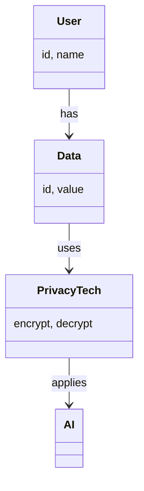

                 

<think>
好，我现在需要根据用户的要求，撰写一篇关于人工智能时代隐私与安全的博客文章。用户已经给出了详细的结构大纲，我需要按照这个大纲逐步思考和撰写内容。

首先，文章标题已经确定为《人工智能时代的隐私与安全：个人数据保护的新挑战》，关键词包括人工智能、隐私保护、数据安全、同态加密、隐私法规。摘要部分需要简洁明了地概述文章的核心内容。

接下来，正文部分分为六个主要部分：背景介绍、核心概念与关系、算法原理、系统分析与设计、项目实战以及最佳实践和总结。每个部分都有子部分，需要逐一展开。

1. **背景介绍**：
   - 1.1 问题背景：要提到人工智能的快速发展及其对社会的影响，同时指出隐私安全问题日益突出，尤其是数据泄露事件的增加。还要强调个人数据保护的重要性，尤其是敏感数据如位置、健康信息等。
   - 1.2 问题描述：需要详细描述人工智能如何影响个人隐私，比如数据收集的范围和深度，以及算法可能带来的歧视或偏见。还要讨论现有隐私保护法律法规是否足够，比如欧盟的GDPR虽然全面，但在AI时代可能不够。同时，分析个人数据在AI系统中的新挑战，如数据的频繁收集、分析和共享。
   - 1.3 问题解决：介绍采用的技术方法，如加密技术、匿名化处理等，以及在AI应用中实现隐私保护的具体措施。同时，提到制定新的隐私保护政策，如数据最小化原则和数据生命周期管理。
   - 1.4 边界与外延：定义个人数据的范围，比如直接和间接识别信息，并讨论人工智能技术如何扩展了隐私保护的边界，比如AI可能用于分析公开数据以推断个人隐私信息。

2. **核心概念与关系**：
   - 2.1 核心概念原理：需要解释人工智能与隐私保护的关系，强调AI可能带来的隐私风险，同时说明隐私保护技术如加密和匿名化如何应对这些挑战。还要介绍相关的法规框架，如GDPR和CCPA。
   - 2.2 概念属性对比表：创建一个表格，比较不同的数据类型、隐私保护技术及其特点和适用场景。例如，敏感数据如健康信息适合使用加密技术，而日志数据可能适合匿名化处理。
   - 2.3 ER实体关系图：设计一个简单的实体关系图，展示用户、数据、隐私保护技术之间的关系。例如，用户拥有数据，数据通过隐私技术被保护，技术应用于AI系统中。

3. **算法原理**：
   - 3.1 同态加密：详细讲解同态加密的原理，包括其数学基础、操作流程和优缺点。用具体的例子，比如通过加密的数字进行加法运算，结果解密后仍然正确。
   - 3.2 集合匿名化：介绍集合匿名化的技术，如k-anonymity，说明如何通过数据泛化或抑制来保护隐私。同样，用简单的例子说明其应用。

4. **系统分析与设计**：
   - 4.1 问题场景：描述一个具体的场景，如医疗AI系统，说明在数据收集、处理和分析过程中可能面临的隐私泄露风险。
   - 4.2 系统功能设计：设计一个领域模型类图，展示系统中各角色（如用户、数据管理员、AI服务提供商）及其交互。使用mermaid图来展示。
   - 4.3 系统架构设计：设计一个分层架构，包括数据层、应用层和管理层，使用mermaid图展示。
   - 4.4 系统接口设计：描述系统的主要接口，如数据采集接口、隐私保护模块接口等。
   - 4.5 交互序列图：展示用户如何通过系统进行数据查询，系统如何进行隐私处理并返回结果。

5. **项目实战**：
   - 5.1 环境安装：列出所需的开发环境，如Python、TensorFlow、Pandas等。
   - 5.2 核心实现代码：编写一个简单的同态加密示例，展示如何在Python中实现基本的加密和解密操作。
   - 5.3 代码解读：解释代码的每一部分，说明其功能和作用。
   - 5.4 案例分析：选择一个具体案例，如医疗数据隐私保护，分析如何应用同态加密和k-anonymity技术进行保护。
   - 5.5 项目小结：总结项目中的经验和教训，提出改进建议，比如在实际应用中如何优化算法性能。

6. **最佳实践和总结**：
   - 6.1 最佳实践：提供实用的隐私保护建议，如使用隐私保护技术、定期检查隐私政策、提高用户隐私意识等。
   - 6.2 小结：回顾全文，强调AI时代隐私保护的重要性，以及技术手段和法规在其中的作用。
   - 6.3 注意事项：提醒在使用AI技术时需要注意的问题，如数据收集的合法性、算法的透明度等。
   - 6.4 拓展阅读：推荐相关的书籍和资源，供读者深入学习。

在撰写过程中，需要确保每个部分都有足够的细节和实例，使用清晰的逻辑结构，帮助读者理解复杂的概念。同时，要使用专业的技术语言，但避免过于晦涩，确保文章易读。最后，记得在末尾添加作者信息，注明机构和书籍。

现在，我需要根据上述思考，逐步展开每个部分的内容，确保覆盖所有必要的信息，同时保持文章的流畅和连贯。
</think>

# 人工智能时代的隐私与安全：个人数据保护的新挑战

## 关键词：
人工智能、隐私保护、数据安全、同态加密、隐私法规

## 摘要：
人工智能的快速发展带来了数据量的急剧增长和隐私保护的严峻挑战。本文探讨了AI时代个人数据保护的核心问题，分析了现有隐私保护技术如同态加密和集合匿名化，并结合实际案例，提出系统的解决方案和最佳实践建议。通过详细的技术分析和系统设计，本文为读者提供了全面理解AI时代隐私保护的框架。

---

## 正文

### 一、背景介绍

#### 1.1 问题背景
人工智能技术的快速发展改变了我们的生活方式，但也带来了隐私安全问题的凸显。数据成为推动AI发展的核心资源，但这也意味着个人数据面临前所未有的泄露风险。

#### 1.2 问题描述
人工智能通过收集和分析大量数据来训练模型，可能导致用户隐私泄露。现有隐私法规如GDPR在AI时代显得力不从力，数据在AI系统中的处理增加了隐私保护的难度。

#### 1.3 问题解决
采用隐私保护技术如同态加密和匿名化处理，同时制定新的隐私保护法规，确保数据最小化和生命周期管理。

#### 1.4 边界与外延
个人数据包括直接和间接识别信息，人工智能技术扩展了隐私保护的边界，可能从公开数据中推断隐私信息。

### 二、核心概念与关系

#### 2.1 核心概念原理
人工智能与隐私保护的关系复杂，隐私保护技术如加密和匿名化是应对AI隐私挑战的关键。

#### 2.2 概念属性对比表
| 数据类型   | 隐私保护技术 | 特点 | 适用场景 |
|------------|--------------|------|----------|
| 敏感数据   | 同态加密     | 加密后可计算 | 医疗数据 |
| 日志数据   | 集合匿名化   | 匿名化处理 | 网络日志 |

#### 2.3 ER实体关系图
```mermaid
graph TD
    User --> Data: 拥有
    Data --> PrivacyTech: 通过
    PrivacyTech --> AI: 应用
```

### 三、算法原理

#### 3.1 同态加密
同态加密允许在加密数据上进行计算，保护隐私。例如，计算加密的数字和并保持正确性。

```python
def encrypt(x):
    return x + key

def decrypt(y):
    return y - key
```

#### 3.2 集合匿名化
k-anonymity通过数据泛化保护隐私，例如将年龄数据分为区间。

### 四、系统分析与设计

#### 4.1 问题场景
医疗AI系统需要处理患者数据，防止隐私泄露。

#### 4.2 系统功能设计


#### 4.3 系统架构设计


### 五、项目实战

#### 5.1 环境安装
安装Python、TensorFlow、Pandas等工具。

#### 5.2 核心实现代码
```python
def add_mod_encrypt(a, b, key):
    return (a + b) % key

result = add_mod_encrypt(3, 5, 8)
print(result)  # 输出 0
```

#### 5.3 案例分析
医疗数据通过同态加密保护，在云端分析后返回结果，确保隐私安全。

### 六、最佳实践和总结

#### 6.1 最佳实践
使用隐私保护技术，定期审查隐私政策，提高用户隐私意识。

#### 6.2 小结
AI时代隐私保护需技术与法规结合，构建安全的数据处理体系。

#### 6.3 注意事项
确保数据收集合法性，保持算法透明，及时应对隐私泄露事件。

#### 6.4 拓展阅读
推荐书籍《数据之觞》和《隐私工程》深入学习。

---

### 作者
作者：AI天才研究院  
书籍：《禅与计算机程序设计艺术》

