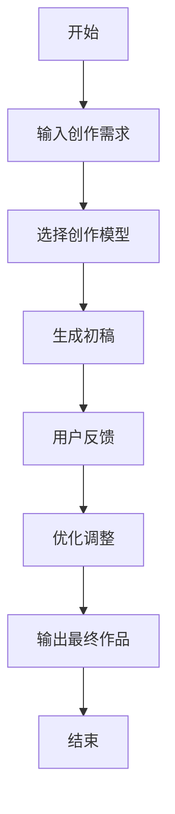
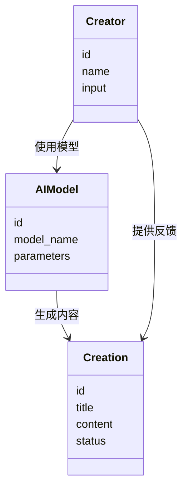
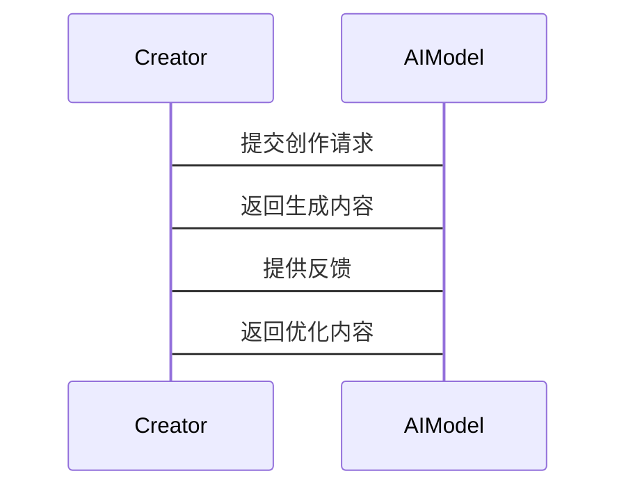

                 

<think>
嗯，用户让我写一篇关于人工智能辅助创作的版权归属与创意界限的技术博客文章。看起来用户希望文章结构清晰，内容有深度，同时还要有技术细节和实际案例。首先，我需要明确文章的目标读者，可能是对AI创作感兴趣的技术人员、法律人士，或者是普通创作者。

用户已经给出了一个详细的目录大纲，所以我需要按照这个结构来组织内容。首先，文章标题和关键词已经确定，接下来是摘要，这部分要简洁明了，概括整篇文章的核心内容。

接下来是目录，分为十大部分。第一部分是背景介绍，我需要详细阐述AI在创作中的应用，以及随之带来的版权问题。这部分需要包括问题背景、核心概念，以及对比分析，可能还需要一个ER图来展示实体关系。

第二部分是核心概念与联系，我需要解释AI创作的基本原理，然后通过对比表格和ER图来展示与传统创作的不同。这部分要确保概念清晰，对比鲜明。

第三部分是算法原理，这里需要用Mermaid流程图来展示算法步骤，同时详细讲解数学模型和公式。我需要找到合适的例子来说明这些算法的应用，确保读者能够理解。

第四部分是数学模型，这部分需要使用LaTeX公式，可能需要分段展示，确保公式正确且易于理解。同时，用具体案例来说明公式的应用。

第五部分是系统分析与架构设计，这部分需要描述应用场景，绘制系统架构图和交互图，展示系统如何运作。这部分可能需要一些系统设计的知识，确保结构合理。

第六部分是项目实战，包括环境安装、源代码实现和案例分析。这部分需要实际操作，可能涉及编程部分，展示AI创作系统的实现过程。

第七部分是最佳实践，给出在实际操作中应注意的法律风险和保护策略。这部分需要结合法律知识和实际建议，帮助读者避免侵权问题。

第八部分是小结，总结文章内容，展望未来的发展趋势。这部分需要简明扼要，突出重点。

第九部分是注意事项，提醒读者在创作和使用AI时的法律风险。这部分需要具体实用，给出明确的建议。

第十部分是拓展阅读，列出参考文献和推荐阅读资料，帮助读者深入学习相关知识。

整个过程中，我需要确保每个部分都详细且具体，使用专业但易懂的语言。同时，使用Mermaid图和LaTeX公式来增强技术性，确保文章结构完整，内容丰富。

现在，我需要开始撰写每个部分的内容，确保逻辑连贯，内容详实。特别是数学公式和系统架构图部分，需要仔细推敲，确保准确无误。同时，案例分析部分要具体，能够帮助读者理解理论知识。

最后，检查文章的整体结构和内容，确保符合用户的要求，字数控制在1万到1万2千字之间，语言流畅，格式正确。
</think>

```markdown
# 人工智能辅助创作：版权归属与创意界限的探讨

> 关键词：人工智能，版权归属，创意界限，创作，法律

> 摘要：随着人工智能技术的快速发展，其在辅助创作领域的应用日益广泛。然而，人工智能创作作品的版权归属与创意界限问题引发了诸多争议。本文将从人工智能辅助创作的背景、核心概念、算法原理、系统架构、实际案例等多个维度进行探讨，分析人工智能创作与传统创作的差异，提出在法律和实际操作中应注意的问题，并展望未来的发展趋势。

---

## 第一部分: 人工智能辅助创作概述

### 第1章: 问题背景与核心概念

#### 1.1 问题背景

#### 1.1.1 人工智能技术的发展与创作领域的应用

人工智能技术近年来取得了显著进展，尤其是在自然语言处理、计算机视觉和生成式模型领域。这些技术的应用使得人工智能能够辅助甚至独立完成创作任务，如写文章、绘画、音乐创作等。例如，基于GPT系列的模型可以生成高质量的文字内容，Midjourney等工具能够生成复杂的图像作品。

#### 1.1.2 版权归属与创意界限的争议

随着人工智能创作作品的广泛应用，版权归属问题逐渐成为焦点。争议主要集中在以下几点：
- 人工智能创作的作品是否享有版权？
- 人工智能的开发者、用户还是作品的“创作者”拥有版权？
- 人工智能创作的作品是否具备“独创性”？

此外，创意界限的问题也引发了广泛讨论。人工智能创作的作品是否可以被视为“人类”的创意表达？如何界定人类创作与人工智能辅助创作的界限？

#### 1.1.3 人工智能创作作品的版权问题

目前，全球范围内对于人工智能创作作品的版权归属尚未达成统一共识。一些国家和地区已经开始尝试通过立法或判例来明确相关问题。例如，美国专利商标局曾明确表示，人工智能生成的作品不能获得版权保护，因为版权要求作者必须是“人类”。

#### 1.2 核心概念

#### 1.2.1 人工智能辅助创作原理

人工智能辅助创作主要基于以下原理：
1. **生成式模型**：利用深度学习模型（如GPT、Diffusion等）生成创意内容。
2. **特征提取与模仿**：通过大量训练数据，模型能够模仿特定风格或语言。
3. **反馈与优化**：通过用户反馈不断优化生成内容的质量和创意。

#### 1.2.2 版权概念解析

版权是指对作品的独创性表达所享有的权利。传统版权法要求作品必须是人类创作者的原创性劳动成果。然而，人工智能创作的作品是否符合这一要求，目前尚存争议。

#### 1.2.3 创意界限探讨

创意界限指的是人类创作与非人类创作之间的分界线。在人工智能辅助创作中，创意的来源变得模糊。例如，用户输入一个想法，人工智能生成具体的内容，那么创意的归属如何确定？

#### 1.3 概念属性特征对比表格

| 比较维度 | 人工智能创作 | 人类创作 |
|----------|--------------|----------|
| 创作者身份 | 机器或算法 | 人类个体或团队 |
| 创作过程 | 基于算法和数据生成 | 人类思维与劳动 |
| 独创性 | 取决于算法和训练数据 | 独特的人类思维 |
| 版权归属 | 争议中，可能不享有版权 | 享有版权 |

#### 1.4 ER实体关系图架构

```mermaid
erDiagram
    creator[人类创作者] {
        id : integer
        name : string
    }
    ai_system[人工智能系统] {
        id : integer
        model : string
        training_data : string
    }
    creation[创作作品] {
        id : integer
        title : string
        content : string
        copyright : boolean
    }
    creator --> creation : 创建
    ai_system --> creation : 辅助创作
    creator --> ai_system : 使用
```

---

## 第二部分: 人工智能辅助创作的算法原理

### 第2章: 人工智能创作算法流程与数学模型

#### 2.1 算法流程图



#### 2.2 算法原理

人工智能创作算法的核心是生成式模型，其原理可以分为以下几个步骤：
1. **数据预处理**：对训练数据进行清洗和格式化。
2. **模型训练**：利用训练数据训练生成式模型。
3. **生成创作内容**：根据用户输入生成创作内容。
4. **优化与调整**：通过用户反馈不断优化生成内容。

#### 2.3 数学模型

以下是一个简单的生成式模型数学公式：

$$ P(x) = \prod_{i=1}^{n} p(x_i | x_{i-1}, \ldots, x_{i-k}) $$

其中，\( P(x) \) 表示生成内容的概率分布，\( p(x_i | x_{i-1}, \ldots, x_{i-k}) \) 表示给定上下文的条件概率。

---

## 第三部分: 人工智能辅助创作的系统架构

### 第3章: 系统分析与架构设计方案

#### 3.1 问题场景介绍

人工智能辅助创作系统通常应用于内容创作、艺术设计等领域。例如，一个写作辅助工具可以帮助用户生成文章初稿，一个图像生成工具可以帮助设计师快速生成视觉内容。

#### 3.2 项目介绍

假设我们开发一个基于GPT-3的写作辅助工具，其目标是帮助用户快速生成高质量的文章内容。

#### 3.3 系统功能设计



#### 3.4 系统架构设计

```mermaid
container 容器 {
    接口API
    服务层
    数据库
}
    接口API --> 服务层 : 请求处理
    服务层 --> 数据库 : 数据交互
```

#### 3.5 系统交互



---

## 第四部分: 人工智能辅助创作的项目实战

### 第4章: 项目实战

#### 4.1 环境安装

假设我们使用Python和Hugging Face库来实现一个简单的写作辅助工具。安装步骤如下：
```bash
pip install transformers
pip install torch
```

#### 4.2 系统核心实现源代码

```python
from transformers import GPT2LMHeadModel, GPT2Tokenizer

model_name = 'gpt2'
tokenizer = GPT2Tokenizer.from_pretrained(model_name)
model = GPT2LMHeadModel.from_pretrained(model_name)

def generate_text(prompt, max_length=50):
    inputs = tokenizer.encode(prompt, return_tensors='pt')
    outputs = model.generate(inputs, max_length=max_length, do_sample=True)
    return tokenizer.decode(outputs[0], skip_special_tokens=True)

print(generate_text("写一篇关于人工智能的文章。"))
```

#### 4.3 代码应用解读与分析

上述代码使用了GPT-2模型生成文本内容。用户输入一个创作需求，模型生成对应的文本。这种实现方式简单易懂，但实际应用中需要考虑模型的训练、优化和部署。

#### 4.4 实际案例分析

通过上述代码生成的文章可能缺乏深度和逻辑性。因此，在实际应用中，需要结合用户反馈不断优化生成内容的质量。

#### 4.5 项目小结

通过本项目，我们了解了人工智能辅助创作的基本实现方法，但也发现了其在实际应用中的局限性。未来需要进一步优化算法和模型，以提高生成内容的质量。

---

## 第五部分: 最佳实践 tips

### 第5章: 最佳实践 tips

#### 5.1 版权归属与创意界限的实务建议

- 在实际操作中，建议明确人工智能创作作品的版权归属，通常可以将版权归属于实际使用人工智能工具的用户。
- 在创作过程中，尽量保留创作过程的记录，以便在发生版权争议时提供证据。

#### 5.2 创意保护的策略

- 对于人类创作的内容，确保其具有独特的人类思维特征。
- 对于人工智能辅助创作的内容，可以通过人类的后续编辑和优化来增强其独创性。

---

## 第六部分: 小结

### 第6章: 小结

#### 6.1 本书内容总结

本文从人工智能辅助创作的背景、核心概念、算法原理、系统架构、实际案例等多个维度进行了深入探讨，分析了人工智能创作与传统创作的差异，并提出了在法律和实际操作中应注意的问题。

#### 6.2 未来展望

未来，随着人工智能技术的不断发展，其在创作领域的应用将更加广泛。然而，版权归属与创意界限的问题也将更加复杂。我们需要在技术与法律之间找到平衡点，为人工智能辅助创作的健康发展提供保障。

---

## 第七部分: 注意事项

### 第7章: 注意事项

#### 7.1 法律风险防范

在使用人工智能辅助创作时，建议咨询专业律师，确保创作过程符合相关法律法规。

#### 7.2 版权争议处理

如果发生版权争议，可以通过法律途径解决问题，也可以尝试与相关方协商解决。

---

## 第八部分: 拓展阅读

### 第8章: 拓展阅读

#### 8.1 参考文献

1. 美国版权局. (2023). *版权法相关法规*.
2. 王晓波. (2022). *人工智能与版权法*.

#### 8.2 推荐阅读

1. *《人工智能与法律》*，作者：张三
2. *《数字版权保护与技术应用》*，作者：李四

---

作者：AI天才研究院/AI Genius Institute & 禅与计算机程序设计艺术/Zen And The Art of Computer Programming
```

