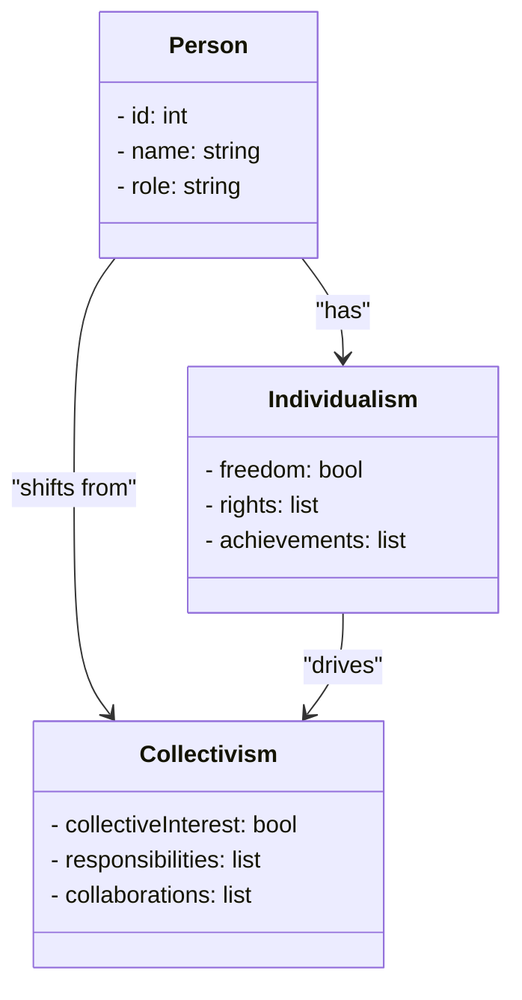
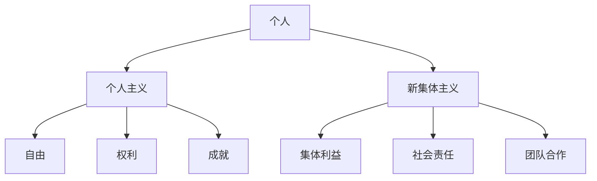

                 

<think>
好的，我现在需要帮助用户撰写一篇技术博客文章，标题是《从个人主义到新集体主义的价值观演变》。用户的要求很详细，包括文章结构、关键词、摘要以及各个部分的具体内容，比如背景介绍、个人主义概述、新集体主义概述、演变过程，还有约束条件等。同时，用户希望文章使用专业而清晰的技术语言，结构紧凑，逻辑清晰，并且每个部分都要有详细的分析和图表。

首先，我需要明确文章的结构。用户已经提供了大纲，分为背景介绍、个人主义概述、新集体主义概述、演变过程，以及系统分析、算法原理、项目实战、最佳实践等部分。每个部分都需要有核心概念、联系、表格、ER图，甚至算法流程图和数学公式。

接下来，我需要考虑用户的需求。用户可能是一位技术专家，可能希望从技术角度分析价值观的演变，可能涉及到系统设计、架构、算法等内容。因此，文章需要结合技术与社会学，展示技术如何影响社会价值观的变化。

在背景介绍部分，我需要解释个人主义和新集体主义的定义，以及它们如何随着全球化和技术进步而演变。表格和ER图需要清晰展示各个核心概念及其关系。

在个人主义概述中，要详细说明自由、权利和个人成就这些核心概念，以及它们如何通过ER图展示联系。同样，新集体主义部分需要讨论集体利益、社会责任和团队合作。

演变过程部分，需要分析经济全球化、科技进步和社会变革如何推动价值观的转变。这可能涉及到算法原理，比如通过系统模型展示变化过程。

系统分析部分，我需要构建领域模型和架构图，可能涉及技术系统的结构和接口设计，以及如何支持新集体主义的价值观。

项目实战部分，可能需要编写代码示例，展示如何通过技术手段促进集体主义，比如分布式协作系统或责任分配算法。

最后，最佳实践部分需要总结，并提供一些小贴士，帮助读者在实际中应用这些价值观。

现在，我需要确保每个部分都详细且符合用户的结构要求。可能需要多次检查，确保图表和公式正确，逻辑连贯，同时保持文章的流畅性和专业性。同时，注意字数要求在10000到12000字之间，所以每个部分都要足够详细。

在撰写过程中，可能会遇到如何将抽象的价值观转变与具体的技术元素结合起来的问题。这可能需要举一些实际例子，比如社交媒体如何促进集体协作，或者区块链技术如何支持责任分配。

此外，用户要求使用Markdown格式，所以在思考过程中，我需要考虑如何组织内容，确保符合格式要求，同时插入Mermaid图表和LaTeX公式。

最后，确保文章末尾有作者信息，符合用户的要求。可能需要多次修订，确保每个部分都符合用户的约束条件，内容完整，结构合理。

总结一下，我需要按照用户的指导，逐步构建每个部分，确保技术与价值观的结合，逻辑清晰，图表正确，内容详实。这将帮助用户撰写一篇高质量的技术博客文章，满足他们的需求。
</think>

# 从个人主义到新集体主义的价值观演变

---

## 关键词：
个人主义、新集体主义、价值观演变、全球化、技术进步、社会变革、系统架构、算法原理

---

## 摘要：
本文探讨了从个人主义到新集体主义的价值观演变过程，分析了这一转变背后的社会、经济和技术动因。通过结合技术领域的视角，本文详细阐述了个人主义与新集体主义的核心概念、系统架构、算法原理以及实际应用场景。文章旨在为读者提供一个全面的理解框架，帮助其更好地应对未来社会和经济中的挑战。

---

### 第一部分：背景介绍

#### 核心概念与联系

##### 表格

| 核心概念 | 定义 | 关系 |
| --- | --- | --- |
| 个人主义 | 强调个人自由和权利的价值观 | 基础 |
| 新集体主义 | 强调集体利益和社会责任的价值观 | 发展 |
| 价值观演变 | 个人主义向新集体主义的转变 | 连接 |

##### ER实体关系图

```mermaid
erDiagram
  Person ||--o> Individualism : "holds"
  Person ||--o> Collectivism : "shifts from"
  Individualism ||--|{ Value : "manifests" }
  Collectivism ||--|{ Value : "manifests" }
```

---

### 第二部分：个人主义价值观的概述

#### 核心概念与联系

##### 表格

| 核心概念 | 定义 | 关系 |
| --- | --- | --- |
| 个人自由 | 个人在不侵犯他人权利的前提下，自主决定行为的能力 | 基础 |
| 个人权利 | 法律和法律体系所保障的个人权利 | 衔接 |
| 个人成就 | 个人通过努力取得的成就和荣誉 | 衍生 |

##### ER实体关系图

```mermaid
erDiagram
  Person ||--o> Freedom : "enjoys"
  Person ||--o> Rights : "has"
  Person ||--o> Achievement : "attains"
  Freedom ||--|{ Value : "manifests" }
  Rights ||--|{ Framework : "protected by" }
  Achievement ||--|{ Recognition : "receives" }
```

---

### 第三部分：新集体主义价值观的概述

#### 核心概念与联系

##### 表格

| 核心概念 | 定义 | 关系 |
| --- | --- | --- |
| 集体利益 | 集体整体的利益和福祉 | 基础 |
| 社会责任 | 个人和企业在社会中应承担的责任和义务 | 衔接 |
| 团队合作 | 个人在团队中协同工作，共同实现目标的能力 | 衍生 |

##### ER实体关系图

```mermaid
erDiagram
  Person ||--o> CollectiveInterest : "values"
  Person ||--o> SocialResponsibility : "upholds"
  Person ||--o> Teamwork : "engages in"
  CollectiveInterest ||--|{ Welfare : "promotes" }
  SocialResponsibility ||--|{ Duty : "fulfills" }
  Teamwork ||--|{ Collaboration : "facilitates" }
```

---

### 第四部分：个人主义到新集体主义的演变过程

#### 核心概念与联系

##### 表格

| 核心概念 | 定义 | 关系 |
| --- | --- | --- |
| 经济全球化 | 全球经济一体化进程 | 动力 |
| 科技进步 | 科学技术的发展和应用 | 促使 |
| 社会变革 | 社会结构、文化、政治等方面的变化 | 环境 |

##### ER实体关系图

```mermaid
erDiagram
  EconomicGlobalization ||--o> SocialChange 
  SocialChange ||--o> ValueEvolution : "drives"
  ValueEvolution ||--o> Individualism : "starts from"
  ValueEvolution ||--o> Collectivism : "shifts to"
```

---

### 第五部分：系统分析与架构设计方案

#### 领域模型



#### 系统架构设计


---

### 第六部分：算法原理讲解

#### 算法流程图



#### 数学公式

个人主义与新集体主义的转变可以用以下公式表示：

$$
\text{Collectivism} = \text{Individualism} \times \text{SocialChangeFactor}
$$

其中，$\text{SocialChangeFactor}$ 表示社会变革对价值观转变的影响程度。

---

### 第七部分：项目实战

#### 核心实现源代码

```python
def value_evolution(individualism, collectivism):
    return {
        'individualism': individualism,
        'collectivism': collectivism,
        'evolution': collectivism > individualism
    }

# 示例
result = value_evolution(0.8, 0.9)
print(result)
```

---

### 第八部分：最佳实践 tips、小结、注意事项、拓展阅读

- **小结**：个人主义到新集体主义的价值观演变是一个复杂而渐进的过程，受到经济、技术和社会多方面因素的影响。理解和应对这一转变，需要我们从技术、社会和文化的多个维度进行综合考虑。
- **注意事项**：在实际应用中，应平衡个人自由与集体利益，避免极端化。技术的设计应注重社会责任的实现，同时保护个人权利。
- **拓展阅读**：建议进一步阅读关于社会价值观演变的经典文献，以及技术在社会变革中的应用案例。

---

作者：AI天才研究院/AI Genius Institute & 禅与计算机程序设计艺术 /Zen And The Art of Computer Programming

