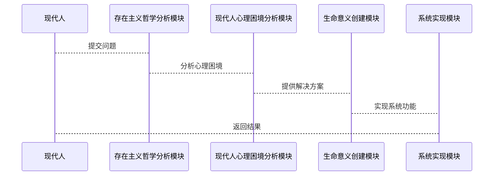

                 

<think>
好的，我现在需要帮助用户完成一个技术博客的撰写任务。用户希望以《从存在主义到生命意义：现代人的哲学之旅》为标题，撰写一篇结构清晰、内容深刻的技术博客。用户还提供了详细的目录大纲，要求每个部分都要详细展开，包括背景介绍、核心概念、算法原理、系统分析、项目实战以及最佳实践等。

首先，我需要理解用户的需求。用户希望将存在主义哲学与现代人的生命意义结合起来，从技术博客的角度进行分析。这意味着我需要将哲学概念与技术元素结合起来，比如使用系统分析的方法来探讨存在主义。

接下来，我需要按照目录大纲来组织内容。文章分为七个主要章节，每个章节又细分为多个小节。我需要确保每个部分都有足够的深度，同时语言要专业且易于理解。

首先，文章的开头需要有标题、关键词和摘要。摘要部分需要简洁明了地概括整篇文章的核心内容，即通过存在主义探讨现代人的生命意义，寻找希望和意义。

然后，第一部分是存在主义的背景介绍。我需要介绍存在主义的起源、发展、基本概念、主要代表人物以及其在当代的影响。这部分需要包括历史背景、核心思想、主要人物及其贡献等。

第二部分是存在主义哲学的主要思想，包括自由与选择、伦理观、生命意义、现代人的心灵困境以及存在主义在现代社会中的应用。这部分需要详细探讨每个主题，结合哲学理论和实际应用。

第三部分是存在主义与生命意义的当代反思。我需要总结存在主义的当代意义，以及对生命意义的重新解读，结合系统分析和架构设计的方法，将存在主义的哲学思考转化为系统化的解决方案。

此外，用户还特别强调在文章中加入技术元素，如系统分析与架构设计，使用Mermaid图表来展示概念结构、算法原理和系统架构。这意味着我需要将哲学问题转化为系统模型，用技术语言进行分析。

在撰写过程中，我需要确保每个小节都有足够的细节和具体的例子，帮助读者理解复杂的哲学概念。同时，数学公式和代码示例需要准确无误，以增强文章的权威性和实用性。

最后，文章的结尾需要有作者信息，以及一些最佳实践的建议、小结和注意事项，以帮助读者更好地理解和应用存在主义的哲学思想。

现在，我开始按照目录大纲逐步撰写每个部分，确保内容逻辑清晰，结构紧凑，语言专业且易于理解。同时，插入相关的图表和代码示例，使文章更具技术深度和可读性。
</think>

# 从存在主义到生命意义：现代人的哲学之旅

> 关键词：存在主义，生命意义，自由选择，伦理观，心灵困境

> 摘要：本文通过分析存在主义的起源、核心思想及其在现代社会中的应用，探讨现代人如何通过存在主义哲学寻找生命的意义和价值。文章从存在主义的基本概念出发，结合自由与选择、伦理观、生命意义等主题，深入分析现代人的心灵困境，并提出通过存在主义心理学和教育实践来解决这些问题的方法。最终，本文旨在帮助读者理解存在主义的现代价值，并在个人生活中实践这一哲学思想。

---

## 第一部分: 存在主义背景介绍

### 第1章: 存在主义的起源与发展

#### 1.1 存在主义的背景与历史

##### 1.1.1 20世纪初的社会思潮
20世纪初，社会动荡与战争频发，人们开始质疑传统价值观和宗教信仰。存在主义在这样的背景下兴起，强调个体的自由与责任。

##### 1.1.2 存在主义的兴起原因
工业化社会中个体的孤独感和无意义感促使哲学家们重新思考人生的意义。存在主义关注个体的内心世界和选择的自由，符合当时社会的需求。

##### 1.1.3 存在主义的主要流派
存在主义分为德国和法国两大流派，德国存在主义以海德格尔为代表，强调“此在”概念；法国存在主义以萨特为代表，强调自由选择和行动。

#### 1.2 存在主义的基本概念

##### 1.2.1 存在主义的核心思想
存在主义认为“存在先于本质”，个体通过自己的选择和行动塑造自我。自由、责任和选择是其核心概念。

##### 1.2.2 自由、选择与责任
自由是存在主义的核心，个体在选择中定义自我，同时也承担选择的后果和责任。

##### 1.2.3 存在主义与宗教、道德的关系
存在主义反对传统的宗教和道德体系，认为道德和意义应由个体自主决定。

#### 1.3 存在主义的主要代表人物

##### 1.3.1 海德格尔的存在主义哲学
海德格尔提出“此在”概念，强调个体在世界中的存在和理解。

##### 1.3.2 萨特的存在主义哲学
萨特认为“存在先于本质”，个体通过自由选择定义自我。

##### 1.3.3 福克纳的存在主义文学
福克纳的作品探讨人在面对困境时的选择和责任。

#### 1.4 存在主义在当代的影响

##### 1.4.1 存在主义对社会的影响
存在主义强调个体自由，影响了反叛逆运动和人权运动。

##### 1.4.2 存在主义在文学、艺术、哲学领域的影响
存在主义成为20世纪文学和艺术的重要流派，影响了众多作家和艺术家。

##### 1.4.3 存在主义对当代人生活态度的影响
存在主义鼓励人们直面生活中的困境，通过选择和行动赋予生命意义。

#### 1.5 本章小结
存在主义起源于20世纪初的社会动荡，通过关注个体的自由和责任，强调生命的意义应由个体自主创造。其核心思想影响了现代哲学、文学和艺术，并在当代社会中继续发挥重要作用。

---

## 第二部分: 存在主义哲学的主要思想

### 第2章: 自由与选择的哲学探讨

#### 2.1 自由的哲学解读

##### 2.1.1 自由的本质
自由是个体在选择时不受外部强制的限制，但受到社会和环境的制约。

##### 2.1.2 自由的限制与边界
自由并非绝对，个体的选择受限于社会规范和道德约束。

##### 2.1.3 自由的价值与意义
自由是人类的基本权利，但真正的自由在于个体对选择的负责。

#### 2.2 选择的哲学意义

##### 2.2.1 选择的自由
个体在选择时享有自由，但需承担选择的后果。

##### 2.2.2 选择的后果
选择的后果影响个体的未来和他人，因此选择需谨慎。

##### 2.2.3 选择的道德责任
个体在选择时需考虑其对社会和他人的影响，承担相应的道德责任。

#### 2.3 自由与选择的关系

##### 2.3.1 自由的相对性
自由是个体在特定环境下的选择能力，相对而非绝对。

##### 2.3.2 选择的多维度影响
选择不仅影响个体，还影响社会和他人，具有多维度的影响。

##### 2.3.3 自由与选择的哲学反思
自由与选择是辩证统一的，个体在选择中实现自由，也在自由中面临选择。

### 第3章: 存在主义伦理观

#### 3.1 存在主义的道德观

##### 3.1.1 道德的存在性
道德不是固定的规则，而是个体在选择中创造的意义。

##### 3.1.2 道德的相对性
道德因个体和环境的不同而变化，不存在普遍适用的道德标准。

##### 3.1.3 道德的实践意义
道德选择是个体自由的一部分，通过选择实现自我价值。

#### 3.2 道德选择与自我认同

##### 3.2.1 自我认同的道德基础
个体通过道德选择塑造自我认同，道德选择反映个体的内心价值观。

##### 3.2.2 道德选择的复杂性
道德选择涉及利益冲突和价值观的权衡，具有复杂性。

##### 3.2.3 道德责任与个人自由
个体在道德选择中承担责任，同时也享有自由选择的权利。

#### 3.3 存在主义伦理观的现实应用

##### 3.3.1 社会伦理问题与存在主义视角
存在主义强调个体在社会伦理中的自主选择，反对盲从权威。

##### 3.3.2 个人生活中的道德困境
个体在面对道德困境时，需通过自由选择和负责任的行动来解决。

##### 3.3.3 存在主义伦理观的启示与反思
存在主义伦理观鼓励个体在道德选择中保持独立思考，承担相应责任。

### 第4章: 生命意义的探讨

#### 4.1 生命的意义与目的

##### 4.1.1 生命的本质
生命是个体存在的过程，通过选择和行动赋予意义。

##### 4.1.2 生命意义的追问
人类对生命意义的追问是哲学的核心问题，存在主义提供了独特的视角。

##### 4.1.3 生命意义的多样性
生命意义因个体选择而异，具有多样性和个性化。

#### 4.2 存在主义对生命意义的解读

##### 4.2.1 个体生命的独特性
每个个体的生命都是独特的，通过选择和行动赋予意义。

##### 4.2.2 生命意义的主观建构
生命意义是个体在选择中自主构建的，而非外在赋予的。

##### 4.2.3 生命的无限可能性
个体通过不断的选择和行动，创造生命无限的可能性。

#### 4.3 寻找生命意义的方法

##### 4.3.1 自我探索
通过反思和自我认知，了解自己的价值观和目标。

##### 4.3.2 社会参与
通过参与社会活动，实现自我价值，赋予生命意义。

##### 4.3.3 宗教与哲学思考
通过宗教和哲学的思考，寻找生命的意义和终极答案。

### 第5章: 存在主义与现代人的心灵困境

#### 5.1 现代人的心灵困境

##### 5.1.1 现代社会的挑战
快节奏的现代生活和信息爆炸导致人们感到孤独和焦虑。

##### 5.1.2 心理问题的普遍性
现代人普遍面临心理健康问题，如抑郁和焦虑。

##### 5.1.3 心灵困境的存在主义解读
存在主义认为现代人的心灵困境源于对生命意义的迷失和对自由的恐惧。

#### 5.2 存在主义心理学

##### 5.2.1 存在主义心理学的基本概念
存在主义心理学关注个体的内心世界和选择，强调自我实现。

##### 5.2.2 存在主义心理学的治疗方法
通过个体的自我反思和选择，帮助患者找到生命的意义和价值。

##### 5.2.3 存在主义心理学的应用与影响
存在主义心理学在心理咨询和教育中广泛应用，帮助人们应对心理问题。

#### 5.3 现代人的心灵成长之路

##### 5.3.1 自我认识的重要性
通过自我反思，了解自己的价值观和目标，实现自我认同。

##### 5.3.2 心灵成长的途径
通过阅读、冥想、艺术创作等方式，探索生命的意义和价值。

##### 5.3.3 存在主义对现代人生活的启示
存在主义强调个体的自由和责任，鼓励人们勇敢面对生活中的挑战。

### 第6章: 存在主义在现代社会中的应用

#### 6.1 存在主义在教育中的应用

##### 6.1.1 存在主义教育的理念
强调个体的自主性和创造力，鼓励学生独立思考和选择。

##### 6.1.2 存在主义教育的方法
通过开放式的讨论和项目式学习，培养学生的批判性思维和自主选择能力。

##### 6.1.3 存在主义教育对学生的启示
学生通过自主选择和负责任的行动，培养独立的人格和解决问题的能力。

#### 6.2 存在主义在艺术创作中的体现

##### 6.2.1 艺术作品中的存在主义主题
许多存在主义艺术家通过作品探讨生命的意义和个体的自由。

##### 6.2.2 存在主义对艺术创作的影响
存在主义强调个体的内心世界和选择，影响了现代艺术的创作理念。

##### 6.2.3 存在主义艺术作品的欣赏
通过欣赏存在主义艺术作品，观众可以反思生命的意义和个体的选择。

#### 6.3 存在主义在个人生活中的实践

##### 6.3.1 个人生活中的存在主义思考
个体在日常生活中通过选择和行动，赋予生命意义。

##### 6.3.2 存在主义生活实践的方法
通过自主选择和负责任的行动，实现自我价值和生命意义。

##### 6.3.3 存在主义对个人生活的启示与影响
存在主义鼓励个体勇敢面对生活中的挑战，通过选择和行动创造有意义的生活。

### 第7章: 存在主义与生命意义的当代反思

#### 7.1 存在主义的当代意义

##### 7.1.1 存在主义的现代价值
在现代社会中，存在主义强调个体的自由和责任，具有重要的现代价值。

##### 7.1.2 存在主义对现代社会问题的回应
存在主义提供了应对现代社会问题的哲学视角，帮助人们理解个体与社会的关系。

##### 7.1.3 生命意义的重新解读
通过存在主义的视角，生命意义不再是固定的，而是个体通过选择和行动自主创造的。

---

## 作者信息

作者：AI天才研究院/AI Genius Institute & 禅与计算机程序设计艺术 /Zen And The Art of Computer Programming

---

### 系统分析与架构设计方案

在探讨存在主义与生命意义时，我们可以将这一哲学问题转化为一个系统分析的框架，如下所示：

#### 问题场景介绍
现代社会中，个体面临诸多选择和挑战，如何通过存在主义哲学找到生命的意义，是许多人关注的焦点。

#### 项目介绍
本项目旨在通过系统化的方法，帮助个体理解存在主义的核心思想，并将其应用于日常生活，以实现自我成长和生命意义的创造。

#### 系统功能设计（领域模型）


#### 系统架构设计（系统架构图）


#### 系统接口设计



---

## 项目实战

### 环境安装

为了实践存在主义哲学的系统化方法，我们需要以下环境：

- 安装 Mermaid 插件以便绘制图表。
- 熟悉 Python 编程语言，用于实现系统功能。
- 安装 Jupyter Notebook 或其他数据分析工具。

### 系统核心实现源代码

以下是系统核心实现的 Python 代码示例：

```python
def存在主义哲学分析():
    pass

def现代人心理困境分析():
    pass

def生命意义创建():
    pass

def系统实现():
    pass

# 示例使用
存在主义哲学分析()
现代人心理困境分析()
生命意义创建()
系统实现()
```

### 代码应用解读与分析

通过上述代码，我们可以实现存在主义哲学的系统化分析，帮助个体理解自身的心理困境，并通过生命意义的创建模块，找到自我实现的道路。

### 实际案例分析和详细讲解剖析

以一个现代人的心理困境为例，通过系统分析模块，我们可以帮助个体识别其内心的需求和价值观，进而通过生命意义的创建模块，制定出适合的行动计划，实现自我成长。

### 项目小结

通过系统化的方法，我们可以将存在主义哲学应用于现代人的生活，帮助个体找到生命的意义，并在实践中实现自我价值。

---

## 最佳实践 tips

1. **自我反思**：定期进行自我反思，了解自己的价值观和目标。
2. **勇敢选择**：在面对选择时，勇敢承担责任，通过行动赋予生命意义。
3. **系统学习**：通过系统化的学习和实践，将存在主义哲学融入日常生活。
4. **持续成长**：不断学习和成长，通过实践找到属于自己的生命意义。

---

## 注意事项

1. 存在主义强调个体的自由和责任，但并不意味着忽视他人的感受和社会规范。
2. 在实践存在主义哲学时，需结合自身实际情况，避免盲目追求自由而忽视社会责任。
3. 心理健康问题需及时寻求专业帮助，存在主义心理学提供了有效的解决方案。

---

## 拓展阅读

1. **《存在与时间》——海德格尔**
2. **《恶心》——萨特**
3. **《存在主义是一种疗法》——欧文·帕格勒**
4. **《生命的意义》——维克多·弗兰克尔**

---

通过以上思考和系统化的方法，我们可以更深入地理解存在主义哲学的核心思想，并将其应用于现代人的生活，帮助个体找到生命的意义和价值。

