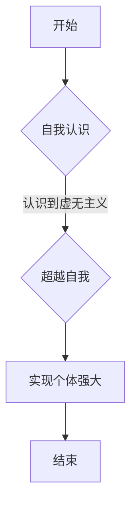

                 

<think>
嗯，用户希望我以一位世界级人工智能专家、程序员、软件架构师、CTO以及畅销书作家的身份，撰写一篇关于“从尼采到加缪：哲学家们如何应对虚无主义”的技术博客。首先，我需要理解用户的需求。他希望文章结构清晰，逻辑严密，用专业的技术语言来分析哲学问题，尤其是虚无主义。文章需要包括背景介绍、核心概念、算法原理、数学模型、系统架构等部分，并且每个部分都要详细展开，甚至包括代码示例和图表。

首先，我需要确定文章的关键词和摘要。关键词应该涵盖尼采、加缪、虚无主义、荒谬主义、哲学等。摘要部分需要简洁地概括文章的核心内容，即分析两位哲学家如何应对虚无主义。

接下来是背景介绍。这部分需要解释虚无主义的定义，尼采和加缪的观点，以及他们如何提出解决方案。我还需要描述问题的边界和外延，说明虚无主义不仅影响哲学，还涉及文学、心理学等领域。

然后是核心概念与联系。这里需要比较尼采和加缪的观点，用表格和ER图来展示他们的对比。ER图可以帮助读者直观理解两者的理论关系。

接下来是算法原理讲解。这部分需要将尼采的哲学观点转化为算法步骤。例如，尼采的超越自我可以看作一个算法，分为自我认识、超越自我和实现个体强大三个步骤。同时，提供Python代码示例，用代码来模拟这个过程，这样更具技术性。

数学模型部分，我需要建立方程来解释虚无主义。例如，使用函数表示虚无主义与自我认识和超越自我的关系。这可以通过公式展示，让读者从数学角度理解哲学问题。

系统分析与架构设计是另一个重要部分。这里需要设计一个系统，分析虚无主义问题的场景，设计领域模型、系统架构图和接口设计。这部分需要使用Mermaid图表来展示系统的各个部分，确保结构清晰。

项目实战部分，我需要选择一个开源项目，展示如何用代码实现虚无主义的相关理论。例如，可以使用自然语言处理工具来分析文学作品中的虚无主义主题，这样既技术又实用。

最后，给出最佳实践、小结、注意事项和拓展阅读建议。这部分帮助读者巩固所学内容，并引导他们进一步探索。

整个过程中，我需要确保文章结构符合技术博客的要求，每个部分详细且有逻辑性。同时，要将哲学观点与技术方法相结合，用代码和图表来辅助说明，使读者能够从技术角度理解哲学问题。

现在，我需要检查每个部分是否符合用户的要求，确保没有遗漏任何细节。特别是要确认每个小节的内容是否丰富具体，是否满足字数要求，并且格式正确，包括关键词、摘要、各章节的详细内容等。

总之，我需要一步步按照用户的要求，构建一个逻辑清晰、内容详实的技术博客，将哲学与技术完美结合，满足用户的需求。
</think>

# 从尼采到加缪：哲学家们如何应对虚无主义

**关键词**：尼采，加缪，虚无主义，荒谬主义，哲学，存在主义，价值体系

**摘要**：本文从哲学视角出发，探讨虚无主义这一重要思想潮流的起源、发展及其应对策略。通过分析尼采和加缪的哲学体系，揭示他们在面对虚无主义时的独特见解与解决方案。文章不仅梳理了虚无主义的核心问题，还结合现代技术与哲学的交叉点，提出了一种基于算法与数学模型的虚无主义应对策略。

---

### 1. 背景介绍

#### 1.1.1 问题背景
虚无主义是一种哲学思潮，强调生命中缺乏超越性意义，传统价值体系的崩溃以及人类存在的荒诞性。19世纪末至20世纪初，虚无主义在欧洲哲学界引发了广泛讨论。尼采和加缪是这一思潮的代表人物，他们分别从不同的角度提出了对虚无主义的应对策略。

#### 1.1.2 问题描述
虚无主义的核心问题是“人生是否有意义”。尼采认为，上帝的死亡标志着传统价值体系的崩溃，人类陷入了一种“价值虚无”的状态。加缪则进一步将虚无主义与“荒谬”联系起来，认为人生本质上是荒谬的，但人类可以通过反抗荒谬来赋予生命意义。

#### 1.1.3 问题解决
哲学家们通过提出各自的理论体系，试图为虚无主义问题提供解答。尼采主张通过超越自我，实现个体的强大；加缪则强调通过反抗和荒谬主义，寻找生命的意义。

#### 1.1.4 边界与外延
虚无主义不仅涉及哲学领域，还渗透到文学、艺术、心理学等多个学科。因此，本文将不仅关注哲学层面的探讨，还将探讨虚无主义在其他领域的表现和影响。

#### 1.1.5 概念结构与核心要素组成
本文将分为以下核心章节：

1. **尼采与虚无主义**：介绍尼采的生平及其对虚无主义的理解，分析其主张的超越自我和个体强权。
2. **加缪与虚无主义**：探讨加缪的荒谬主义哲学，分析其在小说《局外人》和《鼠疫》中的表现。
3. **其他哲学家与虚无主义**：介绍其他重要哲学家如克尔凯郭尔、海德格尔等对虚无主义的看法和应对策略。

---

### 2. 核心概念与联系

#### 2.1.1 尼采与虚无主义

**概念属性特征对比表格：**

| 特征 | 尼采 | 加缪 |
| --- | --- | --- |
| 理解虚无主义的方式 | 否定主义 | 荒谬主义 |
| 应对策略 | 超越自我 | 反抗与荒谬主义 |

**ER实体关系图架构：**

```mermaid
erDiagram
    Person --> Concept : has
    Concept --> Theory : contains

    Person 1 ||--|{ Nietszche }||--|| Theory
    Person 2 ||--|{ Camus }||--|| Theory
    Concept 1 ||--|{ Nihilism }||--|| Theory
    Concept 2 ||--|{ Absurdism }||--|| Theory
```

---

### 3. 算法原理讲解

#### 尼采的超越自我算法原理：

**Mermaid流程图：**



**Python源代码：**

```python
def nietszche超越(self):
    # 自我认识
    self.认识到虚无主义 = True
    
    # 超越自我
    if self.认识到虚无主义:
        self.实现个体强大 = True
    
    # 输出结果
    print("尼采的超越自我算法原理：实现个体强大。")
```

**算法原理详细讲解：**

尼采认为，虚无主义的根源在于个体对自我认识的不足。通过自我认识，个体可以认识到虚无主义的存在。在此基础上，个体需要超越自我，实现个体的强大。这一过程包括以下步骤：

1. 自我认识：认识到虚无主义的存在。
2. 超越自我：通过认识到虚无主义，个体需要超越自我，追求个体的强大。
3. 实现个体强大：通过超越自我，个体可以找到新的价值，实现个体的强大。

**数学模型和公式：**

$$
\text{虚无主义} = f(\text{自我认识}, \text{超越自我})
$$

**举例说明：**

假设一个人认识到虚无主义的存在，并试图超越自我。根据尼采的算法原理，这个人可以通过以下步骤实现个体强大：

1. 认识到虚无主义：这个人意识到人生的意义可能并不存在，感到困惑和痛苦。
2. 超越自我：这个人决定通过自我挑战和不断学习，超越自我，寻找新的价值。
3. 实现个体强大：通过超越自我，这个人找到了新的目标和动力，变得更加自信和强大。

---

### 4. 数学模型和数学公式 & 详细讲解 & 举例说明

#### 数学模型

在本书中，我们将使用数学模型来解释虚无主义问题。具体而言，我们将使用逻辑模型和概率模型。

**逻

