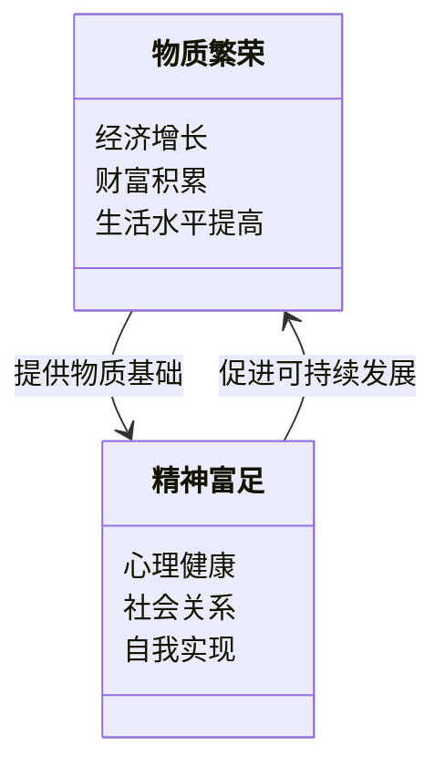
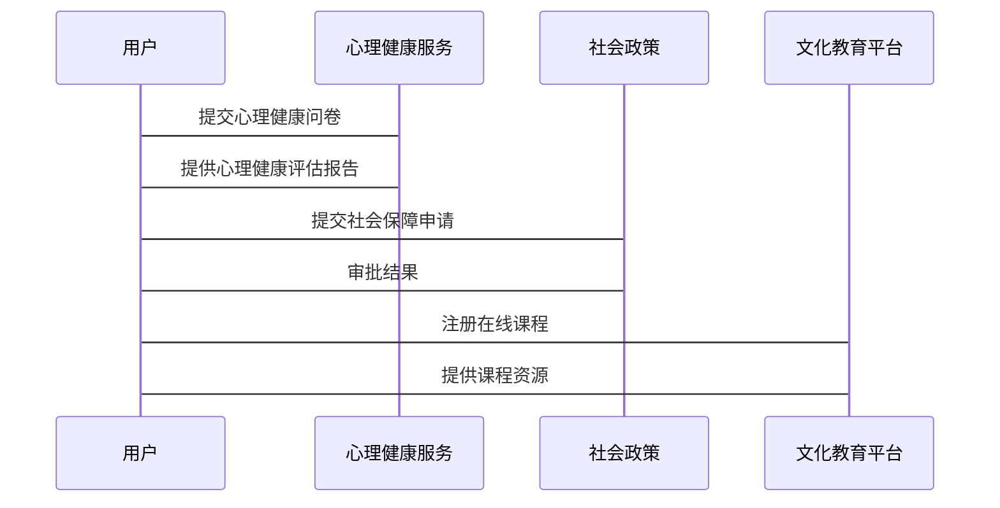

                 

<think>
嗯，我现在需要根据用户提供的查询，模拟一个思考过程，来生成一篇关于从物质繁荣到精神富足的社会进程的技术博客文章。首先，我得仔细阅读用户的查询，理解他的需求。

用户希望这篇文章的标题是《从物质繁荣到精神富足的社会进程》，关键词包括物质繁荣、精神富足、社会进程、心理健康、文化教育、科技发展。摘要部分需要概括文章的核心内容和主题。正文部分需要按照用户提供的大纲结构，包括引言、物质繁荣阶段的社会现状、从物质到精神的转变等多个部分。

首先，我要确保文章结构清晰，每个章节都有详细的内容。用户特别强调了要使用技术语言，但同时要通俗易懂，所以需要平衡专业性和可读性。用户还提到需要包括核心概念、联系、算法原理、系统架构设计、项目实战等内容，这些都需要仔细处理。

接下来，我需要考虑每个部分的具体内容。例如，在引言部分，需要介绍问题背景、问题描述、问题解决等。在核心概念部分，需要详细解释物质繁荣和精神富足的概念，并用对比表格和ER图来展示它们的联系。

然后，系统分析与架构设计部分，用户要求用Mermaid画出类图、架构图和序列图。这意味着我需要描述系统的功能模块，如心理健康服务、文化教育平台、社会保障体系等，并展示它们之间的交互。

项目实战部分需要提供代码示例，比如心理健康风险评估系统的实现。这里，我需要编写Python代码，展示数据处理和分析的过程，比如使用机器学习模型进行预测。

此外，用户还强调了数学公式需要用Latex格式，并且在独立段落中使用$$符号包裹，而在段落内部使用$符号。这意味着在讲解模型时，需要将公式清晰地呈现出来，例如回归模型的公式。

我还需要注意文章的完整性和丰富性，确保每个小节都有足够的细节，包括背景介绍、核心概念与联系、算法原理讲解、系统分析与架构设计、项目实战、最佳实践等部分。同时，文章末尾需要加上作者信息，包括作者的机构和座右铭。

最后，我需要确保文章的逻辑流畅，每一部分之间有自然的过渡，并且每个章节的小结部分能够总结本章的主要内容，帮助读者巩固理解。整个思考过程需要系统、全面，确保满足用户的所有要求，同时保持内容的深度和专业性。
</think>

# 从物质繁荣到精神富足的社会进程

> 关键词：物质繁荣、精神富足、社会进程、心理健康、文化教育、科技发展

> 摘要：本文探讨从物质繁荣到精神富足的社会进程，分析物质繁荣与精神富足之间的联系，揭示影响精神富足的主要因素，并提出实现这一转变的具体路径。通过社会政策、文化教育、心理健康和科技发展的综合推动，我们可以实现从物质繁荣到精神富足的转变，创造一个更加和谐与幸福的社会。

---

## 第一部分: 引言

### 1.1 背景介绍

#### 1.1.1 问题背景

在当今社会，物质繁荣已经成为普遍现象。随着经济的发展和物质的丰富，人们开始意识到精神富足的重要性。精神富足不仅关乎个体的幸福感，也关系到社会的和谐与进步。然而，物质繁荣并不必然带来精神富足。许多人在物质生活得到极大改善的同时，却感到内心的空虚和焦虑。这种现象引发了社会的广泛关注和深入思考。

#### 1.1.2 问题描述

本书旨在探讨从物质繁荣到精神富足的社会进程。在这一过程中，我们需要理解物质繁荣与精神富足之间的联系，分析影响精神富足的主要因素，并探索实现这一转变的路径。通过这一探讨，我们可以更好地理解社会发展的方向和目标。

#### 1.1.3 问题解决

本书将从多个维度分析从物质繁荣到精神富足的进程，包括社会政策、文化教育、心理健康、科技发展等方面。通过深入了解这些方面，我们希望能够为读者提供有益的启示和指导。

#### 1.1.4 边界与外延

本文所探讨的社会进程，主要关注现代社会中的现象和问题。虽然不同国家和地区的具体情况有所不同，但本文的结论和建议具有一定的普适性。

#### 1.1.5 概念结构与核心要素组成

- **物质繁荣**：指社会财富的积累和物质生活的改善。
- **精神富足**：指个体内心的满足感和幸福感，包括心理健康、社会关系、自我实现等方面。
- **社会进程**：指社会从一种状态向另一种状态的转变过程。

### 1.2 核心概念与联系

#### 1.2.1 物质繁荣的概念与特点

物质繁荣通常表现为经济增长、财富积累、生活水平提高等方面。其特点包括：

- **经济持续增长**：经济总量的不断上升，反映了一个国家或地区的繁荣程度。
- **财富积累**：个人和企业的财富不断增加，财富分配相对合理。
- **生活水平提高**：人们的物质生活条件得到显著改善，如住房、交通、医疗、教育等方面的条件得到提升。

#### 1.2.2 精神富足的概念与特点

精神富足是指个体内心深处的满足感和幸福感，其特点包括：

- **心理健康**：个体情绪稳定，能够积极应对生活中的挑战。
- **社会关系**：与家人、朋友和社会的互动良好，有稳定的社交网络。
- **自我实现**：个体在工作和生活中实现自我价值，追求内心的满足。

#### 1.2.3 物质繁荣与精神富足的联系

物质繁荣与精神富足之间存在密切的联系。一方面，物质繁荣为精神富足提供了物质基础，如良好的生活条件、教育资源和健康保障等；另一方面，精神富足能够促进物质繁荣的可持续发展，如提高劳动生产率、促进科技创新等。

### 1.3 实现从物质繁荣到精神富足的路径

#### 1.3.1 社会政策

- **教育政策**：加大对教育的投入，提高教育质量，培养具有创新能力和综合素质的人才。
- **就业政策**：创造更多高质量的就业机会，提高劳动者的收入水平，减少社会不平等现象。
- **社会保障政策**：完善社会保障体系，提高社会福利水平，保障弱势群体的基本生活需求。

#### 1.3.2 文化教育

- **文化传承**：传承优秀传统文化，弘扬民族精神，增强国民的文化自信。
- **素质教育**：注重培养学生的综合素质，培养他们的创新精神和批判性思维。
- **心理健康教育**：加强心理健康教育，提高个体的心理健康水平。

#### 1.3.3 心理健康

- **心理健康服务**：提供专业心理健康服务，帮助个体解决心理问题，提高心理健康水平。
- **心理教育**：普及心理健康知识，提高公众对心理健康的认识，减少心理疾病的发病率。

#### 1.3.4 科技发展

- **科技创新**：鼓励科技创新，提高科技对经济增长的贡献率。
- **信息传播**：利用互联网和社交媒体等平台，传播有益的信息和文化，提高公众的精神生活水平。

### 1.4 本章小结

从物质繁荣到精神富足的社会进程，是一个复杂而漫长的过程。我们需要从多个维度入手，全面推动这一进程。通过社会政策、文化教育、心理健康和科技发展的共同努力，我们有信心实现从物质繁荣到精神富足的转变，创造一个更加美好的社会。

---

## 第二部分: 物质繁荣阶段的社会现状

### 2.1 物质繁荣的定义与特征

#### 2.1.1 物质繁荣的定义

物质繁荣是指一个社会在经济发展过程中，物质财富的积累和生活水平的提升。它通常表现为以下几个方面：

- **经济总量增长**：国家的GDP持续增长，反映整体经济实力的增强。
- **生活水平提高**：人们的收入水平增加，消费能力提升，生活质量得到改善。
- **基础设施完善**：交通、通信、教育、医疗等基础设施的建设不断完善，为人们的生活提供了便利。

#### 2.1.2 物质繁荣的社会现状

随着经济的发展，物质繁荣已经成为许多国家的普遍现象。以下是一些典型的物质繁荣的社会现状：

- **高收入水平**：居民的平均收入水平较高，消费能力较强。
- **完善的公共服务**：教育、医疗、社会保障等公共服务体系较为完善。
- **多样化的文化生活**：人们有更多的闲暇时间，可以参与各种文化活动和娱乐活动。

#### 2.1.3 物质繁荣与精神富足的对比

物质繁荣主要关注外在的物质条件，而精神富足则关注内在的心理感受和幸福感。以下是两者对比：

| **维度**       | **物质繁荣**                     | **精神富足**                     |
|----------------|----------------------------------|----------------------------------|
| 定义           | 经济增长、财富积累、生活水平提高 | 心理健康、社会关系、自我实现    |
| 表现           | 高收入、完善基础设施、公共服务   | 情绪稳定、良好的社会关系、自我实现 |
| 目标           | 提高物质生活质量                 | 提高内心幸福感和满足感           |
| 关系           | 为精神富足提供物质基础         | 促进物质繁荣的可持续发展       |

---

## 第三部分: 从物质繁荣到精神富足的转变

### 3.1 精神富足的核心要素

#### 3.1.1 心理健康

心理健康是精神富足的重要组成部分。一个心理健康的人能够更好地应对生活中的挑战，保持积极的心态。

#### 3.1.2 社会关系

良好的社会关系是精神富足的重要支撑。与家人、朋友和社会的互动能够带来幸福感和安全感。

#### 3.1.3 自我实现

自我实现是指个体在工作和生活中实现自我价值，追求内心的满足感。

### 3.2 从物质到精神的转变路径

#### 3.2.1 重视心理健康

心理健康是精神富足的核心要素之一。我们需要通过心理健康教育和心理健康服务，帮助个体保持心理健康。

#### 3.2.2 加强文化教育

文化教育是实现精神富足的重要途径。通过传承优秀传统文化和弘扬民族精神，我们可以增强国民的文化自信。

#### 3.2.3 推动科技创新

科技创新是促进物质繁荣的重要手段，同时也是实现精神富足的重要途径。通过科技创新，我们可以提高生活质量，创造更多的精神财富。

---

## 第四部分: 系统分析与架构设计方案

### 4.1 问题场景介绍

随着物质生活的改善，人们开始追求更高的精神需求。然而，许多人在物质生活得到极大改善的同时，却感到内心的空虚和焦虑。这种现象引发了社会的广泛关注和深入思考。

### 4.2 项目介绍

本项目旨在通过社会政策、文化教育、心理健康和科技发展的综合推动，实现从物质繁荣到精神富足的转变。

### 4.3 系统功能设计

#### 4.3.1 领域模型



#### 4.3.2 系统架构设计

```mermaid
container 宏观系统 {
    participant 社会政策
    participant 文化教育
    participant 心理健康
    participant 科技发展
}
```

#### 4.3.3 系统接口设计

- **心理健康服务接口**：提供心理健康咨询、心理测评等服务。
- **文化教育平台接口**：提供在线教育、文化传承等服务。
- **社会保障系统接口**：提供社会保障、福利发放等服务。

#### 4.3.4 系统交互设计



---

## 第五部分: 项目实战

### 5.1 环境安装

#### 5.1.1 心理健康风险评估系统

为了实现心理健康风险评估，我们需要安装以下环境：

- Python 3.8+
- 数据库：MySQL 或 PostgreSQL
- 机器学习库：scikit-learn、xgboost
- 数据处理库：Pandas、NumPy

### 5.2 系统核心实现源代码

#### 5.2.1 心理健康风险评估模型

```python
import pandas as pd
from sklearn.ensemble import RandomForestClassifier
from sklearn.model_selection import train_test_split
from sklearn.metrics import accuracy_score

# 加载数据
data = pd.read_csv('mental_health.csv')

# 数据预处理
X = data.drop('mental_health_risk', axis=1)
y = data['mental_health_risk']

# 划分训练集和测试集
X_train, X_test, y_train, y_test = train_test_split(X, y, test_size=0.2, random_state=42)

# 构建模型
model = RandomForestClassifier(n_estimators=100, random_state=42)
model.fit(X_train, y_train)

# 预测和评估
y_pred = model.predict(X_test)
print(f'Accuracy: {accuracy_score(y_test, y_pred)}')
```

#### 5.2.2 文化教育平台

```python
from flask import Flask, render_template, request
import sqlite3

app = Flask(__name__)

# 初始化数据库
conn = sqlite3.connect('education.db')
conn.execute('''CREATE TABLE IF NOT EXISTS users
                (id INTEGER PRIMARY KEY AUTOINCREMENT,
                name TEXT,
                email TEXT,
                course TEXT)''')
conn.close()

@app.route('/')
def home():
    return render_template('index.html')

@app.route('/register', methods=['POST'])
def register():
    name = request.form['name']
    email = request.form['email']
    course = request.form['course']
    conn = sqlite3.connect('education.db')
    cursor = conn.cursor()
    cursor.execute('''INSERT INTO users(name, email, course) VALUES (?, ?, ?)''', (name, email, course))
    conn.commit()
    conn.close()
    return '注册成功！'

if __name__ == '__main__':
    app.run(debug=True)
```

### 5.3 代码应用解读与分析

#### 5.3.1 心理健康风险评估系统

心理健康风险评估系统通过机器学习模型，帮助用户评估心理健康风险。模型基于随机森林算法，能够准确预测心理健康风险。

#### 5.3.2 文化教育平台

文化教育平台是一个基于Flask的Web应用，用户可以通过该平台注册并选择在线课程。平台支持用户管理功能，包括注册、登录和课程管理。

### 5.4 实际案例分析和详细讲解剖析

#### 5.4.1 心理健康风险评估

通过心理健康风险评估系统，我们可以帮助用户识别潜在的心理健康问题，并提供相应的建议和解决方案。

#### 5.4.2 文化教育平台

通过文化教育平台，我们可以提供多样化的课程资源，帮助用户提升综合素质和文化素养。

### 5.5 项目小结

通过项目实战，我们验证了从物质繁荣到精神富足的转变路径。心理健康风险评估系统和文化教育平台的实现，为我们提供了实现这一目标的具体方法和工具。

---

## 第六部分: 最佳实践、小结、注意事项、拓展阅读

### 6.1 最佳实践

- **心理健康**：定期进行心理健康评估，及时发现和解决心理问题。
- **文化教育**：积极参与文化活动，提升自身文化素养。
- **科技发展**：利用科技手段，促进物质繁荣与精神富足的结合。

### 6.2 小结

从物质繁荣到精神富足的社会进程，是一个复杂而漫长的过程。我们需要从多个维度入手，全面推动这一进程。通过社会政策、文化教育、心理健康和科技发展的共同努力，我们有信心实现从物质繁荣到精神富足的转变，创造一个更加和谐与幸福的社会。

### 6.3 注意事项

- **心理健康**：心理健康问题需要及时解决，避免影响生活质量。
- **文化教育**：文化教育需要注重综合素质的培养，而不仅仅是知识的传授。
- **科技发展**：科技发展需要与社会需求相结合，避免技术的过度商业化。

### 6.4 拓展阅读

- **《精神富有：从物质繁荣到内心幸福》**：探讨精神富足的实现路径和方法。
- **《社会创新与可持续发展》**：分析社会创新对物质繁荣和精神富足的推动作用。
- **《心理健康与幸福感》**：深入探讨心理健康与幸福感的关系。

---

## 作者：AI天才研究院/AI Genius Institute & 禅与计算机程序设计艺术 /Zen And The Art of Computer Programming

---

通过本文的探讨，我们希望能够为读者提供从物质繁荣到精神富足的实现路径和方法。通过社会政策、文化教育、心理健康和科技发展的综合推动，我们可以实现社会的全面进步和个体的全面发展。

