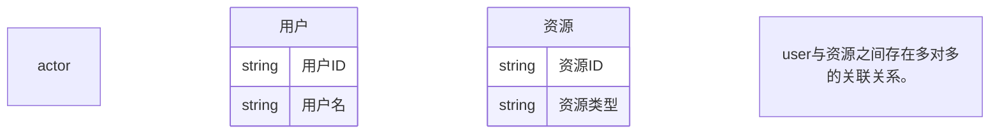

                 

<think>
嗯，我现在需要根据用户的要求，写一篇关于“从线性思维到网状思维：价值观的革新”的技术博客。首先，我得理解用户的需求，看看他到底想要什么。

用户给了一个非常详细的目录大纲，还要求文章结构严谨，用专业且易懂的技术语言，还要有逻辑分析和具体例子。字数要求在10000到12000字，看来得写得比较全面。

首先，文章的标题和关键词已经确定，摘要也写好了。接下来，按照目录来逐步展开每个部分。

第一部分是引言，里面包括问题背景、问题描述、问题解决、边界与外延，还有概念结构。这部分需要先介绍人类思维方式的演变，说明线性思维的局限性，然后引出网状思维的优势。

第二部分是核心概念，需要定义网状思维，对比线性思维和其他思维方式，还要用ER图来展示实体关系。这部分可能需要画一些图表，可能用Mermaid语法来表示。

第三部分讲转变过程，包括线性思维的局限，如何转向网状思维，以及培养网状思维的方法和案例分析。

第四部分是应用与实践，分别在个人发展、组织管理、教育和社会科学中应用，给出具体的例子。

第五部分讨论挑战和未来，包括技术、心理、社会等挑战，以及未来的发展趋势。

第六部分是结论，总结网状思维的价值和未来展望。

现在，我得开始写每个部分。第一部分引言，我需要详细阐述问题背景，说明人类思维的演变，从线性到网状，为什么需要转变，网状思维的优势在哪里。

接下来，核心概念部分，需要明确定义，对比表格，还有ER图。这部分可能需要一些图表，可能用Mermaid来画。

然后，转变过程部分，要具体讲怎么从线性转向网状，举例子说明，比如个人和组织如何改变。

应用部分，要详细说明在不同领域中的具体应用，比如教育如何创新，组织如何协作。

最后，挑战和未来部分，讨论技术、心理、社会等方面的问题，以及未来的可能性。

我可能需要确保每个部分都有足够的细节，比如在转变过程中，给出具体的学习方法和案例。在应用部分，举一些实际的案例，让读者更容易理解。

另外，用户还提到格式要求，文章用markdown写，最后要加上作者信息。数学公式要用latex，系统分析部分可能需要画类图、架构图等，不过可能在当前的回答中暂时不涉及这些，因为用户可能更关注思维的转变。

总之，我需要按照目录大纲，逐步展开每个部分，确保内容详实，例子具体，结构清晰。现在，我开始按照这个思路写文章。
</think>

# 从线性思维到网状思维：价值观的革新

> 关键词：线性思维，网状思维，思维方式，价值观革新，复杂系统，网状结构

> 摘要：本文探讨了人类思维方式从线性思维向网状思维的转变，分析了网状思维的核心概念、优势、应用及其对个人发展、组织变革和社会进步的影响。通过对比分析和实际案例，揭示网状思维在应对复杂问题中的独特价值，并展望其未来发展趋势。

---

## 第一部分：引言

### 1.1 问题背景

#### 1.1.1 人类思维方式的演变  
人类的思维方式经历了从简单到复杂、从单一到多元的演变。早期的线性思维强调逻辑和顺序，适用于简单的因果关系分析。然而，随着社会的复杂化和信息的爆炸式增长，线性思维的局限性逐渐显现。

#### 1.1.2 线性思维的局限性  
线性思维倾向于将问题分解为单一的、线性的因果关系，难以应对复杂系统的非线性特征。例如，在解决社会问题时，线性思维可能导致“头痛医头，脚痛医脚”的片面解决方案。

#### 1.1.3 网状思维的概念与优势  
网状思维是一种以网络结构为基础的思维方式，强调系统性、关联性和整体性。它通过多维度的连接和互动，能够更好地理解和解决复杂问题。

### 1.2 问题描述

#### 1.2.1 当代社会面临的思维困境  
现代社会面临的问题往往是多维度、相互关联的，如气候变化、经济全球化等。线性思维难以应对这些复杂问题，而网状思维则提供了一种新的解决方案。

#### 1.2.2 网状思维与个体发展  
个体在面对职业发展、知识学习等问题时，网状思维能够帮助其建立更广泛的知识网络和人际关系。

#### 1.2.3 网状思维与组织变革  
组织在应对市场竞争和内部协作时，网状思维能够促进跨部门协作和创新，提升组织的灵活性和适应性。

### 1.3 问题解决

#### 1.3.1 如何从线性思维转向网状思维  
转变的关键在于培养系统的思考方式，注重关联性分析，并通过实践不断强化网状思维的习惯。

#### 1.3.2 网状思维的价值与应用  
网状思维能够帮助个人和组织更好地应对复杂问题，提升创新能力和决策效率。

### 1.4 边界与外延

#### 1.4.1 网状思维的具体表现形式  
网状思维可以通过知识网络、社交网络等方式表现出来，强调网络结构中的节点和连接。

#### 1.4.2 网状思维与其他思维方式的关系  
网状思维与发散思维、批判思维等其他思维方式并非完全对立，而是相互补充，形成更全面的思考框架。

### 1.5 概念结构与核心要素组成

#### 1.5.1 网状思维的核心概念  
网状思维的核心在于“网络结构”，强调系统性、关联性和动态性。

#### 1.5.2 网状思维的要素组成  
网状思维由节点（个体、知识、资源等）和连接（关系、互动、协作等）两部分组成。

---

## 第二部分：网状思维的核心概念与原理

### 2.1 网状思维的定义与特点

#### 2.1.1 网状思维的概念  
网状思维是一种以网络结构为基础的思维方式，强调多维度的关联性和系统性。

#### 2.1.2 网状思维的特点  
- **系统性**：关注整体而非局部。
- **关联性**：强调各要素之间的互动。
- **动态性**：网络结构具有动态变化的特征。

### 2.2 网状思维的属性特征对比表格

| 特性         | 线性思维       | 网状思维       |
|--------------|----------------|----------------|
| 思维方式     | 单维、顺序     | 多维、网状       |
| 关联性       | 弱            | 强              |
| 复杂性处理   | 差            | 好              |

### 2.3 网状思维的ER实体关系图架构

### 2.4 网状思维的理论基础

#### 2.4.1 复杂系统理论  
复杂系统理论认为，系统的行为并非简单各部分之和，而是整体表现出的非线性特征。

#### 2.4.2 联结主义理论  
联结主义理论强调通过神经网络的连接和学习来模拟人类认知过程。

#### 2.4.3 网络科学理论  
网络科学理论研究网络结构及其属性，如节点度、中心性等。

---

## 第三部分：从线性思维到网状思维的转变

### 3.1 线性思维到网状思维的过程

#### 3.1.1 线性思维的局限  
线性思维难以应对复杂系统的动态性和不确定性，容易导致片面的解决方案。

#### 3.1.2 转变的动力与路径  
转变的动力来自对复杂问题的应对需求，路径包括学习、实践和反思。

### 3.2 培养网状思维的方法

#### 3.2.1 学习与实践  
通过学习网络科学、系统理论等知识，并在实践中不断应用。

#### 3.2.2 创造与反思  
鼓励创新思维，定期反思现有思维方式的局限性。

#### 3.2.3 案例分析  
通过分析复杂问题的案例，理解网状思维的应用价值。

### 3.3 网状思维的案例分析

#### 3.3.1 个人案例分析  
例如，一个程序员通过建立知识网络，将不同领域的知识联系起来，提升解决问题的能力。

#### 3.3.2 组织案例分析  
例如，一家企业通过构建跨部门协作网络，提升创新能力和应对市场变化的灵活性。

---

## 第四部分：网状思维的应用与实践

### 4.1 网状思维在个人发展中的应用

#### 4.1.1 自我认知  
通过分析个人的知识网络和能力结构，提升自我认知。

#### 4.1.2 人际关系  
建立广泛的人际网络，促进资源共享和协作。

#### 4.1.3 创新思维  
通过多维度的关联性思考，激发创新灵感。

### 4.2 网状思维在组织管理中的应用

#### 4.2.1 战略规划  
通过分析组织内外部的关联性，制定更具前瞻性的战略。

#### 4.2.2 团队协作  
构建跨部门协作网络，促进知识共享和创新。

#### 4.2.3 风险管理  
通过网络结构分析潜在风险，制定应对策略。

### 4.3 网状思维在教育领域中的应用

#### 4.3.1 教学方法  
采用项目式学习，鼓励学生建立知识网络。

#### 4.3.2 教育创新  
通过网络化的课程设计，促进学生跨学科能力的培养。

#### 4.3.3 学生思维培养  
通过案例分析和项目实践，培养学生的网状思维方式。

### 4.4 网状思维在社会科学研究中的应用

#### 4.4.1 社会网络分析  
通过分析社会网络结构，理解社会现象。

#### 4.4.2 复杂社会问题研究  
将复杂社会问题视为网络系统，寻找系统的解决方案。

#### 4.4.3 政策制定  
通过网络分析，制定更具针对性的政策。

---

## 第五部分：网状思维的挑战与未来

### 5.1 网状思维的挑战

#### 5.1.1 技术挑战  
需要依赖先进的技术手段（如大数据、人工智能）来支持网状思维的实践。

#### 5.1.2 心理挑战  
个体需要克服惯性思维，适应新的思维方式。

#### 5.1.3 社会挑战  
社会文化对网状思维的接受度和适应性存在差异。

### 5.2 网状思维的未来发展

#### 5.2.1 技术发展趋势  
随着大数据和人工智能的发展，网状思维的应用将更加广泛。

#### 5.2.2 社会发展趋势  
社会对复杂问题的关注增加，网状思维的需求将上升。

#### 5.2.3 未来思维方式的演变  
网状思维将成为主流思维方式，推动人类认知方式的革新。

### 5.3 网状思维的伦理与责任

#### 5.3.1 伦理问题  
需要关注数据隐私和网络信息的伦理问题。

#### 5.3.2 责任意识  
个体和组织需要承担起维护网络结构的责任。

#### 5.3.3 社会责任  
网状思维的应用需要符合社会价值观和伦理规范。

---

## 第六部分：结论

### 6.1 网状思维的价值

#### 6.1.1 对个人发展的价值  
网状思维能够提升个人的综合能力和创新潜力。

#### 6.1.2 对组织变革的价值  
网状思维能够促进组织的灵活性和创新能力。

#### 6.1.3 对社会进步的价值  
网状思维能够为解决复杂社会问题提供新的思路。

### 6.2 总结与展望

总结全文，网状思维作为一种新兴的思维方式，将在未来的个人发展、组织变革和社会进步中发挥重要作用。展望未来，随着技术的发展和社会的需求，网状思维的应用将更加广泛和深入。

---

作者：AI天才研究院/AI Genius Institute & 禅与计算机程序设计艺术/Zen And The Art of Computer Programming

