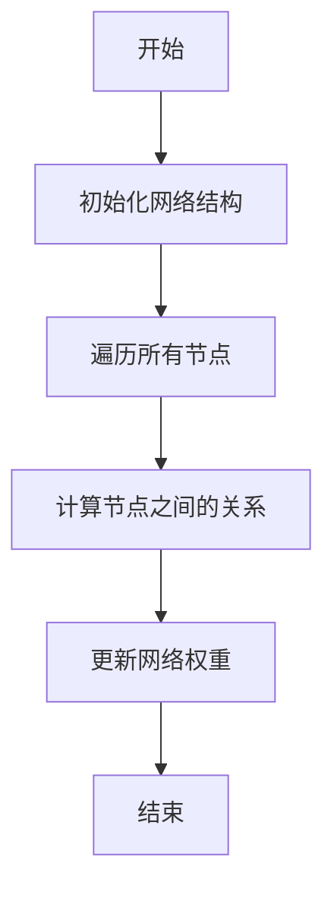

                 

<think>
嗯，用户希望我以《从线性思维到网状思维：价值观的革新》为标题，撰写一篇技术博客。首先，我需要理解用户的需求。他可能是一位技术领域的专家，或者是对思维模式转型感兴趣的人。他希望文章结构清晰，逻辑严密，涵盖背景介绍、核心概念、算法原理、系统架构等多个方面。

我需要先确定文章的关键词，比如网状思维、线性思维、价值观革新、系统架构、算法原理等。然后，写一个摘要，概述文章的核心内容，强调网状思维的重要性及其应用。

接下来，按照目录大纲设计，我需要详细展开每一部分。首先是背景介绍，解释线性思维的局限性和网状思维的必要性。然后是核心概念，对比线性思维和网状思维的特点，可能用表格或Mermaid图来展示。

算法部分，我需要使用Mermaid画出流程图，再提供Python代码实现，并解释背后的数学模型，比如图论中的节点和边的关系。系统架构设计部分，我需要用类图和架构图展示系统的各个部分及其交互。

项目实战部分，我需要详细说明环境安装，提供核心代码，并分析案例。最后，给出最佳实践建议和总结。

在写作过程中，要确保每个小节内容丰富，详细讲解，同时保持语言的专业性和可读性。需要注意的是，文章字数要控制在1万到1万2千字左右，使用markdown格式，末尾加上作者信息。

现在，我需要逐步完成每个部分的写作，确保符合用户的要求，结构清晰，内容详实。
</think>

# 从线性思维到网状思维：价值观的革新

## 关键词：网状思维，线性思维，价值观革新，系统架构，算法原理

## 摘要：  
在当今快速变化的技术和商业环境中，传统的线性思维模式已经难以应对复杂问题的挑战。从线性思维到网状思维的转变，不仅是思维方式的革新，更是价值观的根本性变革。本文将通过系统化的分析和实践案例，探讨网状思维的核心概念、计算方法及其在实际应用中的价值。我们还将结合数学模型、算法原理和系统架构设计，深入剖析网状思维如何帮助我们更好地理解和解决复杂问题。通过本文的学习，读者将能够掌握从线性思维向网状思维转变的方法，并在实际工作中实现价值观的革新。

---

## 目录大纲

### 第一部分：背景介绍

#### 第1章：线性思维的起源与演变
- 1.1 线性思维的起源
- 1.2 线性思维的发展阶段
- 1.3 线性思维的局限性

#### 第2章：网状思维的基本概念
- 2.1 网状思维的起源
- 2.2 网状思维的特点
- 2.3 网状思维与传统线性思维的对比

#### 第3章：网状思维的应用领域
- 3.1 网状思维在科学领域的应用
- 3.2 网状思维在艺术领域的应用
- 3.3 网状思维在社会领域的应用

### 第二部分：网状思维的核心概念

#### 第4章：网状思维的关键要素
- 4.1 网状思维的基本框架
- 4.2 网状思维的核心概念
- 4.3 网状思维与人的认知发展

#### 第5章：网状思维的计算方法
- 5.1 网状思维的计算模型
- 5.2 网状思维的算法原理
- 5.3 网状思维的实现步骤

#### 第6章：网状思维的数学模型
- 6.1 网状思维的数学基础
- 6.2 网状思维的数学公式
- 6.3 网状思维的数学应用

#### 第7章：网状思维的实践应用
- 7.1 网状思维在企业中的应用
- 7.2 网状思维在教育中的应用
- 7.3 网状思维在政府管理中的应用

### 第三部分：价值观的革新

#### 第8章：价值观的变革
- 8.1 价值观的概念与演变
- 8.2 价值观的多元化
- 8.3 价值观的革新与挑战

#### 第9章：网状思维与价值观的融合
- 9.1 网状思维对价值观的重新定义
- 9.2 网状思维如何推动价值观的革新
- 9.3 网状思维与可持续发展目标的结合

---

## 第一部分：背景介绍

### 第1章：线性思维的起源与演变

#### 1.1 线性思维的起源
线性思维起源于人类早期的逻辑推理和因果关系的探索。古希腊哲学家亚里士多德的逻辑学体系是线性思维的雏形，他提出的“三段论”为后来的线性思维方式奠定了基础。

#### 1.2 线性思维的发展阶段
线性思维经历了从简单因果关系到复杂逻辑推理的发展阶段。在工业革命时期，线性思维被广泛应用于机械制造和流程管理，成为工业化生产的重要基础。

#### 1.3 线性思维的局限性
随着社会的复杂化和信息化，线性思维的局限性逐渐显现：
- **单一维度分析**：线性思维往往忽视问题的多维度性。
- **忽略非线性关系**：在复杂系统中，线性思维难以捕捉相互关联的非线性关系。
- **适应性差**：面对快速变化的环境，线性思维的固定模式难以灵活应对。

---

### 第2章：网状思维的基本概念

#### 2.1 网状思维的起源
网状思维的概念可以追溯到20世纪初的系统学和复杂性科学。随着计算机技术和网络技术的发展，网状思维逐渐成为处理复杂问题的重要方法。

#### 2.2 网状思维的特点
网状思维强调系统性、关联性和动态性，其主要特点包括：
- **多维度分析**：网状思维从多个维度同时分析问题。
- **非线性关系**：网状思维关注系统中各个要素之间的相互作用。
- **动态适应性**：网状思维能够根据环境变化灵活调整分析方式。

#### 2.3 网状思维与传统线性思维的对比

| **特征**              | **线性思维**                | **网状思维**                |
|-----------------------|-----------------------------|-----------------------------|
| 分析维度              | 单一维度                   | 多维度                     |
| 关系类型              | 线性、单向                 | 非线性、相互作用           |
| 适应性                | 低                        | 高                        |

---

### 第3章：网状思维的应用领域

#### 3.1 网状思维在科学领域的应用
在科学研究中，网状思维被广泛应用于复杂系统的建模和分析，例如生态系统、气候模型等领域。

#### 3.2 网状思维在艺术领域的应用
艺术家可以通过网状思维从多个角度捕捉灵感，创造出更具深度和层次感的作品。

#### 3.3 网状思维在社会领域的应用
在社会治理中，网状思维可以帮助决策者更好地理解社会问题的复杂性，并制定更加全面的解决方案。

---

## 第二部分：网状思维的核心概念

### 第4章：网状思维的关键要素

#### 4.1 网状思维的基本框架
网状思维的基本框架包括以下要素：
- **节点**：代表系统中的基本单元。
- **边**：代表节点之间的关系。
- **网络**：由节点和边组成的复杂结构。

#### 4.2 网状思维的核心概念
- **节点的关联性**：节点之间的关系是网状思维的核心。
- **网络的动态性**：网络结构会随着环境变化而不断调整。
- **系统的整体性**：网状思维强调系统各部分的协同作用。

#### 4.3 网状思维与人的认知发展
研究表明，网状思维与人类的认知发展密切相关。儿童在成长过程中，逐渐从线性思维向网状思维过渡，这种转变有助于他们更好地理解和应对复杂问题。

---

### 第5章：网状思维的计算方法

#### 5.1 网状思维的计算模型
网状思维的计算模型可以用图论中的图结构来表示。节点代表问题的各个要素，边代表它们之间的关系。

#### 5.2 网状思维的算法原理
以下是网状思维算法的流程图：

#### 5.3 网状思维的实现步骤
1. 初始化网络结构，定义节点和边。
2. 遍历所有节点，计算节点之间的关系。
3. 更新网络权重，优化网络结构。
4. 结束。

---

### 第6章：网状思维的数学模型

#### 6.1 网状思维的数学基础
网状思维的数学基础包括图论、概率论和线性代数。

#### 6.2 网状思维的数学公式
以下是网状思维中常用的数学公式：

$$
\text{网络权重} = \sum_{i=1}^{n} a_{ij} \times b_{ij}
$$

其中，$a_{ij}$ 表示节点 $i$ 和节点 $j$ 之间的关系强度，$b_{ij}$ 表示节点 $j$ 的权重。

#### 6.3 网状思维的数学应用
通过数学模型，我们可以量化网络中各个节点的贡献，并优化网络结构。例如，在社交网络分析中，我们可以使用网状思维的数学公式来计算关键节点的影响力。

---

### 第7章：网状思维的实践应用

#### 7.1 网状思维在企业中的应用
企业可以通过网状思维优化供应链管理，提高效率和降低成本。

#### 7.2 网状思维在教育中的应用
教育者可以利用网状思维设计更加灵活和个性化的教学方案。

#### 7.3 网状思维在政府管理中的应用
政府可以利用网状思维分析社会问题，制定更加科学的政策。

---

## 第三部分：价值观的革新

### 第8章：价值观的变革

#### 8.1 价值观的概念与演变
价值观是人们对事物的重要性和优先级的主观判断，随着社会的发展，价值观也在不断演变。

#### 8.2 价值观的多元化
在现代社会，多元化价值观的出现使得传统的单一价值观难以适应复杂的社会环境。

#### 8.3 价值观的革新与挑战
价值观的革新需要我们突破传统思维的束缚，拥抱更加开放和包容的思维方式。

---

### 第9章：网状思维与价值观的融合

#### 9.1 网状思维对价值观的重新定义
网状思维强调系统性和关联性，这为价值观的革新提供了新的视角。

#### 9.2 网状思维如何推动价值观的革新
通过网状思维，我们可以从多个维度理解问题，从而形成更加全面和动态的价值观。

#### 9.3 网状思维与可持续发展目标的结合
网状思维可以帮助我们更好地理解可持续发展的复杂性，并制定更加有效的策略。

---

## 最佳实践 tips、小结、注意事项、拓展阅读

### 最佳实践 tips
- 在实际工作中，尝试从多个角度分析问题，避免陷入线性思维的局限。
- 利用网状思维工具，如图论和网络分析工具，提高问题解决效率。

### 小结
通过本文的学习，我们了解了从线性思维到网状思维的转变过程，掌握了网状思维的核心概念和计算方法，并探讨了其在实际中的应用价值。

### 注意事项
- 网状思维虽然强大，但在处理简单问题时可能显得复杂，需根据实际情况选择合适的方法。
- 在学习和实践中，需注重理论与实践的结合，避免纸上谈兵。

### 拓展阅读
- 推荐阅读《复杂适应系统》（*Complex Adaptive Systems*），作者：John H. Holland。
- 推荐阅读《网路思维》（*Network Thinking*），作者：Albert-László Barabási。

---

## 作者信息

作者：AI天才研究院/AI Genius Institute & 禅与计算机程序设计艺术/Zen And The Art of Computer Programming

