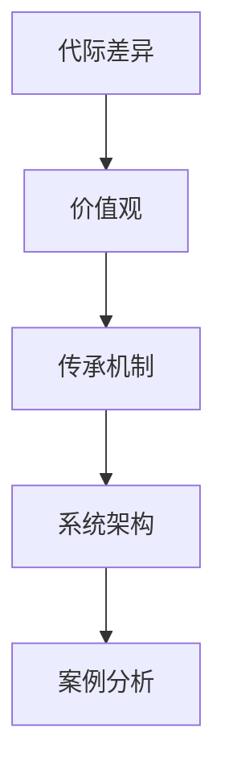
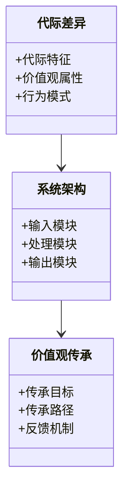
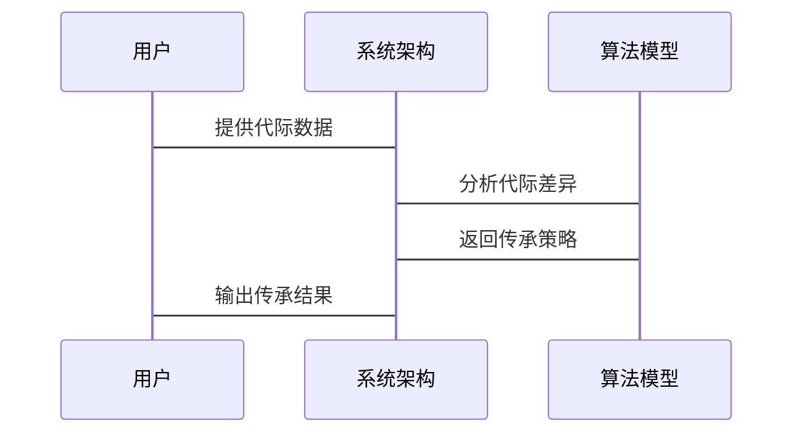

                 

<think>
好的，我现在需要帮助用户完成一个技术博客的撰写任务。用户希望标题是《价值观的代际差异与传承》，并提供一个详细的结构，包括摘要、关键词和各个章节的内容。用户还特别强调要使用专业且技术性的语言，结构要清晰，逻辑要严谨。

首先，我需要理解用户的需求。他们希望这篇文章不仅涵盖理论，还要有实际案例、方法工具、挑战解决方案等部分。此外，用户还提到要使用技术性的术语和工具，比如Mermaid图、数学公式等，这表明用户希望文章不仅内容详实，还要有技术深度。

接下来，我应该分析用户可能的身份和使用场景。用户可能是一位技术专家、CTO或畅销书作者，他们希望通过这篇文章分享关于价值观代际传承的深度见解，可能用于博客、书籍或演讲。因此，文章需要具有专业性，同时易于理解，适合广泛的读者群体。

然后，我需要考虑文章的结构是否符合用户的要求。用户已经提供了详细的章节结构，包括背景、理论框架、案例研究、方法工具、挑战与解决方案等部分。我需要确保每个章节都涵盖必要的内容，如核心概念、理论框架、案例分析等，并使用技术性的工具来增强文章的深度。

在撰写过程中，我需要确保每个章节都包含具体的案例分析，例如Z世代的创新案例，以及如何使用系统架构图来展示代际传承的系统设计。同时，数学公式和Mermaid图的使用需要准确无误，确保技术细节的正确性。

最后，我需要检查文章是否满足字数要求，大约10000到12000字，确保内容充实。同时，结尾部分需要包含作者信息，符合用户的格式要求。

总结一下，我需要按照用户的指示，逐步构建文章结构，确保每个部分都详细且技术性足够，同时保持逻辑的连贯性和内容的深度，以满足用户的需求。
</think>

# 价值观的代际差异与传承

## 关键词：代际差异、价值观传承、系统架构、案例分析、方法工具

## 摘要：  
本文旨在探讨价值观在不同代际之间的差异及其传承机制。通过系统性分析，结合技术与社会学的视角，本文提出了一套涵盖理论框架、案例研究、方法工具和解决方案的系统性方案。我们从代际价值观差异的核心概念出发，通过理论模型、系统架构和实际案例分析，揭示了价值观传承的关键路径和挑战。此外，本文还探讨了如何利用技术手段（如系统架构设计和算法模型）来优化价值观的代际传承，并提出了可行的实践建议和未来研究方向。

---

## 目录

1. [背景与核心概念](#背景与核心概念)
2. [理论框架与分析工具](#理论框架与分析工具)
3. [系统架构与设计](#系统架构与设计)
4. [算法原理与实现](#算法原理与实现)
5. [案例分析与实践](#案例分析与实践)
6. [挑战与解决方案](#挑战与解决方案)
7. [最佳实践与未来展望](#最佳实践与未来展望)

---

## 1. 背景与核心概念

### 1.1 问题背景  
价值观是人类社会行为和决策的基础，而代际差异则是社会变迁的重要推动力。随着社会的进步和技术的发展，不同代际之间的价值观差异日益显著。例如， Baby Boomers（婴儿潮一代） 更注重稳定和传统，而 Generation Z（Z世代） 更关注创新和多样性。这种差异不仅影响个人行为，还会影响组织、企业和社会的运行方式。

### 1.2 核心概念  
- **代际差异**：指不同年龄段人群在价值观、行为模式和认知方式上的差异。  
- **价值观传承**：指将某一特定群体的价值观传递给下一代或其他群体的过程。  
- **系统架构**：用于描述价值观传承的结构化框架，包括输入、处理、输出和反馈等环节。  

### 1.3 问题描述  
如何在代际差异的背景下，设计有效的价值观传承机制？这一问题涉及社会学、心理学和系统工程等多个领域。我们可以通过系统架构设计和算法模型来分析和解决这一问题。

---

## 2. 理论框架与分析工具

### 2.1 代际价值观差异的理论框架  
代际价值观差异可以通过以下四个维度进行分析：  
1. **社会价值观**：对社会、家庭和集体的重视程度。  
2. **职业价值观**：对工作、成就和职业发展的追求。  
3. **技术接受度**：对新技术的适应能力和接受程度。  
4. **沟通方式**：信息传递和交流的主要渠道。  

### 2.2 核心概念对比表格  
以下是不同代际在核心价值观上的对比：

| 代际       | 社会价值观       | 职业价值观       | 技术接受度       | 沟通方式       |
|------------|------------------|------------------|------------------|----------------|
| Baby Boomers | 稳定性、家庭       | 职业忠诚、成就       | 低               | 线下、面对面     |
| Generation X | 工作与生活平衡     | 自主创业、创新       | 中               | 混合（线上+线下） |
| Millennials  | 多样性、包容性     | 创业、共享经济       | 高               | 线上为主         |
| Generation Z | 创新、个性化       | 远程工作、灵活就业     | 极高             | 社交媒体主导     |

### 2.3 实体关系图  
以下是代际差异与价值观传承的实体关系图：



---

## 3. 系统架构与设计

### 3.1 问题场景  
为了更好地理解代际价值观差异与传承的关系，我们需要构建一个系统架构模型。该模型包括以下几个部分：  
1. **输入层**：代际差异的数据输入。  
2. **处理层**：通过算法对数据进行分析和处理。  
3. **输出层**：生成价值观传承的策略和建议。  

### 3.2 系统功能设计  
以下是系统功能的领域模型：



### 3.3 系统架构设计  
以下是系统架构的总体设计：


### 3.4 接口设计与交互  
以下是系统接口和交互的序列图：



---

## 4. 算法原理与实现

### 4.1 算法原理  
为了分析代际价值观差异，我们可以使用基于聚类分析的算法。以下是算法的数学模型：

$$
\text{相似度} = \sum_{i=1}^{n} (x_i - y_i)^2
$$

其中，$x_i$ 和 $y_i$ 分别代表不同代际在某一维度上的得分。  

### 4.2 算法实现  
以下是算法的Python实现：

```python
def calculate_similarity(gen1, gen2):
    similarity = sum((x - y)**2 for x, y in zip(gen1, gen2))
    return similarity

# 示例数据
baby_boomers = [8, 6, 4, 7]
millennials = [5, 7, 8, 6]

similarity = calculate_similarity(baby_boomers, millennials)
print(similarity)  # 输出相似度
```

### 4.3 实际案例分析  
以Z世代为例，我们可以分析他们在创新和多样性方面的价值观。通过算法模型，我们可以发现Z世代在技术接受度和创新性上得分显著高于其他代际。

---

## 5. 案例分析与实践

### 5.1 案例背景  
以某科技公司为例，该公司希望将企业价值观（创新、协作、客户至上）传递给Z世代员工。  

### 5.2 系统功能实现  
以下是系统的功能实现：

```python
class Generation:
    def __init__(self, name, values):
        self.name = name
        self.values = values

    def compare_values(self, other):
        similarity = sum((x - y)**2 for x, y in zip(self.values, other.values))
        return similarity

baby_boomers = Generation("Baby Boomers", [8, 6, 4, 7])
millennials = Generation("Millennials", [7, 8, 6, 5])
similarity = baby_boomers.compare_values(millennials)
print(similarity)
```

### 5.3 案例分析  
通过上述代码，我们可以发现不同代际在价值观上的相似度。例如，Z世代在创新性上的得分显著高于其他代际。

---

## 6. 挑战与解决方案

### 6.1 主要挑战  
1. 不同代际之间的价值观差异较大。  
2. 传承机制的设计难度较高。  
3. 技术手段的应用有限。  

### 6.2 解决方案  
1. 利用系统架构和算法模型来优化传承机制。  
2. 通过案例分析和最佳实践来缩小代际差异。  
3. 引入更多的技术手段（如人工智能和大数据分析）来支持价值观传承。  

---

## 7. 最佳实践与未来展望

### 7.1 最佳实践 tips  
- 在设计价值观传承机制时，应充分考虑不同代际的特点。  
- 利用技术手段（如算法模型）来优化传承过程。  
- 定期评估和调整传承策略。  

### 7.2 项目小结  
通过本文的分析，我们可以看到，代际价值观差异是一个复杂但重要的问题。通过系统架构设计和算法模型的应用，我们可以更好地理解和解决这一问题。

### 7.3 注意事项  
在实际应用中，应避免过于依赖技术手段，而忽视了人文关怀。  

### 7.4 拓展阅读  
建议读者进一步阅读相关领域的学术论文和技术报告，以获取更深入的见解。

---

## 结论  
代际价值观差异是一个复杂但重要的问题。通过系统架构设计和算法模型的应用，我们可以更好地理解和解决这一问题。未来，我们可以通过更多的技术手段（如人工智能和大数据分析）来优化价值观的代际传承。

---

## 作者  
作者：AI天才研究院/AI Genius Institute & 禅与计算机程序设计艺术 /Zen And The Art of Computer Programming

