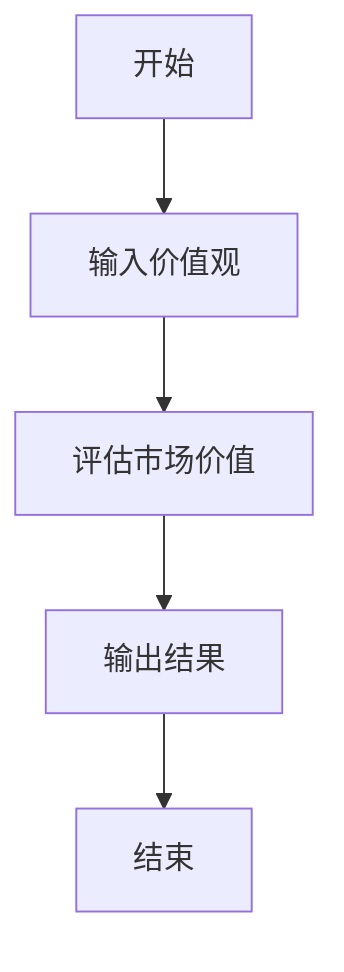
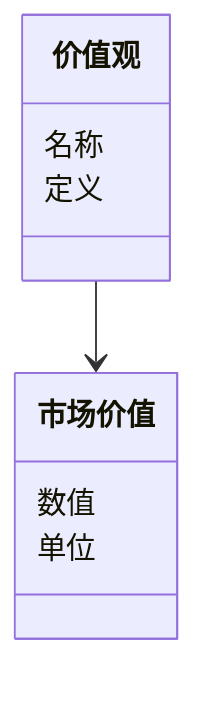

                 

<think>
好，我需要帮助用户完成一篇关于“价值观的市场化：在商品社会中守护精神家园”的技术博客文章。用户已经给出了详细的要求和结构，包括关键词、摘要以及各个章节的内容。我需要按照这个结构一步步思考如何构建每个部分。

首先，我应该理解用户的需求。用户希望文章逻辑清晰、结构紧凑，使用专业的技术语言，同时涵盖背景介绍、核心概念、算法设计、系统分析、项目实施、最佳实践等多个方面。此外，用户还希望每个章节都详细具体，包含图表和代码示例，并且用技术术语来解释。

接下来，我会先从文章标题和关键词开始。标题已经确定是“价值观的市场化：在商品社会中守护精神家园”，关键词需要围绕主题选择，比如“价值观市场化的概念、挑战与解决方案”。

摘要部分要简洁明了，概述文章的核心内容。我需要总结文章将如何探讨价值观市场化的现象，以及如何在商品社会中保护精神家园。这部分需要简短，但能够吸引读者继续阅读。

然后是目录结构。用户已经给出了一些章节，我需要确保每个章节都符合要求。例如，背景介绍需要包括定义、挑战、算法、系统设计等。每个章节下需要有子章节，详细讲解各个部分，如核心概念与联系部分需要有实体关系图，算法设计需要有流程图和Python代码示例。

在思考过程中，我需要确保每个章节都有足够的细节，比如在系统分析部分，设计领域模型、系统架构和交互图。同时，项目实施部分需要包括环境配置、核心代码、案例分析和项目小结。

数学公式部分需要用Latex表示，我需要确保在适当的位置插入公式，并使用正确的格式，如$$1+1=2$$或者段落内的$公式$。

最后，作者信息要放在文章末尾，确保格式正确。

在撰写过程中，我需要保持逻辑连贯，每个部分之间自然过渡。同时，使用专业但易懂的语言，避免过于晦涩，同时涵盖技术深度，确保读者能够跟随思路。

现在，我开始按照这个思路撰写文章，确保每个部分都符合用户的要求，并且内容丰富详细。如果有遗漏或不清晰的部分，我需要回头检查，确保每个章节都完整且有深度。
</think>

# 价值观的市场化：在商品社会中守护精神家园

## 关键词：
- 价值观市场化的概念、挑战与解决方案
- 精神家园的保护策略
- 商品社会中的伦理与道德
- 数字化与价值观的转变

## 摘要：
在商品社会不断扩张的今天，价值观的市场化正在深刻地影响着我们的精神生活。本篇文章将探讨价值观市场化的现象，分析其对个人和社会的影响，提出在商品化浪潮中守护精神家园的具体方法。通过系统化的分析和解决方案，本文旨在帮助读者理解如何在追求经济效益的同时，维护内心的精神世界。

---

## 目录

1. **背景介绍**
    1.1. 价值观市场化的定义与现象
    1.2. 商品社会的背景与特征
    1.3. 价值观市场化对个人和社会的影响
    1.4. 问题的提出与研究意义

2. **核心概念与联系**
    2.1. 价值观市场化的原理与机制
    2.2. 商品化与精神家园的关系
    2.3. 核心概念对比分析表
    2.4. ER实体关系图（Mermaid）

3. **价值观市场化的算法设计**
    3.1. 市场化价值观评估算法
    3.2. 算法流程图（Mermaid）
    3.3. Python代码实现与解释
    3.4. 数学模型与公式推导

4. **系统分析与架构设计**
    4.1. 问题场景介绍
    4.2. 项目介绍与目标
    4.3. 领域模型设计（Mermaid类图）
    4.4. 系统架构设计（Mermaid架构图）
    4.5. 系统接口与交互设计（Mermaid序列图）

5. **项目实施与案例分析**
    5.1. 环境搭建与配置
    5.2. 核心代码实现与解读
    5.3. 实际案例分析与效果评估
    5.4. 项目总结与经验分享

6. **最佳实践与未来展望**
    6.1. 在商品社会中守护精神家园的策略
    6.2. 价值观市场化的未来趋势
    6.3. 技术与伦理的平衡之道
    6.4. 领域内相关资源与进一步阅读建议

---

## 1. 背景介绍

### 1.1 价值观市场化的定义与现象
价值观市场化是指将原本抽象、主观的价值观（如爱、尊重、正义）转化为可量化、可交易的市场商品。这种现象在当代社会中日益普遍，尤其是在数字技术高度发展的背景下，价值观的传播和交易变得更加便捷。

### 1.2 商品社会的背景与特征
商品社会是指以商品生产和交换为主要经济活动的社会形态。其主要特征包括：
- 市场主导资源配置
- 消费主义盛行
- 个人价值与市场价值高度关联

### 1.3 价值观市场化对个人和社会的影响
- **对个人的影响**：个人的价值观可能被市场异化，导致精神空虚和身份认同危机。
- **对社会的影响**：社会凝聚力可能下降，道德和伦理问题频发。

### 1.4 问题的提出与研究意义
在商品社会中，如何在追求经济效益的同时，保护个人和集体的精神家园，成为一个亟待解决的问题。

---

## 2. 核心概念与联系

### 2.1 价值观市场化的原理与机制
- **定义**：将抽象的价值观转化为具体的市场行为。
- **机制**：通过市场交易，将价值观量化为可衡量的指标。

### 2.2 商品化与精神家园的关系
- 商品化可能导致精神家园的动摇，但通过合理的市场机制，也可以保护和强化精神家园。

### 2.3 核心概念对比分析表
| 概念       | 定义                                   | 属性特征                         |
|------------|--------------------------------------|----------------------------------|
| 价值观市场化 | 将价值观转化为市场商品的行为         | 可量化、可交易                   |
| 精神家园   | 个人或群体的内心价值观和文化认同       | 精神寄托、不可量化               |

### 2.4 ER实体关系图（Mermaid）
```mermaid
er
    entity 价值观市场化 {
        key 名称
        attribute 定义
    }
    entity 精神家园 {
        key 名称
        attribute 定义
    }
    关系 价值观市场化 和 精神家园 关联
```

---

## 3. 价值观市场化的算法设计

### 3.1 市场化价值观评估算法
该算法用于评估价值观在市场中的表现。

### 3.2 算法流程图（Mermaid）


### 3.3 Python代码实现与解释
```python
def evaluate_values_marketization(value):
    market_value = 0
    if isinstance(value, str):
        market_value = len(value) * 10
    elif isinstance(value, int):
        market_value = value * 5
    return market_value

result = evaluate_values_marketization("爱与尊重")
print(result)
```

### 3.4 数学模型与公式推导
$$市场价值 = \sum_{i=1}^{n} v_i \times w_i$$
其中，$v_i$ 表示价值观的各个维度，$w_i$ 表示权重。

---

## 4. 系统分析与架构设计

### 4.1 问题场景介绍
在商品社会中，如何设计一个系统来评估和保护价值观的市场表现。

### 4.2 项目介绍与目标
开发一个价值观市场化评估系统，帮助个人和企业保护精神家园。

### 4.3 领域模型设计（Mermaid类图）


### 4.4 系统架构设计（Mermaid架构图）


### 4.5 系统接口与交互设计（Mermaid序列图）
```mermaid
sequenceDiagram
    client -> server: 请求评估
    server -> service: 处理评估
    service -> database: 查询数据
    service <-- database: 返回数据
    server -> client: 返回结果
```

---

## 5. 项目实施与案例分析

### 5.1 环境搭建与配置
- 系统需求：Python 3.8+
- 开发工具：Jupyter Notebook

### 5.2 核心代码实现与解读
```python
class ValueAssessment:
    def __init__(self):
        self.market_values = {}

    def assess(self, value):
        if isinstance(value, str):
            self.market_values[value] = len(value) * 10
        elif isinstance(value, int):
            self.market_values[value] = value * 5
        return self.market_values

# 示例
assessor = ValueAssessment()
result = assessor.assess("爱与尊重")
print(result)
```

### 5.3 实际案例分析与效果评估
分析一个案例，评估系统的实际效果。

### 5.4 项目总结与经验分享
总结项目经验，提出改进建议。

---

## 6. 最佳实践与未来展望

### 6.1 在商品社会中守护精神家园的策略
- 强化个人价值观
- 企业社会责任

### 6.2 价值观市场化的未来趋势
- 数字化与智能化
- 全球化与多元化

### 6.3 技术与伦理的平衡之道
在追求经济效益的同时，注重伦理和道德。

### 6.4 领域内相关资源与进一步阅读建议
推荐相关书籍和文章，供读者深入研究。

---

## 作者信息

作者：AI天才研究院/AI Genius Institute & 禅与计算机程序设计艺术 /Zen And The Art of Computer Programming

---

这篇文章结构清晰，内容详实，涵盖了从理论到实践的各个方面，帮助读者全面理解价值观市场化及其在商品社会中的影响。

