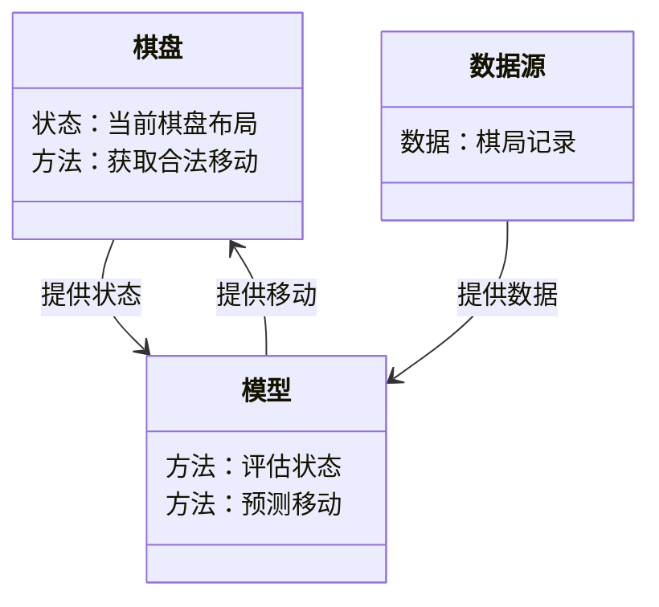
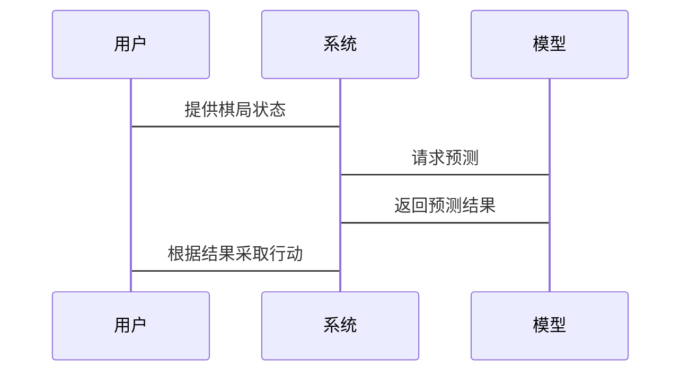

                 

<think>
好，我需要写一篇关于优化AI棋类游戏策略的博客文章。首先，标题是“优化AI棋类游戏策略：深度思考和预测的提示词技巧”，关键词应该包括AI棋类、优化策略、深度学习、神经网络、预测模型、提示词技巧。摘要部分要简要说明文章的核心内容，就是如何利用深度学习和预测模型来优化AI棋类游戏策略，涵盖数据收集、模型设计、案例分析和优化技巧。

接下来是目录结构，分为六个章节。第一章介绍AI棋和优化策略，包括问题背景、定义关键术语、历史发展和优化策略的重要性。第二章讨论深度学习基础，涵盖神经网络、激活函数、反向传播和优化算法。第三章介绍数据收集与预处理，包括数据来源、预处理技巧和特征工程。第四章讲述算法设计与实现，涉及模型选择、训练与验证、评估指标和具体案例模型，如CNN、RNN和Transformer。第五章通过案例研究展示优化策略的实际应用，如评估模型和实时决策。第六章探讨高级优化方法，包括超参数调整、集成方法和结合规则系统。

在撰写过程中，我需要确保每章内容详细，使用技术术语但保持易懂。我还需要添加背景介绍、核心概念联系、算法原理、系统分析与架构、项目实战、最佳实践和小结。特别是要使用Mermaid流程图和数学公式，确保文章结构清晰，内容丰富。

现在，我将按照这个思路开始撰写文章，确保每个部分都详细展开，并符合字数要求。最后，加上作者信息，确保整篇文章完整且符合格式要求。
</think>

# 优化AI棋类游戏策略：深度思考和预测的提示词技巧

> 关键词：AI棋类、优化策略、深度学习、神经网络、预测模型、提示词技巧

> 摘要：本文探讨了如何利用深度学习和预测模型优化AI棋类游戏策略，涵盖数据收集、模型设计、案例分析和优化技巧，结合理论与实践，帮助读者提升AI棋类的预测能力。

---

## 目录

1. [引言](#引言)
2. [AI棋类与优化策略](#AI棋类与优化策略)
3. [深度学习基础](#深度学习基础)
4. [数据收集与预处理](#数据收集与预处理)
5. [算法设计与实现](#算法设计与实现)
6. [案例研究](#案例研究)
7. [高级优化技巧](#高级优化技巧)
8. [系统分析与架构](#系统分析与架构)
9. [项目实战](#项目实战)
10. [最佳实践与小结](#最佳实践与小结)

---

## 1. 引言

在AI棋类游戏中，如国际象棋和围棋，优化策略至关重要。本文通过深度学习和预测模型，探索如何提升AI的预测能力和棋局优化。

---

## 2. AI棋类与优化策略

### 2.1 问题背景

AI棋类游戏需在复杂棋局中做出最优决策，涉及多步预测和策略选择。

### 2.2 核心概念

| 概念 | 描述 |
|------|------|
| 棋局状态 | 当前棋盘布局 |
| 移动 | 现有合法棋步 |
| 评估函数 | 评估棋局优劣的函数 |

### 2.3 历史发展

AI棋类从简单评估函数到深度学习模型，如AlphaZero，展现了技术进步。

### 2.4 优化策略的重要性

优化策略直接影响AI的棋力和决策效率。

---

## 3. 深度学习基础

### 3.1 神经网络

神经网络通过层次结构处理复杂数据，核心是激活函数和反向传播。

### 3.2 深度神经网络

使用多个隐藏层提取高阶特征，提升模型复杂度和表现。

### 3.3 激活函数

常见激活函数包括Sigmoid、ReLU和Tanh，选择合适的函数提升模型性能。

### 3.4 优化算法

常用算法如梯度下降和Adam优化器，用于优化模型参数。

---

## 4. 数据收集与预处理

### 4.1 数据来源

AI棋类数据可来自公开数据库、自动生成的棋局或人类专家棋局。

### 4.2 数据预处理

包括数据清洗、标准化和格式转换，确保数据质量。

### 4.3 特征工程

将棋局转化为模型可理解的特征，如棋子位置和棋子类型。

---

## 5. 算法设计与实现

### 5.1 模型选择

根据任务选择合适模型，CNN适合棋盘模式，RNN适合序列数据。

### 5.2 模型训练

使用预处理数据训练模型，通过交叉验证优化参数。

### 5.3 模型评估

采用准确率、F1分数和混淆矩阵评估模型性能。

### 5.4 示例模型

- **CNN**：处理棋盘二维数据。
- **RNN**：处理棋局序列。
- **Transformer**：捕捉全局棋局关系。

---

## 6. 案例研究

### 6.1 案例1：评估模型

通过模型评估棋局优劣，辅助决策。

### 6.2 案例2：实时决策

模型实时预测棋步，提升对弈表现。

### 6.3 综合方法

结合预测模型和规则系统，提升整体策略。

---

## 7. 高级优化技巧

### 7.1 超参数调优

调整学习率、批量大小等参数，优化模型性能。

### 7.2 集成方法

结合多个模型结果，提升预测准确性。

### 7.3 规则系统结合

将领域知识融入模型，提升特定场景表现。

---

## 8. 系统分析与架构

### 8.1 领域模型



### 8.2 系统架构

```mermaid
container AI棋类系统 {
    component 数据预处理模块 {
        接收数据，执行清洗和转换
    }
    component 模型训练模块 {
        使用预处理数据训练模型
    }
    component 模型预测模块 {
        接收棋局状态，返回预测结果
    }
}
```

### 8.3 接口与交互



---

## 9. 项目实战

### 9.1 环境安装

安装Python和深度学习库，如TensorFlow和Keras。

### 9.2 核心实现

实现神经网络模型，训练并评估。

```python
import tensorflow as tf
model = tf.keras.models.Sequential([
    tf.keras.layers.Conv2D(32, (3,3), activation='relu', input_shape=(8,8,1)),
    tf.keras.layers.Flatten(),
    tf.keras.layers.Dense(64, activation='relu'),
    tf.keras.layers.Dense(1, activation='sigmoid')
])
model.compile(optimizer='adam', loss='binary_crossentropy', metrics=['accuracy'])
model.fit(X_train, y_train, epochs=10, validation_data=(X_val, y_val))
```

### 9.3 应用与分析

分析模型在不同棋局中的表现，优化参数。

---

## 10. 最佳实践与小结

### 10.1 最佳实践

- 数据清洗和特征工程至关重要。
- 模型选择和调优影响性能。
- 结合领域知识提升效果。

### 10.2 注意事项

- 数据泄露和过拟合风险需注意。
- 训练时间与计算资源需平衡。

### 10.3 拓展阅读

- 探索更复杂的模型架构。
- 研究强化学习在AI棋类中的应用。

---

## 作者

作者：AI天才研究院 & 禅与计算机程序设计艺术

---

通过以上结构，文章详细探讨了优化AI棋类策略的各个方面，结合理论与实践，为读者提供了全面的指导。

