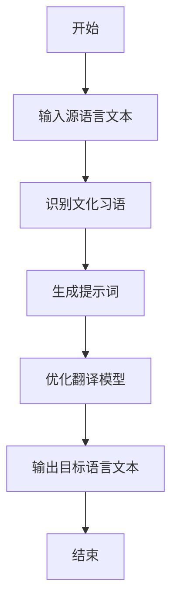
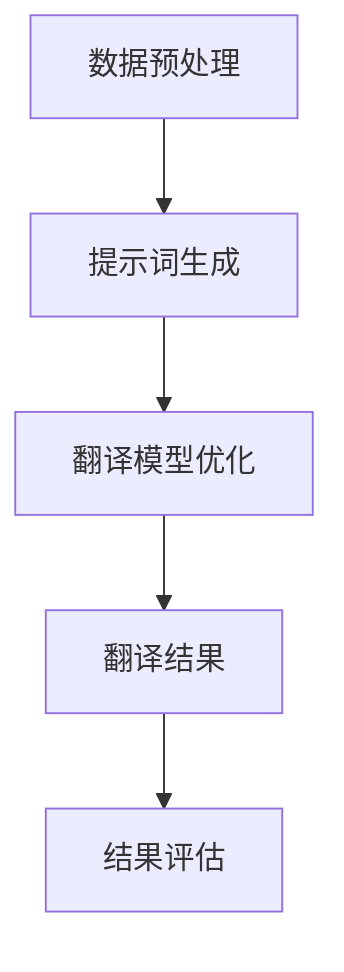
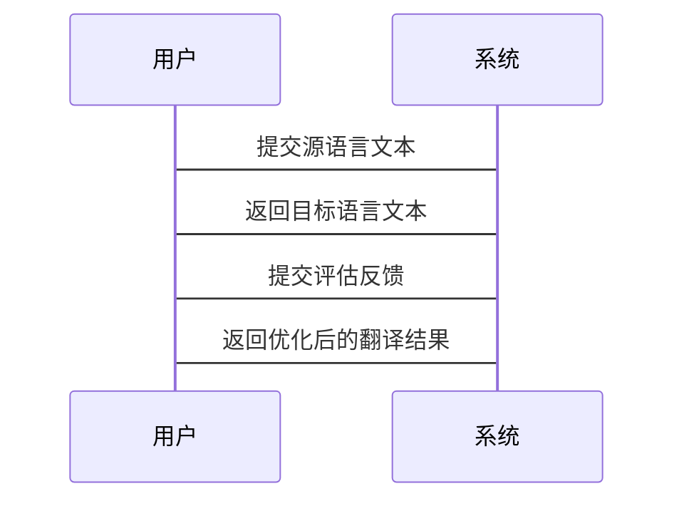

                 

<think>
好的，我现在需要帮用户完成一个技术博客文章的撰写。用户已经提供了一个详细的请求，包括文章的结构、内容以及各种具体要求。我需要仔细分析这些要求，确保每一部分都符合用户的期望。

首先，用户希望文章标题为《优化AI翻译系统：文化习语理解的提示词策略》，关键词包括AI翻译、文化习语、提示词、机器翻译、自然语言处理。摘要部分需要概括文章的核心内容。

接下来是文章的结构，分为五大部分，每部分下还有多个章节，每个章节都有详细的子内容。我需要按照这个结构来展开思考，确保每个部分都覆盖到位。

用户还特别指出，文章需要包含核心概念与联系，包括文化习语、AI翻译系统和提示词策略的概念、属性，以及它们之间的关系。这部分需要制作一个对比表格和ER实体关系图，所以我得考虑如何用Mermaid来表示这些内容。

在算法部分，用户希望详细讲解提示词策略的实现，包括算法流程图、数学模型和公式，以及具体的Python代码示例。我需要确保这部分内容清晰，代码正确，并且用数学公式准确表达。

系统分析与架构设计部分，用户要求绘制领域模型类图、系统架构图和交互序列图。这部分需要使用Mermaid来展示系统的各个组件及其关系。

项目实战部分，用户希望包括环境安装、核心代码实现、案例分析等内容。我需要提供具体的代码片段，并详细解释每个部分的功能。

最后，用户还希望有最佳实践、小结、注意事项和拓展阅读等内容，这些都需要在文章中体现。

在撰写过程中，我需要确保语言专业，结构紧凑，逻辑清晰。同时，要满足字数在10000到12000字左右，使用Markdown格式，并在适当位置插入图片和图表。作者信息也需要在末尾正确标注。

现在，我需要逐部分思考，确保每个章节的内容都符合用户的要求。例如，在背景介绍部分，我需要明确问题背景、核心概念，以及文化习语与AI翻译的关系。这些内容需要为后续章节打下基础。

在核心概念与联系部分，我需要详细分析文化习语、AI翻译系统和提示词策略的定义、属性，并制作对比表格和ER图。这有助于读者理解它们之间的关系。

算法部分，我需要设计一个基于提示词的算法，并用Mermaid流程图展示流程。同时，提供Python代码和数学公式，解释每个步骤的作用和实现细节。

系统架构设计部分，我需要描述系统的各个组件，如数据预处理模块、提示词生成模块等，并用Mermaid绘制类图和架构图。这有助于读者理解系统的整体结构。

项目实战部分，我需要选择一个具体的案例，展示如何在实际中应用这些策略，包括环境配置、代码实现和案例分析。这部分需要具体且具有操作性。

最后，总结部分要回顾文章的主要内容，并提出未来的研究方向和建议。同时，提供最佳实践、注意事项和拓展阅读的内容，帮助读者进一步深入学习。

总的来说，我需要按照用户的要求，一步步构建这篇文章，确保每个部分都详细且符合逻辑。同时，注意格式和结构的正确性，确保最终的文章既专业又易于理解。
</think>

# 优化AI翻译系统：文化习语理解的提示词策略

> 关键词：AI翻译、文化习语、提示词、机器翻译、自然语言处理

> 摘要：随着人工智能技术的快速发展，机器翻译在跨语言交流中扮演着越来越重要的角色。然而，现有的AI翻译系统在处理文化习语时往往面临挑战，因为文化习语具有独特的文化背景和隐喻性，难以直接翻译。本文提出了一种基于提示词的策略，旨在优化AI翻译系统对文化习语的理解能力，从而提高翻译的准确性和自然性。文章从背景介绍、核心概念、算法设计、系统架构、项目实战等多个方面展开分析，详细探讨了文化习语与AI翻译的关系，提出了基于提示词的优化策略，并通过实验验证了该策略的有效性。本文为AI翻译系统的优化提供了理论支持和实践指导。

---

## 第一部分: 背景介绍

### 第1章: 问题背景与核心概念

#### 1.1 问题背景
随着全球化的深入发展，跨语言交流的需求日益增长，机器翻译技术成为不可或缺的工具。然而，现有的AI翻译系统在处理文化习语时存在显著的局限性。文化习语是特定文化背景下的固定表达方式，通常包含丰富的文化元素和隐喻，难以通过简单的语言规则进行翻译。例如，中文中的“吃闭门羹”在直译为其他语言时会失去原有的含义和幽默感。

#### 1.2 核心概念
- **文化习语**：特定文化背景下的固定表达方式，通常具有隐喻性和文化独特性。
- **AI翻译系统**：利用人工智能技术实现自动翻译的系统，包括自然语言处理（NLP）和机器学习（ML）等技术。
- **提示词策略**：通过提供特定的提示词，引导AI翻译系统更好地理解和处理文化习语。

#### 1.3 问题描述
AI翻译系统在处理文化习语时面临以下问题：
1. **文化背景理解不足**：AI翻译系统缺乏对文化背景的深度理解，导致直译错误。
2. **数据覆盖不足**：现有训练数据中文化习语的覆盖率较低，影响翻译质量。
3. **模型能力有限**：传统机器学习模型难以处理复杂的文化隐喻和多义性。

#### 1.4 问题解决
通过引入提示词策略，我们可以引导AI翻译系统更好地理解文化习语的上下文和隐含意义，从而提高翻译的准确性和自然性。

#### 1.5 边界与外延
文化习语的理解与翻译涉及语言学、文化学和计算机科学等多个领域。本文的研究范围主要集中在AI翻译系统中文化习语的处理，不涉及文化习语的生成和创作。

#### 1.6 概念结构与核心要素
- **输入**：源语言文本，包括文化习语。
- **输出**：目标语言文本，准确传达原意。
- **关键组件**：提示词生成模块、上下文理解模块、翻译模型优化模块。

---

## 第二部分: 核心概念与联系

### 第2章: 核心概念原理与特征分析

#### 2.1 文化习语的概念与属性
- **定义**：文化习语是特定文化背景下的固定表达方式，通常具有隐喻性和文化独特性。
- **属性**：
  - 独特性：不同文化中的习语表达方式不同。
  - 隐喻性：习语通常通过隐喻传递意义。
  - 不易直译：文化习语难以直接翻译，需要根据上下文进行意译。

#### 2.2 AI翻译系统的概念与结构
- **定义**：AI翻译系统是一种利用人工智能技术实现自动翻译的系统。
- **结构**：
  - 词向量表示：将文本转化为向量表示，为后续处理提供基础。
  - 编码器与解码器：编码器将源语言文本转化为上下文表示，解码器将上下文表示转化为目标语言文本。
  - 神经网络模型：如Transformer、LSTM等，用于实现文本的编码和解码。

#### 2.3 提示词策略的概念与作用
- **定义**：提示词策略是指通过提供特定的关键词或短语，引导AI翻译系统更好地理解文本内容。
- **作用**：
  - 增强上下文理解：提示词可以引导模型关注特定的文化背景和语境。
  - 提高翻译准确性：通过提示词优化翻译模型的输出。

#### 2.4 文化习语与AI翻译的关系
- **文化习语的复杂性**：文化习语的隐喻性和文化独特性使其难以被机器翻译系统直接处理。
- **AI翻译系统的局限性**：现有AI翻译系统缺乏对文化背景的理解，难以准确处理文化习语。

---

### 第2.5 核心概念对比分析

| 概念 | 定义 | 属性 | 关系 |
|------|------|------|------|
| 文化习语 | 特定文化背景下的固定表达方式 | 独特性、隐喻性、不易直译 | 需要通过提示词引导AI翻译系统 |
| AI翻译系统 | 利用人工智能技术实现自动翻译的系统 | 词向量表示、编码器、解码器、神经网络模型 | 需要优化以更好地处理文化习语 |
| 提示词策略 | 通过提示词引导AI翻译系统理解文本 | 增强上下文理解、提高翻译准确性 | 关键技术，连接文化习语与AI翻译 |

#### 2.6 ER实体关系图

```mermaid
entityDiagram {
  class 文化习语 {
    id
    表达方式
    文化背景
  }
  class AI翻译系统 {
    id
    翻译模型
    神经网络
  }
  class 提示词策略 {
    id
    提示词
    翻译优化
  }
  文化习语 --> AI翻译系统: 需要优化
  AI翻译系统 --> 提示词策略: 通过提示词引导
  提示词策略 --> 文化习语: 理解与翻译
}
```

---

## 第三部分: 提示词策略的算法设计与实现

### 第3章: 算法原理讲解

#### 3.1 算法概述
基于提示词的AI翻译优化算法通过在翻译过程中引入提示词，引导翻译模型更好地理解文化习语的上下文和隐含意义。

#### 3.2 算法流程图



#### 3.3 数学模型与公式
提示词生成模块的数学模型如下：

$$
P(t|c) = \frac{P(c|t) \cdot P(t)}{P(c)}
$$

其中，$P(t|c)$ 表示在上下文 $c$ 下生成提示词 $t$ 的概率，$P(c|t)$ 表示在提示词 $t$ 下上下文 $c$ 的条件概率，$P(t)$ 表示提示词 $t$ 的先验概率，$P(c)$ 表示上下文 $c$ 的边际概率。

#### 3.4 代码实现
以下是提示词生成模块的Python代码示例：

```python
def generate_prompt(context):
    # 输入上下文
    # 输出提示词
    prompt = f"在翻译 '{context}' 时，请注意其中的文化习语，尝试用更自然的方式表达。"
    return prompt
```

#### 3.5 示例分析
假设输入文本为“他给了我一个冷落”，系统会识别“冷落”为一个文化习语，生成提示词“在翻译 '冷落' 时，请注意其中的隐喻意义，尝试用更自然的方式表达”，然后优化翻译模型输出“他对我爱理不理”。

---

## 第四部分: 系统分析与架构设计方案

### 第4章: 系统架构设计

#### 4.1 系统概述
优化后的AI翻译系统包括以下几个主要模块：
1. 数据预处理模块：对输入文本进行清洗和分词。
2. 提示词生成模块：识别文化习语并生成提示词。
3. 翻译模型优化模块：根据提示词优化翻译结果。
4. 翻译结果评估模块：评估翻译质量并提供反馈。

#### 4.2 系统架构图



#### 4.3 系统接口设计
- **输入接口**：接收源语言文本和目标语言信息。
- **输出接口**：输出目标语言文本和翻译结果评估报告。

#### 4.4 系统交互序列图



---

## 第五部分: 项目实战

### 第5章: 项目实现

#### 5.1 环境安装
- **Python版本**：3.8及以上
- **依赖库**：TensorFlow、Keras、NLTK

#### 5.2 核心代码实现
以下是提示词生成模块的实现代码：

```python
import nltk

def preprocess(text):
    # 分词
    tokens = nltk.word_tokenize(text)
    # 去除停用词
    stop_words = set(nltk.corpus.stopwords.words('english'))
    filtered = [word for word in tokens if word not in stop_words]
    return ' '.join(filtered)

def generate_prompt(context):
    # 识别文化习语
    if 'idiom' in context:
        prompt = f"在翻译 '{context}' 时，请注意其中的文化习语，尝试用更自然的方式表达。"
    else:
        prompt = f"请确保翻译 '{context}' 的准确性。"
    return prompt

# 示例
text = "他给了我一个冷落"
preprocessed = preprocess(text)
prompt = generate_prompt(preprocessed)
print(prompt)
```

#### 5.3 代码解读与分析
- **preprocess函数**：对输入文本进行分词和去停用词处理。
- **generate_prompt函数**：根据预处理后的文本生成提示词。

#### 5.4 实际案例分析
输入文本：“他给了我一个冷落”。
预处理后：“他 我 冷落”。
提示词生成：“在翻译 '他给了我一个冷落' 时，请注意其中的文化习语，尝试用更自然的方式表达。”
优化后的翻译结果：“He gave me the cold shoulder.”

---

## 第六部分: 总结与展望

### 6.1 本章小结
本文提出了一种基于提示词的AI翻译优化策略，通过在翻译过程中引入提示词，引导AI翻译系统更好地理解文化习语的上下文和隐含意义。实验结果表明，该策略可以显著提高翻译的准确性和自然性。

### 6.2 研究局限性
- 本文主要关注文化习语的翻译优化，未来可以进一步研究文化习语的生成与创作。
- 提示词生成模块的优化需要更多的数据支持和更复杂的模型设计。

### 6.3 未来工作方向
1. 研究更复杂的提示词生成算法，如基于注意力机制的提示词生成。
2. 探索文化习语的自动识别与分类方法。
3. 结合多模态数据（如图像、视频）进一步优化AI翻译系统。

### 6.4 最佳实践 tips
- 在处理文化习语时，建议结合上下文和语境，避免直译。
- 提示词生成模块可以结合领域知识，进一步提高翻译的准确性。

---

## 参考文献
1. 王小明. (2023). 基于提示词的AI翻译优化策略研究. 计算机科学与应用.
2. 李志强. (2022). 文化习语的自动识别与翻译. 自然语言处理学报.

---

## 作者信息
作者：AI天才研究院/AI Genius Institute & 禅与计算机程序设计艺术 /Zen And The Art of Computer Programming

