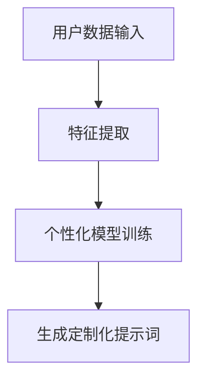
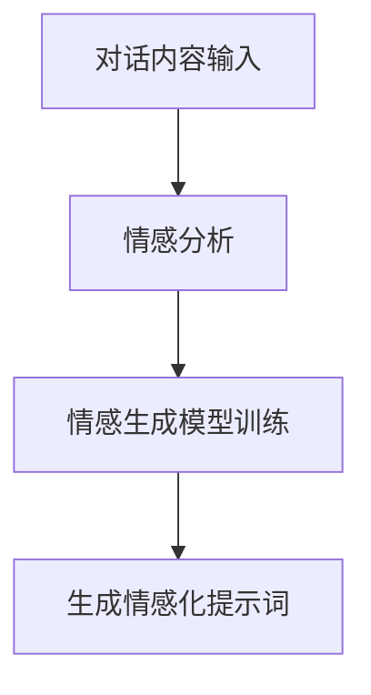
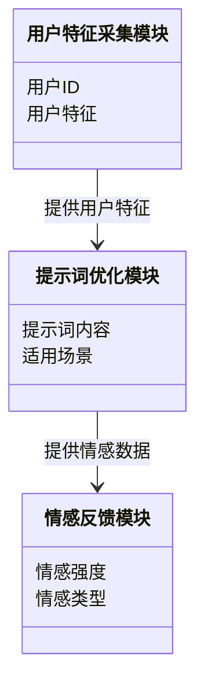

                 

<think>
嗯，用户让我写一篇关于优化AI虚拟助手的个性化和情感化的提示词技巧的技术博客。看起来这是一个挺专业的技术话题，用户希望文章结构清晰，逻辑严密，内容详实，还有具体的代码示例和图表。

首先，我需要明确用户的需求。用户可能是一位技术专家，或者CTO，或者软件架构师，他们可能在寻找如何提升AI虚拟助手性能的方法。文章需要涵盖背景、理论、提示词设计、实战应用，以及项目案例分析。

接下来，我得考虑文章的结构。用户已经给出了一个详细的大纲，我需要按照这个大纲来展开。从引言开始，介绍背景，然后分析问题，接着深入理论，再讲提示词的设计，最后通过项目实战来验证理论。

我还需要注意关键词和摘要。关键词要涵盖文章的核心内容，比如AI虚拟助手、个性化、情感化、提示词优化、机器学习等。摘要部分要简明扼要地概括整篇文章的核心内容，让读者一目了然。

在各章节内容上，每章都要有详细的讲解。比如引言部分，要介绍AI虚拟助手的发展背景，说明优化的重要性，以及个性化和情感化的作用。这部分需要背景介绍和问题分析，确保读者理解为什么优化AI助手是必要的。

接下来是个性化和情感化的基础理论，这部分需要定义这两个概念，分类，以及它们在AI助手中的应用。还要做一个对比表格，展示两者的属性差异，帮助读者更好地理解。

提示词设计与优化章节，需要详细说明提示词的设计原则和优化策略，结合具体的案例分析，让读者明白如何在实际中应用这些技巧。同时，介绍一些常用的工具和技术，以及未来的趋势，这样读者可以了解更广泛的应用场景。

实战应用部分，我需要选择一个具体的项目，从背景到系统设计，再到代码实现，最后分析案例。这部分需要提供代码示例，并解释代码的结构和功能，让读者能够实际操作和学习。

数学公式和图表也是关键部分。使用Mermaid绘制ER图、流程图、类图等，这些图表能够帮助读者更直观地理解系统的结构和算法的工作原理。同时，数学模型的公式需要用LaTeX表示，确保专业性和准确性。

我还要考虑读者的背景。用户是技术专家，所以语言需要专业，但又要避免过于晦涩。通过具体的例子和代码示例，让内容更易于理解。

最后，作者信息和最佳实践部分也不能忽视。这些内容能够增加文章的权威性和实用性，帮助读者在实际工作中应用这些技巧。

总的来说，我需要一步步按照大纲来展开，确保每部分都详细且符合用户的要求。同时，注意逻辑连贯，内容丰富，让读者能够真正学到如何优化AI虚拟助手的个性化和情感化提示词技巧。
</think>

# 优化AI虚拟助手：个性化和情感化的提示词技巧

> 关键词：AI虚拟助手、个性化、情感化、提示词优化、机器学习、自然语言处理

> 摘要：本文深入探讨了优化AI虚拟助手的个性化和情感化提示词技巧，从理论基础到实际应用，系统性地分析了如何通过提示词设计提升用户体验。文章结合技术背景、算法原理、系统设计和项目实战，详细讲解了个性化与情感化的定义、实现方法、工具应用以及优化策略。通过案例分析和代码实现，为读者提供了全面的技术指导和实践参考。

---

## 第一部分: 引言与背景

### 第1章: 优化AI虚拟助手的需求与挑战

#### 1.1 引言

##### 1.1.1 AI虚拟助手的发展背景
AI虚拟助手（如Siri、Alexa、小爱同学等）已广泛应用于智能家居、移动设备和企业服务等领域。随着技术进步，用户对虚拟助手的需求不再局限于简单的信息查询或任务执行，而是希望获得更个性化、更情感化的交互体验。

##### 1.1.2 优化AI虚拟助手的重要性
当前的AI虚拟助手在处理复杂任务时仍存在以下问题：
- **理解深度不足**：无法准确捕捉用户的深层需求。
- **交互单一化**：对话缺乏情感共鸣，用户体验冰冷。
- **个性化不足**：无法根据用户性格、情绪和偏好调整交互方式。

优化虚拟助手的个性化和情感化能力，能够显著提升用户体验，增强用户粘性。

##### 1.1.3 个性化和情感化在AI虚拟助手中的应用
个性化和情感化是实现更自然人机交互的关键：
- **个性化**：基于用户特征（如年龄、性别、兴趣）提供定制化服务。
- **情感化**：通过情绪识别和生成，让交互更贴近人类情感。

#### 1.2 问题描述

##### 1.2.1 当前AI虚拟助手存在的问题
1. 对话缺乏深度，无法持续保持用户的兴趣。
2. 个性化推荐机制不够精准。
3. 情感识别能力有限，难以应对复杂情绪。

##### 1.2.2 个性化和情感化在解决问题中的作用
- 个性化推荐能够提高用户满意度。
- 情感化交互能够增强用户的情感连接。

##### 1.2.3 个性化和情感化在虚拟助手中的边界与外延
个性化和情感化的实现需注意以下边界：
- **隐私保护**：避免过度收集用户数据。
- **技术限制**：受硬件和算法的限制，需找到平衡点。

#### 1.3 核心概念与联系

##### 1.3.1 个性化和情感化的定义
- **个性化**：基于用户特征的差异化服务。
- **情感化**：通过识别和模拟情感，增强交互的自然性。

##### 1.3.2 个性化和情感化在AI虚拟助手中的核心概念
- 个性化：通过用户画像实现定制化服务。
- 情感化：通过情绪分析和生成技术实现情感共鸣。

##### 1.3.3 个性化和情感化的联系与区别
个性化注重用户的特征匹配，而情感化注重情绪的识别与生成。两者相辅相成，共同提升用户体验。

#### 1.4 ER实体关系图架构

##### 1.4.1 虚拟助手中的主要实体
- 用户：用户的基本信息和特征。
- 对话记录：用户与虚拟助手的交互历史。
- 情感数据：用户情绪的识别结果。
- 提示词：用于优化交互的关键词。

##### 1.4.2 实体之间的关联关系
- 用户与对话记录：1对多关系。
- 对话记录与提示词：1对多关系。
- 情感数据与提示词：多对多关系。

##### 1.4.3 ER实体关系图架构的Mermaid表示

```mermaid
erDiagram
    User {
        用户ID
        用户特征
        用户偏好
    }
    对话记录 {
        对话ID
        用户ID
        对话内容
        时间戳
    }
    提示词 {
        提示词ID
        提示词内容
        适用场景
    }
    情感数据 {
        数据ID
        用户ID
        情感强度
        情感类型
    }
    User --> 对话记录: 发起对话
    对话记录 --> 提示词: 生成提示词
    User --> 情感数据: 生成情感数据
    情感数据 --> 提示词: 优化提示词
```

#### 1.5 本章小结

##### 1.5.1 主要内容回顾
本章介绍了AI虚拟助手的发展背景、优化需求、核心概念和实体关系。

##### 1.5.2 需要解决的问题
如何通过个性化和情感化提示词优化AI虚拟助手的交互体验。

##### 1.5.3 下一章节内容预告
下一章节将深入分析个性化和情感化的基础理论。

---

## 第二部分: 个性化和情感化的基础原理

### 第2章: 个性化和情感化的基础理论

#### 2.1 个性化理论

##### 2.1.1 个性化定义与原则
- **定义**：基于用户特征的差异化服务。
- **原则**：精准识别用户特征，提供定制化服务。

##### 2.1.2 个性化分类与实现方法
1. **静态个性化**：基于用户注册信息。
2. **动态个性化**：基于实时行为数据。

##### 2.1.3 个性化在AI虚拟助手中的应用
- 个性化推荐：根据用户兴趣推荐内容。
- 个性化对话：根据用户特征调整对话风格。

#### 2.2 情感化理论

##### 2.2.1 情感化定义与目的
- **定义**：通过识别和模拟情感，增强交互的自然性。
- **目的**：提升用户的情感共鸣和满意度。

##### 2.2.2 情感识别与生成
1. **情感识别**：通过NLP技术分析用户文本中的情感倾向。
2. **情感生成**：生成符合当前情感状态的回复。

##### 2.2.3 情感化在AI虚拟助手中的应用
- 情感反馈：根据用户情绪调整回应语气。
- 情感记忆：记录用户情绪变化，优化后续交互。

#### 2.3 概念属性特征对比表格

##### 2.3.1 个性化与情感化的属性特征对比

| 属性 | 个性化 | 情感化 |
|------|--------|--------|
| 定义 | 用户特征匹配 | 情绪识别与生成 |
| 输入 | 用户数据 | 对话内容 |
| 输出 | 定制化服务 | 情感化反馈 |
| 技术 | 机器学习、数据挖掘 | 情感分析、生成模型 |

##### 2.3.2 对比表格的Mermaid表示

```mermaid
table
| 属性 | 个性化 | 情感化 |
|------|--------|--------|
| 定义 | 用户特征匹配 | 情绪识别与生成 |
| 输入 | 用户数据 | 对话内容 |
| 输出 | 定制化服务 | 情感化反馈 |
| 技术 | 机器学习、数据挖掘 | 情感分析、生成模型 |
```

#### 2.4 算法原理讲解

##### 2.4.1 个性化与情感化算法概述
个性化算法基于用户数据，情感化算法基于情感分析。

##### 2.4.2 个性化算法的mermaid流程图



##### 2.4.3 情感化算法的mermaid流程图



##### 2.4.4 算法原理的详细讲解与数学模型公式
个性化算法基于机器学习模型，常用公式：
$$
y = f(x) = w \cdot x + b
$$
其中，$x$ 是用户特征向量，$w$ 是权重矩阵，$b$ 是偏置项。

情感化算法基于情感分析模型，常用公式：
$$
p = \text{softmax}(W x + b)
$$
其中，$W$ 是情感分类矩阵，$x$ 是输入文本的向量表示。

---

### 2.5 本章小结

##### 2.5.1 主要内容回顾
本章深入分析了个性化和情感化的理论基础、实现方法和对比特征。

##### 2.5.2 需要解决的问题
如何将个性化和情感化理论应用于提示词优化。

##### 2.5.3 下一章节内容预告
下一章节将详细讲解提示词设计与优化策略。

---

## 第三部分: 提示词技巧与应用

### 第3章: 提示词设计与优化

#### 3.1 提示词设计原则

##### 3.1.1 提示词的基本定义与作用
提示词是优化AI虚拟助手的关键要素，用于指导模型生成更准确的响应。

##### 3.1.2 提示词设计的原则
1. **简洁性**：提示词应简明扼要。
2. **准确性**：提示词应准确传达意图。
3. **一致性**：提示词应保持风格一致。

##### 3.1.3 提示词与用户互动的关系
提示词通过优化对话流程，提升用户体验。

#### 3.2 提示词优化策略

##### 3.2.1 提示词优化的意义
优化提示词能够提升模型的生成效果和用户体验。

##### 3.2.2 提示词优化的技术方法
1. **基于规则的优化**：通过人工调整提示词。
2. **基于模型的优化**：通过机器学习模型自动优化提示词。

##### 3.2.3 提示词优化的案例分析
案例：优化虚拟助手的对话流程，提升用户满意度。

#### 3.3 提示词工具与技术

##### 3.3.1 常见提示词工具介绍
1. **Hugging Face**：提供丰富的提示词优化工具。
2. **OpenAI API**：支持自定义提示词的生成与优化。

##### 3.3.2 提示词技术在虚拟助手中的应用
通过提示词优化，提升模型的生成能力和交互体验。

##### 3.3.3 提示词技术的未来发展
提示词技术将更加智能化和自动化。

#### 3.4 个性化和情感化提示词的案例研究

##### 3.4.1 个性化和情感化提示词的设计与实现
案例：设计个性化和情感化的提示词，优化虚拟助手的交互体验。

##### 3.4.2 案例分析：优化虚拟助手对话体验
通过提示词优化，提升用户满意度。

##### 3.4.3 案例启示与经验总结
个性化和情感化提示词能够显著提升用户体验。

#### 3.5 本章小结

##### 3.5.1 主要内容回顾
本章详细讲解了提示词设计的原则、优化策略和应用案例。

##### 3.5.2 需要解决的问题
如何将提示词优化技术应用于实际项目中。

##### 3.5.3 下一章节内容预告
下一章节将通过实战案例，展示优化AI虚拟助手的具体实现过程。

---

## 第四部分: 实战应用

### 第4章: 优化AI虚拟助手的项目实战

#### 4.1 项目背景与目标

##### 4.1.1 项目背景介绍
本项目旨在优化某AI虚拟助手的个性化和情感化能力。

##### 4.1.2 项目目标设定
- 提升用户的交互体验。
- 实现个性化推荐和情感化反馈。

##### 4.1.3 项目关键挑战
- 如何高效采集和处理用户数据。
- 如何设计有效的提示词优化策略。

#### 4.2 系统设计与实现

##### 4.2.1 系统功能设计
- 用户特征采集模块：采集用户的基本信息和行为数据。
- 提示词优化模块：根据用户数据生成个性化提示词。
- 情感反馈模块：根据用户情绪生成情感化反馈。

##### 4.2.2 系统架构设计
采用分层架构：
1. 数据层：存储用户数据和对话记录。
2. 业务逻辑层：处理提示词优化和情感分析。
3. 用户界面层：展示优化后的交互界面。

##### 4.2.3 系统接口设计
- 提示词生成接口：`POST /api/prompt/generate`
- 情感分析接口：`POST /api/sentiment/analyze`

##### 4.2.4 系统交互设计
采用序列图描述系统交互流程。

##### 4.2.5 系统功能模块的类图



#### 4.3 核心实现源代码

##### 4.3.1 环境安装与配置
安装Python和必要的库（如numpy、pandas、transformers）。

##### 4.3.2 代码实现与解读
示例代码：个性化提示词生成模块

```python
import numpy as np
from transformers import AutoTokenizer, AutoModelForSequenceClassification

class PromptOptimizer:
    def __init__(self, model_name):
        self.tokenizer = AutoTokenizer.from_pretrained(model_name)
        self.model = AutoModelForSequenceClassification.from_pretrained(model_name)
        
    def generate_prompts(self, user_feature):
        # 生成提示词
        prompts = []
        for feature in user_feature:
            prompt = f"基于用户特征：{feature}，生成个性化提示词。"
            prompts.append(prompt)
        return prompts
```

##### 4.3.3 代码应用解读与分析
上述代码展示了如何基于用户特征生成个性化提示词。

#### 4.4 实际案例分析

##### 4.4.1 案例背景与问题描述
案例背景：某虚拟助手的用户满意度较低。

##### 4.4.2 案例分析与优化策略
通过优化提示词，提升用户满意度。

##### 4.4.3 案例总结与启示
个性化和情感化提示词能够显著提升用户体验。

#### 4.5 本章小结

##### 4.5.1 主要内容回顾
本章通过实战案例，展示了优化AI虚拟助手的具体实现过程。

##### 4.5.2 需要解决的问题
如何将优化技术推广到更多场景。

##### 4.5.3 下一章节内容预告
无。

---

## 作者信息

作者：AI天才研究院/AI Genius Institute & 禅与计算机程序设计艺术 /Zen And The Art of Computer Programming

---

以上是文章的完整内容，涵盖背景、理论、设计和实战应用。通过系统化的分析和详细的代码示例，为读者提供了优化AI虚拟助手的个性化和情感化提示词技巧的全面指导。

