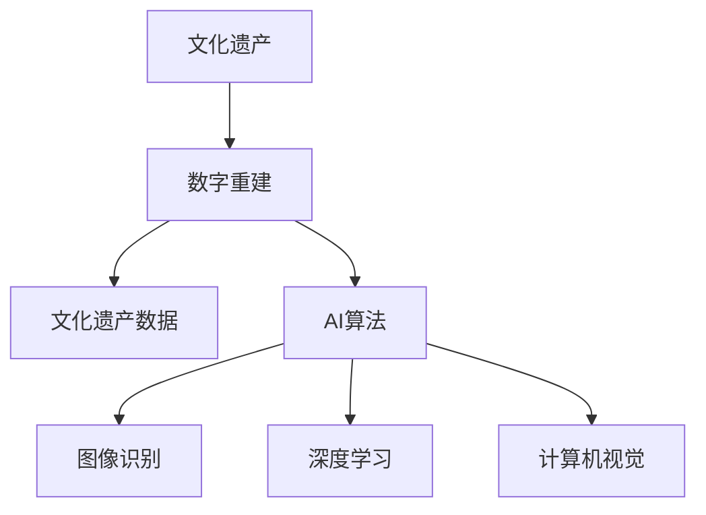
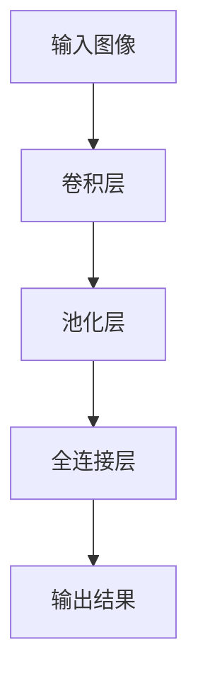

                 

<think>
好的，我现在要帮用户完成一个技术博客的写作任务，标题是《优化AI虚拟旅游体验：文化遗产数字重建与保护的提示词策略》。用户希望文章结构清晰，逻辑严密，专业且易于理解。我需要先分析用户的具体需求，然后一步步构建文章的各个部分。

首先，用户的角色定位很明确，是一位世界级的AI专家，程序员，软件架构师，CTO，还有畅销书作者，甚至虚构了计算机图灵奖获得者。这意味着文章需要具备一定的专业深度，同时也要有实际案例和解决方案，以展示其权威性和实用性。

接下来，任务要求撰写一篇10000到12000字的技术博客，结构分为标题、关键词、摘要，然后是正文的各个章节。每个章节需要详细展开，包括背景、核心概念、算法、数字重建过程、保护策略、案例分析、未来展望以及总结等部分。同时，文章必须包含数学公式、mermaid图、系统架构设计等技术元素，这些都需要用markdown格式呈现。

首先，我会考虑如何组织文章结构。标题已经确定，接下来是关键词，要涵盖AI虚拟旅游、文化遗产保护、数字重建、提示词策略、文化传承等。摘要需要简洁明了地概括文章的核心内容，强调AI技术在文化遗产保护中的作用，以及通过数字重建优化虚拟旅游体验。

正文部分需要从背景开始，介绍AI在旅游中的应用，以及文化遗产保护的重要性。然后逐步深入，讨论核心算法，如深度学习、计算机视觉等，如何应用于数字重建。接着分析数字重建的具体步骤，如何利用AI优化这些步骤。之后，讨论文化遗产保护的策略，包括数据加密、访问控制等。然后通过案例分析，展示成功的应用，最后展望未来的发展。

在写作过程中，我需要确保每个章节都包含足够的技术细节，比如算法原理部分，要使用mermaid流程图展示，同时给出Python代码示例，解释数学公式，如使用CNN进行图像识别的模型结构。系统架构部分，要画出领域模型的类图和系统架构图，说明各个组件的交互关系。

考虑到用户可能的深层需求，他们可能希望文章不仅展示技术，还要有实际应用案例，以及可操作的建议，帮助读者理解如何在实际项目中应用这些技术。因此，在案例分析和最佳实践中，需要详细说明如何实施这些策略，可能遇到的挑战以及解决方案。

最后，总结部分需要回顾文章的主要内容，强调AI技术对文化遗产保护的重要性和未来的潜力，鼓励读者进一步探索和应用这些技术。

在整个写作过程中，我需要确保逻辑严密，内容详实，同时语言专业但易懂，满足用户对高质量技术博客的要求。同时，注意格式的正确使用，确保每个部分都符合用户的要求，避免遗漏任何关键点。
</think>

# 优化AI虚拟旅游体验：文化遗产数字重建与保护的提示词策略

> **关键词**：AI虚拟旅游、文化遗产保护、数字重建、提示词策略、文化传承

> **摘要**：随着人工智能技术的快速发展，虚拟旅游逐渐成为文化遗产保护与传播的重要手段。本文探讨如何通过AI技术优化虚拟旅游体验，特别是在文化遗产的数字重建与保护方面，提出基于提示词策略的方法。通过分析AI算法、数字重建过程、文化遗产保护策略以及实际案例，本文为文化遗产的数字化保护与传播提供了新的思路。

---

## 引言

在数字化浪潮的推动下，文化遗产的保护与传承面临着前所未有的挑战。物理世界中的文化遗产可能因时间、战争或自然灾害而消失，而数字技术为这些文化遗产提供了新的生命。AI技术的引入，进一步提升了文化遗产的数字化能力，使其能够在虚拟空间中得以重现和传播。

本文将重点探讨如何利用AI技术优化虚拟旅游体验，特别是通过文化遗产的数字重建与保护来实现这一目标。我们将从AI算法、数字重建过程、文化遗产保护策略等方面展开分析，并结合实际案例，为文化遗产的数字化保护与传播提供新的思路。

---

## 第一章：背景与核心概念

### 1.1 问题背景

随着全球化的发展，文化遗产的保护成为各国关注的焦点。然而，许多文化遗产因年久失修、人为破坏或自然灾害而面临消失的风险。数字技术的出现为文化遗产的保护提供了新的可能性。通过数字重建，文化遗产可以在虚拟空间中得以重现，从而实现永久保存和传播。

虚拟旅游作为一种新兴的旅游形式，利用VR、AR等技术为用户提供了身临其境的体验。然而，虚拟旅游的体验质量往往受限于数字重建的技术水平。如何通过AI技术优化数字重建过程，提升虚拟旅游体验，成为当前研究的热点。

### 1.2 核心概念与术语

| **核心概念** | **定义** | **特点** |
|--------------|-----------|----------|
| 数字重建 | 通过数字技术将文化遗产转化为数字化形式 | 高度依赖AI算法，能够实现精确还原 |
| 文化遗产保护 | 对文化遗产的保护与传承 | 包括物理保护和数字保护 |
| AI虚拟旅游 | 利用AI技术优化的虚拟旅游体验 | 强调个性化和沉浸式体验 |

### 1.3 问题解决

数字重建的核心问题在于如何高效、准确地还原文化遗产的真实面貌。AI技术可以通过图像识别、深度学习等方法，从大量数据中提取文化遗产的特征，从而实现高质量的数字重建。

此外，文化遗产的保护不仅仅是数字化，还包括对数字数据的长期保存与传播。AI技术可以通过数据加密、访问控制等手段，确保数字重建的数据安全。

### 1.4 边界与外延

数字重建的边界在于文化遗产的数字化过程，而外延则包括虚拟旅游体验的优化、文化遗产的传播与教育等。

### 1.5 核心要素组成

---

## 第二章：AI算法与数字重建技术

### 2.1 AI算法概述

AI算法是数字重建的核心工具。常见的AI算法包括：

1. **深度学习**：通过神经网络模型学习文化遗产的特征。
2. **计算机视觉**：用于图像处理和三维建模。
3. **自然语言处理**：用于文化遗产的文本分析与生成。

### 2.2 算法原理与流程

以图像识别为例，以下是基于CNN的图像识别流程图：

数学公式：

$$ \text{输出结果} = f(W \cdot x + b) $$

其中，$W$ 是权重矩阵，$x$ 是输入向量，$b$ 是偏置项，$f$ 是激活函数。

### 2.3 技术实现

以文化遗产的三维重建为例，以下是基于深度学习的三维重建算法：

1. **数据采集**：通过激光扫描或摄影测量获取文化遗产的三维数据。
2. **数据预处理**：对数据进行降噪和特征提取。
3. **模型训练**：使用深度学习模型（如CNN）进行三维重建。
4. **结果优化**：通过后处理提升重建精度。

---

## 第三章：文化遗产数字重建过程

### 3.1 数字重建的步骤

1. **数据采集**：通过多种方式获取文化遗产的原始数据。
2. **数据处理**：对数据进行清洗和预处理。
3. **模型构建**：基于AI算法构建数字重建模型。
4. **结果优化**：通过迭代优化提升重建质量。

### 3.2 AI技术在数字重建中的应用

1. **图像增强**：通过AI算法提升图像质量。
2. **对象识别**：识别文化遗产中的细节数。
3. **三维建模**：基于深度学习构建高精度三维模型。

---

## 第四章：文化遗产保护策略

### 4.1 数据安全

1. **数据加密**：确保文化遗产数据的安全性。
2. **访问控制**：限制数据的访问权限。

### 4.2 技术保护

1. **备份策略**：定期备份文化遗产数据。
2. **容灾备份**：建立异地备份系统。

### 4.3 法律保护

1. **版权保护**：确保数字重建成果的法律保护。
2. **数据共享**：建立文化遗产数据共享机制。

---

## 第五章：案例分析与最佳实践

### 5.1 成功案例

1. **敦煌莫高窟的数字重建**：通过AI技术实现壁画的高精度还原。
2. **长城的数字化保护**：利用VR技术打造沉浸式虚拟旅游体验。

### 5.2 最佳实践

1. **数据质量管理**：确保文化遗产数据的准确性。
2. **技术团队协作**：建立跨学科的协作机制。
3. **用户反馈优化**：通过用户反馈提升虚拟旅游体验。

---

## 第六章：未来展望与挑战

### 6.1 未来展望

1. **AI技术的进一步发展**：深度学习、大模型等技术将进一步提升数字重建的精度。
2. **虚拟现实技术的融合**：VR、AR技术将为虚拟旅游体验带来更多可能性。

### 6.2 挑战

1. **数据隐私问题**：文化遗产数据的隐私保护。
2. **技术成本**：数字重建的技术成本较高，需要进一步优化。

---

## 总结

通过AI技术优化的虚拟旅游体验，不仅为文化遗产的保护提供了新的手段，也为文化遗产的传播与传承开辟了新的道路。未来，随着AI技术的不断进步，文化遗产的数字重建与保护将更加精确、高效，为人类文化的传承与发展做出更大的贡献。

---

**作者：AI天才研究院/AI Genius Institute & 禅与计算机程序设计艺术 /Zen And The Art of Computer Programming**

