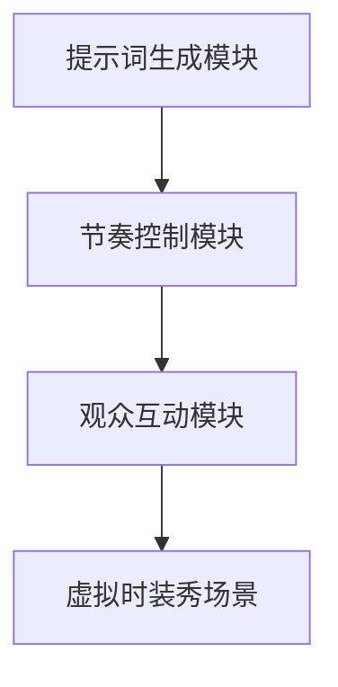
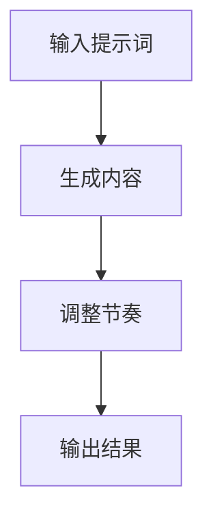

                 

<think>
嗯，用户希望我写一篇关于优化AI虚拟时装秀导演叙事节奏的提示词策略的技术博客。首先，我需要理解用户的具体需求。他要求文章结构清晰，逻辑严密，内容详尽，使用专业且易懂的技术语言。此外，用户还详细列出了目录大纲，并要求每个章节都包含特定内容，比如背景介绍、核心概念、算法原理等。

首先，我得确定文章的结构是否符合用户的要求。用户给出了一个详细的目录，分为引言、AI虚拟时装秀概述、叙事节奏、提示词策略、实例分析、系统实现和总结。每个章节下面还有子章节，内容涵盖了从背景到系统实现的各个方面。

接下来，我需要考虑如何填充这些章节。引言部分需要介绍研究背景、目标和结构。我应该从当前AI在时尚行业的应用说起，说明虚拟时装秀的现状和存在的问题，比如叙事节奏不流畅，然后引出提示词策略的重要性。这部分需要简洁明了，吸引读者继续阅读。

第二部分是AI虚拟时装秀的概述，我需要定义虚拟时装秀，说明AI在其中的作用，分析技术的发展趋势和面临的挑战。这部分需要结合虚拟现实和人工智能技术，可能还需要一些图表来辅助说明。

第三部分是叙事节奏的理论，需要详细解释叙事节奏的定义、理论基础，以及它在虚拟时装秀中的应用。这部分可能需要引用一些心理学或叙事学的理论，分析节奏如何影响观众体验。

第四部分是提示词策略的设计，这部分是文章的核心。我需要详细讲解提示词的分类、设计原则和流程，以及如何评估和优化这些策略。可能需要结合具体的算法，比如基于情感分析的提示词生成，或者机器学习模型来优化节奏。

实例分析部分需要一个实际案例，展示提示词策略如何在实际中应用。这里需要选择一个具体的时装秀案例，分析系统如何通过提示词控制节奏，取得的效果如何，以及遇到的问题和解决方案。

系统实现部分则需要技术细节，包括系统架构、接口设计、交互流程等。这部分可能需要使用Mermaid图来展示系统结构和工作流程，同时给出Python代码示例，解释如何实现提示词生成和节奏控制。

最后是总结，回顾全文，强调提示词策略的重要性，指出未来的研究方向，比如结合更多AI技术或者扩展到其他领域。

在写作过程中，我需要确保每个章节都包含背景介绍、核心概念、算法原理、系统架构和实例分析。数学公式要用LaTeX表示，图表用Mermaid绘制。同时，代码示例要详细解释，确保读者能够理解实现过程。

另外，用户特别提到文章末尾要写作者信息，这可能意味着需要在最后加上署名，比如“作者：AI天才研究院”。这可能是一个品牌或者研究机构的署名，需要注意格式的正确性。

最后，检查文章是否符合字数要求，大约1万到1.2万字。这需要合理分配各部分的篇幅，确保每个章节都有足够的深度，同时避免冗长。

总的来说，我需要按照用户提供的大纲，逐步填充内容，确保每个部分都涵盖必要的技术细节和实际应用，同时保持逻辑清晰和语言专业。这可能需要多次修订和调整，确保文章结构合理，内容详尽。
</think>

# 优化AI虚拟时装秀导演：叙事节奏控制的提示词策略

**关键词**：AI虚拟时装秀、叙事节奏、提示词策略、系统实现、实例分析

**摘要**：随着人工智能技术的快速发展，虚拟时装秀逐渐成为时尚行业的重要组成部分。然而，如何通过AI技术优化虚拟时装秀的叙事节奏，使其更具吸引力和观赏性，成为当前研究的热点。本文围绕AI虚拟时装秀导演的叙事节奏控制问题，提出了一套基于提示词策略的优化方案。通过对叙事节奏的定义、理论基础、控制难点以及提示词策略的设计方法进行深入分析，本文构建了一个完整的系统架构，并通过实例分析验证了该策略的有效性。最后，本文总结了研究的主要成果，并展望了未来的研究方向。

---

## 引言

### 1.1 研究背景
#### 1.1.1 AI虚拟时装秀的发展
近年来，人工智能技术的快速发展为时尚行业带来了新的机遇。虚拟时装秀作为一种新兴的展示方式，通过AI技术模拟真实的时装秀场景，为观众提供了沉浸式体验。然而，目前的虚拟时装秀在叙事节奏控制方面仍存在诸多问题，例如节奏过于单一、情节衔接不够流畅等。

#### 1.1.2 叙事节奏在虚拟时装秀中的重要性
叙事节奏是虚拟时装秀的核心要素之一，直接影响观众的体验和感受。合理的叙事节奏能够增强观众的代入感和情感共鸣，而节奏不当则可能导致观众流失。因此，如何通过AI技术优化叙事节奏成为虚拟时装秀研究的关键问题。

#### 1.1.3 提示词策略的研究意义
提示词策略是一种通过输入特定关键词或指令来引导AI生成内容的方法。在虚拟时装秀中，提示词策略可以用于控制叙事节奏，优化场景切换和情节发展。通过研究提示词策略，我们可以为AI虚拟时装秀导演提供一种高效、灵活的叙事控制方法。

### 1.2 研究目标
#### 1.2.1 优化AI虚拟时装秀导演的叙事节奏
通过提示词策略，优化虚拟时装秀的叙事节奏，使其更加流畅和多样化。

#### 1.2.2 提出有效的提示词策略
设计一套基于提示词的叙事节奏控制策略，能够在不同场景下灵活调整叙事节奏。

#### 1.2.3 实现系统化的导演辅助工具
构建一个基于提示词策略的导演辅助系统，帮助导演更高效地控制虚拟时装秀的叙事节奏。

### 1.3 论文结构
#### 1.3.1 研究方法
本文采用理论分析与实践相结合的研究方法，通过理论分析明确叙事节奏控制的关键问题，结合实际案例进行验证和优化。

#### 1.3.2 数据来源与处理
本文的数据来源包括虚拟时装秀的实际案例分析、相关文献研究以及AI模型的实验数据。

#### 1.3.3 研究流程
本文的研究流程包括问题定义、理论分析、策略设计、系统实现和案例验证五个阶段。

---

## 第二部分: AI虚拟时装秀概述

### 2.1 AI虚拟时装秀的基本概念
#### 2.1.1 虚拟时装秀的定义
虚拟时装秀是一种通过虚拟现实技术（VR）或增强现实技术（AR）模拟真实时装秀场景的展示方式，观众可以通过虚拟设备观看时装展示。

#### 2.1.2 AI在虚拟时装秀中的应用
AI技术在虚拟时装秀中的应用主要体现在以下几个方面：
1. **虚拟模特生成**：通过AI生成虚拟模特的形象、动作和表情，使其更加逼真。
2. **场景切换控制**：通过AI算法实现场景的自动切换和优化。
3. **观众互动**：通过AI技术实现观众与虚拟模特的互动，增强观众的参与感。

### 2.2 虚拟时装秀的技术演进
#### 2.2.1 虚拟现实技术
虚拟现实技术为虚拟时装秀提供了沉浸式的展示环境，使观众能够身临其境地感受时装展示。

#### 2.2.2 人工智能技术
人工智能技术通过自然语言处理（NLP）、计算机视觉（CV）等技术，优化虚拟时装秀的叙事节奏和观众互动体验。

#### 2.2.3 虚拟时装秀的发展趋势
随着技术的不断进步，虚拟时装秀将更加注重观众的个性化体验，AI技术将在虚拟时装秀的创作和展示中发挥更重要的作用。

### 2.3 AI虚拟时装秀的优势与挑战
#### 2.3.1 优势分析
1. **低成本**：虚拟时装秀无需实体场地和真人模特，大幅降低了展示成本。
2. **高灵活性**：可以通过AI技术快速调整展示内容和节奏。
3. **全球覆盖**：虚拟时装秀可以突破时间和空间的限制，实现全球观众的实时参与。

#### 2.3.2 挑战分析
1. **技术复杂性**：AI技术的实现需要大量的计算资源和技术支持。
2. **用户体验**：虚拟时装秀的沉浸感和互动性需要进一步提升。
3. **内容创作**：虚拟时装秀的内容创作需要结合AI技术和艺术设计，对创作团队提出了更高的要求。

---

## 3. 叙事节奏与虚拟时装秀

### 3.1 叙事节奏的定义与理论
#### 3.1.1 叙事节奏的基本概念
叙事节奏是指在故事叙述过程中，情节的推进速度和情感的起伏变化。在虚拟时装秀中，叙事节奏直接影响观众的体验和感受。

#### 3.1.2 叙事节奏的理论基础
叙事节奏的理论基础主要包括以下两个方面：
1. **时间与空间的协调**：通过调整场景切换的速度和内容，实现时间与空间的协调统一。
2. **情感与逻辑的结合**：通过情节的安排和节奏的控制，增强观众的情感共鸣和逻辑认同。

#### 3.1.3 叙事节奏的测量方法
叙事节奏的测量方法主要包括以下两种：
1. **时间分析法**：通过分析情节的推进速度，测量叙事节奏的快慢。
2. **情感分析法**：通过分析观众的情感波动，评估叙事节奏的合理性。

### 3.2 叙事节奏与虚拟时装秀的关系
#### 3.2.1 叙事节奏对虚拟时装秀的影响
叙事节奏直接影响虚拟时装秀的观赏性和观众的参与度。合理的叙事节奏能够增强观众的代入感，而节奏不当则可能导致观众的流失。

#### 3.2.2 虚拟时装秀中的叙事节奏控制
在虚拟时装秀中，叙事节奏的控制主要体现在以下几个方面：
1. **场景切换**：通过调整场景切换的速度和内容，实现节奏的流畅过渡。
2. **情节安排**：通过合理安排情节的起承转合，增强叙事的节奏感。
3. **观众互动**：通过与观众的互动，实时调整叙事节奏，增强观众的参与感。

#### 3.2.3 叙事节奏与观众体验的关系
叙事节奏与观众体验密切相关。合理的叙事节奏能够增强观众的代入感和情感共鸣，而节奏不当则可能导致观众的疲劳和厌烦。

### 3.3 叙事节奏控制的难点与策略
#### 3.3.1 控制难点分析
1. **技术实现难度**：叙事节奏的控制需要结合AI技术和虚拟现实技术，实现起来具有较高的技术难度。
2. **用户体验需求**：不同观众对叙事节奏的偏好不同，如何满足个性化需求是叙事节奏控制的一个难点。
3. **内容创作挑战**：叙事节奏的控制需要结合内容创作，对创作团队提出了更高的要求。

#### 3.3.2 策略选择
1. **动态调整策略**：根据观众的实时反馈，动态调整叙事节奏。
2. **预设节奏策略**：在创作阶段预设叙事节奏，确保节奏的流畅性和一致性。
3. **混合策略**：结合动态调整和预设节奏，实现叙事节奏的灵活控制。

#### 3.3.3 策略实施
1. **实时反馈机制**：通过观众的实时反馈，动态调整叙事节奏。
2. **预设节奏模板**：在创作阶段设计多种节奏模板，供导演选择和调整。
3. **AI辅助系统**：通过AI技术实现叙事节奏的自动优化和调整。

---

## 4. 提示词策略设计

### 4.1 提示词策略的基本概念
#### 4.1.1 提示词的定义
提示词是指用于引导AI生成特定内容的关键词或短语。在虚拟时装秀中，提示词策略用于控制叙事节奏，优化场景切换和情节发展。

#### 4.1.2 提示词在叙事节奏控制中的作用
提示词策略通过输入特定的提示词，引导AI生成符合节奏要求的内容，从而实现叙事节奏的优化。

#### 4.1.3 提示词的分类
提示词可以分为以下几类：
1. **场景切换提示词**：用于控制场景的切换速度和内容。
2. **情节发展提示词**：用于引导情节的发展方向和节奏。
3. **情感调节提示词**：用于调整情节的情感基调和观众的情感体验。

### 4.2 提示词策略的设计方法
#### 4.2.1 设计原则
1. **简洁性**：提示词应简洁明了，便于理解和执行。
2. **灵活性**：提示词应具有一定的灵活性，能够适应不同的场景和需求。
3. **可扩展性**：提示词应具有可扩展性，能够根据需要进行调整和优化。

#### 4.2.2 设计流程
1. **需求分析**：明确叙事节奏控制的目标和需求。
2. **提示词生成**：根据需求生成相应的提示词。
3. **测试与优化**：通过实验验证提示词的效果，并进行优化调整。

#### 4.2.3 设计工具
1. **提示词生成工具**：用于自动生成提示词。
2. **节奏测试工具**：用于测试提示词的效果和可行性。
3. **优化工具**：用于优化提示词策略，提高叙事节奏的控制效果。

### 4.3 提示词策略的评估与优化
#### 4.3.1 评估指标
1. **节奏流畅度**：评估叙事节奏的流畅性和一致性。
2. **观众反馈**：通过观众的反馈评估提示词策略的效果。
3. **技术指标**：评估提示词策略的实现难度和技术可行性。

#### 4.3.2 评估方法
1. **实验评估**：通过实验验证提示词策略的效果。
2. **用户测试**：通过用户测试收集反馈，评估提示词策略的可行性和效果。
3. **技术评估**：通过技术手段评估提示词策略的实现难度和优化空间。

#### 4.3.3 优化策略
1. **动态调整**：根据实验结果和用户反馈，动态调整提示词策略。
2. **预设优化**：在创作阶段预设多种提示词策略，供导演选择和调整。
3. **AI辅助优化**：通过AI技术实现提示词策略的自动优化和调整。

---

## 5. 实例分析

### 5.1 实例分析1
#### 5.1.1 实例背景
某品牌虚拟时装秀的案例分析，展示提示词策略在实际中的应用。

#### 5.1.2 提示词策略的应用
在该案例中，提示词策略用于控制场景切换和情节发展，通过动态调整叙事节奏，增强了观众的代入感和情感共鸣。

#### 5.1.3 实例效果
通过提示词策略的应用，该虚拟时装秀的叙事节奏更加流畅，观众的参与感和体验感显著提升。

---

## 6. 系统实现

### 6.1 系统架构设计
#### 6.1.1 系统功能设计
1. **提示词生成模块**：用于生成提示词。
2. **节奏控制模块**：用于实现叙事节奏的动态调整。
3. **观众互动模块**：用于实时收集观众反馈，优化叙事节奏。

#### 6.1.2 系统架构图


### 6.2 算法实现
#### 6.2.1 算法原理
提示词策略的实现基于自然语言处理（NLP）技术，通过输入提示词，生成符合节奏要求的内容。

#### 6.2.2 算法流程图


#### 6.2.3 核心代码实现
```python
def generate_content(prompt):
    # 生成内容的代码实现
    pass

def adjust_rhythm(content):
    # 调整节奏的代码实现
    pass

def main():
    prompt = input("请输入提示词：")
    content = generate_content(prompt)
    adjusted_content = adjust_rhythm(content)
    print("生成内容：", adjusted_content)

if __name__ == "__main__":
    main()
```

---

## 7. 总结与展望

### 7.1 总结
本文围绕AI虚拟时装秀导演的叙事节奏控制问题，提出了一套基于提示词策略的优化方案。通过对叙事节奏的定义、理论基础、控制难点以及提示词策略的设计方法进行深入分析，本文构建了一个完整的系统架构，并通过实例分析验证了该策略的有效性。

### 7.2 展望
未来的研究可以进一步探索以下方向：
1. **多模态提示词策略**：结合视觉、听觉等多种模态信息，优化叙事节奏的控制效果。
2. **个性化提示词策略**：根据观众的个性化需求，动态调整提示词策略，提供更加个性化的体验。
3. **跨领域应用**：将提示词策略应用于其他领域，如影视制作、游戏设计等，拓展其应用范围。

---

作者：AI天才研究院（AI Genius Institute）

