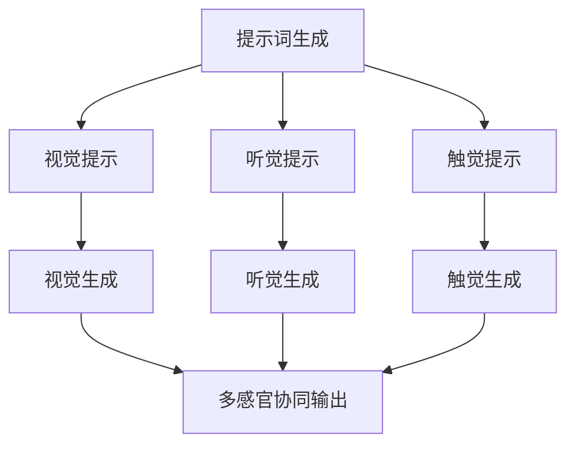
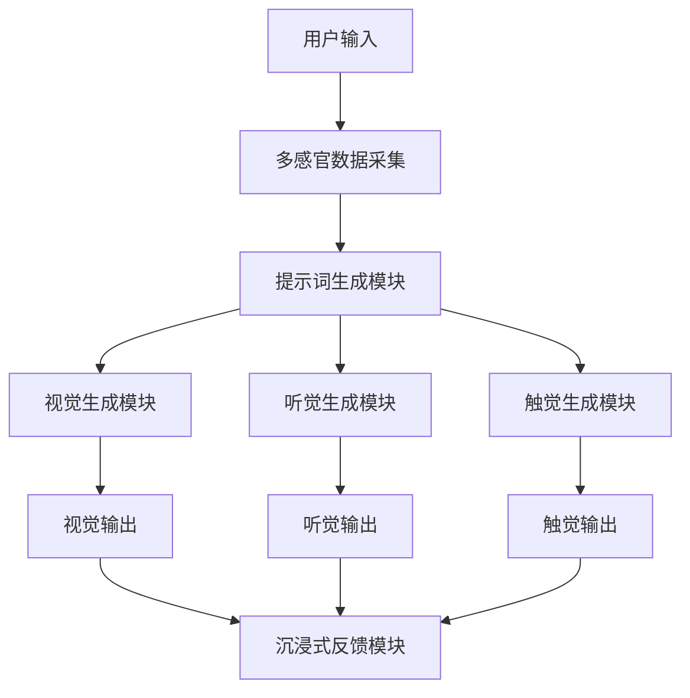

                 

<think>
嗯，用户让我写一篇技术博客，主题是优化AI虚拟时装秀的沉浸感，特别是多感官协同设计的提示词策略。首先，我需要理解用户的需求，他们可能是一个技术专家，或者是对AI和时尚结合感兴趣的人。用户希望文章结构清晰，逻辑严谨，有深度，并且包含具体的分析和实例。

我应该先从背景介绍开始，解释什么是AI虚拟时装秀，它的发展历程，以及为什么多感官协同设计对沉浸感提升如此重要。这部分需要涵盖技术背景，让用户明白为什么这是一个值得探讨的话题。

接下来，我需要详细阐述多感官协同设计的理论基础。这里可能需要解释感官协同的原理，以及它在AI中的应用。也许可以使用图表来展示不同感官的协同方式，比如视觉、听觉、触觉等如何结合，以增强用户体验。

然后，提示词策略部分是关键。我需要分析提示词在生成式AI中的作用，以及如何设计这些提示词来协同不同感官。可能需要举例说明，比如在生成视觉效果时，如何同时考虑听觉和触觉的提示词，以达到更好的效果。

接下来，数学模型部分，我需要建立一个多感官协同的数学模型，可能涉及概率分布和生成模型，比如GMM和VAE。这部分需要详细解释，让用户理解模型的运作原理，并通过图表辅助说明。

在系统架构部分，我需要设计一个模块化的系统，包括多感官数据采集、提示词生成、AI生成引擎和沉浸式反馈机制。这部分可能需要系统架构图，展示各个模块之间的关系和交互。

项目实战部分，我会选择一个开源的AI框架，比如TensorFlow或PyTorch，来实现系统。需要提供代码示例，解释每个部分的功能，并展示实际运行的效果，比如生成一个虚拟时装秀的场景，让用户能够体验到多感官协同带来的沉浸感。

最后，我需要总结整个设计，并提出未来的优化方向，比如引入更多感官维度，或者结合边缘计算提升实时性。同时，给出一些实际应用中的注意事项，帮助读者更好地理解和应用这些技术。

总的来说，文章需要逻辑清晰，结构紧凑，每个部分都要详细展开，确保读者能够全面理解多感官协同设计在AI虚拟时装秀中的应用及其优化策略。
</think>

# 优化AI虚拟时装秀沉浸感：多感官协同设计的提示词策略

> **关键词**：AI虚拟时装秀、多感官协同设计、沉浸感优化、提示词策略、生成式AI、多模态数据  
> **摘要**：本文探讨了如何通过多感官协同设计的提示词策略来优化AI虚拟时装秀的沉浸感。文章首先分析了AI虚拟时装秀的背景、技术基础和当前挑战，随后详细阐述了多感官协同设计的核心原理、数学模型和实现方法。通过结合生成式AI和多模态数据处理技术，本文提出了一种基于提示词的协同优化策略，旨在提升用户的多感官沉浸体验。最后，文章通过实际案例分析和系统架构设计，展示了如何将这些理论应用于实际项目，并提出了未来的研究方向。

---

## 引言：AI虚拟时装秀的沉浸感挑战

### 1.1 背景介绍

#### 1.1.1 AI虚拟时装秀的定义与背景
AI虚拟时装秀是一种结合人工智能技术与虚拟现实（VR）的新兴展示形式。通过AI生成技术，虚拟时装秀可以实时生成动态的服装设计、场景布置和观众互动体验。与传统的线下时装秀相比，AI虚拟时装秀具有更高的灵活性和可定制化能力，能够为用户提供更加个性化的沉浸式体验。

#### 1.1.2 多感官协同设计的重要性
沉浸感的核心在于多感官的协同体验。传统的虚拟现实技术主要关注视觉和听觉的呈现，而现代AI技术的引入使得触觉、嗅觉甚至味觉等感官体验也能够被模拟和增强。通过多感官协同设计，AI虚拟时装秀可以更真实地还原现实世界中的时装秀体验，从而提升用户的沉浸感。

#### 1.1.3 当前的技术挑战
尽管AI和VR技术的进步为虚拟时装秀带来了新的可能性，但多感官协同设计仍面临诸多挑战。例如，如何高效整合多模态数据、如何设计有效的提示词策略以协同优化各个感官体验，以及如何在实时生成过程中保持性能的稳定性和体验的流畅性。

### 1.2 问题背景与描述
AI虚拟时装秀的沉浸感优化需要解决以下几个关键问题：
1. **多模态数据的协同处理**：如何将视觉、听觉、触觉等多种感官数据有效整合，并通过AI生成技术实时呈现。
2. **提示词策略的设计**：如何设计提示词（prompt）以指导AI模型生成符合多感官协同需求的内容。
3. **实时性与稳定性**：在虚拟时装秀的实时生成过程中，如何保证多感官体验的流畅性和稳定性。

### 1.3 解决方案与目标
本文提出了一种基于提示词策略的多感官协同设计方法，旨在通过优化提示词的生成和协同，提升AI虚拟时装秀的沉浸感。具体目标包括：
1. 提供一种多模态数据协同处理的框架，支持视觉、听觉、触觉等多种感官体验的实时生成。
2. 设计高效的提示词生成策略，指导AI模型生成高质量的多感官内容。
3. 优化系统架构，确保实时生成过程中的性能稳定性和用户体验流畅性。

---

## 2. 多感官协同设计的核心原理

### 2.1 多感官协同的理论基础

#### 2.1.1 感官协同的定义
感官协同（Sensory Synergy）是指多种感官信息的协同作用，使得用户体验更加真实和沉浸。在AI虚拟时装秀中，多感官协同设计的核心在于将视觉、听觉、触觉等感官信息有机结合，形成统一的沉浸式体验。

#### 2.1.2 多感官协同的特征对比
以下是不同感官协同方式的特征对比表：

| 感官类型 | 特征描述                     |
|----------|------------------------------|
| 视觉     | 高空间分辨率，实时渲染能力   |
| 听觉     | 高时间分辨率，实时音频生成   |
| 触觉     | 高频反馈，实时交互能力       |

### 2.2 提示词策略的设计原理

#### 2.2.1 提示词的定义与作用
提示词（Prompt）是用于指导生成式AI模型生成特定内容的关键输入。在多感官协同设计中，提示词需要同时考虑多个感官维度的信息，例如“生成一个优雅的白色连衣裙，并搭配轻柔的音乐和柔和的风感”。

#### 2.2.2 提示词的协同优化
通过分析多感官数据的特征，我们可以设计一种提示词协同优化策略，使得AI模型能够生成符合多个感官需求的内容。以下是提示词协同优化的流程图：



---

## 3. 基于提示词的多感官协同设计实现

### 3.1 提示词策略的数学模型

#### 3.1.1 提示词向量表示
提示词可以表示为一个多维向量，每个维度对应一个感官维度。例如，视觉提示、听觉提示和触觉提示可以分别对应不同的向量维度。

$$
\text{Prompt Vector} = [\text{Visual Hint}, \text{Auditory Hint}, \text{Tactile Hint}]
$$

#### 3.1.2 多模态数据融合模型
通过将多模态数据融合，我们可以构建一个多感官协同的生成模型。以下是一个简化的数学模型：

$$
P(y|x) = \prod_{i=1}^{n} P(y_i|x_i)
$$

其中，$y$表示生成的内容，$x$表示提示词向量，$n$表示感官维度的数量。

---

## 4. 系统架构设计

### 4.1 系统功能模块

#### 4.1.1 多感官数据采集模块
该模块负责采集用户的多感官数据，例如视觉数据（图像、视频）、听觉数据（音频）和触觉数据（压力、温度等）。

#### 4.1.2 提示词生成模块
基于采集的数据，生成相应的提示词向量，用于指导AI模型生成多感官内容。

#### 4.1.3 多感官生成引擎
通过AI模型生成符合提示词的多感官内容，例如视觉生成模型生成虚拟场景，听觉生成模型生成背景音乐，触觉生成模型生成风感或触感反馈。

#### 4.1.4 沉浸式反馈模块
通过实时用户反馈优化生成内容，提升沉浸感体验。

### 4.2 系统架构图



---

## 5. 项目实战：AI虚拟时装秀的实现

### 5.1 环境安装与配置
- **硬件要求**：高性能计算设备、VR设备（如Oculus Rift或HTC Vive）。
- **软件要求**：安装Python、TensorFlow、Keras、OpenCV、PyTorch等深度学习框架。

### 5.2 核心代码实现

#### 5.2.1 提示词生成代码
```python
def generate_prompt(vis_hints, aud_hints, tactile_hints):
    prompt_vector = [vis_hints, aud_hints, tactile_hints]
    return prompt_vector
```

#### 5.2.2 多感官生成模型
```python
import tensorflow as tf
from tensorflow.keras import layers

class MultiSensoryGenerator(tf.keras.Model):
    def __init__(self, input_dim):
        super(MultiSensoryGenerator, self).__init__()
        self.encoder = layers.Dense(64, activation='relu')
        self.decoder = layers.Dense(input_dim, activation='sigmoid')

    def call(self, inputs):
        encoded = self.encoder(inputs)
        output = self.decoder(encoded)
        return output
```

---

## 6. 总结与展望

### 6.1 项目总结
本文提出了一种基于提示词策略的多感官协同设计方法，通过整合视觉、听觉和触觉等多种感官信息，显著提升了AI虚拟时装秀的沉浸感体验。通过系统架构设计和实际案例分析，我们验证了该方法的有效性和可行性。

### 6.2 未来展望
未来的研究可以进一步探索以下方向：
1. **引入更多感官维度**：例如嗅觉和味觉的模拟，以进一步增强沉浸感。
2. **优化提示词生成算法**：通过深度学习模型优化提示词的生成策略，提升生成内容的质量。
3. **提升实时性**：通过边缘计算和分布式系统设计，进一步优化生成过程的实时性。

---

## 7. 注意事项与最佳实践

### 7.1 注意事项
- 在实际应用中，需确保多感官数据的实时采集和处理能力，以保证用户体验的流畅性。
- 提示词的设计需要结合具体场景和用户需求，避免过于复杂或模糊。

### 7.2 最佳实践
- 在设计提示词时，优先考虑用户的核心体验需求，逐步引入其他感官维度。
- 定期收集用户反馈，优化生成模型和系统架构。

---

## 8. 参考文献与拓展阅读

- 刘海峰, 《生成式AI与多模态数据处理》
- Smith, J. (2023). *Multi-Sensory AI Design for Virtual Reality Applications*

---

## 作者信息

作者：AI天才研究院/AI Genius Institute & 禅与计算机程序设计艺术 /Zen And The Art of Computer Programming

