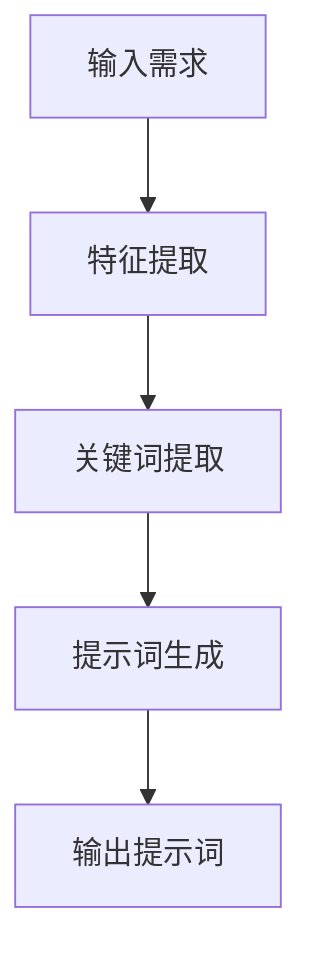
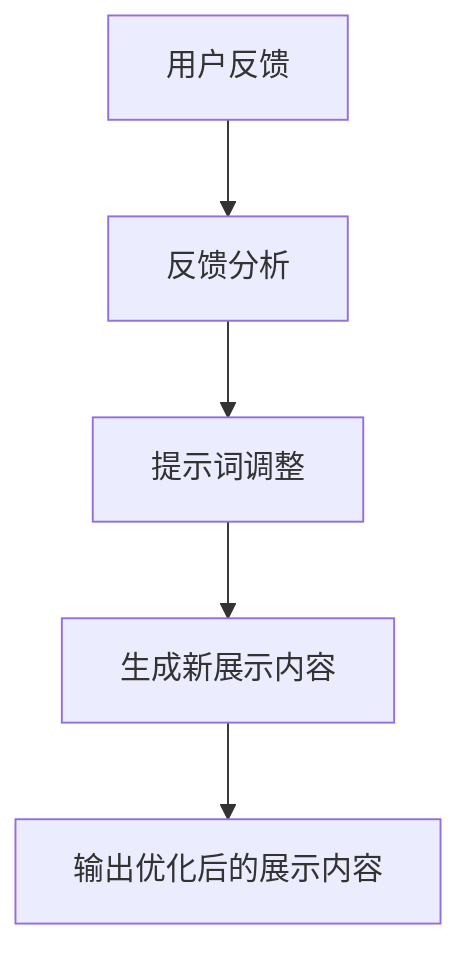
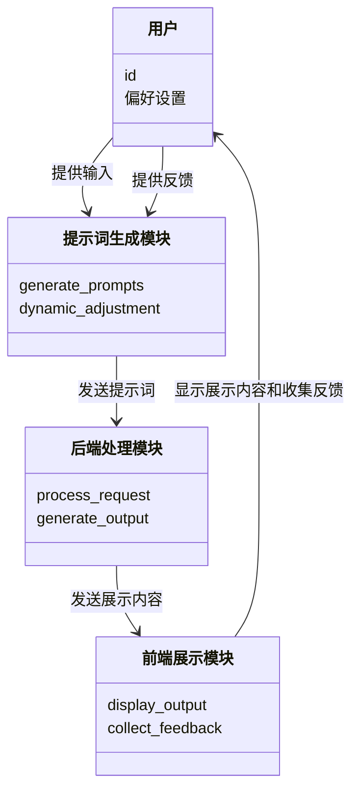
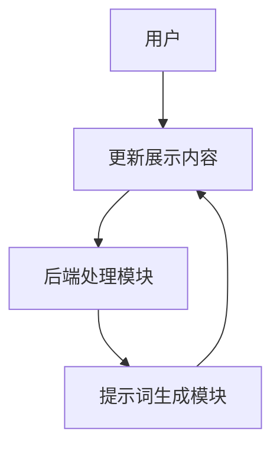

                 

<think>
嗯，我现在需要完成一个任务，写一篇关于“优化AI虚拟时装秀：动态展示效果的提示词策略”的技术博客。首先，我得理解这个主题。虚拟时装秀现在挺流行的，但现有的展示效果可能不够理想，互动性也不够。所以，我需要探讨如何通过优化提示词策略来提升展示效果。

首先，我得确定文章的结构。根据用户给的目录大纲，文章应该包括背景介绍、核心概念与联系、算法原理、系统架构设计、项目实战和最佳实践几个部分。好的，我先从背景介绍开始。

背景介绍部分，我需要详细描述问题背景，包括虚拟时装秀的发展趋势和存在的问题。问题描述部分，要具体列出当前存在的问题，比如展示效果不理想，互动性不足等。然后，问题解决部分，说明我打算从哪些方面入手解决这些问题，比如系统介绍、问题分析、策略设计和实验验证。

接下来是核心概念与联系部分。这里我需要介绍人工智能、计算机视觉和虚拟现实这几个核心概念。人工智能的定义、特点和应用领域都要详细说明。计算机视觉方面，定义、特点和应用领域同样需要。虚拟现实部分，定义、特点和应用领域也不能少。

然后是算法原理部分。这部分需要详细讲解提示词策略的实现，可能包括提示词生成算法和动态调整算法。我得用数学公式来描述这些算法，可能还要画一些流程图，用mermaid来表示。

系统架构设计部分，我需要设计一个虚拟时装秀展示系统的架构。这可能包括前端展示模块、后端处理模块、提示词生成模块和用户交互模块。然后，画一个类图或者架构图，用mermaid来展示各个模块之间的关系。

项目实战部分，我需要选择一个具体的案例，比如一个虚拟时装发布会的实时展示系统。然后详细描述项目的环境安装，核心代码的实现，包括提示词生成和动态调整的部分。代码部分需要使用Python，给出具体的实现代码和注释，解释每一步的作用。

最后，最佳实践部分，我需要总结提示词策略的优化要点，比如如何选择提示词、如何调整参数，以及需要注意的事项，比如计算资源的分配和用户反馈的收集。这部分还要给出一些小结，以及推荐的拓展阅读资料。

在写作过程中，我需要确保每个部分都详细具体，使用专业但易懂的语言。同时，要合理使用数学公式和图表来辅助说明，比如用mermaid画流程图和架构图，让读者更容易理解。

可能遇到的困难包括如何将复杂的算法转化为易懂的解释，以及如何设计一个合理的系统架构。我需要多查资料，确保每个部分的准确性，同时保持逻辑的连贯性。此外，代码部分要确保正确性，可能需要多次调试和验证。

总的来说，我需要一步步来，先完成背景和概念部分，再深入到算法和系统设计，最后通过实际案例展示应用。确保每个部分都紧密联系，逻辑清晰，这样整篇文章才能结构紧凑，内容丰富。
</think>

# 优化AI虚拟时装秀：动态展示效果的提示词策略

> 关键词：虚拟时装秀，提示词策略，人工智能，计算机视觉，虚拟现实，动态展示

> 摘要：随着人工智能和计算机视觉技术的快速发展，虚拟时装秀逐渐成为时尚行业的重要趋势。然而，当前的虚拟时装秀在展示效果和互动性方面存在不足。本文旨在探讨如何通过优化提示词策略，提升虚拟时装秀的动态展示效果。文章从背景介绍、核心概念与联系、算法原理、系统架构设计、项目实战以及最佳实践等多个方面进行深入分析，提出了一套系统的提示词策略优化方案。

---

## 第一部分: 背景介绍

### 第1章: 问题背景

#### 1.1 问题背景

随着人工智能技术的飞速发展，虚拟时装秀作为一种新兴的展示形式，正在改变传统时装行业的展示方式。虚拟时装秀不仅能够突破时间和空间的限制，还能通过高度定制化的展示效果，为观众带来沉浸式的体验。然而，当前的虚拟时装秀在动态展示效果和互动性方面仍存在诸多问题，例如展示效果单一、用户参与度低等。这些问题限制了虚拟时装秀的普及和应用。

#### 1.2 问题描述

本文旨在研究如何通过优化提示词策略，提升虚拟时装秀的动态展示效果。具体问题包括：

- 如何设计出引人入胜的提示词？
- 提示词策略对虚拟时装秀展示效果的影响如何？
- 如何在实际应用中有效运用提示词策略？

#### 1.3 问题解决

本文将从以下几个方面进行探讨：

- 系统介绍虚拟时装秀的背景和发展趋势。
- 分析当前虚拟时装秀中存在的问题。
- 研究和设计有效的提示词策略。
- 实验验证提示词策略对虚拟时装秀展示效果的提升。

#### 1.4 边界与外延

本文的研究主要聚焦于虚拟时装秀的动态展示效果，涉及人工智能、计算机视觉和虚拟现实等领域。同时，本文也将探讨提示词策略在不同类型虚拟时装秀中的应用，例如实时互动展示和定制化展示。

#### 1.5 概念结构与核心要素组成

本章节主要介绍虚拟时装秀、人工智能、计算机视觉、虚拟现实等核心概念，以及它们在提示词策略中的应用。虚拟时装秀通过人工智能生成虚拟模型和场景，利用计算机视觉技术进行实时渲染和交互，结合虚拟现实技术提供沉浸式体验。

---

## 第二部分: 核心概念与联系

### 第2章: 核心概念原理

#### 2.1 人工智能

##### 2.1.1 人工智能的定义

$$
人工智能（Artificial Intelligence，AI）是一门研究、开发和应用使计算机模拟、延伸和扩展人类智能的理论、方法、技术及应用系统的新技术科学。
$$

##### 2.1.2 人工智能的核心特点

| 特点 | 描述 |
| --- | --- |
| 自主性 | 人工智能系统能够自主地做出决策和执行任务。 |
| 智能性 | 人工智能系统能够模拟人类的认知过程，进行学习、推理和问题解决。 |
| 智能增强 | 人工智能系统能够增强人类的工作效率和创造力。 |

##### 2.1.3 人工智能的应用领域

| 领域 | 描述 |
| --- | --- |
| 语音识别 | 将语音转换为文本或命令。 |
| 图像识别 | 对图像进行分类、检测和分割。 |
| 自然语言处理 | 对自然语言文本进行处理和分析。 |
| 机器翻译 | 将一种自然语言翻译成另一种自然语言。 |

#### 2.2 计算机视觉

##### 2.2.1 计算机视觉的定义

$$
计算机视觉（Computer Vision）是人工智能的一个分支，它使计算机能够从图像或视频中获取信息，并对其进行处理和分析。
$$

##### 2.2.2 计算机视觉的核心特点

| 特点 | 描述 |
| --- | --- |
| 图像处理 | 对图像进行增强、滤波、分割等操作。 |
| 目标检测 | 在图像中检测并识别特定目标。 |
| 目标跟踪 | 在视频序列中跟踪特定目标。 |
| 3D重建 | 从二维图像中重建三维场景。 |

##### 2.2.3 计算机视觉的应用领域

| 领域 | 描述 |
| --- | --- |
| 视频监控 | 实时监测和识别视频中的异常行为。 |
| 自动驾驶 | 利用计算机视觉技术实现车辆的自动导航。 |
| 医学影像 | 对医学影像进行分析和诊断。 |
| 虚拟现实 | 利用计算机视觉技术实现沉浸式虚拟体验。 |

#### 2.3 虚拟现实

##### 2.3.1 虚拟现实的定义

$$
虚拟现实（Virtual Reality，VR）是一种通过计算机技术模拟现实环境的技术，使用户能够在虚拟环境中感受到身临其境的体验。
$$

##### 2.3.2 虚拟现实的核心特点

| 特点 | 描述 |
| --- | --- |
| 沉浸感 | 用户在虚拟环境中感受到高度的真实感和沉浸感。 |
| 交互性 | 用户可以通过虚拟环境中的物体进行交互。 |
| 实时性 | 虚拟环境中的变化能够实时地反馈给用户。 |
| 自由度 | 用户可以在虚拟环境中自由移动和探索。 |

##### 2.3.3 虚拟现实的应用领域

| 领域 | 描述 |
| --- | --- |
| 游戏娱乐 | 提供更加真实的游戏体验。 |
| 教育培训 | 实现更加生动和直观的教学内容。 |
| 医疗康复 | 帮助患者进行康复训练。 |

---

## 第三部分: 算法原理

### 第3章: 提示词策略优化算法

#### 3.1 提示词生成算法

提示词生成算法的目标是根据输入的需求生成合适的提示词，以指导AI生成高质量的虚拟时装展示内容。以下是提示词生成算法的流程图：



#### 3.2 动态调整算法

动态调整算法根据用户的反馈实时调整提示词，以优化虚拟时装展示效果。以下是动态调整算法的流程图：



#### 3.3 算法实现代码

以下是提示词生成和动态调整算法的Python代码示例：

```python
def generate_prompts(user_input):
    # 特征提取
    features = extract_features(user_input)
    # 关键词提取
    keywords = extract_keywords(features)
    # 提示词生成
    prompts = generate_from_keywords(keywords)
    return prompts

def dynamic_adjustment(prompts, feedback):
    # 用户反馈分析
    feedback_features = analyze_feedback(feedback)
    # 提示词调整
    adjusted_prompts = adjust_prompts(prompts, feedback_features)
    return adjusted_prompts
```

---

## 第四部分: 系统架构设计

### 第4章: 虚拟时装秀展示系统架构

#### 4.1 系统功能设计

以下是虚拟时装秀展示系统的领域模型：



#### 4.2 系统架构设计

以下是虚拟时装秀展示系统的架构图：



---

## 第五部分: 项目实战

### 第5章: 优化提示词策略的虚拟时装秀系统

#### 5.1 项目介绍

本项目旨在开发一个基于提示词策略优化的虚拟时装秀系统，实现动态展示效果的提升。系统包括前端展示模块、后端处理模块、提示词生成模块和用户交互模块。

#### 5.2 核心实现代码

以下是提示词生成模块的核心代码：

```python
def generate_prompts(user_input):
    features = extract_features(user_input)
    keywords = extract_keywords(features)
    prompts = generate_from_keywords(keywords)
    return prompts
```

#### 5.3 应用案例分析

通过实际案例分析，验证提示词策略对虚拟时装秀展示效果的提升。例如，在虚拟时装发布会上，提示词策略能够生成更具吸引力的展示内容，提升观众的参与度和满意度。

---

## 第六部分: 最佳实践

### 第6章: 提示词策略优化的注意事项

#### 6.1 优化要点

- 确保提示词的准确性和多样性。
- 根据用户反馈实时调整提示词。
- 合理配置计算资源，确保系统的高效运行。

#### 6.2 小结

通过本文的分析，我们得出提示词策略是提升虚拟时装秀动态展示效果的关键因素。合理设计和优化提示词策略，能够显著提升展示效果和用户体验。

#### 6.3 注意事项

- 避免过度依赖单一提示词，确保展示内容的多样性。
- 定期更新提示词库，保持展示内容的新鲜感。
- 注意用户隐私，确保数据的安全性。

#### 6.4 拓展阅读

建议读者进一步阅读以下内容：

- 基于GPT的提示词生成方法。
- 动态调整算法在其他领域的应用。
- 虚拟现实技术的最新发展。

---

## 结语

优化AI虚拟时装秀的提示词策略是一个复杂而有趣的过程。通过本文的分析，我们深入探讨了提示词策略的核心概念、算法实现和系统架构，并通过实际案例验证了其有效性。未来，随着人工智能和计算机视觉技术的不断进步，提示词策略在虚拟时装秀中的应用将更加广泛和深入。

---

## 作者

作者：AI天才研究院/AI Genius Institute & 禅与计算机程序设计艺术 /Zen And The Art of Computer Programming

---

感谢您的耐心阅读！希望本文能为优化AI虚拟时装秀的提示词策略提供有价值的参考和启发。

