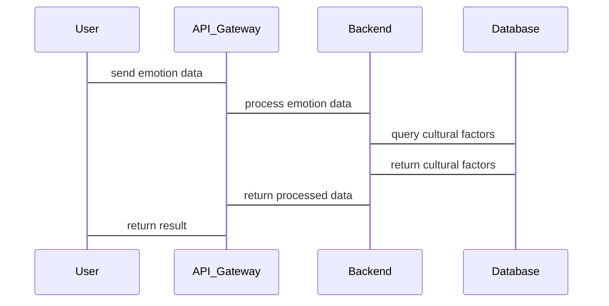

                 

<think>
嗯，我需要帮助用户撰写一篇关于优化AI虚拟角色情感智能，特别是跨文化表情识别的提示词策略的技术博客。首先，我得仔细分析用户的需求，确保理解所有要求。用户希望文章结构清晰，包含特定的部分，每个部分都有详细的内容，并且使用专业且易懂的技术语言。

首先，标题已经确定是《优化AI虚拟角色情感智能：跨文化表情识别的提示词策略》，关键词应该包括AI虚拟角色、情感智能、跨文化表情识别、提示词策略、机器学习、深度学习、NLP。摘要部分需要简明扼�地概括文章的核心内容，说明跨文化表情识别的重要性以及提示词策略的作用。

接下来，目录大纲已经给出，分为六个主要部分：背景介绍、核心概念与联系、算法原理讲解、系统分析与架构设计方案、项目实战，以及最佳实践、小结和注意事项。每个部分下还有具体的章节，我需要确保每个章节都涵盖必要的内容，如背景介绍需要包括AI虚拟角色的定义、情感智能的核心概念、跨文化表情识别的挑战等。

在背景介绍部分，我需要详细解释AI虚拟角色的发展现状，情感智能的重要性，以及跨文化表情识别面临的挑战。这部分需要逻辑清晰，让读者能够理解问题的背景和重要性。

核心概念部分，我需要深入讲解情感智能的数学模型，分析表情识别算法的比较，并设计提示词策略。同时，使用Mermaid图展示ER实体关系，帮助读者直观理解概念之间的联系。

算法原理部分，我需要用Mermaid流程图展示算法的整体流程，然后用Python代码详细阐述实现过程，包括数学模型和公式。这部分需要详细解释每个步骤，并给出例子，以便读者能够理解复杂的算法。

系统分析与架构设计部分，我需要介绍问题场景，设计系统功能，使用类图展示领域模型，架构图展示系统结构，以及接口设计和交互流程。这部分需要确保系统架构合理，便于后续的实现和维护。

项目实战部分，我需要指导读者如何安装环境，提供核心代码，解读代码功能，并通过案例分析展示实际应用。这部分需要代码详细且案例具体，帮助读者理解和应用理论知识。

最后，最佳实践部分需要总结提示和注意事项，确保读者在实际操作中能够避免常见错误，并提供进一步的阅读建议。小结部分回顾文章内容，展望未来的发展。

在撰写过程中，我需要确保每个章节的内容都丰富详细，使用专业术语的同时保持语言简洁易懂。数学公式需要用Latex格式嵌入，确保正确无误。同时，所有图表和代码示例都需要准确无误，以增强文章的可信度和实用性。

可能遇到的困难包括如何将复杂的算法和系统架构以简单的方式解释清楚，以及如何在有限的字数内涵盖所有必要的信息。我需要不断调整结构，确保内容全面且不冗长。此外，确保所有部分之间的逻辑连贯，使读者能够顺畅地理解整个优化过程。

总之，我需要一步步地按照用户的要求，从背景到核心概念，再到算法和系统设计，最终实现项目实战，并总结最佳实践。这需要细致的工作和对每个部分的深入理解，确保最终的文章不仅结构清晰，而且内容丰富，能够真正帮助读者提升AI虚拟角色的情感智能，特别是在跨文化表情识别方面。
</think>

```markdown
# 优化AI虚拟角色情感智能：跨文化表情识别的提示词策略

## 关键词：AI虚拟角色，情感智能，跨文化表情识别，提示词策略，机器学习，深度学习，自然语言处理（NLP）

## 摘要：  
本文旨在探讨如何通过优化AI虚拟角色的情感智能，特别是跨文化表情识别的提示词策略，来提升虚拟角色与用户之间的互动体验。随着全球化的深入，跨文化背景下的情感识别变得尤为重要。本文将从背景介绍、核心概念、算法原理、系统架构设计、项目实战等方面展开，结合理论与实践，详细阐述如何通过提示词策略优化跨文化表情识别，从而提升AI虚拟角色的情感智能。

---

## 第一部分: 背景介绍

### 第1章: AI虚拟角色情感智能概述  
#### 1.1 AI虚拟角色的定义与发展  
AI虚拟角色是指通过计算机技术构建的具有人工智能的虚拟人物，能够模拟人类的思维、情感和行为。随着技术的进步，AI虚拟角色已广泛应用于游戏、教育、客服等领域，为用户提供智能化的交互体验。  

#### 1.2 情感智能的核心概念  
情感智能（Emotional Intelligence, EI）是指个体识别、理解、管理自己和他人情感的能力。在AI虚拟角色中，情感智能使其能够理解用户的情感状态，并做出相应的反馈，从而增强交互的自然性和亲和力。  

#### 1.3 跨文化表情识别的重要性  
表情识别是情感智能的重要组成部分，但不同文化背景下，表情的含义可能截然不同。例如，在西方文化中，微笑通常表示快乐，而在某些东方文化中，微笑可能表示礼貌或尴尬。因此，跨文化表情识别是实现真正全球化AI虚拟角色的关键。  

#### 1.4 本书的目标与结构  
本书旨在探讨如何通过优化提示词策略，提升AI虚拟角色在跨文化环境下的表情识别能力。通过理论分析、算法设计和实践案例，帮助读者全面理解并掌握这一技术。

### 第2章: 跨文化表情识别的挑战  
#### 2.1 文化差异与表情识别  
不同文化背景下，表情的含义、频率和使用场景存在显著差异。例如，某些文化中，中立表情可能被解读为不耐烦或困惑，这增加了跨文化表情识别的难度。  

#### 2.2 表情识别技术的现状  
目前，表情识别技术主要依赖于计算机视觉和深度学习。然而，现有技术在跨文化场景下的表现仍不理想，主要原因是数据集的局限性和文化差异的复杂性。  

#### 2.3 提示词策略的作用  
提示词策略是一种通过优化输入数据来提升模型性能的方法。在跨文化表情识别中，提示词策略可以帮助模型更好地理解文化背景，从而提高识别的准确性。

---

## 第二部分: 核心概念与联系

### 第3章: 核心概念原理与特征对比  
#### 3.1 情感智能的数学模型  
情感智能可以通过多种数学模型实现，如基于情感词典的规则模型和基于深度学习的情感分类模型。规则模型简单易懂，但灵活性较差；深度学习模型能够捕捉复杂的特征，但需要大量数据支持。  

#### 3.2 表情识别算法的比较  
表情识别算法主要包括基于特征工程的传统方法和基于深度学习的端到端方法。传统方法依赖人工提取特征，而深度学习方法能够自动学习特征，因此在复杂场景下表现更优。  

#### 3.3 提示词策略的设计  
提示词策略的核心在于通过优化输入数据，引导模型关注与任务相关的特征。在跨文化表情识别中，提示词策略可以结合文化背景信息，帮助模型更好地理解用户的情感状态。  

### 第4章: ER实体关系图架构  
```mermaid
erDiagram
A[User] ||--|{ B[Emotion]}
B ||--|{ C[Expression]}
C ||--|{ D[Cultural Factor]}
```

---

## 第三部分: 算法原理讲解

### 第5章: 算法流程与原理  
#### 5.1 基于机器学习的情感识别  
基于机器学习的情感识别算法通常包括数据预处理、特征提取、模型训练和预测四个步骤。例如，使用支持向量机（SVM）或随机森林（Random Forest）进行分类。  

#### 5.2 跨文化表情识别算法  
跨文化表情识别算法需要同时考虑表情和文化因素。一种常用的方法是将表情识别任务分解为文化无关和文化相关两部分，分别进行处理。  

#### 5.3 提示词策略的优化  
提示词策略通过优化输入数据，引导模型关注与任务相关的特征。例如，在跨文化表情识别中，提示词可以强调文化背景信息，从而提高模型的识别精度。  

### 第6章: 算法实现与Python代码详解  
```python
import numpy as np
from sklearn.svm import SVC

# 数据预处理
X_train = ...  # 特征数据
y_train = ...  # 标签数据

# 模型训练
model = SVC()
model.fit(X_train, y_train)

# 预测
X_test = ...  # 测试数据
y_pred = model.predict(X_test)
```

---

## 第四部分: 系统分析与架构设计方案

### 第7章: 问题场景与项目介绍  
#### 7.1 项目背景  
本项目旨在优化AI虚拟角色的情感智能，特别是在跨文化表情识别方面。通过设计和实现跨文化表情识别系统，提升虚拟角色与用户之间的交互体验。  

#### 7.2 项目目标  
项目的最终目标是实现一个能够理解不同文化背景下用户情感状态的AI虚拟角色，从而提供更个性化的服务。  

#### 7.3 项目范围  
项目范围包括需求分析、算法设计、系统实现和测试优化四个阶段。  

### 第8章: 系统功能设计与领域模型  
```mermaid
classDiagram
class User {
    +name: str
    +age: int
    +gender: str
}
class Emotion {
    +type: str
    +intensity: float
}
class Expression {
    +face: str
    +body_language: str
}
class Cultural_Factor {
    +region: str
    +习俗: str
}
User -> Emotion: triggers
Emotion -> Expression: influences
Expression -> Cultural_Factor: depends_on
```

### 第9章: 系统架构设计  


### 第10章: 系统接口设计与交互  


---

## 第五部分: 项目实战

### 第11章: 环境安装与准备  
#### 11.1 安装Python和相关库  
需要安装Python 3.8及以上版本，并安装以下库：  
- numpy  
- scikit-learn  
- matplotlib  

#### 11.2 数据集准备  
需要准备包含不同文化背景下用户表情数据的训练集和测试集。  

### 第12章: 系统核心实现源代码详解  
```python
import numpy as np
from sklearn.svm import SVC

# 数据加载
X_train = np.loadtxt('train_features.csv', delimiter=',')
y_train = np.loadtxt('train_labels.csv', delimiter=',')
X_test = np.loadtxt('test_features.csv', delimiter=',')
y_test = np.loadtxt('test_labels.csv', delimiter=',')

# 模型训练
model = SVC()
model.fit(X_train, y_train)

# 预测
y_pred = model.predict(X_test)

# 输出结果
print('Accuracy:', model.score(X_test, y_test))
```

### 第13章: 代码应用解读与分析  
上述代码实现了基于SVM的情感分类模型。首先，加载训练数据和测试数据，然后训练模型，最后进行预测并输出准确率。  

### 第14章: 实际案例分析与讲解  
以跨文化表情识别为例，假设我们有一个包含不同文化背景下用户表情的数据集。通过训练模型，我们可以识别出用户的情感状态，并结合文化因素进行优化。  

---

## 第六部分: 最佳实践、小结与拓展

### 第15章: 最佳实践 tips  
1. 在跨文化表情识别中，数据的多样性和代表性至关重要。  
2. 提示词策略可以帮助模型更好地理解文化背景信息。  
3. 在实际应用中，需要不断优化模型和数据，以适应不同文化背景的需求。  

### 第16章: 小结与展望  
本文通过理论分析和实践案例，详细探讨了如何优化AI虚拟角色的情感智能，特别是在跨文化表情识别方面。未来的研究方向可以包括更复杂的情感建模和多模态数据的融合。  

### 第17章: 注意事项与拓展阅读  
1. 在实际应用中，需要注意数据隐私和文化敏感性问题。  
2. 拓展阅读推荐：《Deep Learning》、《Emotional Intelligence: Why It Can Matter More Than IQ》。

---

## 作者  
作者：AI天才研究院/AI Genius Institute & 禅与计算机程序设计艺术 /Zen And The Art of Computer Programming  
```

