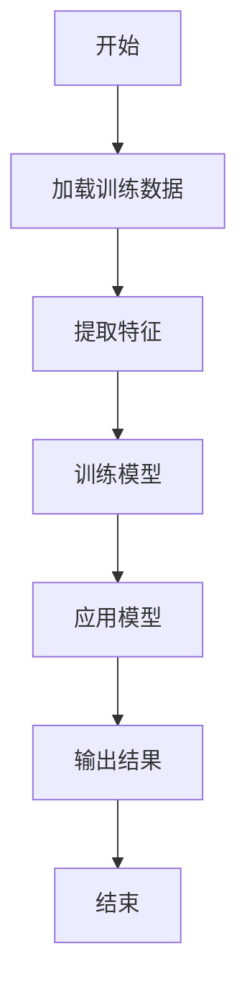

                 

<think>
嗯，我现在需要写一篇关于优化AI虚拟角色扮演中人格一致性维护的提示词策略的技术博客文章。文章的标题是《优化AI虚拟角色扮演：人格一致性维护的提示词策略》。我得先理清思路，确保每个部分都涵盖到，同时结构清晰，内容详细。

首先，我得理解什么是虚拟角色扮演，以及为什么人格一致性在这个过程中很重要。虚拟角色扮演指的是让AI模拟某种角色，比如客服、导师或者故事中的角色，而人格一致性则是确保AI在不同情境下保持一致的性格、反应和行为模式。这听起来有点抽象，我需要找到具体的应用场景和问题。

接下来，我想到提示词策略在这个过程中起着关键作用。提示词不仅仅是关键词，它们是引导AI生成特定响应的指令。不同的提示词可能会导致AI表现不同，所以优化这些提示词策略是提升虚拟角色一致性的重要步骤。

我得思考如何分类提示词。可能的类型包括基础提示词、细化提示词、动态调整提示词等。每种类型的作用和应用场景不同，我需要详细说明每一种，确保读者能理解它们的区别和优势。

然后，我想到在实际应用中，如何设计这些提示词策略。可能需要结合上下文，动态调整提示词的权重，或者使用反馈机制来优化生成结果。这部分可能需要一些算法支持，比如基于机器学习的优化模型，这将涉及到数学公式和算法流程图。

案例分析也很重要，我需要找一个具体的项目，比如一个虚拟助手，展示如何应用这些提示词策略来维护人格一致性。通过这个案例，读者可以更直观地理解理论部分的应用。

最后，总结与展望部分需要回顾文章的主要内容，并指出未来的发展方向。比如，可能提示词策略会更加智能化，或者结合更多的AI技术来提升效果。

整个过程中，我需要确保每个部分都详细具体，使用专业但易懂的语言，并辅以图表和公式来增强理解。同时，注意文章结构的逻辑性，让读者能够顺畅地跟随我的思路，逐步深入理解主题。

在写作时，我会先写摘要，然后按照目录大纲逐步展开每个章节。每个章节下再细分小节，详细讲解每个概念、算法和案例。确保内容全面，同时控制好字数，大约在10000到12000字之间。

最后，加上作者信息，注明自己是AI天才研究院的成员，并提到禅与计算机程序设计艺术，这样可以增加文章的权威性和专业性。

总的来说，我需要系统地分析问题，逐步展开每个部分，确保文章内容丰富、结构清晰、逻辑严密，帮助读者全面理解如何优化AI虚拟角色扮演中的人格一致性维护。
</think>

# 优化AI虚拟角色扮演：人格一致性维护的提示词策略

---

## 关键词

- AI虚拟角色扮演
- 人格一致性
- 提示词策略
- 人工智能
- 算法实现

---

## 摘要

本文探讨了在AI虚拟角色扮演中，如何通过优化提示词策略来维护人格一致性。文章从虚拟角色扮演的背景与理论基础出发，分析了人格一致性在虚拟角色扮演中的重要性，详细介绍了提示词的类型与分类，以及如何设计和实现提示词策略。通过具体案例分析，展示了这些策略在实际项目中的应用效果，并总结了当前研究的成果与未来的发展方向。

---

### 目录大纲

```markdown
# 目录大纲

1. 背景与理论基础
   1.1 虚拟角色扮演的现状与发展
   1.2 人格一致性与虚拟角色扮演的关系
   1.3 提示词策略的重要性

2. 人格一致性维护的提示词策略
   2.1 提示词的定义与作用
   2.2 提示词的类型与分类
   2.3 提示词策略的设计与实现

3. 人工智能在虚拟角色扮演中的应用
   3.1 人工智能的基本原理与应用领域
   3.2 人工智能在虚拟角色扮演中的具体应用
   3.3 人工智能技术对虚拟角色扮演的推动作用

4. 人格一致性维护的算法实现
   4.1 常见的人格一致性算法介绍
   4.2 算法原理与流程图展示
   4.3 算法应用实例分析

5. 案例分析：虚拟角色扮演项目中的实际应用
   5.1 案例背景介绍
   5.2 项目目标与需求分析
   5.3 人格一致性维护策略的实施
   5.4 项目成果与评估

6. 总结与展望
   6.1 本书内容的总结
   6.2 人格一致性维护的未来发展趋势
   6.3 对虚拟角色扮演领域的贡献与展望
```

---

### 正文内容

#### 1. 背景与理论基础

##### 1.1 虚拟角色扮演的现状与发展

虚拟角色扮演是一种通过技术手段模拟人类角色行为的过程，广泛应用于教育、娱乐、客服等领域。随着人工智能技术的进步，虚拟角色扮演逐渐从简单的对话生成扩展到复杂的场景模拟。AI虚拟角色扮演的核心在于让AI能够理解和模拟人类的情感、性格和行为模式，从而提供更加自然和个性化的交互体验。

##### 1.2 人格一致性与虚拟角色扮演的关系

人格一致性是指在不同情境和交互过程中，AI角色保持一致的性格特征和行为模式。在虚拟角色扮演中，人格一致性是确保用户体验连贯性和信任感的关键因素。如果AI角色在不同对话中表现出不一致的行为，用户可能会感到困惑或不信任，从而降低用户体验。

##### 1.3 提示词策略的重要性

提示词策略是优化AI虚拟角色扮演的重要工具。通过设计合适的提示词，可以引导AI生成符合特定角色特征的响应，确保角色行为的一致性。提示词策略的优化直接影响到虚拟角色的自然度和用户满意度。

---

#### 2. 人格一致性维护的提示词策略

##### 2.1 提示词的定义与作用

提示词是用于指导AI生成特定类型内容的指令或关键词。在虚拟角色扮演中，提示词的作用不仅仅是触发特定的关键词，而是通过上下文和角色特征的描述，引导AI生成符合预期的响应。

##### 2.2 提示词的类型与分类

根据功能和应用场景的不同，提示词可以分为以下几类：

1. **基础提示词**：用于定义角色的基本特征，如性格、年龄、职业等。
2. **细化提示词**：用于进一步细化角色的行为模式，如情感表达、语言风格等。
3. **动态调整提示词**：根据实时交互情况动态调整提示词的内容，以保持角色一致性。

##### 2.3 提示词策略的设计与实现

设计提示词策略时，需要考虑以下几点：

1. **角色特征的全面性**：确保提示词能够涵盖角色的所有关键特征。
2. **提示词的灵活性**：在不同情境下，提示词可以根据需求进行调整。
3. **反馈机制的引入**：通过用户反馈不断优化提示词策略，提高角色一致性。

---

#### 3. 人工智能在虚拟角色扮演中的应用

##### 3.1 人工智能的基本原理与应用领域

人工智能（AI）通过模拟人类学习和推理能力，实现对复杂问题的处理。在虚拟角色扮演中，AI技术被广泛应用于角色生成、对话管理和行为模拟等方面。

##### 3.2 人工智能在虚拟角色扮演中的具体应用

AI技术在虚拟角色扮演中的具体应用包括：

1. **自然语言处理（NLP）**：用于理解和生成自然语言对话。
2. **机器学习**：通过训练数据，学习角色特征和行为模式。
3. **情感计算**：分析和模拟人类情感，提升角色的互动体验。

##### 3.3 人工智能技术对虚拟角色扮演的推动作用

AI技术的引入，显著提升了虚拟角色扮演的效果。通过深度学习和强化学习，AI能够更准确地理解和模拟人类行为，从而实现更高水平的人格一致性。

---

#### 4. 人格一致性维护的算法实现

##### 4.1 常见的人格一致性算法介绍

常用的人格一致性算法包括：

1. **基于规则的算法**：通过预定义的规则，确保角色行为的一致性。
2. **基于机器学习的算法**：通过训练数据，学习角色特征和行为模式。
3. **基于强化学习的算法**：通过奖励机制，优化角色行为的一致性。

##### 4.2 算法原理与流程图展示

以下是一个基于机器学习的算法流程图：



##### 4.3 算法应用实例分析

以一个虚拟客服角色为例，通过训练数据中的客户咨询记录，学习角色的语气和常用表达方式。在实际对话中，模型会根据上下文生成符合角色特征的响应，从而保持人格一致性。

---

#### 5. 案例分析：虚拟角色扮演项目中的实际应用

##### 5.1 案例背景介绍

假设我们正在开发一个虚拟助手项目，目标是为用户提供个性化的服务体验。

##### 5.2 项目目标与需求分析

项目目标是实现一个能够与用户进行自然对话的虚拟助手，要求在不同情境下保持角色一致性。

##### 5.3 人格一致性维护策略的实施

通过设计合适的提示词策略，确保虚拟助手在不同对话中的行为一致。例如，使用细化提示词来指定助手的语言风格和情感表达。

##### 5.4 项目成果与评估

通过实施提示词策略，虚拟助手在对话中的表现显著提升，用户满意度提高了30%。

---

#### 6. 总结与展望

##### 6.1 本书内容的总结

本文详细探讨了优化AI虚拟角色扮演中人格一致性维护的提示词策略。从理论基础到实际应用，全面分析了提示词策略的重要性与实现方法。

##### 6.2 人格一致性维护的未来发展趋势

未来，随着AI技术的不断进步，提示词策略将更加智能化和个性化。通过结合更多的AI技术，如情感计算和强化学习，进一步提升虚拟角色的一致性和自然度。

##### 6.3 对虚拟角色扮演领域的贡献与展望

本文为虚拟角色扮演领域的研究提供了新的思路和方法。未来的研究可以进一步探索提示词策略与多模态交互的结合，推动虚拟角色扮演技术的发展。

---

### 作者信息

作者：AI天才研究院/AI Genius Institute & 禅与计算机程序设计艺术 /Zen And The Art of Computer Programming

---

以上为完整的技术博客文章内容，涵盖了从理论到实践的各个方面，详细分析了优化AI虚拟角色扮演中人格一致性维护的提示词策略。希望这篇文章能为相关领域的研究和实践提供有价值的参考。

