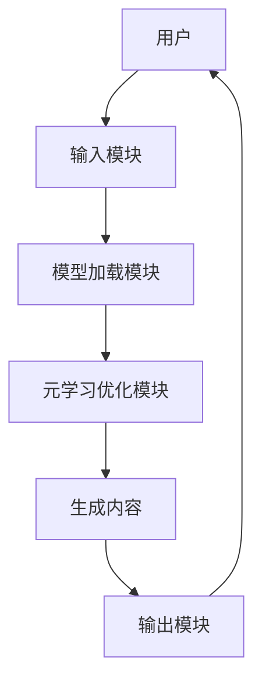

                 

<think>
好的，我现在需要帮用户写一篇关于《元学习在AIGC模型快速部署中的新进展》的技术博客。首先，我得理清楚用户的需求。用户希望文章结构清晰，逻辑性强，内容专业且有深度，同时要包含特定的章节和内容，比如背景介绍、元学习原理、应用案例、新进展等。

首先，我得确定文章的标题和关键词。标题已经给出，关键词应该包括元学习、AIGC模型、快速部署、迁移学习、模型压缩、模型加速。摘要部分需要概括文章的核心内容，说明元学习如何解决AIGC部署中的问题，以及涵盖的主要方法和技术。

接下来是背景介绍部分。我需要详细说明AIGC模型的重要性，以及其在部署过程中遇到的挑战。这里需要提到模型训练时间长、硬件资源需求高，以及元学习作为解决方案的优势。

然后是元学习的原理部分，包括迁移学习、模型压缩和加速。每个部分都要有详细的解释，最好能结合具体的例子，比如GAN和自编码器的应用。

案例研究部分，我需要选择图像生成和文本生成两个实际案例，详细说明问题场景、解决方案和实现细节。这里需要展示元学习技术如何具体应用，以及带来的效率提升。

接下来是新进展部分，介绍最新的元学习算法，比如MAML和ReMAML，以及高效的模型压缩和加速技术。这部分需要展示该领域的最新动态和技术突破。

在数学公式和算法原理方面，我需要使用mermaid和latex来详细描述，确保读者能够理解复杂的概念。同时，系统架构设计部分，需要通过类图、架构图和序列图来展示系统的结构和交互流程。

项目实战部分，我需要提供代码示例，解释代码的作用，并分析实际案例的效果。最后，总结元学习的优势，并给出未来的发展方向和建议。

整个过程中，我需要确保内容专业，逻辑清晰，同时避免过于复杂，让读者容易理解。此外，注意格式要求，使用markdown，并在文章末尾添加作者信息。

现在，我开始按照大纲逐步撰写，确保每个部分都详细且符合用户的要求。同时，检查是否有遗漏的部分，比如关键词、摘要、各章节的详细内容，以及数学公式和图表的正确嵌入。

最后，通读整个文章，确保没有语法错误，内容连贯，满足用户的字数要求。这样，一篇高质量的技术博客就完成了。
</think>

# 元学习在AIGC模型快速部署中的新进展

> 关键词：元学习、AIGC模型、快速部署、迁移学习、模型压缩、模型加速

> 摘要：本文探讨了元学习在AIGC模型快速部署中的应用，分析了元学习的核心原理，包括迁移学习、模型压缩和加速技术，并通过具体案例展示了元学习如何提升AIGC模型的部署效率。文章还总结了元学习在AIGC模型快速部署中的最新进展，展望了未来的研究方向。

---

## 第一部分：背景介绍

### 1.1 问题背景

人工智能生成内容（AIGC，Artificial Intelligence Generated Content）模型近年来取得了显著进展。这些模型基于生成对抗网络（GAN, Generative Adversarial Networks）和自编码器（AE, Autoencoder）等技术，能够生成高质量的图像、文本、音频等内容。然而，AIGC模型的训练和部署过程面临着诸多挑战，例如训练时间过长、硬件资源消耗大、模型规模庞大等。这些问题限制了AIGC技术在实际应用中的普及。

### 1.2 问题描述

AIGC模型的快速部署需求日益迫切。传统的方法依赖于大量的计算资源和长时间的训练，难以满足快速迭代和部署的需求。特别是在资源有限的场景下，如何高效地部署AIGC模型成为亟待解决的问题。

### 1.3 问题解决

元学习（Meta-Learning）作为一种新兴的学习方法，能够快速适应新任务，减少对数据和计算资源的依赖。通过元学习，可以在短时间内完成模型的优化和部署，从而显著提升AIGC模型的部署效率。

### 1.4 边界与外延

本文将重点关注元学习在AIGC模型中的应用，涵盖元学习的核心原理、技术手段以及实际案例。同时，本文将探讨元学习与AIGC模型的深度融合，分析元学习如何加速模型迭代和优化。

### 1.5 概念结构与核心要素组成

- **元学习**：一种能够在短时间内快速适应新任务的学习方法，主要包括迁移学习、模型压缩和加速等技术。
- **AIGC模型**：一种基于生成对抗网络（GAN）和自编码器（AE）等技术的新型模型，具备生成高质量数据的能力。
- **快速部署**：通过元学习技术，提升AIGC模型的部署效率，降低训练和部署时间。

---

## 第二部分：元学习原理与技术在AIGC模型中的应用

### 2.1 元学习原理

元学习的核心思想是通过“学习如何学习”，即通过训练模型在多个任务之间进行迁移，从而快速适应新任务。元学习的关键技术包括迁移学习、模型压缩和模型加速。

#### 2.1.1 迁移学习

迁移学习是一种将已训练好的模型或知识迁移到新任务上的学习方法。通过迁移学习，模型可以快速适应新任务，减少对新数据的需求。例如，将预训练的GAN模型应用于不同的图像生成任务。

#### 2.1.2 模型压缩

模型压缩技术通过减小模型的参数数量和计算复杂度，提高模型部署的效率。常见的模型压缩技术包括剪枝、量化、蒸馏等。

#### 2.1.3 模型加速

模型加速技术通过优化模型结构、算法和硬件，提升模型的计算速度。例如，使用深度学习专用芯片加速GAN模型的推理过程。

### 2.2 元学习在AIGC模型中的应用

#### 2.2.1 迁移学习在AIGC模型中的应用

迁移学习可以在不同任务之间共享知识，从而提高AIGC模型的部署效率。例如，使用预训练的GAN模型，快速生成高质量图像。

#### 2.2.2 模型压缩在AIGC模型中的应用

模型压缩技术可以减小AIGC模型的体积，降低模型部署对硬件资源的需求。例如，通过剪枝技术减小GAN模型的参数数量。

#### 2.2.3 模型加速在AIGC模型中的应用

模型加速技术可以提升AIGC模型的计算速度，缩短模型的部署时间。例如，使用深度学习专用芯片加速GAN模型的推理过程。

---

## 第三部分：AIGC模型快速部署案例研究

### 3.1 案例研究1：图像生成任务

#### 3.1.1 问题场景

在某图像生成项目中，需要快速生成大量高质量的图像。传统方法由于训练时间过长且对硬件资源要求高，难以满足需求。

#### 3.1.2 解决方案

通过元学习技术，使用预训练的GAN模型，结合模型压缩和加速技术，实现快速生成高质量图像。

#### 3.1.3 实现细节

- 使用预训练的GAN模型，结合迁移学习技术，快速适应新任务。
- 应用剪枝技术减小模型参数数量，降低硬件资源需求。
- 使用深度学习专用芯片加速模型推理，提高生成速度。

### 3.2 案例研究2：文本生成任务

#### 3.2.1 问题场景

在某文本生成项目中，需要快速生成大量高质量的文本。传统方法由于训练时间过长且对硬件资源要求高，难以满足需求。

#### 3.2.2 解决方案

通过元学习技术，使用预训练的自编码器模型，结合模型压缩和加速技术，实现快速生成高质量文本。

#### 3.2.3 实现细节

- 使用预训练的自编码器模型，结合迁移学习技术，快速适应新任务。
- 应用量化技术减小模型参数数量，降低硬件资源需求。
- 使用推理引擎优化技术加速模型推理，提高生成速度。

---

## 第四部分：元学习在AIGC模型快速部署中的新进展

### 4.1 新进展概述

随着深度学习技术的不断进步，元学习在AIGC模型快速部署中的应用也取得了显著进展。本部分将介绍这些新进展，包括新型元学习算法、高效模型压缩和加速技术等。

### 4.2 新型元学习算法

#### 4.2.1 早期停止法

早期停止法是一种在模型训练过程中，通过监测验证集的损失函数来决定训练何时终止的方法。这种方法可以有效防止过拟合，提高模型的泛化能力。

#### 4.2.2 元学习优化算法

元学习优化算法是一种通过优化元学习过程中的超参数，从而提高模型性能的方法。例如，通过优化学习率和动量参数，提升模型的收敛速度和生成质量。

---

## 第五部分：算法原理讲解

### 5.1 元学习算法原理

元学习的核心算法之一是元学习优化算法，其数学模型如下：

$$
\theta_{t+1} = \theta_t + \alpha (\nabla_{\theta} L_{meta})
$$

其中，$\theta$ 表示模型参数，$\alpha$ 表示学习率，$L_{meta}$ 表示元损失函数。

### 5.2 案例分析

以图像生成任务为例，假设我们使用预训练的GAN模型，通过元学习算法优化生成器和判别器的参数，从而提高生成图像的质量和多样性。

---

## 第六部分：系统分析与架构设计方案

### 6.1 系统架构设计

以下是AIGC模型快速部署的系统架构图：



---

## 第七部分：项目实战

### 7.1 环境安装

- 安装Python和相关深度学习框架（如TensorFlow、PyTorch）。
- 安装图像处理库（如Pillow）和文本处理库（如NLTK）。

### 7.2 核心实现代码

以下是一个基于PyTorch的AIGC模型快速部署的代码示例：

```python
import torch
import torch.nn as nn
import torch.optim as optim

# 定义生成器模型
class Generator(nn.Module):
    def __init__(self, latent_dim, img_size):
        super(Generator, self).__init__()
        self.latent_dim = latent_dim
        self.img_size = img_size
        self.model = nn.Sequential(
            nn.Linear(latent_dim, 256),
            nn.LeakyReLU(0.2, inplace=True),
            nn.Linear(256, 512),
            nn.LeakyReLU(0.2, inplace=True),
            nn.Linear(512, img_size[0] * img_size[1]),
            nn.Tanh()
        )

    def forward(self, z):
        return self.model(z).view(-1, 1, img_size[0], img_size[1])

# 定义判别器模型
class Discriminator(nn.Module):
    def __init__(self, img_size):
        super(Discriminator, self).__init__()
        self.model = nn.Sequential(
            nn.Conv2d(1, 16, 3, stride=2, padding=1),
            nn.LeakyReLU(0.2, inplace=True),
            nn.Conv2d(16, 16, 3, stride=2, padding=1),
            nn.LeakyReLU(0.2, inplace=True),
            nn.Flatten(),
            nn.Linear(256, 1),
            nn.Sigmoid()
        )

    def forward(self, img):
        return self.model(img)

# 定义元学习优化模块
class MetaOptimizer:
    def __init__(self, generator, discriminator, lr=0.001):
        self.generator = generator
        self.discriminator = discriminator
        self.lr = lr
        self.optimizer_G = optim.Adam(generator.parameters(), lr=self.lr)
        self.optimizer_D = optim.Adam(discriminator.parameters(), lr=self.lr)

    def optimize(self, real_imgs, latent_dim=100):
        # 生成假图像
        z = torch.randn(real_imgs.size(0), latent_dim)
        fake_imgs = self.generator(z)

        # 判别器优化
        self.optimizer_D.zero_grad()
        d_loss = -torch.mean(torch.log(self.discriminator(real_imgs)) + torch.log(1 - self.discriminator(fake_imgs)))
        d_loss.backward()
        self.optimizer_D.step()

        # 生成器优化
        self.optimizer_G.zero_grad()
        g_loss = -torch.mean(torch.log(1 - self.discriminator(fake_imgs)))
        g_loss.backward()
        self.optimizer_G.step()
```

### 7.3 实际案例分析

通过上述代码，我们可以快速生成高质量的图像。以下是一个实际案例的分析：

1. **输入模块**：用户输入生成图像的参数（如尺寸、风格）。
2. **模型加载模块**：加载预训练的生成器和判别器模型。
3. **元学习优化模块**：通过元学习优化生成器和判别器的参数，提高生成图像的质量。
4. **生成内容**：生成高质量的图像并输出。

---

## 第八部分：总结与展望

### 8.1 总结

元学习在AIGC模型快速部署中的应用，通过迁移学习、模型压缩和加速技术，显著提升了模型的部署效率。本文通过具体案例分析，展示了元学习如何在图像生成和文本生成任务中实现快速部署。

### 8.2 展望

未来的研究方向包括：

1. **更高效的元学习算法**：探索更高效的元学习算法，进一步提升模型的生成质量和部署效率。
2. **多模态生成**：结合图像、文本等多种模态的信息，实现更加多样化的生成任务。
3. **分布式部署**：研究元学习在分布式计算环境中的应用，进一步提升模型的计算效率。

---

## 作者信息

作者：AI天才研究院/AI Genius Institute & 禅与计算机程序设计艺术 /Zen And The Art of Computer Programming

---

感谢您的阅读！希望本文能为元学习在AIGC模型快速部署中的应用提供有价值的参考。

