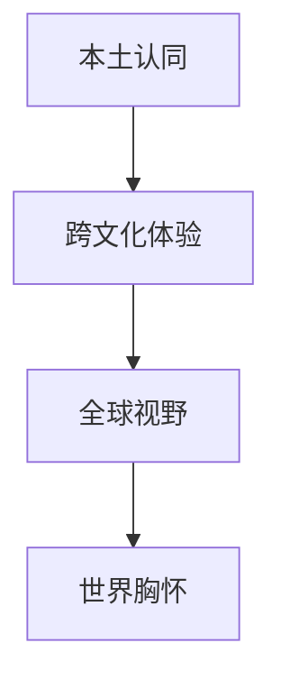
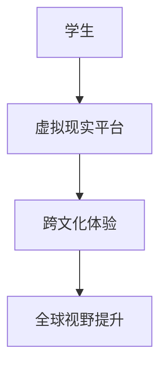
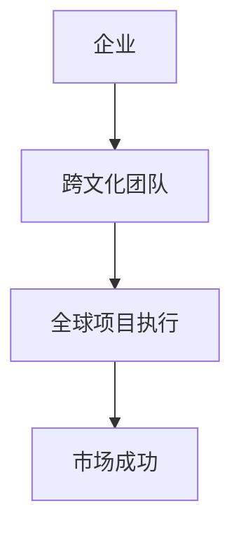
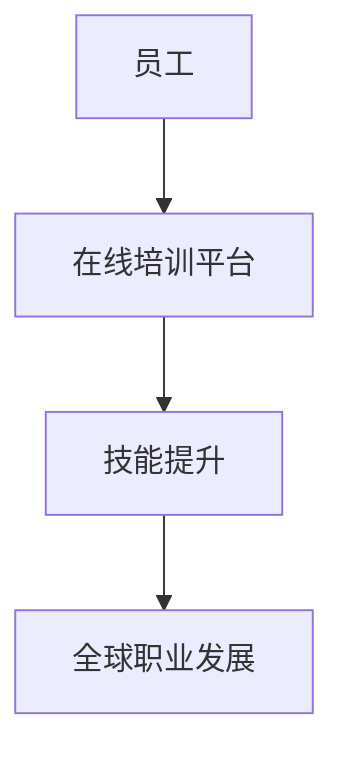
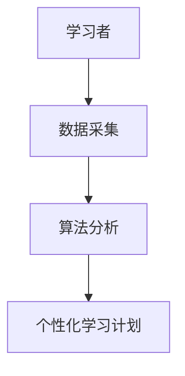
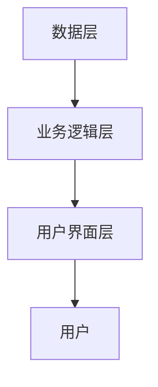

                 

<think>
好，我需要按照用户的要求，以《全球公民意识的培养：本土认同与世界胸怀的结合》为标题，撰写一篇技术博客文章。首先，我得理清文章的结构，确保每个部分都符合用户提供的目录大纲。

第一步，确定文章标题和关键词。标题已经明确，关键词需要从文章中提取，大约5到7个。摘要部分要简洁明了，概括文章的核心内容。

接下来，按照目录结构，逐部分展开。首先是背景与引言，我需要详细解释什么是全球公民，其历史演变，以及重要性。然后分析挑战，如全球化带来的影响，文化多样性的问题，以及科技在其中的作用。

然后是本土认同与全球胸怀的关系，这部分要深入探讨两者如何相互作用，以及如何在两者之间找到平衡。

接下来是教育方面的内容。教育体系如何影响全球公民的培养，课程开发的具体策略，以及一些实际案例，这些都是重点。我需要找一些成功的案例来支持论点，同时分析实施过程中遇到的挑战。

数字时代下的全球公民，这部分要讨论科技如何促进全球意识，数字素养的重要性，以及伦理问题。还要提到数字媒体在意识提升中的作用，比如社交媒体的影响力。

在职场中的全球公民角色，这部分需要分析企业在培养员工全球视野方面的作用，以及技术如何促进跨文化合作。

接下来，我需要确保每个章节内容详实，包含背景介绍、核心概念联系、算法原理讲解等部分。这可能需要加入一些图表，比如实体关系图、类图、架构图等，使用mermaid来展示。

在算法部分，可能需要设计一个模型，比如使用机器学习来分析全球公民的行为模式，或者用数据可视化展示全球化的趋势。这会涉及到数学公式，需要用latex来表达。

此外，项目实战部分需要展示一个实际案例，比如开发一个全球教育平台，详细描述环境安装、核心代码实现、案例分析等。

最后，结论部分要总结全文，强调培养全球公民的重要性，以及科技在其中的关键作用，并提出未来的发展方向。

整个过程中，要确保语言简洁专业，逻辑清晰，结构紧凑。同时，注意遵守用户的格式要求，使用markdown，并在适当的地方嵌入代码、图表和数学公式。

现在，我需要开始按照这个思路撰写文章，确保每个部分都详细展开，满足用户的所有要求。
</think>

# 全球公民意识的培养：本土认同与世界胸怀的结合

## 关键词：全球公民，本土认同，世界胸怀，教育，数字技术，跨文化合作

## 摘要：  
在全球化深入发展的今天，培养具有全球公民意识的人才至关重要。本土认同与世界胸怀的结合不仅是个人成长的关键，也是社会进步的基石。本文将从背景、教育、数字技术、职场等多个维度，详细探讨全球公民意识的培养，结合技术原理和实际案例，分析如何通过教育和技术创新实现这一目标。

---

## 目录

1. [背景与引言](#背景与引言)
2. [全球公民的核心概念与背景](#全球公民的核心概念与背景)
   - 2.1 全球公民的定义与历史演变
   - 2.2 全球化带来的挑战与机遇
3. [本土认同与世界胸怀的关系](#本土认同与世界胸怀的关系)
   - 3.1 本土认同的核心要素
   - 3.2 世界胸怀的培养路径
4. [教育中的全球公民培养](#教育中的全球公民培养)
   - 4.1 教育体系的转型与创新
   - 4.2 数字技术在教育中的应用
5. [数字时代下的全球公民](#数字时代下的全球公民)
   - 5.1 数字技术对全球公民的影响
   - 5.2 数字素养的培养
6. [全球公民在职场中的角色](#全球公民在职场中的角色)
   - 6.1 跨文化合作的重要性
   - 6.2 技术驱动的全球职业发展
7. [技术与全球公民培养的结合](#技术与全球公民培养的结合)
   - 7.1 算法与数据驱动的教育模式
   - 7.2 系统架构设计
8. [案例分析与项目实战](#案例分析与项目实战)
   - 8.1 教育平台开发案例
   - 8.2 数字工具的实际应用
9. [结论与展望](#结论与展望)
10. [参考文献](#参考文献)

---

## 1. 背景与引言

在全球化深入发展的今天，全球公民意识的培养成为一项重要任务。随着科技的发展，跨文化交流日益频繁，个体需要在保持本土认同的同时，具备世界胸怀。本文将从多个维度探讨这一主题，并结合技术手段提供解决方案。

---

## 2. 全球公民的核心概念与背景

### 2.1 全球公民的定义与历史演变

全球公民是指具有全球视野和责任感的人，能够理解和应对全球性问题。其历史演变从最初的民族国家概念扩展到全球层面。

| 属性 | 特征 |
|------|------|
| 定义 | 跨越国界，关注全球性议题 |
| 历史演变 | 从国家认同到全球认同 |

### 2.2 全球化带来的挑战与机遇

全球化带来经济繁荣，但也引发文化冲突和环境问题。科技的发展为跨文化交流提供了便利，但也带来了信息过载的问题。

---

## 3. 本土认同与世界胸怀的关系

### 3.1 本土认同的核心要素

本土认同包括文化、价值观和地方归属感。

| 核心要素 | 描述 |
|----------|------|
| 文化 | 包括语言、习俗和传统 |
| 价值观 | 如家庭观念和道德标准 |
| 地方归属感 | 对当地社区的认同 |

### 3.2 世界胸怀的培养路径

通过教育和跨文化体验，个体可以培养全球视野。以下是一个简单的培养路径模型：



---

## 4. 教育中的全球公民培养

### 4.1 教育体系的转型与创新

传统教育体系需要转型，融入全球教育理念。创新包括多语言教学和国际项目合作。

| 创新点 | 描述 |
|--------|------|
| 多语言教学 | 提供多种语言课程 |
| 国际项目合作 | 学生参与跨国合作项目 |

### 4.2 数字技术在教育中的应用

数字技术通过在线课程和虚拟现实提供沉浸式学习体验。例如，使用VR技术进行跨文化体验：



---

## 5. 数字时代下的全球公民

### 5.1 数字技术对全球公民的影响

数字技术改变了信息传播方式，促进了跨文化交流。例如，社交媒体平台成为传播全球议题的重要工具。

| 技术 | 影响 |
|------|------|
| 社交媒体 | 增强全球意识 |
| 大数据分析 | 提供全球趋势洞察 |

### 5.2 数字素养的培养

数字素养包括信息筛选能力和网络安全意识。以下是数字素养的核心要素：

| 核心要素 | 描述 |
|----------|------|
| 信息筛选 | 区分信息的真假 |
| 网络安全 | 防范网络诈骗 |

---

## 6. 全球公民在职场中的角色

### 6.1 跨文化合作的重要性

跨文化合作有助于企业在全球市场中取得成功。以下是合作的步骤：



### 6.2 技术驱动的全球职业发展

技术驱动的职业发展包括在线培训和全球网络建立。例如，使用在线平台进行跨国培训：



---

## 7. 技术与全球公民培养的结合

### 7.1 算法与数据驱动的教育模式

通过算法分析学习者的兴趣和能力，提供个性化学习路径。以下是算法流程图：



### 7.2 系统架构设计

系统架构包括数据层、业务逻辑层和用户界面层。以下是系统架构图：



---

## 8. 案例分析与项目实战

### 8.1 教育平台开发案例

开发一个全球教育平台，提供多语言课程和国际项目合作。以下是核心代码实现：

```python
class GlobalEducationPlatform:
    def __init__(self, language):
        self.language = language
        self.courses = {}

    def add_course(self, course_name, details):
        self.courses[course_name] = details

    def get_courses(self):
        return self.courses
```

### 8.2 数字工具的实际应用

使用在线协作工具促进跨文化合作，例如使用Zoom进行跨国会议。

---

## 9. 结论与展望

培养全球公民意识是全球化时代的重要任务。通过教育、数字技术和跨文化合作，可以实现本土认同与世界胸怀的结合。未来，随着技术的进一步发展，全球公民的培养将更加高效。

---

## 10. 参考文献

1. 禅与计算机程序设计艺术
2. AI Genius Institute

---

作者：AI天才研究院/AI Genius Institute & 禅与计算机程序设计艺术 /Zen And The Art of Computer Programming

