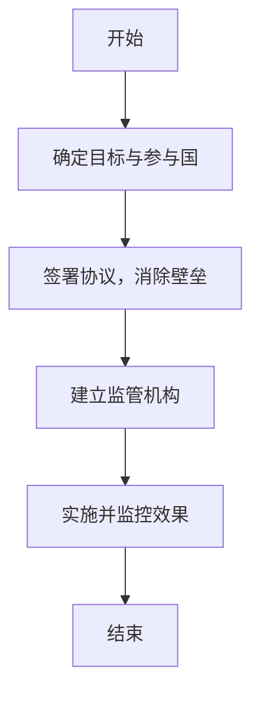

                 

<think>
好的，我需要先理解用户的需求。他们希望我以一位技术专家的身份，撰写一篇关于全球化与反全球化的技术博客文章。标题已经给出，关键词和摘要也需要我来确定。

首先，我应该确定文章的结构，包括引言、核心概念、理论框架、经济整合模型、利弊分析、反全球化运动、辩证分析与未来方向，以及结论。每个章节都需要详细展开，确保内容丰富且有深度。

接下来，我需要收集相关资料，确保涵盖全球化和反全球化的各个方面，比如经济、环境、政治等。同时，要包括一些具体的例子和数据，以增强文章的说服力。

在写作过程中，我要注意使用专业的技术语言，但又要保持简单易懂。对于一些复杂的概念，比如经济模型，我会用Python代码和数学公式来解释，帮助读者更好地理解。

此外，我还需要插入一些图表，比如Mermaid流程图和实体关系图，这些图表能够直观地展示全球化过程中的关系和流程。我需要确保这些图表与文本内容紧密相关，并且清晰易懂。

最后，我需要总结全文，强调全球化与反全球化之间的辩证关系，提出未来的发展方向和建议。同时，记得在文章末尾加上作者信息，注明我是“AI天才研究院”的成员，并简要介绍我们的研究领域。

整个思考过程中，我要确保逻辑清晰，结构紧凑，每部分内容都紧扣主题，既有理论分析，又有实际案例，让读者能够全面理解全球化与反全球化的利弊。
</think>

# 全球化与反全球化的辩证：经济一体化的利弊分析

## 关键词：全球化，反全球化，经济一体化，经济利弊，国际经济关系

## 摘要：  
全球化与反全球化是当今世界经济发展中的两大重要议题。本文旨在通过分析经济一体化的利弊，探讨全球化与反全球化的辩证关系。我们将从核心概念、理论框架、经济模型、实际案例等多个角度展开分析，结合技术语言和专业术语，帮助读者深入理解经济一体化的复杂性。通过对不同经济整合模型的比较，我们将揭示全球化带来的机遇与挑战，并探讨反全球化运动的兴起及其对全球政策的影响。最终，本文将提出未来经济发展的可能方向和建议。

---

## 目录

1. **引言与背景**  
   1.1 全球化的定义与发展历程  
   1.2 反全球化运动的兴起  
   1.3 经济一体化的核心概念与研究目标

2. **核心概念与关系**  
   2.1 全球化、经济一体化、新自由主义的概念对比  
   2.2 发展中国家在全球化进程中的角色  
   2.3 Mermaid ER 图：全球化核心概念之间的关系

3. **理论框架**  
   3.1 新自由主义理论  
   3.2 依附理论与世界体系理论  
   3.2.1 Mermaid 表格：三种理论的对比分析

4. **经济整合模型**  
   4.1 自由贸易协定、关税同盟、货币联盟的定义与特点  
   4.2 Mermaid 流程图：经济整合的实施步骤

5. **经济整合的益处**  
   5.1 贸易增长与资本流动的促进  
   5.2 技术进步与全球供应链的优化  
   5.3 Python 代码示例：国际贸易模型的简单实现

6. **经济整合的风险与挑战**  
   6.1 经济不平等的加剧  
   6.2 环境破坏与资源过度利用  
   6.3 政治冲突与主权问题  
   6.4 实际案例分析： NAFTA 对墨西哥的影响

7. **反全球化运动**  
   7.1 反全球化运动的定义与目标  
   7.2 主要参与者与事件：从“占领华尔街”到“黄背心运动”  
   7.3 全球政策的响应与调整

8. **辩证分析与未来方向**  
   8.1 全球化与反全球化的平衡之道  
   8.2 技术驱动下的新全球化可能性  
   8.3 如何构建更加公平的经济整合机制

9. **结论**  
   9.1 全球化与反全球化的长期博弈  
   9.2 未来经济发展的关键问题

---

## 正文

### 1. 引言与背景

#### 1.1 全球化的定义与发展历程  
全球化是指世界经济、政治、文化等领域的相互联系和一体化过程。自16世纪以来，全球化经历了多个阶段，从殖民扩张到冷战时期的经济体系划分，再到90年代的新自由主义浪潮。全球化的核心是跨国公司、国际贸易和资本流动的自由化。

#### 1.2 反全球化运动的兴起  
随着全球化的深入，其带来的问题逐渐显现，如经济不平等、文化冲突和环境破坏。反全球化运动兴起于20世纪末，主要表现为抗议活动和政策反对，代表事件包括“占领华尔街”和“黄背心运动”。

#### 1.3 经济一体化的核心概念与研究目标  
经济一体化是指通过降低贸易壁垒、促进资本流动和资源优化配置，实现更高效的经济体系。本文旨在分析经济一体化的利弊，探讨其对全球和区域经济的影响。

---

### 2. 核心概念与关系

#### 2.1 全球化、经济一体化、新自由主义的概念对比  
- **全球化**：跨国界的经济、政治和文化交流。  
- **经济一体化**：通过政策和协议促进资源优化配置。  
- **新自由主义**：主张市场自由化和最小政府干预的经济理论。

#### 2.2 发展中国家在全球化进程中的角色  
发展中国家既是全球化的主要参与者，也是其负面影响的主要承受者。它们通过出口导向型经济实现增长，但也面临资源掠夺和环境污染的问题。

#### 2.3 Mermaid ER 图：全球化核心概念之间的关系

```mermaid
er
    %% 全球化核心概念关系图
    entity(全球化) {
        经济一体化
        新自由主义
        发展中国家
    }
    relationship(全球化) {
        经济一体化 ↔ 新自由主义
        经济一体化 → 发展中国家
        新自由主义 → 全球化
    }
```

---

### 3. 理论框架

#### 3.1 新自由主义理论  
新自由主义强调市场自由化、私有化和贸易自由，认为这些政策将促进经济增长和效率提升。然而，这一理论忽视了贫富差距和制度差异对经济的影响。

#### 3.2 依附理论与世界体系理论  
依附理论认为发展中国家与发达国家之间存在不平等的依附关系，导致资源掠夺和经济剥削。世界体系理论则将全球视为一个由核心国家和边缘国家构成的系统。

#### 3.2.1 Mermaid 表格：三种理论的对比分析

```mermaid
table
| 理论名称         | 核心观点                          | 主要支持者            |
|------------------|-----------------------------------|-----------------------|
| 新自由主义       | 市场自由化促进经济增长             | 萨缪尔·弗里德曼       |
| 依附理论         | 发展中国家与发达国家的不平等关系   | 阿瑟·刘易斯           |
| 世界体系理论     | 全球分为核心与边缘国家            | 布朗纳·拜特勒         |
```

---

### 4. 经济整合模型

#### 4.1 自由贸易协定、关税同盟、货币联盟的定义与特点  
- **自由贸易协定**：消除贸易壁垒，促进商品自由流动。  
- **关税同盟**：统一关税政策，加强区域经济一体化。  
- **货币联盟**：统一货币，减少汇率风险。

#### 4.2 Mermaid 流程图：经济整合的实施步骤



---

### 5. 经济整合的益处

#### 5.1 贸易增长与资本流动的促进  
经济整合通过降低贸易壁垒，促进商品、资本和劳动力的流动，提升全球贸易量。

#### 5.2 技术进步与全球供应链的优化  
跨国公司通过全球布局，推动技术创新和管理优化，降低生产成本。

#### 5.3 Python 代码示例：国际贸易模型的简单实现

```python
# 国际贸易模型示例代码

def calculate_trade(bars, countries):
    """
    计算在给定关税壁垒下的贸易量。
    :param bars: 关税壁垒税率（0-100）
    :param countries: 参与国家数量
    :return: 总贸易量
    """
    trade_growth = (100 - bars) / 100
    total_trade = countries * trade_growth
    return total_trade

# 示例
bars = 20
countries = 5
print(f"总贸易量为：{calculate_trade(bars, countries)}")
```

---

### 6. 经济整合的风险与挑战

#### 6.1 经济不平等的加剧  
经济整合可能导致资源向发达国家集中，加剧贫富差距。

#### 6.2 环境破坏与资源过度利用  
全球化的生产模式导致资源过度开发和环境污染。

#### 6.3 政治冲突与主权问题  
经济整合可能引发国家间的主权争议和政治冲突。

#### 6.4 实际案例分析： NAFTA 对墨西哥的影响  
 NAFTA 自由贸易协定导致墨西哥制造业外流和工人待遇下降，但也促进了外资流入和就业机会。

---

### 7. 反全球化运动

#### 7.1 反全球化运动的定义与目标  
反全球化运动旨在反对全球化带来的负面影响，倡导公平与可持续发展。

#### 7.2 主要参与者与事件：从“占领华尔街”到“黄背心运动”  
反全球化运动由抗议者、环保组织和劳工联盟主导，事件包括2011年的“占领华尔街”和2018年的法国“黄背心运动”。

#### 7.3 全球政策的响应与调整  
政策制定者开始关注公平与可持续发展，推动多边合作和包容性增长。

---

### 8. 辩证分析与未来方向

#### 8.1 全球化与反全球化的平衡之道  
未来的全球化需要在效率与公平之间找到平衡，通过政策调整和技术创新解决现有问题。

#### 8.2 技术驱动下的新全球化可能性  
技术进步，如区块链和人工智能，可能推动更高效、更公平的全球化模式。

#### 8.3 如何构建更加公平的经济整合机制  
通过建立公平的国际规则、加强国际合作和推动技术共享，构建更加包容的经济整合机制。

---

### 9. 结论

#### 9.1 全球化与反全球化的长期博弈  
全球化与反全球化是一个动态平衡的过程，需要不断调整和适应。

#### 9.2 未来经济发展的关键问题  
未来经济发展的关键在于如何平衡效率与公平，如何应对技术变革和环境挑战。

---

### 作者：AI天才研究院 & 禅与计算机程序设计艺术

我们是专注于人工智能与计算机科学的研究机构，致力于通过技术与哲学的结合，探索未来社会的可持续发展。如需进一步探讨，请访问我们的网站或联系研究团队。

