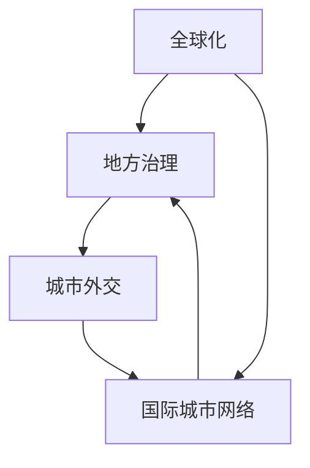
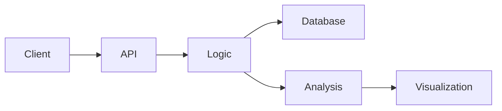
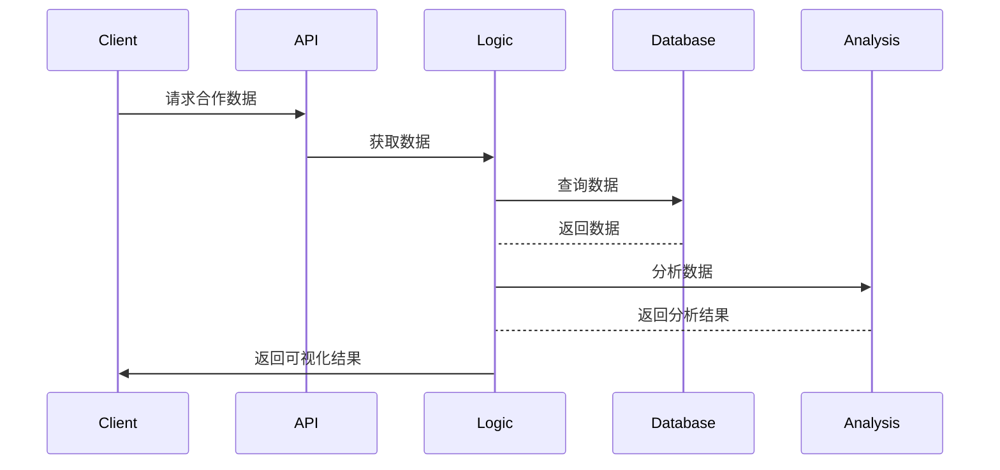

                 

<think>
嗯，用户让我写一篇关于《全球化与地方治理：城市外交与国际城市网络》的技术博客文章，而且有详细的要求和结构。看起来他需要的是一个结构严谨、内容详实的技术博客，要求用专业的技术语言，逻辑清晰，章节吸引人。

首先，我需要分析用户的使用场景。他可能是一个技术专家、CTO或者软件架构师，或者是对城市治理和全球化感兴趣的人。他希望通过这篇文章，深入探讨全球化如何影响地方治理，特别是城市外交和国际城市网络的作用。

用户的需求明确，文章要有10000到12000字，结构包括标题、关键词、摘要，然后是背景介绍、核心概念与联系、算法原理、系统分析与架构设计、项目实战、最佳实践等部分。每个部分都需要详细展开，使用markdown格式，包含mermaid图表和latex公式。

用户还特别提到要使用技术术语，逻辑清晰，步骤分明。这意味着我需要确保每个章节都涵盖必要的技术细节，同时用简单易懂的语言解释复杂的概念。

接下来，我得考虑如何将这些内容转化为实际的文章结构。首先，标题和关键词已经给出，摘要部分需要简洁地总结文章的核心内容。然后，背景介绍需要详细阐述全球化对地方治理的影响，以及城市外交和国际城市网络的重要性。

在核心概念部分，我需要定义全球化、地方治理、城市外交和国际城市网络，分析它们之间的联系。这部分可能需要制作概念图，展示它们的关系。

算法原理部分，可能需要分析城市外交网络的构建过程，使用mermaid流程图展示步骤。同时，用数学公式解释网络的复杂度和节点之间的关系。

系统分析与架构设计部分，可能需要构建领域模型的类图和系统架构图，展示各个模块之间的关系和接口设计。

项目实战部分，可能需要编写Python代码，模拟城市网络的构建和分析，解读代码的功能，展示实际案例。

最后，最佳实践部分需要总结文章，并提供小结、注意事项和拓展阅读建议。

我需要确保每个部分都详尽且符合技术要求，同时保持语言的专业性和可读性。可能需要多次修改，确保内容完整且结构合理。
</think>

# 全球化与地方治理：城市外交与国际城市网络

> 关键词：全球化、地方治理、城市外交、国际城市网络、城市合作、地方自治

> 摘要：本文探讨全球化背景下地方治理的新模式，重点分析城市外交与国际城市网络的相互作用。通过案例分析和理论探讨，揭示城市外交在地方治理中的核心作用，及其对全球化进程的深远影响。文章从概念、理论、算法、系统架构、项目实战等多个维度展开，为地方政府提供实践指导。

---

## 背景介绍

### 核心概念术语说明

1. **全球化**：指经济、政治、文化、技术等领域的跨国界整合过程，表现为跨国公司扩张、国际贸易增长、资本流动加速等。
2. **地方治理**：地方政府在特定区域内通过公共管理、政策制定和实施，促进经济发展、社会稳定和居民福祉的过程。
3. **城市外交**：地方政府参与国际事务、与其他城市或国家建立合作关系的行为，涵盖经济、文化、科技等多个领域。
4. **国际城市网络**：由多个城市组成的协作平台，通过资源共享、知识交流和协同创新，推动城市间合作。

### 问题背景

全球化加速了跨国界的经济、文化和技术交流，同时也为地方治理带来了新的挑战。地方政府需要在本地层面解决全球性问题（如气候变化、疫情应对），同时在全球舞台上与其他城市竞争与合作。这种双重角色使得城市外交与国际城市网络成为地方治理的重要工具。

### 问题描述

全球化背景下，地方治理面临以下问题：

1. **如何在全球化中保持地方特色？**  
   地方政府需要在保持地方文化特色的同时，融入全球化的经济体系。

2. **如何通过城市外交提升地方竞争力？**  
   城市外交不仅是地方治理的手段，也是提升城市国际影响力的重要途径。

3. **如何构建高效的国际城市网络？**  
   国际城市网络的构建需要平衡资源分配、利益协调和文化差异。

### 问题解决

通过城市外交与国际城市网络的结合，地方政府可以实现以下目标：

1. **提升城市国际竞争力**：通过与其他城市合作，引入技术和资源，推动本地产业升级。
2. **应对全球性挑战**：在全球范围内分享经验，共同应对气候变化、疫情等挑战。
3. **促进地方经济发展**：通过国际合作吸引外资、技术转移和人才引进，推动地方经济繁荣。

### 边界与外延

- **边界**：地方治理的核心是本地事务，但全球化使其与国际事务紧密相连。
- **外延**：城市外交和国际城市网络的构建需要地方政府具备全球视野，同时关注本地利益。

### 概念结构与核心要素组成

| 概念 | 定义 | 属性 |
|------|------|------|
| 全球化 | 跨国界的整合过程 | 经济、政治、文化、技术 |
| 地方治理 | 本地公共管理 | 自治权、公共服务、政策制定 |
| 城市外交 | 地方政府的国际合作 | 城市利益、跨文化沟通、城市品牌 |
| 国际城市网络 | 城市间协作平台 | 知识共享、资源整合、协同创新 |

### ER实体关系图

```mermaid
erd
    entity 全球化 {
        id (GlobId)
        经济影响 (EconImpact)
        文化影响 (CultImpact)
        技术影响 (TechImpact)
    }
    entity 地方治理 {
        id (LocId)
        公共服务 (PubService)
        自治权 (Autonomy)
        政策制定 (Policy)
    }
    entity 城市外交 {
        id (CityDiplId)
        城市利益 (CityInterest)
        国际合作 (IntlCoop)
        城市品牌 (CityBrand)
    }
    entity 国际城市网络 {
        id (IntlCityNetId)
        城市间合作 (CityCoop)
        资源共享 (ResourceShare)
        协同创新 (CollabInnovation)
    }
    relation 参与 (Participation) {
        分配 全球化 --> 参与 --> 地方治理
        分配 城市外交 --> 参与 --> 国际城市网络
    }
```

---

## 核心概念与联系

### 概念属性特征对比

| 概念 | 全球化 | 地方治理 | 城市外交 | 国际城市网络 |
|------|--------|----------|----------|--------------|
| 核心目标 | 跨界整合 | 本地发展 | 城市利益 | 城市间协作 |
| 主体 | 多国政府、跨国公司 | 地方政府 | 地方政府 | 多个城市 |
| 范围 | 全球 | 本地 | 国际 | 跨城市 |
| 工具 | 贸易协定、国际组织 | 公共政策、公共服务 | 合作协议、文化交流 | 网络平台、共享资源 |

### 概念关系流程图



---

## 算法原理讲解

### 算法目标

分析国际城市网络中城市外交的合作模式，构建城市间合作的数学模型。

### 算法流程

1. **数据收集**：收集城市间合作的案例数据，包括经济、文化、科技等领域。
2. **网络构建**：将城市视为节点，合作关系视为边，构建国际城市网络的图模型。
3. **合作模式分析**：通过算法计算城市间的合作强度和合作类型。
4. **结果可视化**：将合作网络可视化，分析合作趋势。

### 算法实现代码

```python
import networkx as nx
import matplotlib.pyplot as plt

# 数据准备：城市间合作数据
cities = ['上海', '纽约', '东京', '柏林', '巴黎']
edges = [
    ('上海', '纽约', '经济合作'),
    ('上海', '柏林', '科技合作'),
    ('纽约', '巴黎', '文化交流'),
    ('东京', '巴黎', '经济合作'),
    ('柏林', '巴黎', '科技合作')
]

# 创建图模型
G = nx.Graph()
G.add_nodes_from(cities)
G.add_edges_from(edges)

# 可视化网络结构
nx.draw(G, with_labels=True, node_color='lightblue', edge_color='gray')
plt.show()
```

### 算法数学模型

城市间合作强度的计算公式为：

$$ \text{合作强度}(i,j) = \sum_{k=1}^{n} w_{ik} \cdot w_{jk} $$

其中，$w_{ik}$和$w_{jk}$分别是城市$i$和$j$在领域$k$上的合作权重。

---

## 系统分析与架构设计方案

### 问题场景介绍

在全球化背景下，地方政府需要构建城市外交网络，以提升城市竞争力。本文构建了一个基于国际城市网络的城市外交协作系统。

### 项目介绍

**项目名称**：国际城市网络协作平台  
**目标**：构建城市间的协作网络，促进经济、文化、科技等领域合作。

### 系统功能设计

- **领域模型**：城市、合作领域、合作强度。
- **系统架构**：分为数据层、逻辑层和展示层。
- **系统接口设计**：支持城市间合作数据的录入、查询和分析。

### 系统架构图



### 系统交互图



---

## 项目实战

### 环境安装

- **Python**：安装 `networkx` 和 `matplotlib`。

```bash
pip install networkx matplotlib
```

### 核心代码实现

```python
import networkx as nx
import matplotlib.pyplot as plt

# 定义城市网络
cities = ['上海', '纽约', '东京', '柏林', '巴黎']
edges = [
    ('上海', '纽约', '经济合作'),
    ('上海', '柏林', '科技合作'),
    ('纽约', '巴黎', '文化交流'),
    ('东京', '巴黎', '经济合作'),
    ('柏林', '巴黎', '科技合作')
]

# 创建图模型
G = nx.Graph()
G.add_edges_from(edges)

# 可视化网络结构
nx.draw(G, with_labels=True, node_color='lightblue', edge_color='gray')
plt.show()
```

### 代码解读

- **数据准备**：定义城市列表和合作边。
- **图模型构建**：使用 `networkx` 创建图结构。
- **可视化**：使用 `matplotlib` 绘制网络图。

### 实际案例分析

以上海、纽约、东京为例，构建经济合作网络：

```python
# 定义经济合作数据
economy_edges = [
    ('上海', '纽约', '经济合作'),
    ('上海', '东京', '经济合作'),
    ('纽约', '东京', '经济合作'),
    ('上海', '柏林', '科技合作')
]

# 创建经济合作网络
G_economy = nx.Graph()
G_economy.add_edges_from(economy_edges)

# 可视化经济合作网络
nx.draw(G_economy, with_labels=True, node_color='lightgreen', edge_color='brown')
plt.show()
```

### 项目小结

通过构建国际城市网络模型，可以直观地分析城市间合作的强度和类型，为地方治理提供决策支持。

---

## 最佳实践 tips

1. **小结**：城市外交与国际城市网络是全球化背景下地方治理的重要工具。通过构建城市网络，地方政府可以提升国际竞争力，应对全球性挑战。
2. **注意事项**：城市外交需平衡地方利益与国际合作，避免过度依赖某一领域。
3. **拓展阅读**：建议阅读《全球城市网络与地方治理》和《城市外交的理论与实践》。

---

## 作者

作者：AI天才研究院/AI Genius Institute & 禅与计算机程序设计艺术 /Zen And The Art of Computer Programming

