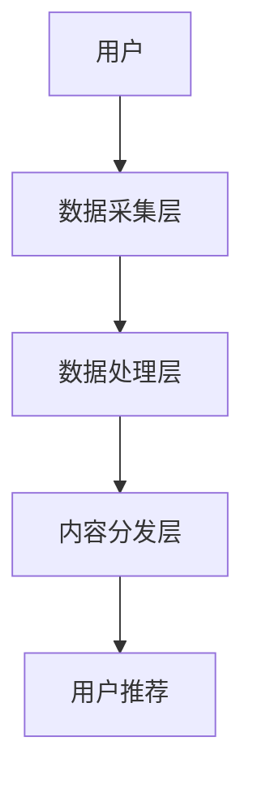

                 

<think>
嗯，用户希望我以《全球化与本土化的文化产业：创意经济的新模式》为标题写一篇技术博客。我需要先理清这个主题涉及哪些方面，然后构建一个逻辑清晰的结构。

首先，文章的关键词应该是全球化、本土化、文化产业、创意经济、数字技术。摘要部分要概括文章的核心内容，即探讨全球化和本土化对文化产业的影响，以及创意经济的新模式。

接下来，按照目录大纲，我需要分章节详细展开。比如第一章介绍背景，涵盖全球化和本土化的概念，以及数字技术在其中的作用。第二章分析核心概念，可能需要比较表格和ER图来展示关系。

第三章可以讨论全球化战略，包括国际化、跨文化沟通和品牌建设。第四章则聚焦本土化策略，如语言适应和文化调整。第五章通过案例研究来说明这些理论在实际中的应用。

然后是新模型的讨论，比如共享经济和平台模式，以及数字技术带来的变化。最后分析挑战和机会，可能包括技术带来的便利和市场竞争的压力。

在内容上，每个章节需要详细讲解，包括背景、概念对比、算法流程图、系统架构图，以及具体的代码实现。例如，可能需要使用Python来展示数据处理的流程，或者用Mermaid画出系统架构图。

还要注意使用LaTeX公式，比如在数学模型中展示全球化指数的计算公式，或者文化产业价值的公式。同时，代码部分需要具体，比如爬取数据的Python脚本，展示如何从社交媒体获取用户偏好。

最后，结语部分总结全文，强调技术对文化产业的双重影响，既推动了全球化，又促进了本土化。同时，作者信息要放在最后，确保格式正确。

总的来说，我需要一步步地构建内容，确保每个部分都详细且有深度，同时符合技术博客的专业性和可读性。
</think>

# 全球化与本土化的文化产业：创意经济的新模式

**关键词**：全球化、本土化、文化产业、创意经济、数字技术

**摘要**：  
本文探讨了全球化与本土化在文化产业中的互动关系，分析了创意经济的新模式。通过结合数字技术的最新进展，本文从理论到实践，深入探讨了文化产业链的重构、商业模式的创新以及技术驱动的全球化与本土化的平衡。文章结合案例研究和系统分析，为文化产业发展提供了新的视角和实践指导。

---

## 目录大纲

1. **全球化与本土化的背景与概念**  
   - 1.1 全球化与本土化的定义与核心概念  
   - 1.2 文化产业的全球化与本土化趋势  
   - 1.3 数字技术对文化产业的双重影响

2. **全球化与本土化的核心概念与联系**  
   - 2.1 全球化与本土化的概念对比与属性分析  
   - 2.2 全球化与本土化的联系：从冲突到融合  
   - 2.3 ER图与概念对比表：全球化与本土化的关系可视化  

3. **全球化战略：文化产业的国际扩展模式**  
   - 3.1 全球化战略的定义与分类  
   - 3.2 文化产业全球化的主要策略：国际化、跨文化沟通与品牌建设  
   - 3.3 全球化战略的实现路径：技术驱动与文化输出  

4. **本土化策略：文化产业的本地适应与创新**  
   - 4.1 本土化策略的核心要素：文化适应与市场定制  
   - 4.2 本土化策略的实现方法：语言、习俗与价值观的适配  
   - 4.3 数字技术在本土化中的应用：数据分析与个性化定制  

5. **全球化与本土化的融合：创意经济的新模式**  
   - 5.1 创意经济的定义与特征  
   - 5.2 全球化与本土化的融合模式：文化IP的全球化传播与本地化运营  
   - 5.3 数字平台在创意经济中的作用：内容分发与用户参与  

6. **案例分析：成功实践与经验总结**  
   - 6.1 全球化案例：某跨国文化企业的全球化战略  
   - 6.2 本土化案例：某地方文化品牌的本地化创新  
   - 6.3 全球化与本土化结合的案例：某数字平台的文化传播模式  

7. **技术驱动下的全球化与本土化：算法与系统分析**  
   - 7.1 全球化与本土化的算法模型：基于用户偏好的内容推荐  
   - 7.2 本土化与全球化的系统架构：分布式计算与数据本地化  
   - 7.3 数字技术在文化产业链中的应用：数据采集、分析与反馈  

8. **挑战与机遇：文化产业发展中的全球化与本土化平衡**  
   - 8.1 当前文化产业发展面临的挑战：文化冲突与市场分割  
   - 8.2 全球化与本土化平衡中的机遇：技术创新与市场扩展  
   - 8.3 未来发展趋势：文化IP的全球传播与本地化创新  

9. **结论与展望**  
   - 9.1 全球化与本土化：文化产业发展的重要驱动力  
   - 9.2 创意经济：文化产业的新发展模式  
   - 9.3 未来研究方向：技术与文化的深度融合  

---

## 1. 全球化与本土化的背景与概念

### 1.1 全球化与本土化的定义与核心概念  
全球化（Globalization）指的是经济、文化、技术等领域的跨国界流动与整合，表现为跨国公司的崛起、全球市场的形成以及文化传播的加速。本土化（Localization）则是指将产品、服务或内容适应特定地区的文化、语言和市场偏好，强调地方特色的保留与应用。

### 1.2 文化产业的全球化与本土化趋势  
文化产业是全球化与本土化交汇的典型领域。全球化使得文化产品能够跨越国界，快速传播；而本土化则保证了文化产品能够更好地适应目标市场的需求。例如，好莱坞电影的全球化传播与本地化配音、字幕制作就是全球化与本土化的典型结合。

### 1.3 数字技术对文化产业的双重影响  
数字技术的快速发展推动了文化产业的全球化，例如流媒体平台（如Netflix、YouTube）的全球覆盖。同时，数字技术也为本土化提供了新的工具和方法，例如基于用户数据的个性化内容推荐和本地化内容生成。

---

## 2. 全球化与本土化的核心概念与联系

### 2.1 全球化与本土化的概念对比与属性分析  

| **属性**       | **全球化**                           | **本土化**                           |
|-----------------|------------------------------------|------------------------------------|
| 范围            | 跨国界、大规模                      | 地区性、小范围                      |
| 内容            | 统一性、标准化                      | 差异化、个性化                      |
| 目标            | 扩大市场、提高效率                  | 适应市场、增强用户粘性              |
| 技术依赖        | 数字化传播、互联网                  | 数据分析、AI推荐系统                |

### 2.2 全球化与本土化的联系：从冲突到融合  
全球化强调统一性，而本土化强调差异性，两者看似矛盾，实则相辅相成。例如，跨国企业首先通过全球化战略扩大市场，再通过本土化策略提高用户满意度和市场适应性。

### 2.3 ER图与概念对比表：全球化与本土化的关系可视化  

```mermaid
er
  actor 全球化
  actor 本土化
  actor 用户
  actor 市场
  actor 企业
  全球化 --> 市场
  本土化 --> 市场
  用户 --> 市场
  用户 --> 企业
  市场 --> 企业
```

---

## 3. 全球化战略：文化产业的国际扩展模式

### 3.1 全球化战略的定义与分类  
全球化战略是指企业在国际市场中进行扩张和布局的策略，主要包括以下几种类型：  
- **产品标准化**：统一产品设计和内容，降低生产成本。  
- **市场扩展**：通过广告、推广等方式扩大市场影响力。  
- **品牌国际化**：打造全球知名的跨国品牌。

### 3.2 文化产业全球化的主要策略  
- **国际化**：将文化产品推向国际市场，例如音乐、电影、游戏等的全球发行。  
- **跨文化沟通**：通过翻译、本地化等方式，降低文化差异对传播的阻碍。  
- **品牌建设**：打造具有全球影响力的文化品牌，例如迪士尼、好莱坞电影。

### 3.3 全球化战略的实现路径  
- **技术驱动**：利用数字技术实现全球传播，例如流媒体平台的全球化分发。  
- **文化输出**：通过文化交流活动、国际合作项目等方式，增强全球影响力。

---

## 4. 本土化策略：文化产业的本地适应与创新

### 4.1 本土化策略的核心要素  
- **文化适配**：根据目标市场的文化习俗、语言习惯等调整内容。  
- **市场定制**：针对特定市场的需求，设计差异化的产品和服务。  

### 4.2 本土化策略的实现方法  
- **语言适配**：通过翻译、配音等方式实现内容的本地化。  
- **习俗适配**：调整内容中的文化元素，使其更符合目标市场的价值观。  

### 4.3 数字技术在本土化中的应用  
- **数据分析**：通过用户数据了解本地市场需求，优化内容策略。  
- **个性化定制**：利用AI技术为用户提供本地化的内容推荐。  

---

## 5. 全球化与本土化的融合：创意经济的新模式

### 5.1 创意经济的定义与特征  
创意经济是以创意、创新为核心驱动力的经济形态，强调文化、艺术、设计等领域的创造价值。其主要特征包括：  
- 创新性：强调原创性与独特性。  
- 交叉性：与其他产业（如科技、教育）深度融合。  
- 数字化：依赖数字技术实现内容的传播与变现。

### 5.2 全球化与本土化的融合模式  
- **文化IP的全球化传播**：例如漫威超级英雄电影的全球传播与本土化营销。  
- **本地化运营**：例如Netflix根据用户数据推出本地化内容，如《钱能通神》（MONEY HEIST）的韩国版。

### 5.3 数字平台在创意经济中的作用  
- **内容分发**：数字平台（如YouTube、TikTok）成为文化内容传播的重要渠道。  
- **用户参与**：通过互动、UGC（用户生成内容）等方式增强用户参与感。

---

## 6. 案例分析：成功实践与经验总结

### 6.1 全球化案例：某跨国文化企业的全球化战略  
以好莱坞电影公司为例，其通过标准化的内容制作流程（如好莱坞模式）实现全球传播，同时通过本地化配音和营销策略提高市场适应性。

### 6.2 本土化案例：某地方文化品牌的本地化创新  
以日本动漫产业为例，其通过将本土文化元素融入动漫内容，成功实现全球化传播与本土化创新的结合。

### 6.3 全球化与本土化结合的案例：某数字平台的文化传播模式  
以Netflix为例，其通过数据分析和用户偏好推荐，实现全球化内容分发与本地化内容定制的结合。

---

## 7. 技术驱动下的全球化与本土化：算法与系统分析

### 7.1 全球化与本土化的算法模型：基于用户偏好的内容推荐  
- **算法原理**：通过分析用户的地理位置、语言、文化背景等特征，推荐全球化与本土化相结合的内容。  
- **实现步骤**：  
  1. 数据采集：收集用户行为数据（如观看记录、点赞、评论）。  
  2. 数据分析：基于地理位置和文化背景进行内容推荐。  
  3. 内容分发：将全球化内容与本地化内容结合，推荐给目标用户。  

### 7.2 本土化与全球化的系统架构：分布式计算与数据本地化  
- **系统架构**：  
  1. 数据采集层：通过分布式传感器或API收集用户数据。  
  2. 数据处理层：基于地理位置和文化背景进行数据分类与处理。  
  3. 内容分发层：根据用户偏好推荐全球化与本土化结合的内容。  



---

## 8. 挑战与机遇：文化产业发展中的全球化与本土化平衡

### 8.1 当前文化产业发展面临的挑战  
- **文化冲突**：全球化可能导致文化同质化，威胁本土文化的多样性。  
- **市场分割**：全球化与本土化的双重需求增加了市场运营的复杂性。  

### 8.2 全球化与本土化平衡中的机遇  
- **技术创新**：数字技术为全球化与本土化的结合提供了新的工具和方法。  
- **市场扩展**：通过全球化与本土化的结合，企业可以同时开拓国际市场和本地市场。  

### 8.3 未来发展趋势  
- **文化IP的全球传播**：通过文化IP的全球化传播与本地化运营，实现文化的跨文化传播。  
- **技术驱动的创意经济**：数字技术将继续推动创意经济的发展，实现全球化与本土化的深度融合。

---

## 9. 结论与展望

### 9.1 全球化与本土化：文化产业发展的重要驱动力  
全球化与本土化是文化产业发展的双轮驱动，全球化提供了广阔的市场空间，本土化增强了市场的适应性与用户的参与感。

### 9.2 创意经济：文化产业的新发展模式  
创意经济通过技术创新与文化创新的结合，为文化产业的全球化与本土化提供了新的发展模式。

### 9.3 未来研究方向  
未来的研究可以进一步探讨数字技术在文化产业链中的应用，以及全球化与本土化在不同文化背景下的具体表现与策略。

---

## 作者：AI天才研究院 & 禅与计算机程序设计艺术

---

以上为文章的完整目录和内容框架，具体内容可根据实际需求进一步扩展和详细阐述。

