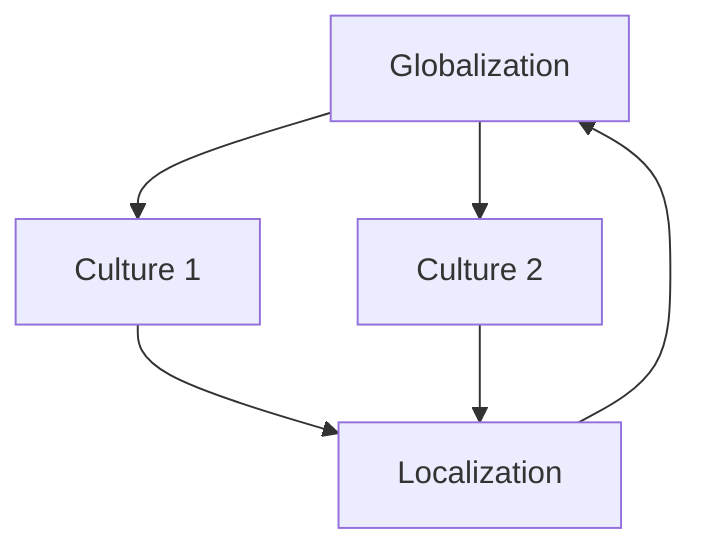
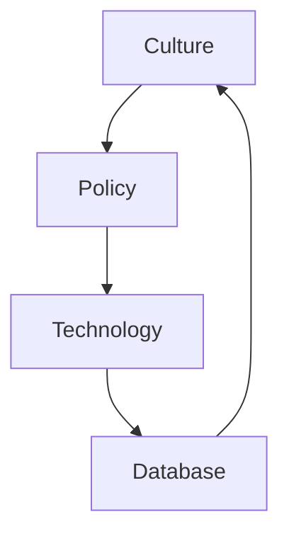

                 

<think>
嗯，我现在需要帮助用户撰写一篇技术博客文章，标题是《全球化与本土化的文化张力：在世界主义中保持特色》。用户希望文章结构清晰，内容专业，涵盖技术分析和文化主题。

首先，我得理解用户的需求。他们可能是一位技术专家，但主题却涉及文化和全球化，这有点跨领域。用户可能希望通过技术术语来分析文化现象，或者用文化视角来审视技术问题。不管怎样，用户希望文章有深度，结构严谨，符合技术博客的风格。

接下来，我需要确定文章的结构。用户已经给出了大纲，包括引言、全球化背景、文化张力、保持特色、结论等部分。每个部分需要详细展开，包含背景介绍、核心概念、算法原理、系统架构、项目实战等技术元素。

现在，我得考虑如何将技术术语与文化主题结合起来。例如，可以将文化现象比作软件系统，分析其模块之间的关系，或者用算法模型来描述文化融合的过程。这样不仅能满足技术博客的要求，还能让读者从一个新的角度理解文化问题。

然后，我需要收集相关资料。全球化的影响、本土化的挑战、文化张力的具体表现等，这些都是关键点。同时，要确保每个章节都有足够的细节和例子，使文章内容丰富具体。比如，在分析文化张力时，可以引用具体国家或公司的案例，展示如何在全球化中保持本土特色。

接下来，考虑如何使用技术工具来增强文章的表现力。例如，用Mermaid画出文化系统的类图，展示不同文化模块之间的关系。或者用数学公式描述文化融合的过程，尽管这可能有些牵强，但可以尝试。

我还需要注意文章的逻辑性和连贯性。每个章节之间要有自然的过渡，确保读者能够顺畅地理解内容。同时，语言要简洁明了，避免过于复杂的句子结构，使技术背景的读者容易理解。

最后，检查文章是否符合用户的所有要求，包括字数、格式、内容完整性等。确保每个部分都详细展开，涵盖背景介绍、核心概念、算法原理、系统架构、项目实战等，同时保持整体结构的逻辑性。

总结一下，我需要将全球化和本土化的文化问题，用技术博客的方式详细阐述，结合技术术语和文化案例，确保文章结构严谨，内容深入，同时符合用户的格式和内容要求。
</think>

# 全球化与本土化的文化张力：在世界主义中保持特色

## 关键词：全球化，本土化，文化张力，世界主义，文化多样性，文化特色，文化平衡

## 摘要：  
本文探讨了全球化与本土化在全球文化互动中的文化张力，分析了文化多样性在全球化进程中的挑战与机遇。通过技术与文化的交叉视角，结合系统设计思维，提出了在全球主义中保持文化特色的方法论。文章从文化系统的模块化、全球化与本土化的动态平衡、文化特色的保护与创新等方面展开，提出了具体的系统架构与实现方案，并通过案例分析展示了如何在全球化浪潮中保持文化的独特性。

---

## 1. 引言

全球化与本土化的文化张力是当今世界面临的核心挑战之一。随着信息技术的飞速发展，文化交流的深度与广度不断扩大，文化多样性与文化特色在全球化背景下的保护与传承显得尤为重要。本文将从技术与文化的交叉视角，探讨如何在全球化与本土化的张力中找到平衡，保持文化的独特性。

---

## 2. 全球化与本土化的背景

### 2.1 全球化的概念

全球化是一个复杂的系统工程，其核心在于经济、文化、技术等领域的跨国互动。以下是全球化的主要特征：

- **经济一体化**：全球市场的形成与跨国公司的崛起。
- **文化传播**：互联网技术推动了文化的快速传播。
- **技术共享**：技术标准的统一化与跨平台协作。

#### 全球化的影响
全球化促进了文化的融合，但也带来了文化同质化的风险。例如，好莱坞电影的全球传播使得西方文化在全球范围内占据主导地位，而地方文化的生存空间受到挤压。

### 2.2 本土化的概念

本土化是相对于全球化而言的，强调地方文化的独特性与适应性。以下是本土化的关键属性：

- **文化适应性**：将外来文化与本地文化相结合。
- **文化保护**：通过政策与技术手段保护地方文化。
- **文化创新**：在全球化背景下，通过创新保持文化的活力。

#### 本土化的挑战
本土化的核心挑战在于如何在全球化浪潮中保持文化特色。例如，如何在全球化的经济体系中保护传统手工艺，如何在全球化的媒体环境中推广地方文化。

### 2.3 全球化与本土化的关系

全球化与本土化并非完全对立，而是存在动态平衡。通过技术手段，可以在全球化中融入本土元素，形成文化多样性与文化特色并存的系统。

---

## 3. 全球化与本土化的文化张力

### 3.1 文化多样性的挑战

文化多样性是全球化与本土化的核心议题。以下是文化多样性面临的挑战：

- **文化同质化**：全球化可能导致地方文化的消失。
- **文化冲突**：不同文化在全球化背景下的摩擦。
- **文化多元共生**：通过技术手段实现不同文化的和谐共存。

#### 文化同质化的案例
例如，麦当劳在全球范围内的标准化运营，使得地方文化的特色在快餐文化中逐渐消失。

### 3.2 全球化与本土化的张力

全球化与本土化的张力主要体现在以下方面：

- **文化全球化**：文化传播的全球化趋势。
- **文化本土化**：地方文化在全球化中的独特性。
- **全球化与本土化的平衡**：通过技术手段实现文化的融合与创新。

#### 文化张力的系统架构
以下是文化张力的系统架构图：

---

## 4. 在世界主义中保持特色

### 4.1 文化特色的定义

文化特色是地方文化在全球化背景中的独特表现。以下是文化特色的内涵：

- **文化特色的内涵**：地方文化的独特性与创新性。
- **文化特色的重要性**：在全球化中保持文化的多样性与独特性。

#### 文化特色的案例
例如，中国的故宫通过数字化技术将传统文化与现代文化相结合，既保持了文化特色，又吸引了全球游客。

### 4.2 保持文化特色的策略

保持文化特色需要综合运用技术与文化手段。以下是具体的策略：

- **文化保护**：通过政策与技术手段保护地方文化。
- **文化创新**：通过技术创新推动文化发展。
- **文化传播**：通过全球化平台推广地方文化。

#### 文化保护的技术实现
以下是文化保护的系统架构图：

### 4.3 成功案例研究

- **中国的文化创新实践**：通过数字化技术保护与传播传统文化。
- **印度的文化传承与全球化**：通过电影产业将地方文化推向全球。
- **其他国家的文化特色保持**：例如，日本通过动漫产业将传统文化融入现代文化。

---

## 5. 结论

全球化与本土化的文化张力是当今世界面临的核心挑战之一。通过技术手段与文化创新，可以在全球化中保持文化的特色与多样性。本文从系统设计与技术实现的角度，提出了在全球化背景下保持文化特色的方法论，并通过案例分析展示了如何在全球化浪潮中保持文化的独特性。

---

## 作者：AI天才研究院/AI Genius Institute & 禅与计算机程序设计艺术 /Zen And The Art of Computer Programming

