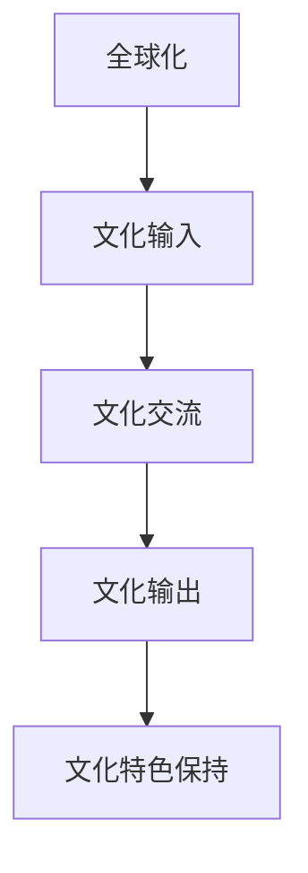
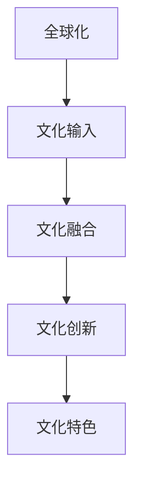
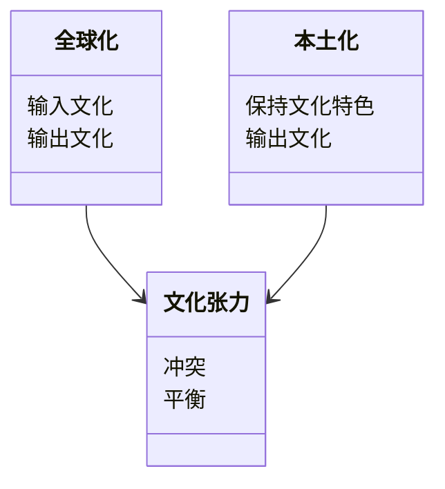
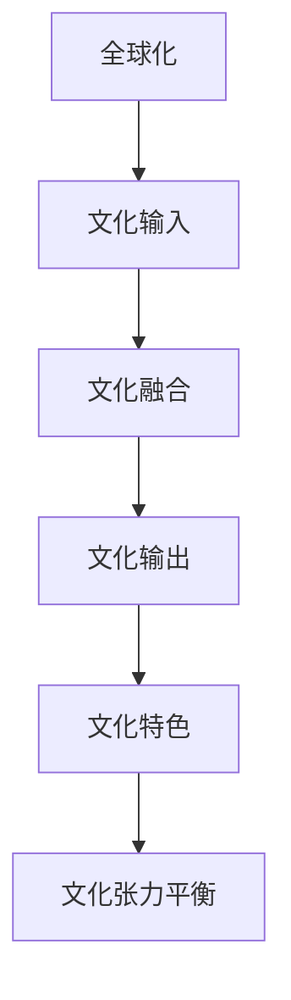
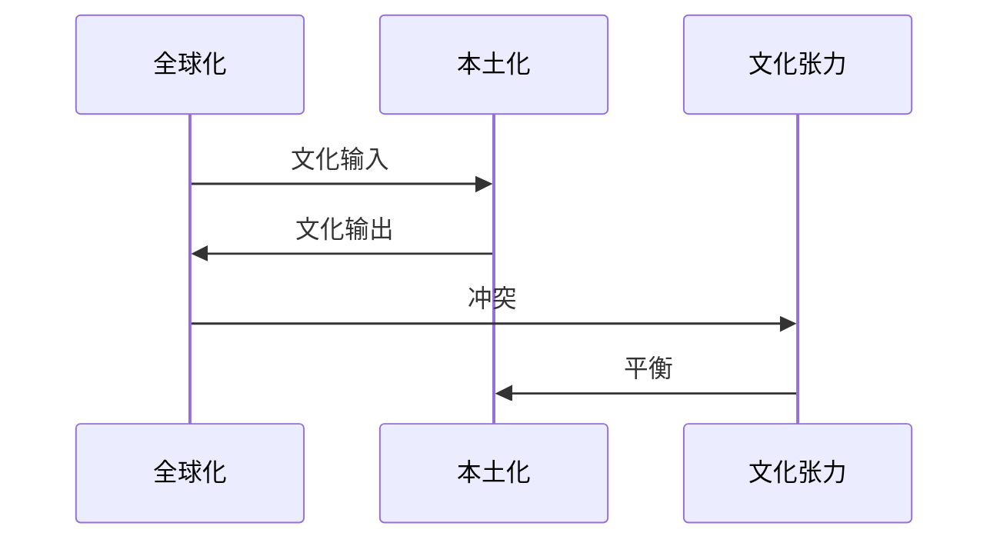

                 

<think>
嗯，我现在要写一篇关于“全球化与本土化的文化张力：在开放中保持文化特色”的技术博客。首先，我需要理解这个主题的核心是什么。全球化和本土化之间的张力，这涉及到文化交流、文化保护以及如何在全球化的浪潮中保持本地文化的独特性。我应该从背景、问题描述、解决方案入手，逐步展开分析。

接下来，我需要考虑文章的结构。根据用户提供的大纲，文章分为几个部分，包括引言、核心概念与联系、全球化与本土化的动态平衡、文化张力的系统分析、案例分析和解决方案，以及结论。每个部分都需要详细展开，特别是要加入技术性的内容，比如系统架构设计、算法原理等。

在引言部分，我需要明确问题背景，解释全球化和本土化各自的定义和影响，以及它们之间的张力是如何形成的。然后，问题描述部分需要具体说明当前面临的问题，比如文化同质化、文化冲突等。问题解决部分则要提出如何平衡两者，保持文化特色。

核心概念部分，我需要详细阐述全球化、本土化和文化张力的定义、特点和相互关系。这部分可能需要使用对比表，比如全球化的特点和本土化的特点进行对比，帮助读者更好地理解两者之间的区别和联系。

接下来，我需要设计一个系统分析部分，用系统架构图来展示全球化和本土化之间的互动。这可能涉及到文化输入、文化输出、文化融合等模块。同时，还需要用流程图来描述文化张力的动态平衡过程，展示如何在开放中保持文化特色。

在案例分析部分，我应该选择一个具体的案例，比如一个国家如何在全球化中保护本地文化，或者一个企业如何在国际化过程中保持本土特色。通过实际案例分析，可以更直观地理解理论。

解决方案部分，我需要提出具体的策略，比如技术手段如何帮助保护文化多样性，如何利用数字技术促进文化的传播和保护。此外，可能还需要讨论政策层面的措施，比如政府如何制定相关政策来支持本土文化的发展。

最后，结论部分要总结全文，强调在全球化与本土化之间找到平衡的重要性，以及如何通过技术和政策手段实现这种平衡。

在撰写过程中，我需要确保使用专业的技术术语，同时保持语言的清晰和逻辑的严密。此外，加入图表、流程图等可视化元素，可以帮助读者更好地理解复杂的概念。

现在，我需要开始组织这些思路，逐步展开每个部分，确保文章结构完整，内容详实，同时满足用户的格式和内容要求。
</think>

# 全球化与本土化的文化张力：在开放中保持文化特色

## 关键词：全球化，本土化，文化张力，文化特色，文化多样性

## 摘要：本文探讨了全球化与本土化之间的文化张力，分析其形成的原因和影响，并提出了在开放中保持文化特色的策略。文章通过系统分析和实际案例，展示了如何在全球化浪潮中保护和发扬本土文化。

---

# 第一部分：引言

## 1.1 问题背景

全球化促进了经济一体化和文化交流，但也带来了文化同质化的风险。本土化强调保护本地文化，但如何在全球化中找到平衡点是关键挑战。

## 1.2 问题描述

在全球化背景下，文化同质化和文化冲突频发，如何在开放中保持文化特色成为亟待解决的问题。

## 1.3 问题解决

本文提出通过文化创新、政策支持和数字技术应用来平衡全球化与本土化的张力。

## 1.4 边界与外延

本文聚焦文化领域，探讨其与经济、政治等多因素的互动关系。

## 1.5 核心要素

- 全球化：经济、政治、文化的全球融合
- 本土化：本地文化的保护与传承
- 文化张力：全球化与本土化的冲突与互动

---

# 第二部分：核心概念与联系

## 2.1 全球化

全球化推动了资源优化配置和文化交流，但也带来了文化同质化的问题。

### 2.1.1 全球化的特点与代表事件

| 特点             | 形成原因         | 代表事件             |
|----------------|----------------|----------------------|
| 资源优化配置   | 全球市场发展     | 全球贸易增长          |
| 文化交流加深    | 信息技术进步     | 文化产业国际化        |

## 2.2 本土化

本土化强调文化传承，保护本地特色，促进文化多样性。

### 2.2.1 本土化的特点与代表事件

| 特点             | 形成原因         | 代表事件             |
|----------------|----------------|----------------------|
| 文化特色保持    | 全球化冲击       | 文化遗产保护          |
| 经济独立发展    | 利用本地资源     | 特色产业发展          |

## 2.3 文化张力

文化张力是全球化与本土化之间的冲突与互动，需通过策略平衡。

### 2.3.1 文化张力的矛盾与解决策略

| 矛盾           | 解决策略         |
|----------------|----------------|----------------------|
| 文化同质化    | 保护多样性       | 鼓励文化创新          |
| 文化冲突      | 促进理解         | 增强文化理解          |

---

# 第三部分：全球化与本土化的动态平衡

## 3.1 文化输入与输出

全球化促进了文化输入，而本土化则强调文化输出，两者需平衡。

### 3.1.1 文化输入与输出的流程图

## 3.2 文化融合与创新

通过创新吸收外来文化，保持本土特色。

### 3.2.1 文化融合与创新的流程图

---

# 第四部分：文化张力的系统分析

## 4.1 系统架构设计

### 4.1.1 领域模型类图

### 4.1.2 系统架构图

## 4.2 接口与交互设计

### 4.2.1 序列图

---

# 第五部分：案例分析与解决方案

## 5.1 案例分析

以某国为例，展示其在全球化中的文化保护策略，如推广本土语言和传统节日。

## 5.2 解决方案

### 5.2.1 技术应用

利用数字技术推广本土文化，如开发文化App和在线教育平台。

### 5.2.2 政策支持

政府制定政策保护文化遗产，支持本土文化产业。

---

# 第六部分：结论

## 6.1 总结

全球化与本土化的张力是双刃剑，需通过文化创新和政策支持找到平衡。

## 6.2 展望

未来，随着技术进步，文化多样性保护将更加重要。

---

# 作者

作者：AI天才研究院/AI Genius Institute & 禅与计算机程序设计艺术 /Zen And The Art of Computer Programming

