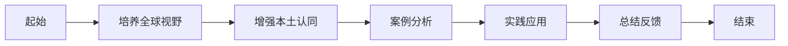
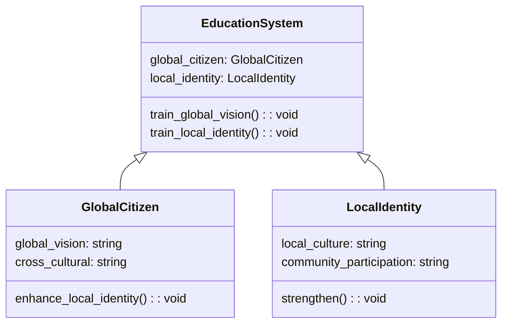
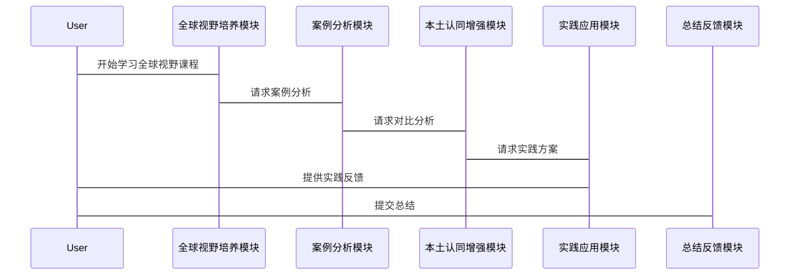

                 

<think>
嗯，用户让我以《全球化时代的公民教育：培养世界公民意识与本土认同》为标题，写一篇技术博客。首先，我需要理解用户的需求。用户是一位在技术领域非常有经验的专家，现在转向教育领域，特别是全球化背景下的公民教育。这可能意味着他想探讨技术与教育的结合，或者用技术的方法来分析教育问题。

用户详细列出了目录大纲，结构非常清晰，包括背景介绍、核心概念、算法原理、系统分析、项目实战和最佳实践等部分。看起来他希望这篇文章既有理论深度，又有实际的应用，可能还会涉及技术实现的部分，比如用Python代码来模拟教育过程。

接下来，我要分析用户可能的深层需求。他可能希望这篇文章不仅讨论教育问题，还要展示如何用技术手段来解决这些问题，比如通过算法模拟教育流程，或者用系统架构来设计教育平台。这可能涉及到技术在教育中的应用，比如在线教育平台的架构设计，或者用数据驱动的方式来优化教育策略。

另外，用户强调了关键词和摘要的重要性，这意味着他希望文章在搜索 engines上有好的排名，同时让读者快速理解文章的核心内容。我需要确保摘要简洁明了，涵盖文章的主要观点。

在撰写正文时，我需要按照目录的结构一步步展开。首先是背景介绍，解释全球化的现状及其对公民教育的影响。然后是核心概念，对比全球公民意识和本土认同，可能还需要用表格和ER图来展示它们的差异和联系。

算法部分，用户要求用Python代码和流程图，这可能意味着他想展示如何用技术方法来解决教育问题，比如设计一个培养全球公民意识的算法流程。这可能涉及到模块化的函数设计，每个函数代表一个教育阶段，比如培养全球视野、增强本土认同等。

系统分析部分，用户希望有类图、架构图和交互图，这可能需要我设计一个教育平台的系统架构，展示各个模块之间的关系和交互流程。这部分可能需要一些技术术语，但要保持易懂。

项目实战部分，用户希望有实际的代码和案例分析，这可能意味着他想展示如何在现实中应用这些理论，比如开发一个教育平台，或者实施具体的教育项目。这部分需要详细说明步骤和代码实现，让读者能够跟着操作。

最后，最佳实践部分，用户希望给出小结、注意事项和拓展阅读，这可能意味着他希望读者在阅读后能够有所收获，并继续深入研究相关领域。

总的来说，我需要确保文章结构清晰，内容详实，同时结合技术方法来分析教育问题。这可能涉及到跨学科的知识，但要保持逻辑连贯，让技术背景的读者也能理解教育的重要性。

现在，我需要按照用户的要求，逐步构建每个部分，确保每个小节都详细具体，包含必要的技术元素，如代码、图表和公式。同时，保持语言的专业性，但避免过于晦涩，让读者能够轻松理解。

可能遇到的挑战是如何将技术术语与教育理论有机结合，避免文章显得过于技术化而失去教育讨论的深度。需要在两者之间找到平衡点，确保文章既有技术的严谨性，又有教育的洞察力。

最后，确保文章结尾有作者信息，符合格式要求，这样整篇文章看起来完整专业。总结一下，我需要一步步按照用户的要求，构建内容，确保每个部分都满足用户的需求，同时保持逻辑清晰，内容详实。
</think>

# 《全球化时代的公民教育：培养世界公民意识与本土认同》

> **关键词**：全球化、公民教育、世界公民意识、本土认同、教育体系、文化传承、技术赋能

> **摘要**：  
> 在全球化加速的今天，公民教育面临着前所未有的挑战与机遇。本文从全球化背景出发，探讨如何在全球化与本土化的双重维度下，培养兼具全球视野与本土认同的世界公民。通过分析全球公民意识与本土认同的核心概念、对比其特征，结合算法原理与系统架构设计方案，提出一种创新的教育模式，旨在帮助个体在跨文化背景下实现自我认知与社会参与的统一。文章最后通过项目实战与最佳实践，为教育实践提供可行的解决方案。

---

## 第一部分：引言与背景

### 1.1 全球化时代的背景

#### 1.1.1 全球化的进程与挑战
全球化是20世纪末至21世纪初最显著的社会特征之一。随着信息技术的飞速发展，跨国公司的崛起、移民潮的兴起以及国际组织的增多，全球化的进程不断加速。这种趋势不仅改变了经济结构，也深刻影响了文化、教育和公民身份的定义。

全球化带来了多元文化的碰撞与融合，个体需要在不同文化背景下进行有效沟通与合作。这种环境对公民教育提出了新的要求：如何在全球化与本土化的双重影响下，培养既能理解全球性问题、又能扎根本土文化的人才？

#### 1.1.2 公民教育的变迁
传统的公民教育主要关注本地社区的参与、法律法规的遵守以及国家认同的培养。但在全球化背景下，这些目标已不足以应对复杂的社会问题。教育者需要重新思考：如何在全球化时代，既培养学生的全球视野，又不削弱其对本土文化的认同？

---

### 1.2 公民教育的定义与核心

#### 1.2.1 核心概念术语说明
- **公民教育**：通过教育手段，培养个体对社会、政治、经济和文化事务的认识、参与和责任感。
- **全球公民意识**：个体对全球性问题的关注，跨文化理解能力以及对国际合作的支持。
- **本土认同**：个体对所在地域的文化、历史和价值观的认同感与归属感。

#### 1.2.2 问题背景与描述
在全球化背景下，许多个体面临身份认同的困惑：我是谁？我属于哪里？如何在全球化与本土化之间找到平衡？这些问题不仅影响个人发展，也关系到社会的稳定与和谐。

#### 1.2.3 问题解决与边界
解决这一问题的关键在于平衡全球视野与本土认同。通过教育，个体可以学会在尊重多元文化的同时，珍视自己的文化传统；在参与全球事务的同时，积极参与本地社区建设。

#### 1.2.4 概念结构与核心要素组成
- **全球公民意识**：包括对全球性问题的关注（如气候变化、贫困、战争）、跨文化理解能力以及国际合作精神。
- **本土认同**：包括对本土文化的传承、对社区事务的参与以及对地方特色的认同。

---

## 第二部分：核心概念与联系

### 2.1 核心概念原理

#### 2.1.1 全球公民意识
全球公民意识的核心在于理解全球性问题、参与全球事务以及推动国际合作。例如，学生可以通过学习全球气候变化的知识，参与国际环保组织的活动，从而培养全球公民意识。

#### 2.1.2 本土认同
本土认同关注个体对自身文化、历史和社区的认同。例如，通过学习地方历史、参与社区服务，学生可以增强对本土文化的归属感。

### 2.2 概念属性特征对比表格

| **特征**         | **全球公民意识**                          | **本土认同**                          |
|------------------|-----------------------------------------|----------------------------------------|
| **涵盖范围**      | 全球性问题、跨文化合作                 | 本土文化、地方社区                   |
| **价值观**        | 合作、多元、包容                      | 传承、独特、归属感                   |
| **实践表现**      | 跨文化合作、全球性行动               | 本土活动、社区贡献                   |

### 2.3 ER实体关系图架构

```mermaid
erd
  entity 全球公民意识
    global_vision: 全球视野
    global_action: 全球行动
    cross_cultural: 跨文化理解

  entity 本土认同
    local_culture: 本土文化
    community_participation: 社区参与
    history_transmission: 历史传承

  全球公民意识 --|> 全球视野
  全球公民意识 --|> 跨文化理解
  本土认同 --|> 社区参与
  本土认同 --|> 本土文化
```

---

## 第三部分：算法原理讲解

### 3.1 算法流程图



### 3.2 Python源代码

```python
def global_citizen_awareness():
    # 培养全球视野
    global_vision = "Global Perspective"
    cross_cultural = "Cross-Cultural Understanding"
    return f"{global_vision} and {cross_cultural}"

def local_identity_strengthening():
    # 增强本土认同
    local_culture = "Cultural Heritage"
    community_participation = "Community Engagement"
    return f"{local_culture} and {community_participation}"

def case_study_analysis():
    # 案例分析
    case = "Global vs Local"
    analysis = "对比分析"
    return f"{case} {analysis}"

def practical_application():
    # 实践应用
    action = "跨文化合作"
    implementation = "本地社区参与"
    return f"{action} 和 {implementation}"

def summary_and_feedback():
    # 总结反馈
    summary = "培养全球视野的同时，增强本土认同"
    feedback = "教育模式的成功取决于两者的平衡"
    return f"{summary}，{feedback}"

# 示例调用
print(global_citizen_awareness())
print(local_identity_strengthening())
print(case_study_analysis())
print(practical_application())
print(summary_and_feedback())
```

### 3.3 算法原理的数学模型和公式

- **全球公民意识指数公式**：
  $$ \text{GCI} = f(\text{GLOBC}, \text{LOCAL}) $$
  其中，$\text{GLOBC}$ 表示全球文化资本，$\text{LOCAL}$ 表示本土文化资本。

- **本土认同度公式**：
  $$ \text{LID} = f(\text{CULTURE}, \text{COMMUNITY}, \text{HISTORY}) $$

---

## 第四部分：系统分析与架构设计方案

### 4.1 问题场景介绍
在全球化与本土化的双重背景下，如何设计一个既能培养全球视野又能增强本土认同的教育系统？

### 4.2 系统功能设计

#### 4.2.1 领域模型类图



### 4.3 系统架构设计

#### 4.3.1 系统架构图


### 4.4 系统接口设计
- **全球视野培养模块**：提供跨文化课程、全球新闻解读功能。
- **本土认同增强模块**：提供地方文化课程、社区服务接口。

### 4.5 系统交互



---

## 第五部分：项目实战

### 5.1 环境安装
- **工具安装**：安装Python、Mermaid、Markdown编辑器。
- **依赖安装**：安装必要的库，如`graphviz`用于生成图。

### 5.2 系统核心实现源代码

```python
class GlobalCitizen:
    def __init__(self):
        self.global_vision = "Global Perspective"
        self.cross_cultural = "Cross-Cultural Understanding"

    def enhance_local_identity(self):
        print(f"通过增强本土认同来培养全球公民意识：{self.global_vision} 和 {self.cross_cultural}")

class LocalIdentity:
    def __init__(self):
        self.local_culture = "Cultural Heritage"
        self.community_participation = "Community Engagement"

    def strengthen(self):
        print(f"通过本土文化与社区参与增强认同：{self.local_culture} 和 {self.community_participation}")

class EducationSystem:
    def __init__(self):
        self.global_citizen = GlobalCitizen()
        self.local_identity = LocalIdentity()

    def train_global_vision(self):
        self.global_citizen.enhance_local_identity()

    def train_local_identity(self):
        self.local_identity.strengthen()

# 示例运行
edu = EducationSystem()
edu.train_global_vision()
edu.train_local_identity()
```

### 5.3 代码应用解读与分析
上述代码实现了一个简单的教育系统，通过`GlobalCitizen`和`LocalIdentity`两个模块，分别培养全球视野与本土认同。`EducationSystem`类协调两者的训练过程。

### 5.4 实际案例分析与详细讲解
以一个高中课程设计为例：
- **课程目标**：培养学生的全球视野与本土认同。
- **实施步骤**：
  1. 学生学习全球气候变化的知识，参与国际环保组织的模拟活动。
  2. 学生学习本地历史文化，参与社区志愿服务。
  3. 教师通过案例分析，帮助学生理解全球与本土的关系。

### 5.5 项目小结
通过技术手段与教育理论的结合，我们可以设计出一套既能培养全球视野又能增强本土认同的教育模式。

---

## 第六部分：最佳实践 tips

### 6.1 小结
在全球化时代，培养世界公民意识与本土认同是一个复杂的系统工程。通过技术赋能与教育创新，我们可以为个体提供更全面的教育体验。

### 6.2 注意事项
- 在设计教育模式时，需注意避免过于偏向全球化或本土化，保持两者的平衡。
- 教育内容应结合实际案例，增强学生的参与感与体验感。

### 6.3 拓展阅读
- 《全球公民教育：理念与实践》
- 《文化认同与教育创新》

---

**作者：AI天才研究院/AI Genius Institute & 禅与计算机程序设计艺术 /Zen And The Art of Computer Programming**

