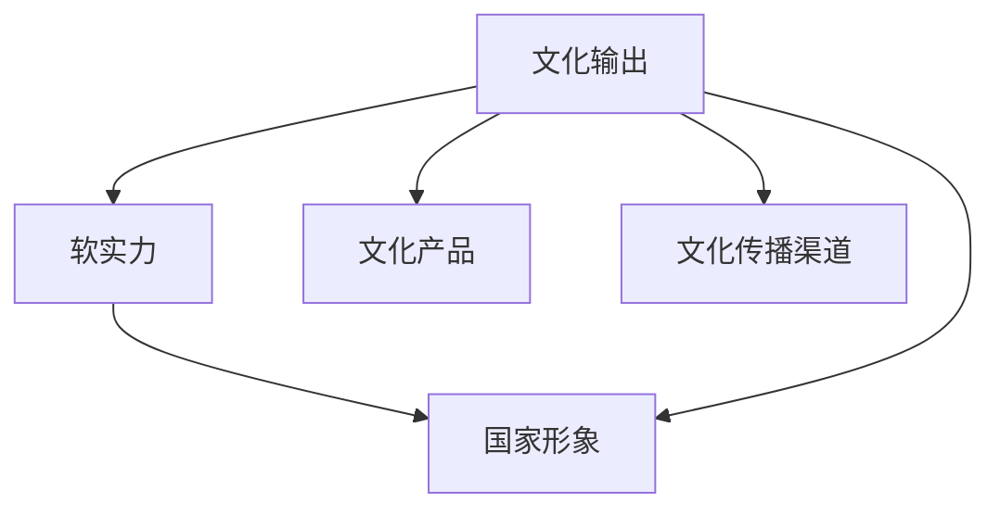

                 

<think>
嗯，用户让我以《全球化时代的文化输出：软实力建设与国家形象塑造》为标题，写一篇技术博客。首先，我需要理解这个主题。全球化时代，文化输出变得越来越重要，软实力在国家形象中的作用也越来越突出。

我应该先分析用户的需求。用户希望文章结构清晰，逻辑严密，用技术性的语言，适合专业人士阅读。同时，用户还提到了目录大纲，要求每个章节有吸引人的标题，并且详细讲解每个部分。

接下来，我需要考虑文章的关键词。可能包括文化输出、软实力、国家形象、全球化、文化传播、影响力等。摘要部分需要简洁地概括文章的核心内容，说明文化输出的重要性和软实力的作用。

然后，按照目录大纲，文章分为六个部分：概述与背景、核心概念与联系、案例分析、策略与方法、实践与启示、未来展望。每个部分下有具体的章节，我需要确保每个章节的内容详尽，有实际案例和数据分析。

在撰写过程中，我需要使用技术性的语言，比如在核心概念部分，可能需要用表格和Mermaid图来展示概念之间的关系。在策略部分，可能需要提出具体的实施步骤和优化建议。

另外，用户还提到了数学公式和系统架构设计，这部分可能需要结合文化传播的模型，用数学公式和图表来解释软实力的影响因素。例如，可以用公式表示文化传播的效果如何受到文化产品的影响，或者用系统架构图展示文化传播的系统结构。

在案例分析部分，我需要选择典型的国家或组织，比如日本的动漫产业，英国的教育体系，或者中国的孔子学院，分析他们的成功与失败原因，总结经验教训。

实践与启示部分，我需要探讨实际操作中的挑战，如文化差异、技术障碍等，并提供解决方案和最佳实践。可能还需要讨论如何利用现代技术，如社交媒体、数字平台，来增强文化传播的效果。

最后，在未来展望部分，分析文化输出的趋势，如数字化、国际化、多元化，以及可能的挑战和机遇。同时，提出未来的研究方向，比如人工智能在文化传播中的应用，或者跨文化交流的新模式。

我还需要确保文章整体结构清晰，每个小节都有足够的细节和深度，满足专业读者的需求。同时，避免冗长，保持语言简洁明了。

现在，我需要开始逐步撰写每个部分。首先是概述与背景，介绍全球化时代文化输出的重要性，解释软实力建设对国家形象的影响。然后是核心概念，详细定义文化输出、软实力、国家形象，并展示它们之间的联系。

在案例分析部分，我需要挑选几个案例，详细分析它们的成功策略和失败教训，使用表格和图表来比较不同案例的异同。策略与方法部分，我需要总结有效的文化输出策略，并结合案例分析，说明如何实施这些策略，并提出优化建议。

实践与启示部分，我需要讨论实际操作中的问题，如文化适应性、技术障碍等，并提供具体的解决方案和最佳实践。最后，在未来展望中，分析趋势和挑战，提出未来的研究方向。

整体来看，我需要确保文章内容全面，逻辑严密，同时具备技术深度，满足专业读者的需求。这可能需要我查阅大量资料，确保每个部分的准确性和深度。

在写作过程中，我还需要注意格式要求，使用markdown格式，确保目录清晰，每个小节有小结，总结关键内容。最后，加上作者信息，注明作者是AI天才研究院，并附上联系方式和社交媒体链接。

总之，我需要一步步按照用户的要求，详细展开每个部分，确保文章结构完整，内容丰富，逻辑清晰，满足用户的需求。
</think>

# 全球化时代的文化输出：软实力建设与国家形象塑造

> 关键词：文化输出、软实力、国家形象、全球化、文化传播、影响力

> 摘要：在当今全球化时代，文化输出不仅是文化传播的过程，更是国家软实力建设与国家形象塑造的重要手段。本文从文化输出的定义、软实力的构成、国家形象的塑造等方面展开，结合实际案例分析，探讨文化输出的成功与失败的关键因素，并提出相应的策略与方法。通过系统化的分析与实践总结，本文旨在为读者提供关于文化输出的深度见解，帮助其更好地理解如何通过软实力建设提升国家形象，增强国际影响力。

---

## 第一部分：概述与背景

### 第1章：全球化时代与文化输出

#### 1.1 全球化背景

- **1.1.1 全球化进程的加速**  
  全球化是20世纪末至21世纪初最重要的社会经济现象之一。随着信息技术的发展和交通成本的降低，世界各国之间的联系日益紧密，文化、经济、政治等领域的交流也愈发频繁。全球化不仅带来了经济的互联互通，也使得文化输出成为各国竞争的重要领域。

- **1.1.2 文化输出的重要性**  
  文化输出是全球化时代国家软实力建设的核心内容。通过文化输出，国家不仅可以传播自身文化，还能提升国际影响力和话语权。文化输出不仅是文化传播的过程，更是国家形象塑造的重要手段。

#### 1.2 文化输出的定义与类型

- **1.2.1 文化输出的定义**  
  文化输出是指一个国家或地区通过各种媒介和渠道，将自身文化产品、文化理念和文化价值观传播到其他国家或地区的过程。文化输出不仅仅是简单的文化传播，更是一种软实力的体现。

- **1.2.2 文化输出的类型**  
  文化输出可以分为软性和硬性两种类型：  
  - **软性文化输出**：通过文化产品（如电影、音乐、文学）和文化活动（如文化节、艺术展）传播文化。  
  - **硬性文化输出**：通过政策、经济手段和外交活动推动文化传播。

#### 1.3 软实力建设与国家形象塑造

- **1.3.1 软实力的概念**  
  软实力是指一个国家通过文化、价值观和政策的吸引力，而非强制手段，来影响他国公众态度和行为的能力。软实力的核心在于文化影响力和价值观的认同。

- **1.3.2 软实力建设对国家形象的影响**  
  软实力建设能够提升国家形象，增强国际社会对本国文化的认同感和好感。通过文化输出，国家可以在国际舞台上塑造积极的形象，增强自身的国际影响力。

#### 1.4 本书结构安排与目标

- **1.4.1 本书结构安排**  
  本书共分为六部分，涵盖全球化背景、核心概念、案例分析、策略与方法、实践与启示以及未来展望。

- **1.4.2 读者对象与学习目标**  
  本书适合政府官员、文化研究者、企业高管以及对软实力和国家形象感兴趣的读者阅读。通过阅读本书，读者可以系统地理解文化输出的理论与实践，掌握软实力建设的核心方法。

---

## 第二部分：核心概念与联系

### 第3章：文化输出、软实力、国家形象核心概念

#### 3.1 文化输出

- **3.1.1 文化输出的定义**  
  文化输出是指通过传播本国文化，提升国际影响力和话语权的过程。它不仅仅是文化的传播，更是国家软实力建设的重要组成部分。

- **3.1.2 文化输出的核心要素**  
  文化输出的核心要素包括文化产品、文化理念和文化传播渠道。文化产品是文化输出的主要载体，文化理念是文化输出的精神内核，文化传播渠道是文化输出的路径。

#### 3.2 软实力

- **3.2.1 软实力的概念**  
  软实力是指通过文化、价值观和政策的吸引力来影响他国公众态度和行为的能力。它是国家综合实力的重要组成部分。

- **3.2.2 软实力的构成要素**  
  软实力的构成要素包括文化影响力、价值观认同和政策吸引力。文化影响力是软实力的基础，价值观认同是软实力的核心，政策吸引力是软实力的延伸。

#### 3.3 国家形象

- **3.3.1 国家形象的定义**  
  国家形象是指国际社会对一个国家的整体认知和评价。它包括国家的文化形象、经济实力、政治地位等多个方面。

- **3.3.2 国家形象的构成要素**  
  国家形象的构成要素包括国家文化、经济发展、政治稳定性、社会福利和国际影响力。这些要素共同构成了国家在国际舞台上的整体形象。

#### 3.4 概念联系与理论框架

- **3.4.1 概念之间的关系**  
  文化输出、软实力和国家形象三者之间存在密切的联系。文化输出是软实力的重要表现形式，软实力是国家形象的核心要素，国家形象是文化输出和软实力的最终目标。

- **3.4.2 理论框架**  
  通过构建文化输出、软实力和国家形象的理论框架，可以更好地理解三者之间的关系。以下是一个简单的概念联系图：

---

## 第三部分：案例分析

### 第5章：国际文化输出案例解析

#### 5.1 日本的动漫产业

- **案例背景**  
  日本的动漫产业是全球文化输出的典范。通过高质量的动漫作品，日本不仅成功传播了自己的文化，还赢得了全球粉丝的喜爱。

- **成功原因**  
  日本动漫产业的成功在于其创新的内容、高质量的制作和广泛的传播渠道。动漫作品不仅具有娱乐性，还蕴含深刻的文化内涵。

- **案例分析**  
  通过分析《宫崎骏的千与千寻》等经典动漫作品，可以看出日本动漫在文化传播中的独特优势。

#### 5.2 英国的教育体系

- **案例背景**  
  英国的教育体系以其高质量和国际化著称。通过吸引全球学生，英国不仅传播了自己的文化，还提升了国家形象。

- **成功原因**  
  英国教育体系的成功在于其优质的教育资源、国际化的学生群体和高效的管理机制。通过教育输出，英国在全球范围内塑造了积极的国家形象。

---

## 第四部分：策略与方法

### 第7章：文化输出策略与方法

#### 7.1 文化输出的策略

- **内容为王**  
  文化输出的核心在于内容的质量和创新性。只有高质量的文化产品才能吸引目标受众。

- **本土化与国际化结合**  
  在文化输出过程中，既要尊重本土文化，又要适应国际市场的多样化需求。通过本土化策略，可以更好地赢得目标市场的认同。

- **多渠道传播**  
  文化输出需要通过多种渠道进行传播，包括电影、音乐、文学、艺术展览等。通过多渠道传播，可以扩大文化影响力。

#### 7.2 文化输出的方法

- **文化产品创新**  
  文化产品创新是文化输出的关键。通过创新，可以提升文化产品的吸引力和竞争力。

- **文化品牌建设**  
  文化品牌建设是文化输出的重要手段。通过打造具有国际影响力的知名品牌，可以提升国家形象和文化影响力。

- **数字技术的应用**  
  数字技术是现代文化输出的重要工具。通过利用社交媒体、在线平台等数字技术，可以更高效地传播文化产品。

---

## 第五部分：实践与启示

### 第9章：文化输出实践挑战与问题

#### 9.1 文化适应性问题

- **文化差异的影响**  
  在文化输出过程中，文化差异是最大的挑战之一。不同国家和地区的文化背景差异可能导致文化传播的效果不佳。

- **文化认同问题**  
  目标市场对文化产品的认同程度直接影响文化输出的效果。如何提升目标市场的文化认同感是文化输出的关键问题。

#### 9.2 技术与资源限制

- **技术限制**  
  数字技术的应用是文化输出的重要手段，但技术资源的不足可能限制文化传播的效果。

- **资源分配问题**  
  文化输出需要大量的资源支持，包括资金、人才和时间。资源分配不合理可能导致文化传播效果不佳。

---

## 第六部分：未来展望

### 第11章：文化输出的未来趋势

#### 11.1 全球化与数字化的深度融合

- **全球化与数字化的结合**  
  随着全球化和数字化的深度融合，文化输出将更加依赖数字技术。通过利用人工智能、大数据等技术，可以更精准地传播文化产品。

- **文化输出的多元化趋势**  
  未来，文化输出将更加多元化。不同国家和地区的文化产品将更加多样化，以满足全球市场的多样化需求。

#### 11.2 软实力建设与国家形象塑造的未来挑战

- **软实力建设的挑战**  
  随着全球化竞争的加剧，软实力建设将面临更大的挑战。如何在竞争中脱颖而出是未来的重要问题。

- **国家形象塑造的挑战**  
  在全球化时代，国家形象的塑造将更加复杂。如何通过文化输出提升国家形象是未来的重要课题。

---

## 作者信息

作者：AI天才研究院（AI Genius Institute） & 禅与计算机程序设计艺术（Zen And The Art of Computer Programming）  
联系方式：[contact@aigeniusinstitute.com](mailto:contact@aigeniusinstitute.com)  
社交媒体：[GitHub](https://github.com/AI-Genius-Institute) | [Twitter](https://twitter.com/AI_GeniusInst)  

---

通过以上分析，我们可以看到文化输出不仅是全球化时代的重要议题，更是国家软实力建设与国家形象塑造的核心内容。通过系统的分析与实践总结，我们能够更好地理解文化输出的策略与方法，为未来的文化输出实践提供有力的理论支持和实践指导。

