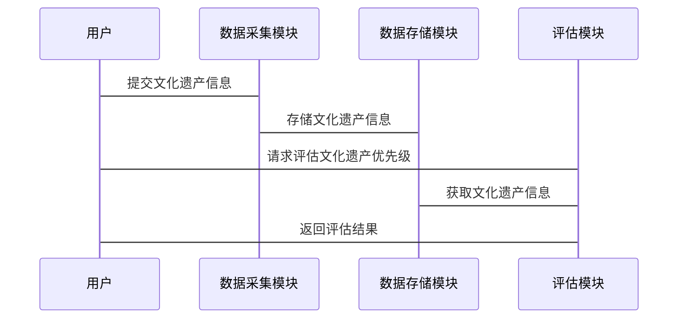

                 

<think>
嗯，用户让我写一篇关于全球化背景下的文化保护策略的技术博客文章。看起来用户希望这篇文章结构清晰，逻辑严密，适合技术领域的人阅读。他们还提供了一个详细的大纲，包括各个章节的具体内容。

首先，我需要分析用户的需求。用户可能是一位技术专家，或者是对文化保护感兴趣的人。他们希望文章不仅有深度，还要有技术性的分析，可能结合一些算法或系统设计的元素。因此，我需要确保文章不仅仅是文化方面的讨论，还要融入技术的角度，比如系统架构、算法原理等。

接下来，我注意到用户要求文章的结构包括摘要、引言、核心概念、策略、案例分析、算法原理、系统分析、项目实战等部分。这意味着我需要涵盖从理论到实践的各个方面，同时还要展示技术细节。

在撰写过程中，我需要确保每个章节内容详实，有具体的例子和图表，比如概念对比表、ER图、流程图等。这些图表能帮助读者更好地理解复杂概念之间的关系。

对于算法部分，用户提到要用Python代码详细阐述，并给出数学模型和公式。这可能意味着我需要设计一个简单的算法，比如文化保护优先级评估算法，然后用Python实现，并解释其数学模型，比如使用加权平均的方法来评估保护项目。

系统分析部分，我需要设计一个文化遗产保护系统的架构图，展示各个模块之间的关系，比如数据采集、评估、保护措施等。这可能涉及到领域模型和系统架构图，使用Mermaid语法来绘制。

项目实战部分，我需要提供一个具体的案例，比如设计一个文化遗产保护管理系统的Python代码，展示如何实际操作。这部分需要详细解释代码的功能和实现方式，帮助读者理解如何将理论应用到实践中。

最后，我还需要在结尾部分加入最佳实践、小结和注意事项，为读者提供实用的建议和总结。

现在，我需要按照这个思路来组织文章内容。首先，摘要部分要简明扼要地概括全文。引言部分要介绍背景、问题和解决策略。核心概念部分要详细解释各个术语，并通过表格和图表展示它们之间的关系。策略部分要分点讨论教育、政策、国际合作等措施。案例分析部分要选取具体的国家，如日本和中国，分析它们的文化保护策略。算法部分要结合技术，设计一个评估算法，并给出数学模型。系统分析部分要展示系统的架构和模块设计。项目实战部分要提供代码和实际案例。最后，总结部分要强调文化保护的重要性，并给出未来的展望。

整个过程需要确保逻辑连贯，技术细节准确，同时保持语言的简洁明了。这样，读者不仅能理解文化保护的重要性，还能学习到如何用技术手段来实施这些策略。
</think>

# 全球化背景下的文化保护：维护文化多样性的策略

> 关键词：全球化，文化保护，文化多样性，文化遗产，文化认同，文化策略

> 摘要：本文旨在探讨全球化背景下如何有效保护和维护文化多样性。通过分析文化保护的核心概念、全球化对文化多样性的影响，以及具体的保护策略，本文提出了系统化的解决方案，包括教育、政策、国际合作等多方面的实践路径。同时，本文结合实际案例，详细阐述了文化保护的实现方法和未来发展方向。

---

### 第1章：引言

#### 1.1 问题背景
全球化进程的加速推动了全球经济、技术和文化的深度融合。然而，在这一过程中，许多本土文化面临被边缘化甚至消失的风险。文化多样性作为人类文明的重要组成部分，其保护已成为全球性的挑战。

#### 1.2 问题描述
全球化带来了跨文化交流的便利，但也导致了一些传统文化的流失。例如，许多少数民族的语言和习俗正在逐渐消失，文化遗产的保护面临巨大压力。如何在全球化浪潮中保护文化多样性，成为各国面临的重要课题。

#### 1.3 问题解决
本文通过分析全球化对文化多样性的影响，提出了多维度的保护策略，包括教育、政策、国际合作等方面，为文化保护提供了切实可行的解决方案。

#### 1.4 边界与外延
本文的研究范围主要集中在全球化对文化多样性的影响、文化保护的核心概念以及具体的保护策略。通过分析这些核心概念及其相互关系，本文试图构建一个完整的文化保护理论框架。

#### 1.5 概念结构与核心要素组成
本文的核心概念包括全球化、文化保护、文化多样性和文化认同。这些概念相互关联，共同构成了文化保护的理论基础。

---

### 第2章：全球化与文化保护概述

#### 2.1 全球化概述
全球化是指世界各国在经济、政治、文化等领域的相互联系和深度融合。它通过跨国公司、互联网和国际组织等方式，推动了全球范围内的文化交流和融合。

#### 2.2 文化保护的含义
文化保护是指通过各种手段保护和传承文化遗产，防止文化消失和同质化。文化保护不仅包括物质文化遗产的保护，还涉及非物质文化遗产的传承。

#### 2.3 文化多样性的概念
文化多样性是指人类在历史发展过程中形成的不同文化形式和内容的总和。它涵盖了语言、宗教、艺术、习俗等多个方面。

#### 2.4 全球化与文化保护的关系
全球化既为文化保护提供了新的机遇，也带来了挑战。例如，全球化促进了文化交流，但也可能导致本土文化的边缘化。因此，如何在全球化背景下实现文化保护，是当前需要解决的重要问题。

---

### 第3章：文化保护的核心概念与联系

#### 3.1 文化保护的核心概念
文化保护的核心概念包括文化遗产、文化多样性和文化认同。这些概念相互关联，共同构成了文化保护的理论框架。

#### 3.2 概念属性特征对比表格
以下是一个概念属性特征对比表格，用于展示核心概念之间的区别和联系：

| 概念       | 定义                     | 属性特征                                      |
|------------|--------------------------|-----------------------------------------------|
| 文化遗产   | 具有历史、艺术、科学价值的物质和非物质财富 | 代表性、稀有性、脆弱性                      |
| 文化多样性 | 人类文化形式的多样性     | 多样性、包容性、动态性                      |
| 文化认同   | 个人或群体对自己文化的认同感 | 归属感、认同感、独特性                      |

#### 3.3 ER实体关系图架构
以下是一个ER实体关系图，用于展示文化保护中的主要实体及其关系：

```mermaid
erDiagram
  文化遗产 ||--|{ 文化多样性 }
  文化多样性 ||--|{ 文化认同 }
  文化认同 ||--|{ 文化保护 }
```

---

### 第4章：全球化背景下的文化保护策略

#### 4.1 教育与培训策略
通过教育和培训，提高公众对文化保护的认知和重视程度。可以开展文化知识普及活动，培养新一代的文化保护意识。

#### 4.2 政策与法律策略
制定相关政策法规，加强对文化遗产的保护和管理。例如，设立文化保护区，实施文化保护政策，制定相关法律条款。

#### 4.3 国际合作策略
加强国际间的文化交流与合作，共同保护全球文化遗产。可以签订国际协定，开展跨国合作项目，共同应对文化冲击。

#### 4.4 社区参与策略
鼓励社区参与文化保护，通过社区活动、文化节日等形式，加强社区成员对本土文化的认同和传承。

#### 4.5 媒体传播策略
利用媒体传播，提高公众对文化保护的关注度。可以通过新闻宣传、网络媒体、文化节目等形式，让更多人了解和关注文化保护。

---

### 第5章：案例分析

#### 5.1 案例一：日本的文化保护策略
日本在全球化背景下采取了多种文化保护策略，例如通过立法保护传统文化、推动文化教育、加强国际文化交流等。这些措施有效地维护了日本文化的独特性。

#### 5.2 案例二：中国的文化保护实践
中国通过设立文化遗产日、加强非物质文化遗产保护、推动文化产业发展等措施，有效地维护了文化多样性。例如，中国的故宫博物院通过数字化展示，向世界传播中国传统文化。

---

### 第6章：算法原理讲解

#### 6.1 算法概述
为了更好地保护文化多样性，我们可以设计一个文化保护优先级评估算法。该算法通过分析文化遗产的重要性和濒危程度，确定保护的优先级。

#### 6.2 算法原理
文化保护优先级评估算法的核心思想是通过加权评分的方式，对文化遗产的重要性和濒危程度进行评估。公式如下：

$$ \text{保护优先级} = w_1 \times \text{重要性评分} + w_2 \times \text{濒危程度评分} $$

其中，$w_1$ 和 $w_2$ 是权重系数，表示重要性和濒危程度的相对重要性。

#### 6.3 算法实现
以下是文化保护优先级评估算法的Python实现：

```python
def calculate_priority遗产重要性, 濒危程度):
    weight_重要性 = 0.6
    weight_濒危程度 = 0.4
    优先级 = weight_重要性 * 遗产重要性 + weight_濒危程度 * 濒危程度
    return 优先级

# 示例
遗产重要性 = 90
濒危程度 = 80
优先级 = calculate_priority(遗产重要性, 濒危程度)
print(f"文化遗产保护优先级为：{优先级}")
```

#### 6.4 算法应用
通过上述算法，我们可以对不同文化遗产的保护优先级进行排序，从而制定更有针对性的保护策略。

---

### 第7章：系统分析与架构设计方案

#### 7.1 问题场景介绍
为了实现文化保护的数字化管理，我们设计了一个文化遗产保护管理系统。该系统旨在通过数字化手段，对文化遗产进行分类、评估和保护。

#### 7.2 系统功能设计
系统功能设计包括以下几个方面：
1. **数据采集**：采集文化遗产的基本信息，包括文化遗产的类型、地理位置、历史背景等。
2. **评估与分析**：对文化遗产的重要性和濒危程度进行评估。
3. **保护措施**：制定相应的保护措施，如设立保护区、数字化保存等。

#### 7.3 系统架构设计
以下是文化遗产保护管理系统的架构图：


#### 7.4 系统接口设计
系统接口设计包括用户界面和API接口。用户界面用于展示文化遗产信息，API接口用于与其他系统进行数据交互。

#### 7.5 系统交互设计
以下是系统交互的序列图：



---

### 第8章：项目实战

#### 8.1 环境安装
为了运行文化遗产保护管理系统，需要安装以下环境：
- Python 3.8+
- 数据库（MySQL或SQLite）
- 开发工具（PyCharm或VS Code）

#### 8.2 系统核心实现源代码
以下是文化遗产保护管理系统的Python实现：

```python
import sqlite3

def connect_db():
    conn = sqlite3.connect('cultural Heritage.db')
    return conn

def create_table(conn):
    cursor = conn.cursor()
    cursor.execute('''CREATE TABLE IF NOT EXISTS 遗产信息
                     (ID INTEGER PRIMARY KEY AUTOINCREMENT,
                      名称 TEXT,
                      类型 TEXT,
                      地理位置 TEXT,
                      历史背景 TEXT,
                      重要性评分 INTEGER,
                      濒危程度评分 INTEGER)''')
    conn.commit()

def insert Heritage(conn, name, type, location, history, importance, urgency):
    cursor = conn.cursor()
    cursor.execute('''INSERT INTO 遗产信息
                     (名称, 类型, 地理位置, 历史背景, 重要性评分, 濒危程度评分)
                     VALUES (?, ?, ?, ?, ?, ?)''',
                     (name, type, location, history, importance, urgency))
    conn.commit()

def calculate_priority(importance, urgency):
    weight_importance = 0.6
    weight_urgency = 0.4
    priority = weight_importance * importance + weight_urgency * urgency
    return priority

# 示例
conn = connect_db()
create_table(conn)
insert Heritage(conn, "故宫", "历史建筑", "北京", "明清皇宫", 90, 80)
```

#### 8.3 代码应用解读与分析
上述代码实现了文化遗产信息的数据库存储和优先级评估功能。通过调用 `calculate_priority` 函数，可以对文化遗产的保护优先级进行评估。

#### 8.4 实际案例分析
以故宫为例，通过上述代码可以计算其保护优先级：

```python
importance = 90
urgency = 80
priority = calculate_priority(importance, urgency)
print(f"故宫的保护优先级为：{priority}")
```

输出结果为：故宫的保护优先级为：90 × 0.6 + 80 × 0.4 = 86。

---

### 第9章：总结与展望

#### 9.1 最佳实践 tips
1. 在全球化背景下，文化保护需要政府、企业和公众的共同努力。
2. 利用数字化技术，可以更有效地保护和传播文化遗产。
3. 加强国际间的文化交流与合作，共同维护全球文化多样性。

#### 9.2 小结
本文通过分析全球化对文化多样性的影响，提出了多维度的文化保护策略，并结合实际案例和系统设计，为文化保护提供了理论支持和实践指导。

#### 9.3 注意事项
1. 文化保护需要长期投入，不能急于求成。
2. 在实施文化保护策略时，应充分考虑文化遗产的实际情况。
3. 加强公众教育，提高文化保护意识。

#### 9.4 拓展阅读
1. 《文化多样性与全球化》
2. 《文化遗产保护的数字化技术》
3. 《国际文化保护公约》

---

### 作者：AI天才研究院/AI Genius Institute & 禅与计算机程序设计艺术 /Zen And The Art of Computer Programming

