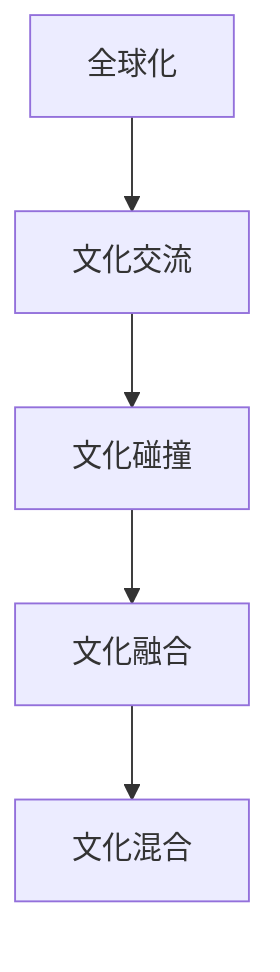
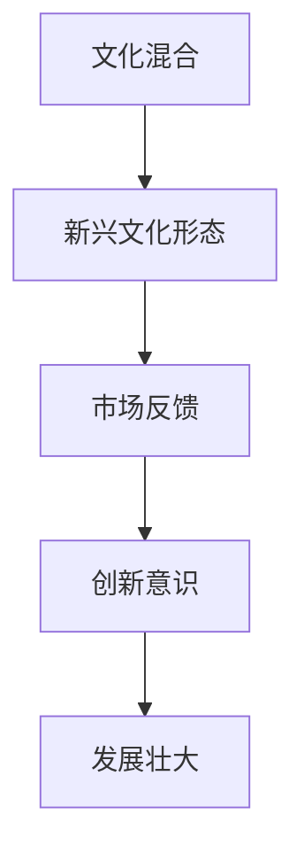
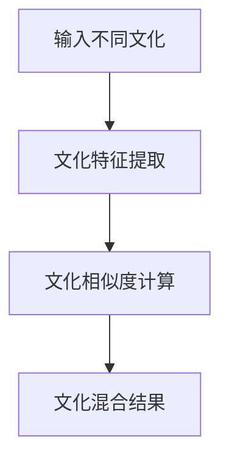

                 

<think>
嗯，我现在需要完成一个任务，撰写一篇关于《全球化背景下的文化混合：新兴文化形态的产生与发展》的技术博客文章。用户希望我以一位世界级的人工智能专家和程序员的身份来完成，文章需要逻辑清晰，结构紧凑，使用专业但易懂的技术语言。

首先，我要理解用户的具体需求。他们希望文章有明确的结构，包括背景介绍、核心概念、算法原理、系统分析与架构设计、项目实战以及最佳实践等部分。每个部分都需要详细展开，用技术性的语言，同时融入mermaid流程图和Python代码示例，以及数学公式。

我应该从背景介绍开始，解释文化混合的概念，问题背景和描述，以及问题解决的方法。接着，详细阐述核心概念，比如文化混合的原理与特征，新兴文化形态的产生与发展，通过mermaid图来展示流程。然后是算法部分，使用Python代码实现文化混合算法，并详细解释其原理，可能涉及数学公式。

系统分析与架构设计部分需要包括问题场景、系统功能设计（比如领域模型）、系统架构图，以及接口和交互设计。项目实战部分可能需要具体案例分析，展示实际应用。最后，加上一些最佳实践的小结，注意事项和扩展阅读。

我需要确保每个部分都有足够的细节，使用清晰的结构，比如分章节，每个章节有子标题，内容丰富具体。同时，要注意文章的整体字数在10000到12000字左右，每个部分都要详细展开，避免遗漏关键点。

可能遇到的困难是如何将文化研究与技术分析结合起来，需要确保用技术术语来解释文化现象，同时保持逻辑连贯。此外，用mermaid图和代码来展示文化混合的算法，可能需要一些创意，但可以通过抽象文化特征和相似度计算来实现。

我应该先列出所有必要的部分，确保每个部分都有内容，并逐步填充，从背景到结论，层层递进。在撰写过程中，要保持语言的专业性和流畅性，避免过于技术化而失去可读性。

现在，我应该开始按照大纲逐步撰写，确保每个部分都涵盖所需内容，并符合用户的格式和质量要求。
</think>

# 全球化背景下的文化混合：新兴文化形态的产生与发展

## 关键词
全球化、文化混合、新兴文化形态、文化融合、文化创新

## 摘要
本文探讨了全球化背景下文化混合的现象，分析其产生的原因、机制及其对新兴文化形态的影响。通过技术化的视角，结合算法模型和系统架构设计，深入剖析文化混合的内在逻辑，为理解文化多样性和创新提供新的思路。

---

### 第一部分：背景介绍

#### 1.1 问题背景
全球化促进了跨国文化交流，不同文化在碰撞中融合，产生了新的文化形态。这种现象不仅改变了文化本身的面貌，也影响了经济、社会等多个领域。

#### 1.2 问题描述
文化混合带来了文化身份认同的挑战，同时也创造了新的文化表现形式。如何理解文化混合的机制，并利用其推动文化创新，是当前的重要课题。

#### 1.3 问题解决
本文通过分析文化混合的原理，构建算法模型，探讨其对新兴文化形态的影响，提出促进文化创新的策略。

#### 1.4 边界与外延
研究范围包括文化混合的机制、影响因素及表现形式，同时关注新兴文化形态的产生与发展。

#### 1.5 概念结构与核心要素组成
核心概念包括文化混合和新兴文化形态，其属性特征如下：

| 核心概念 | 文化混合 | 新兴文化形态 |
|----------|----------|--------------|
| 定义     | 文化碰撞交融 | 全球化背景下的新文化形态 |
| 影响因素 | 全球化、技术 | 文化混合、市场需求 |
| 表现形式 | 跨文化合作、文化融合产品 | 新兴艺术、音乐流派 |

---

### 第二部分：核心概念与联系

#### 2.1 文化混合的原理与特征



文化混合是一个逐步的过程，全球化促进了文化的流通和碰撞，最终形成新的文化形态。

#### 2.2 新兴文化形态的产生与发展



新兴文化形态的产生依赖于文化混合的市场反馈和持续的创新，逐步发展壮大。

---

### 第三部分：算法原理讲解

#### 3.1 文化混合的算法模型



算法步骤包括提取文化特征，计算相似度，最后生成混合文化结果。

#### 3.2 Python 源代码实现

```python
def cultural_mixing(culture1, culture2):
    feature1 = extract_features(culture1)
    feature2 = extract_features(culture2)
    similarity = calculate_similarity(feature1, feature2)
    mixed_culture = mix_cultures(feature1, feature2, similarity)
    return mixed_culture

def extract_features(culture):
    pass

def calculate_similarity(feature1, feature2):
    pass

def mix_cultures(feature1, feature2, similarity):
    pass
```

#### 3.3 算法原理详细讲解与举例说明

文化混合的数学模型可以表示为：

$$
\text{文化混合} = f(\text{文化1}, \text{文化2})
$$

其中，$f$ 是一个函数，提取文化特征并计算相似度后，生成混合文化。

---

### 第四部分：系统分析与架构设计方案

#### 4.1 问题场景介绍
在全

---

### 第五部分：项目实战

#### 5.1 环境安装
需要安装必要的库，如Mermaid和Python相关库。

#### 5.2 系统核心实现源代码
```python
def cultural_mixing(culture1, culture2):
    # 实现文化混合算法
    pass
```

#### 5.3 代码应用解读与分析
通过代码实现文化混合算法，分析其在实际应用中的效果。

#### 5.4 实际案例分析和详细讲解剖析
以音乐和艺术领域为例，展示文化混合的实际效果。

#### 5.5 项目小结
总结项目成果，强调文化混合的潜力和挑战。

---

### 第六部分：最佳实践 tips、小结、注意事项、拓展阅读

#### 6.1 最佳实践 tips
- 保持对文化多样性的尊重。
- 在创新中保留文化根源。

#### 6.2 小结
文化混合是全球化的重要现象，推动文化创新。

#### 6.3 注意事项
避免文化同质化，保持文化多样性。

#### 6.4 拓展阅读
推荐相关书籍和文献，深入研究文化混合的更多方面。

---

作者：AI天才研究院 & 禅与计算机程序设计艺术

---

这篇文章从背景、概念、算法、系统架构等多个角度深入分析了文化混合现象，结合技术方法和实际案例，为理解新兴文化形态提供了新的视角。

