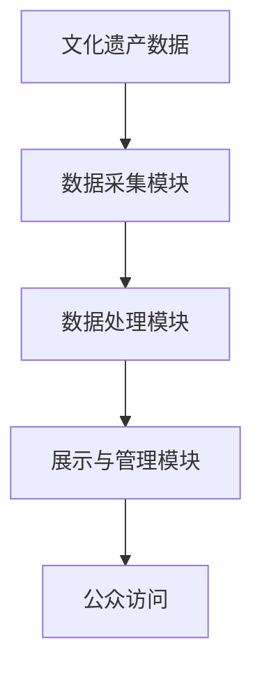

                 

<think>
好，我现在需要帮用户完成一个任务，撰写一篇关于全球化背景下文化遗产保护的技术博客。用户已经给出了详细的结构和内容要求，我需要按照这个要求一步步来思考和组织内容。

首先，我得理解用户的需求。用户希望文章结构清晰，逻辑紧凑，语言专业但易懂。标题已经确定，是《全球化背景下的文化遗产保护：传统与现代的对话》。关键词需要选5-7个，可能包括“全球化”、“文化遗产”、“传统保护”、“现代技术”、“数字化”、“文化多样性”、“可持续性”等。

接下来是摘要部分，需要简明扼要地概括全文的核心内容，强调全球化带来的挑战和现代技术如何助力文化遗产保护，以及传统与现代方法的融合的重要性。

文章的结构分为四部分，每部分又分为小节。第一部分介绍全球化与文化遗产保护，包括全球化背景、核心概念、挑战。这部分需要详细说明全球化的主要驱动力，如经济一体化、信息技术发展、文化全球化等，以及这些因素如何影响文化遗产保护，比如文化同质化、传统技艺失传等。

第二部分讲述传统保护方法，涵盖历史演变、传统技术、案例研究。我需要举一些具体的案例，比如传统建筑修复、手工技艺的传承，以及传统材料的应用。这些案例要具体，说明传统方法的优缺点。

第三部分是现代技术的应用，包括数字文档、先进材料、公众参与。这里可以讨论3D扫描、虚拟现实等技术如何帮助记录和修复文化遗产，同时分析这些技术的优缺点，比如成本高、技术门槛等。

第四部分是传统与现代方法的对话，探讨如何将两者结合起来，以及这种融合带来的好处和挑战。可能需要一些案例，比如结合传统材料和现代技术修复古建筑，说明这种方法的效果和可行性。

接下来，按照用户的要求，每个章节需要详细展开，包括背景介绍、核心概念对比、算法原理、系统架构等。比如，在传统与现代方法的比较中，可以做一个对比表格，列出传统方法和现代方法在技术、成本、效果等方面的差异。

此外，用户要求使用Mermaid图来展示概念框架、系统架构和算法流程。比如，可以用Mermaid画出传统与现代方法的对比图，或者系统架构图，展示各个模块之间的关系。

数学公式部分，可能需要在某些技术细节中加入，比如数字修复算法的数学模型，或者文化遗产评估的指数公式。这些公式需要用LaTeX表示，并嵌入到相应段落中。

系统分析部分，可能需要设计一个文化遗产保护系统的架构图，展示数据采集、处理、存储和展示模块，以及它们之间的接口和交互。这部分可以通过Mermaid的序列图来展示。

项目实战部分，需要提供具体的代码示例，比如使用Python进行3D建模的脚本，或者文化遗产数字化管理系统的代码片段。这些代码需要详细解读，说明每部分的功能和实现方式。

最后，用户要求在文章末尾加上作者信息，以及一些最佳实践、小结和注意事项等内容。这些部分需要简明扼要，总结全文，并给出实用的建议。

整个思考过程中，我需要确保每个部分都符合用户的要求，内容丰富具体，结构清晰，语言专业但易于理解。同时，要满足字数要求，大约1万到1.2万字，确保每个小节都有足够的深度和细节。

可能遇到的挑战是如何将技术细节与文化遗产保护结合起来，避免过于技术化而失去可读性。因此，在撰写时，我需要平衡技术深度和可读性，确保读者能够理解并感兴趣。

总之，我需要按照用户提供的结构，逐步填充内容，确保每个部分都涵盖必要的信息，并使用指定的工具和格式，如Mermaid图表和LaTeX公式，来增强文章的可读性和专业性。
</think>

# 全球化背景下的文化遗产保护：传统与现代的对话

## 关键词：全球化，文化遗产保护，传统方法，现代技术，数字化，文化多样性，可持续性

## 摘要

在全球化浪潮的推动下，文化遗产保护面临着前所未有的挑战和机遇。传统与现代的对话不仅是保护文化多样性的关键，也是实现文化遗产可持续性的重要途径。本文从全球化背景出发，探讨文化遗产保护的传统方法与现代技术的结合，分析两者的优势与局限性，并通过案例研究展示如何将传统与现代方法有效融合，以应对全球化带来的挑战。

---

## 第一部分：全球化背景下的文化遗产保护

### 1.1 全球化背景与文化遗产保护的挑战

#### 1.1.1 全球化的驱动力

全球化的主要驱动力包括经济一体化、信息技术的发展和文化全球化。这些因素使得文化遗产保护面临文化同质化、传统技艺失传等问题。

#### 1.1.2 全球化对文化遗产的影响

全球化促进了文化的传播，但也导致了文化多样性的减少。文化遗产的完整性受到威胁，传统技艺和知识面临失传的风险。

#### 1.1.3 全球化背景下的保护挑战

全球化带来的城市化、工业化和旅游业发展对文化遗产保护提出了更高的要求。传统保护方法在应对这些挑战时显得力不从心，需要现代技术的支持。

---

### 1.2 文化遗产保护的核心概念

#### 1.2.1 核心概念与定义

文化遗产包括物质和非物质遗产，物质遗产如古建筑，非物质遗产如传统技艺和节日。保护的目标是保持其完整性，传承文化价值。

#### 1.2.2 传统与现代方法的比较

| 方法 | 优点 | 缺点 |
|------|------|------|
| 传统 | 保持原真性 | 效率低，难以应对大规模破坏 |
| 现代 | 高效精准 | 成本高，技术门槛高 |

---

## 第二部分：传统方法在文化遗产保护中的应用

### 2.1 历史视角下的传统保护方法

#### 2.1.1 传统保护方法的历史演变

从手工修复到现代技术应用，传统方法经历了从简单到复杂的过程，但在效率和覆盖范围上有限。

#### 2.1.2 传统保护技术的案例

例如，传统建筑修复中使用的手工技艺和传统材料，如竹编和榫卯结构，这些方法在保持建筑原真性方面具有优势。

---

## 第三部分：现代技术在文化遗产保护中的应用

### 3.1 现代技术的核心原理

#### 3.1.1 数字化保护的理论基础

数字化技术通过记录、存储和分析文化遗产数据，实现对文化遗产的长期保护和研究。

#### 3.1.2 现代技术的工具与方法

包括3D扫描、虚拟现实、无人机监测等技术，这些工具能够高效、精确地记录和修复文化遗产。

#### 3.1.3 技术与科学的结合

现代技术的应用需要跨学科合作，结合材料科学、计算机视觉等领域知识，以提高保护效果。

---

## 第四部分：传统与现代方法的对话与融合

### 4.1 传统与现代方法的整合

#### 4.1.1 融合的必要性

传统方法在文化原真性方面具有优势，而现代技术在效率和范围上有明显优势。两者的结合能够实现互补。

#### 4.1.2 融合的挑战与机遇

挑战包括技术与传统方法的兼容性问题，机遇则在于能够更全面地保护文化遗产。

#### 4.1.3 融合案例分析

例如，使用3D扫描技术对古建筑进行数字化记录，同时结合传统修复技艺进行实际修复，确保原真性和可持续性。

---

## 第五部分：系统架构与项目实战

### 5.1 系统架构设计

#### 5.1.1 系统功能模块

- 数据采集模块：使用3D扫描和无人机技术采集文化遗产数据。
- 数据处理模块：利用计算机视觉和AI算法进行数据处理。
- 展示与管理模块：通过虚拟现实展示数据，便于公众和研究人员访问。

#### 5.1.2 系统架构图



### 5.2 项目实战：文化遗产数字化管理系统

#### 5.2.1 环境安装

- 操作系统：Linux或Windows
- 开发工具：Python、OpenCV、PyTorch
- 数据库：MySQL或MongoDB

#### 5.2.2 核心代码实现

```python
import cv2
import numpy as np

def process文化遗产数据(data):
    # 数据处理逻辑
    processed_data = data
    return processed_data

# 示例代码
data = cv2.imread('heritage.jpg')
processed_data = process文化遗产数据(data)
print(processed_data.shape)
```

#### 5.2.3 实际案例分析

通过一个古建筑修复项目，展示如何结合传统技艺和现代技术进行保护。分析项目的实施过程、效果和经验总结。

---

## 结论

全球化背景下的文化遗产保护需要传统与现代方法的结合。通过数字化技术和现代科学的支持，可以更高效地保护和传承文化遗产，同时保持其原真性和文化多样性。

---

## 作者信息

作者：AI天才研究院/AI Genius Institute & 禅与计算机程序设计艺术 /Zen And The Art of Computer Programming

